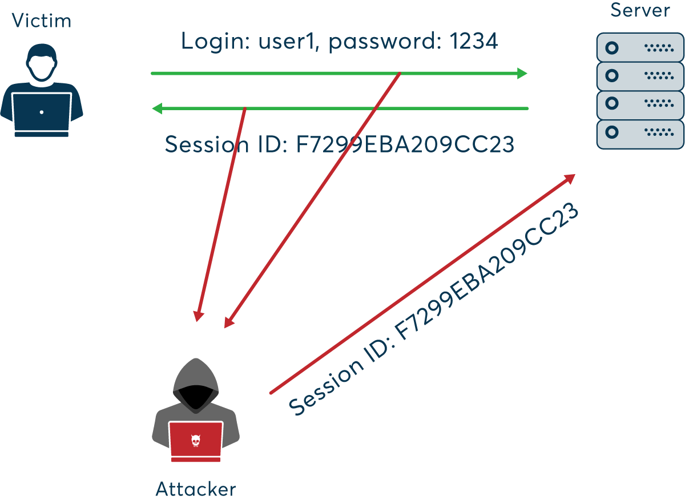
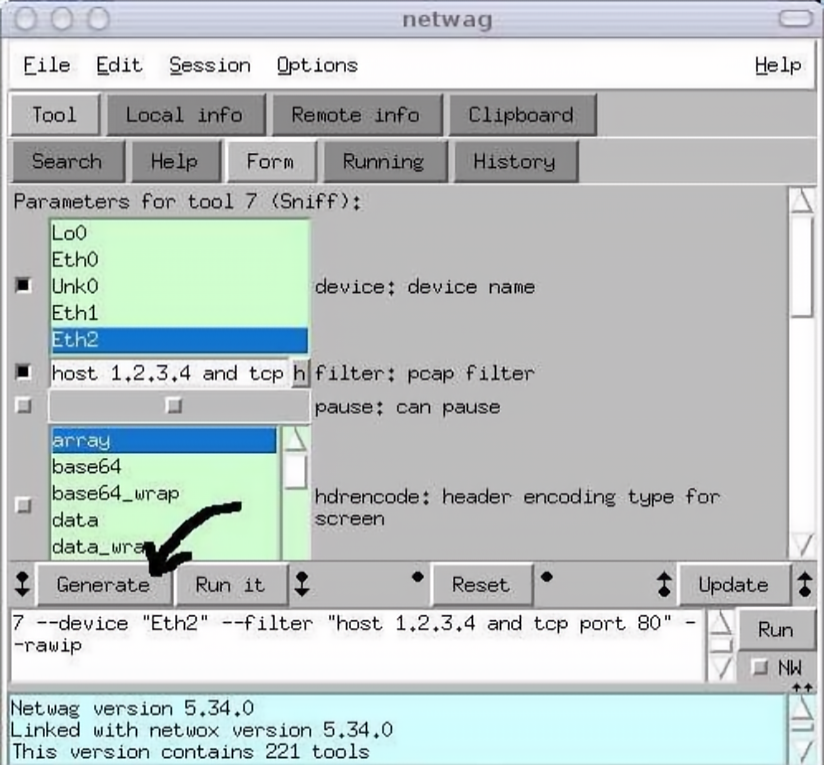

## 名词解释

1、名词解释：ARP cache poisoning，ICMP Redirect Attack，SYN Flooding Attack，TCP Session Hijacking。如果想监听局域网内另外一台机器，一般先要进行什么步骤？

#### ARP cache poisoning

参考文档：[arp-spoofing](https://www.imperva.com/learn/application-security/arp-spoofing/)

地址解析协议 (ARP) 是一种使网络通信能够到达网络上特定设备的协议。ARP 将 Internet 协议 (IP) 地址转换为媒体访问控制 (MAC) 地址，反之亦然。

 ARP 欺骗（ARP spoofing**, **ARP cache poisoning, or ARP poison routing）可能允许攻击者拦截网络上的数据帧、修改流量或停止所有流量。通常，攻击被用作其他攻击的开端，例如拒绝服务、中间人或会话劫持攻击。该攻击只能在使用 ARP 的网络上使用，并且需要攻击者可以直接访问要攻击的本地网段。

一台不可信赖的计算机会发出假冒的ARP查询或应答信息，并将所有流向它的数据流转移。这样，它就可以伪装成某台机器，或修改数据流。这种攻击叫做ARP欺骗攻击。


ARP 欺骗是一种中间人(MitM)攻击，允许攻击者拦截网络设备之间的通信。攻击的工作原理如下：

1. 攻击者必须有权访问网络。他们扫描网络以确定至少两个设备的 IP 地址——假设它们是工作站和路由器。 
2. 攻击者使用欺骗工具（例如 Arpspoof 或 Driftnet）发送伪造的 ARP 响应。 
3. 伪造的响应会宣传属于路由器和工作站的两个 IP 地址的正确 MAC 地址是攻击者的 MAC 地址。这欺骗了路由器和工作站连接到攻击者的机器，而不是相互连接。
4. 这两个设备更新它们的 ARP 缓存条目，并从那时起与攻击者通信，而不是直接相互通信。
5. 攻击者现在秘密地处于所有通信的中间。

使用命令行检测特定设备的 ARP缓存是否已中毒的简单方法：以管理员身份启动终端，`arp -a`，如果该表包含两个具有相同 MAC 地址的不同 IP 地址，则表明正在发生 ARP 攻击。

#### ICMP Redirect Attack

参考文档：[what-icmp-redirect-message](https://www.ibm.com/support/pages/what-icmp-redirect-message)

ICMP 重定向是 IP 的一项“功能”，它允许路由器通知主机有一条更有效的到达目的地的路由，并且主机应该相应地调整其路由表。这在受信任的 LAN 上可能没问题，但在狂野的 Internet 上，随别人的心血来潮改变您的路由表可能不是一个好主意。可能被恶意用于将流量重定向到特定系统的攻击。如果黑客想让被攻击主机修改其路由表，黑客伪装成路由器，向主机发送 Internet 控制消息协议 (ICMP) 重定向消息，让主机根据黑客的要求修改路由表，所有未来的流量都必须定向到特定系统。


#### SYN Flooding Attack

[syn-flood-ddos-attac](https://www.cloudflare.com/en-gb/learning/ddos/syn-flood-ddos-attack/)

[syn-flood](https://www.imperva.com/learn/ddos/syn-flood/)

SYN Flood Attack是一种拒绝服务 (DDoS) 攻击，旨在通过消耗所有可用的服务器资源使服务器对合法流量不可用。通过重复发送初始连接请求 (SYN) 数据包，攻击者能够淹没目标服务器计算机上的所有可用端口，导致目标设备对合法流量的响应缓慢或根本不响应。

SYN Flood攻击：攻击者利用TCP连接的半开放状态发动攻击。攻击者使用第一个数据包对服务器进行大流量冲击，使服务器一直处于半开放连接状态，从而无法完成3步握手协议。

TCP SYN 洪水（又名 SYN 洪水）是一种 分布式拒绝服务 ( DDoS ) 攻击，它利用正常 TCP 三向握手的一部分 来消耗目标服务器上的资源并使其无响应。本质上，使用 SYN flood DDoS，攻击者发送 TCP 连接请求的速度比目标机器处理它们的速度更快，从而导致网络饱和。

在 SYN 泛洪攻击中，攻击者经常使用虚假 IP 地址向目标服务器上的每个端口发送重复的 SYN 数据包。服务器在没有意识到攻击的情况下，接收到多个明显合法的建立通信请求。它使用来自每个开放端口的 SYN-ACK 数据包来响应每次尝试。

恶意客户端要么不发送预期的 ACK，要么（如果 IP 地址被欺骗）从一开始就不会收到 SYN-ACK。无论哪种方式，受到攻击的服务器都将等待对其 SYN-ACK 数据包的确认一段时间。

攻击者利用这样一个事实，即在接收到初始 SYN 数据包后，服务器将返回一个或多个 SYN/ACK 数据包并等待握手的最后一步。


 


| 正常的TCP “三次握手”                                   | TCP SYN Flood                                                |
| ------------------------------------------------------ | ------------------------------------------------------------ |
| 客户端通过向服务器发送 SYN（同步）消息来请求连接。     | 攻击者向目标服务器发送大量 SYN 数据包，通常带有欺骗性IP 地址。 |
| 服务器通过向客户端发送 SYN-ACK（同步确认）消息来确认。 | 服务器响应每个连接请求，并留下一个开放端口准备接收响应。     |
| 客户端以 ACK（确认）消息进行响应，并建立连接。         | 在服务器等待最终的 ACK 数据包（它永远不会到达）时，攻击者会继续发送更多的 SYN 数据包。<br/>每一个新的 SYN 包的到来，都会导致服务器暂时保持一个新的开放端口连接一段时间，一旦所有可用的端口都被利用完，服务器就无法正常工作。 |

#### TCP Session Hijacking

[network-or-tcp-session-hijacking](https://www.greycampus.com/opencampus/ethical-hacking/network-or-tcp-session-hijacking)

TCP 会话劫持是对受保护网络上的用户会话的安全攻击，因为身份验证通常只在 TCP 会话开始时进行，所以有可乘之机。

最常见的会话劫持方法称为 **IP 欺骗：**攻击者使用源路由 IP 数据包将命令插入网络上两个节点之间的活动通信中，并将自己伪装成经过身份验证的用户之一。将消息发送到具有表明该消息来自受信任主机的 IP 地址的计算机。

另一种是**中间人攻击：**攻击者试图通过 ARP 欺骗和中间人攻击来获取会话 ID，使用嗅探器可以观察设备之间的通信并收集传输的数据。




还有一种**盲目劫持：**在禁用源路由的情况下，会话劫持者还可以使用盲劫持，将恶意数据注入 TCP 会话中截获的通信中。之所以称为盲，是因为他看不到反应；虽然劫持者可以发送数据或命令，但他基本上是在猜测客户端和服务器的响应。

TCP 会话劫持者的目标是创建客户端和服务器无法交换数据的状态；使他/她能够为两端伪造可接受的数据包，模仿真实的数据包。因此，攻击者能够控制会话。

#### 监听域外步骤

如果想监听局域网内另外一台机器，一般先要进行什么步骤？

发送ARP欺骗包伪装网关，将`网内的机器网关的IP+你的MAC地址`伪装成真网关，这样就会将数据发送到本机

## Netwox/Netwag

2、阅读下面这篇文章并且了解Netwox/Netwag的基本操作：
Netwox/Netwag Troubleshooting guide 
http://www.cis.syr.edu/~wedu/seed/Documentation/Misc/netwox.pdf

[PDF: netwox](netwox.pdf)

[netwox-doc](https://web.ecs.syr.edu/~wedu/Teaching/cis758/netw522/netwox-doc_html/html/examples.html)、[netwox](http://www.vulnerabilityassessment.co.uk/netwox.htm)

### 通用工具

##### Tool 7 : sniff packets and display them

这个工具显示网络数据包。您必须选择要拦截数据包的设备。

1. 找到你正在使用的嗅探设备。

2. 通过提供pcap过滤器来细化它。

```bash
# netwox 7
 ETH_____________________________________________________________________.
 | 00:01:01:01:01:01 vers 00:02:02:02:02:02         type : 0x0800        |
 |_______________________________________________________________________|
 IP______________________________________________________________________.
 |version |  ihl   |       tos       |              totlen               |
 |___ 4___|___ 5___|_______  0_______|____________0054h=   84____________|
 |                id                 |xxDfMf         fragoffset          |
 |____________061Dh= 1565____________|0_0_0__________0000h=    0_________|
 |       ttl       |    protocol     |          header checksum          |
 |_____40h= 64_____|_____01h=  1_____|_______________DF38h_______________|
 |                                source                                 |
 |______________________________192.168.1.1______________________________|
 |                              destination                              |
 |______________________________192.168.1.2______________________________|
 ICMP_(echo request)_____________________________________________________.
 |      type       |      code       |             checksum              |
 |_____08h=  8_____|_____00h=  0_____|____________2829h=10281____________|
 65 01 01 00  91 04 40 3C  AC 91 01 00  08 09 0A 0B     # e.....@<........
[...]

```

##### Tool38:Spoof Ip4 packet

这个工具是用来欺骗IP数据包的。

在使用这个工具时可能遇到主机操作系统会放弃该数据包的问题，这是因为一些操作系统（如Linux）会验证源的IP地址是否在其ARP缓存中。可以先将ARP缓存中的数据删除。这个工具一般有效

可以用来发送假的IP数据包，它让用户完全控制IP头。对IP头的控制。理论上说，它本身是自足的，可以进行所有其他的TCP/ICMP攻击，只要能精确地提供正确的其有效载荷的值，这可能会变得有点混乱。因此，我们将使用这个工具纯粹用于IP攻击，如DoS、Tear Drop等。

##### Tool41:Spoof Ip4Icmp4 packet

41: 这个工具被用来欺骗IP/ICMP数据包。它允许攻击者用任意的IP参数发送任意长度的ICMP数据包。几乎所有与ICMP有关的攻击都可以用这个工具完成。这个工具是基于Tool 38的。它允许用户将ICMP头参数与IP头参数一起指定。尽管对大多数特定的ICMP攻击有专门的工具，如Source Quench, ICMP redirect等（见下一节），这个工具也可以用于这些攻击。
此工具对于Ping Of Death和smurf攻击非常有用，其他工具无法执行这些攻击。

##### Tool40:Spoof Ip4Tcp packet

40：它用于欺骗TCP/IP数据包。通过正确的参数设置，所有的TCP攻击都可以用这个工具完成。它允许用户修改数据包的IP头、TCP头和TCP数据。
这被用于会话劫持，可以很容易地用于编写操作系统指纹扫描器。

### 特殊工具

##### 80:Periodically send ARP replies

80:该工具发送连续的ARP响应。您需要设备名称

(上面解释过)，以及源和目的IP地址以及以太网地址。即使你不知道任何机器的以太网地址，你可以提供@IP作为参数，Netwox会为你解决它(例如，ip地址为1.2.3.4的机器的以太网地址是@1.2.3.4)

##### 72:Scan ARP (EthIp spoof)

72:一些系统拒绝ARP响应，如果他们没有请求它。这时这个工具就派上用场了。它使用欺骗地址向目标机器发送一个ARP请求(可以用于ARP缓存中毒)。

这个工具的唯一问题是它不发送连续的数据包。

这个问题可以通过在脚本中使用它来克服，这将在下一节中进行演示。

##### 82、83、84、85、86

> 82:Sniff and send ICMP4/ICMP6 destination unreachable
> 嗅探并发送ICMP4/ICMP6目的地不可达的信息
>
> 83:Sniff and send ICMP4/ICMP6 time exceeded
> 嗅探和发送ICMP4/ICMP6的时间超过了
>
> 84:Sniff and send ICMP4/ICMP6 parameter problem
> 嗅探并发送ICMP4/ICMP6参数问题
>
> 85:Sniff and send ICMP4 source quench
> 嗅探并发送ICMP4信号源熄灭
>
> 86:Sniff and send ICMP4/ICMP6 redirect
> 嗅探并发送ICMP4/ICMP6重定向

82、83、84、85、86:这些工具用于专门的ICMP攻击和使用起来很简单。请查看Netwag对这些工具的解释。

##### 76,78

> 76:Synflood
> 同步泛洪 迅雷不及掩耳之势
> 
>78:Reset every TCP packe
> 重置每个TCP数据包

76,78:这些工具用于特定的TCP攻击(SYN和RST攻击)，并且非常简单。

### 命令行

虽然Netwag GUI真的很简单，但像其他GUI一样，它可能会变得 有一点限制。例如，它不允许我们连续使用72号工具。手动点击 100次并不是很有效。Netwag GUI只是一个封装器 围绕着Netwox，所以我们可以直接从命令行中使用Netwox，而不是使用Netwag。使用Netwox，而是直接从命令行中使用Netwox。要记住所有的 我们要使用的所有工具的选项，所以我们可以使用GUI来生成 命令给我们。请看下面的屏幕截图。



输入参数后，单击Generate按钮，而不是单击run按钮。这将在窗口的底部显示一些文本。复制该文本并将其用作Netwox命令的参数。例如，对于前面提到的情况，输出将是:

```bash
#netwox 7 --device "Eth2" --filter "host 1.2.3.4 and tcp port 80" --rawip
```

现在我们知道了如何从命令行使用netwox工具，我们可以围绕它编写大量的功能代码。大多数现代语言如C、C++、Java、Perl、Ruby等都允许你执行随机文件。我们可以利用这些语言所提供的字符串操作能力和netwox工具来设计任意的自动攻击。考虑一下下面的程序。

```c++
#include <iostream>
using namespace std;
int main()
{
	char add[50];
	char ethadd[50];
	char arppoison[1000];
	for(int i=1;i<255;i++)
	{
	sprintf(add,"192.168.232.%d",i);
	sprintf(ethadd,"%x:%x:%x:%x:%x:%x",i,i,i,i,i,i);
	sprintf(arppoison,"netwox --ips \"192.168.232.131\"	--device \"Eth2\" --src-eth %s --src-ip %s",ethadd,add);
	system(arppoison);
	}
}
```

上面的代码试图在ARP缓存中投毒，该机器的IP地址为 IP地址为192.168.232.131的机器上的255个假值。由于以太网地址 是十六进制的，第20行构建了一个假的十六进制字符串，作为 以太网地址。这个程序将为IP地址192.168.232.1到192.168.232.255添加条目 到192.168.232.255在192.168.232.131的arp缓存中。
使用类似的策略可以设计出更复杂的攻击。

## linux命令

```bash
sysctl -q net.ipv4.tcp_max_syn_backlog
sysctl -w net.ipv4.tcp_syncookies=0
```

> `sysctl`  用于在内核运行时动态地修改内核的运行参数；
>
> > `-p`：从配置文件“/etc/sysctl.conf”加载内核参数设置；
> >
> > `-w`：当改变sysctl设置时使用此项；

- `net.ipv4.tcp_max_syn_backlog`：TCP syn 队列的最大长度, 是指定所能接受SYN同步包的最大客户端数量，即半连接上限；第一次握手的连接参数过大可能也会遭受syn flood攻击

- `net.ipv4.tcp_syncookies `：为1表示开启SYN cookies。当出现SYN等待队列溢出时，启用cookies来处理，可防范少量SYN攻击，默认为0，表示关闭

## Smashing C++ VPTRs

4、阅读Smashing C++ VPTRs这篇文章，阐述其原理。
http://www.phrack.org/issues.html?issue=56&id=8

[Phrack Magazine](phrack.org- Phrack Magazine .pdf)

#### 介绍

目前，一套广为人知的技术指导我们如何利用通常用C语言编写的程序中的缓冲区溢出。虽然C语言几乎无处不在，但我们看到许多程序也是用C++编写的。在大多数情况下，适用于C语言的技术在C++中也是可用的，然而，C++在缓冲区溢出方面可以为我们提供新的可能性，这主要是由于面向对象技术的使用。我们将使用C++ GNU编译器，在x86 Linux系统上分析其中的一种可能性。


