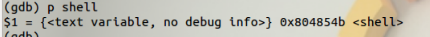

# Unlink


关闭 ASLR，打开栈可执行编译 uaf.c，并将编译好的程序设置成 root 所有 suid 程序


```bash
sudo sysctl -w kernel.randomize_va_space=0
sudo chown root:root unlink
sudo chmod 4755 unlink
```

通过分析源代码，我们可以发现又一个 shell 函数。这显然是想让我们获取root shell

```c
//关掉栈保护，打开堆栈不可执行，关闭ASLR

#include <stdio.h>
#include <stdlib.h>
#include <string.h>
typedef struct tagOBJ
{
    struct tagOBJ *fd;
    struct tagOBJ *bk;
    char buf[8];
} OBJ;

void shell()
{
    setuid(geteuid());
    system("/bin/sh");
}

void unlink(OBJ *P)
{
    OBJ *BK;
    OBJ *FD;
    BK = P->bk;
    FD = P->fd;
    FD->bk = BK;
    BK->fd = FD;
}
int main(int argc, char *argv[])
{
    malloc(1024);
    OBJ *A = (OBJ *)malloc(sizeof(OBJ));
    OBJ *B = (OBJ *)malloc(sizeof(OBJ));
    OBJ *C = (OBJ *)malloc(sizeof(OBJ));

    // double linked list: A <-> B <-> C
    A->fd = B;
    B->bk = A;
    B->fd = C;
    C->bk = B;

    printf("here is stack address leak: %p\n", &A);
    printf("here is heap address leak: %p\n", A);
    printf("now that you have leaks, get shell!\n");
    // heap overflow!
    gets(A->buf);

    // exploit this unlink!
    unlink(B);
    return 0;
}

```

堆上分配了三个结构体，它们了双链接，其中一个块的头包含一个指向前一个块和下一个块的指针。还有一个明显的溢出现象，可能会让我们破坏这些结构。在程序开始的时候，堆栈的地址可能会被泄露，

我们查到了shell的地址。



接下来便是通过技术让返回地址落在此处。

