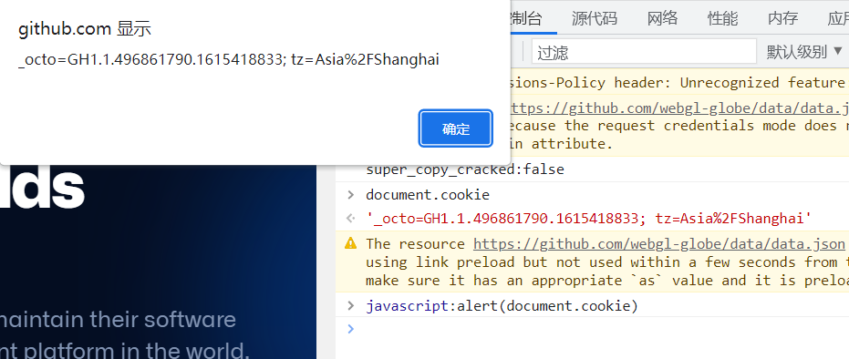
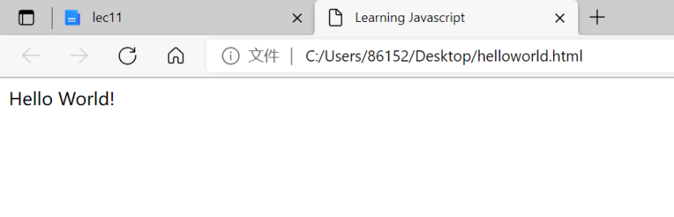

# lec11

[wm]: wm
[z周周]: z周周

## 1、用IE访问某些网站的时候，输入javascript:alert(document.cookie)会有什么反应，

解释原因。

​                         

`document.cookie`可以获取本网页的`cookie`值，`alert()`方法显示一个带有消息和OK按钮的警告框。

`javascript:alert(document.cookie)`是一段脚本，可以让浏览器以警告框的形式弹出本页面的cookie值。

## 2、阅读下面两篇文章或者阅读一本书\<\<JavaScript DOM编程艺术>\>：

### Javascript Tutorial

<https://www.evl.uic.edu/luc/bvis546/Essential_Javascript_--_A_Javascript_Tutorial.pdf>

这篇文章介绍了Javascript语言一些基本的语法结构和注意事项，有输入输出格式、注释、变量名、算术符号、逻辑和比较运算符、if条件判断、循环等等。

一个最简单的例子，只需利用文本编辑器和浏览器就可在浏览器中显示出"`Hello World`。

先新建一个文本文档，把文章中的代码复制进.txt文件中，再将文件后缀名更改为.html，再次点击文件就可直接跳转到浏览器中。

​                         

还有点击文本内容改变文本颜色和位置等。

​                         

​                         

### XMLHttpRequest

http://[www.w3school.com.cn/ajax/](http://www.w3school.com.cn/ajax/)找不到了，应该是转移到了https://www.w3school.com.cn/js/js_ajax_intro.asp页面。

Ajax是**可以在不刷新页面时更新网页、在页面加载后从服务器请求数据、在页面加载后从服务器接收数据、在后台向服务器发送数据的技术。其**仅仅组合了浏览器内建的 XMLHttpRequest 对象（从 web 服务器请求数据）、JavaScript 和 HTML DOM（显示或使用数据）便实现了这个技术。

<http://www.hunlock.com/blogs/AJAX_for_n00bs>

这一篇文章看不到了。

## 3、了解FireFox的两个插件LiveHttpHeaders和Firebug的基本使用方法。

### Live HTTP Headers

Live HTTP Headers记录浏览器和互联网之间的所有HTTP流量，可以用来：

- 调试web应用程序
- 遵循定向路径
- 查看远程站点发送的cookie
- 查看远程站点使用的web服务器
- 查看发送到服务器的报头
- 查看服务器返回的报头
- 查看使用的HTTP请求方式
- 查看响应码

​                         

### Firedug

Firebug是一个开源的Firefox网页浏览器扩展，是一个网页开发工具，可以利用它调试、编辑、删改任何网站的CSS、HTML、DOM与JavaScript代码，现在已经停止开发，并且前去搜索会指引你下载Firefox Developer Edition。

好在Google还保留了Firebug Lite端口。Firebug Lite提供了丰富的视觉表示，当涉及到HTML元素，DOM元素和框模型阴影时，我们用于在Firebug中看到。 它还提供了一些很酷的功能，如用鼠标检查HTML元素，以及Live编辑CSS属性。

​                         

4、阅读下面这篇文章：

跨站脚本攻击实例解析

<http://bbs.pediy.com/showthread.php?t=124209>

网页显示权限不足。

## 5、阅读下面这几篇文章：

### DOM Based Cross Site Scripting or XSS of the Third Kind

<http://www.webappsec.org/projects/articles/071105.html>

本文介绍了第三类跨站脚本攻击（XSS）------基于DOM的XSS攻击。典型的XSS攻击分为两种，反射性XSS和存储型XSS，这两种攻击方法都是攻击者通过目标网站将他们的代码注入到目标用户的浏览器中，而本文所介绍基于DOM的XSS则是一种不依赖于将恶意数据发送到服务器的攻击。这种攻击会对Web应用程序构成威胁，因此开发人员和站点维护人员(以及审核员)需要熟悉检测基于DOM的XSS漏洞的技术，以及防御这些漏洞的技术。

DOM型XSS主要是由客户端的脚本通过DOM动态地输出数据到页面而不是依赖于将数据提交给服务器端，而从客户端获得DOM中的数据在本地执行，因而仅从服务器端是无法防御的。

有效的防御方法有：（

1. 避免客户端文档重写、重定向或其他敏感操作，同时避免使用客户端数据，这些操作大多数都可以通过使用动态页面（服务器端）来实现；
2.  分析和强化客户端JS代码，特别是可能受到用户（攻击者）影响的DOM对象。

### XSS (Cross Site Scripting) Cheat Sheet Esp: for filter evasion

<http://80x86.io/post/xsscrosssitescriptingcheatsheetespforfilterevasion>网页打不开。通过搜索找到另一网址：<https://n0p.net/penguicon/php_app_sec/mirror/xss.html>

本页面介绍了过滤器规避，只列出了显示底层攻击媒介，并没有展示如何减轻这些风险或如何编写攻击的实际cookie/credential 窃取部分。分为XSS（跨站脚本）、XSS 使用 HTML 引用封装、URL 字符串规避三部分

### 利用QQ邮箱漏洞进行钓鱼事件溯源

<https://www.freebuf.com/news/85586.html>

文章正在审核，还是打不开。好在有转载链接<https://www.secpulse.com/archives/40443.html>

本文讲述了一个由于允许加载远程可控的XML文件导致的漏洞。在解析远程xml文档生成邮件预览页时，没有严格校验输入数据，从而导致跨站的发生。

其中link标签的数据在生成邮件预览页的过程中会被readOriginalLink函数处理，readOriginalLink未对传入的参数进行任何校验,直接写入到了document对象中，导致img标签被控制，从而使本次跨站可以成功实施。

生成XSS攻击代码利用跨站漏洞钓取Cookie，有Cookie可以直接登陆。

伪装iCloud页面直接钓取账号，进而登陆，黑客伪造一个网站，将账号密码通过POST请求发送到一个远程地址。通过这个远程地址，可以找到注册是所使用的邮箱以及注册者名；而通过钓鱼页面网址可以查到另一个邮箱以及注册者名。进而继续追查犯罪嫌疑人。

令有钓鱼地址构造到ifeng.com的子域名里，为了过QQ邮箱不可信域名拦截以及各类安全软件的拦截，去借助ifeng.com白域名去跳转到真正的钓鱼页面。

## 6、XSS漏洞的触发条件有哪些？应该如何防范？

### **触发条件：**

#### **1.脚本插入**

**(1)插入javascript和vbscript正常字符。**

```html
例1：\

例2：\<table background="javascript:alert(/xss/)">\</table>'/在表格中插入脚本

例3：\
```

**(2)转换字符类型。将javascript或vbscript中的任一个或全部字符转换为十进制或十六进制字符。**

```html
例1：\ '/将j字符转为十进制字符j 。

例2：\ '/将j字符转为十六进制字符j 。
```

**(3)插入混淆字符。**

在系统控制字符中，除了头部的(null)和尾部的 (del)外，其他31个字符均可作为混淆字符，比如`\`等字符都可插入到javascript或vbscript的头部，其中Tab符 、换行符、回车符还可以插入到代码中任意地方。

```html
例1： '/插入到代码头部，其中 可写成 ，效果一样

例2： '/插入到代码中任意位置，其中 可写成

例3： '/ 是回车符的16进制形式

例4： '/ 是换行符的16进制形式
```

#### **2.样式表**

**(1)利用CSS代码@import、expression触发XSS漏洞。**

```css
例1：@import "http://web/xss.css"; '导入外部带有XSS代码的CSS样式表。

例2：@import'javascript:alert("xss")'; '调用javascript脚本触发漏洞

例3：body{xss:expression(alert('xss'))} '在内部样式表中加入expression事件

例4：'在内嵌样式表中加入expression事件
```

**(2)在CSS代码中加入javascript和vbscript脚本**

```css
例1：body{background-image:url(javascript:alert("xss"))}

例2：body{background-image:url(vbscript:msgbox("xss"))}
```

**(3)转换字符类型，以十六进制字符替换其中或全部的字符：**

```css
例1：@\0069mport:url(web/1.css);’//将其中的i转为\0069

例2：body{xss:\0065xpression(alert(‘xss’))}’//将e转换为\0065

例3：body{background-image:\0075\0072\006c…}’将url全转为16进制
```

**(4)插入混淆字符，在css中，/\*\*/是注释字符，除了/\*\*/外，字符"\\"和结束符"\\0″也是被忽略的，可以用来混淆字符。**

```css
例1：@\0im\port’\0ja\vasc\ript:alert(“xss”)’;

例2：@\i\0m\00p\000o\0000\00000r\000000t”url”;
```

### **防范方法：**

防御XSS攻击主要有两种方法，一种是设法过滤掉数据中的代码或把代码转换成数据，一种是强制开发者把代码和数据分开，再对代码部分添加约束条件。

（1）对于第一种方法，关键在于如何去除来自用户输入中的代码或使其无效。一般有两种方法：

1. 过滤方法：即删除用户输入中的代码，开发者可使用过滤器实现从数据中过滤掉JavaScript代码。

2. 编码方法：编码能将HTML标记进行替换表示。服务器将注入的JavaScript代码进行编码，当浏览器看到被编码的脚本后，只会将JavaScript代码显示出来，而不会执行它。

（2）对于第二种方法，关键在于将代码和数据分离开来，并设置相应规则来禁止执行来自不可信源的JavaScript代码。这可以通过内容安全策略机制(CSP)来实现。CSP是为了有效地防御XSS攻击而开发的一套机制，设置相应的CSP规则可有效地禁止恶意代码的运行，提高程序对XSS攻击的抵抗力。

## 7、认真观看，P3 Cross-Site Scripting Attack Lecture

https://www.bilibili.com/video/BV1a441117kb

大概说下视频的内容。

点击劫持(ClickJacking)的攻击。点击劫持是视觉欺骗，用户只看到了底层页面，与页面进行交互时却是与上层页面在交互。这是由于透明的iframe造成的，通过控制iframe的位置，导致上层页面的按钮等覆盖到下层上。 

CSRF(Cross Site Request Forgery)译为跨站请求伪造。CSRF指攻击者盗用了你的身份，以你的名义发送恶意请求。 包括：以你的名义发送邮件，发送消息，盗取你的账号，甚至于购买商品，虚拟货币转账\...\...引发个人隐私泄露以及财产安全的问题。 

跨站脚本攻击 作为一种HTML注入攻击，XSS攻击的核心思想就是在HTML页面中注入恶意代码。

 在XSS攻击中，一般有三个角色参与：`攻击者`、`目标服务器`、``受害者的浏览器`。 由于有的服务器并没有对用户的输入进行 安全方面的验证，攻击者就可以很容易地通过正常的输入手段，夹带进一些恶意的HTML脚本代码。当受害者的浏览器访问目标服务器上被注入恶意脚本的页面后，由于它对目标服务器的信任，这段恶意脚本的执行不会受到什么阻碍。 XSS攻击的分类:反射型XSS,存储型XSS。

SQL Injection：就是通过把SQL命令插入到Web表单递交或输入域名或页面请求的查询字符串，最终达到欺骗服务器执行恶意的SQL命令。

