# 华为数据库实验

## 1.1.4 创建数据表
根据C银行的场景描述，本实验分别针对客户(client)，银行卡(bank_card)，理财产品(finance168s_product)，保险(insurance)，基金(fund)和资产(property)创建相应的表。具体的实验步骤如下所示： 

步骤 1创建金融数据库finance168。

切换到omm用户，以操作系统用户omm登录数据库主节点。

```sh
su - omm
```
启动数据库服务

```sh
gs_om -t start
```
使用gsql工具登陆数据库。

```sh
gsql -d postgres -p 26000 -r
```
创建数据库finance168。

```sh
CREATE DATABASE finance168 ENCODING 'UTF8' template = template0;
```
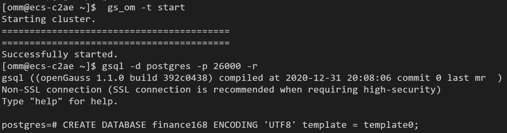

连接finance168数据库。

```sh
\connect finance168
```
创建名为finance168的schema，并设置finance168为当前的schema。

```sql
CREATE SCHEMA finance168;
```
将默认搜索路径设为finance168。

```sql
SET search_path TO finance168;
```
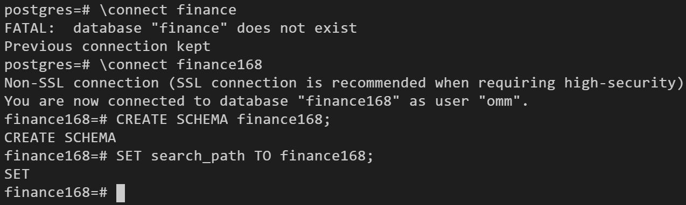

步骤 2客户信息表的创建。
在SQL编辑框中输入如下语句，创建客户信息表client。
删除表client。

```sql
DROP TABLE IF EXISTS finance168.client;
```
创建表client。

```sql
CREATE TABLE finance168.client
(
        c_id INT PRIMARY KEY,
        c_name VARCHAR(100) NOT NULL,
        c_mail CHAR(30) UNIQUE,
        c_id_card CHAR(20) UNIQUE NOT NULL,
        c_phone CHAR(20) UNIQUE NOT NULL,
        c_password CHAR(20) NOT NULL
);
```
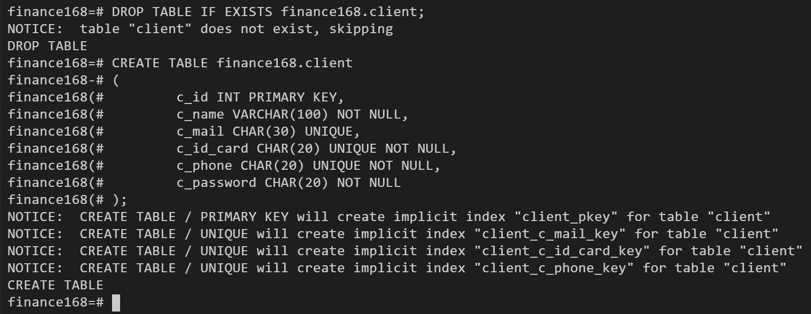

步骤 3银行卡信息表的创建。
在SQL编辑框中输入如下语句，创建银行卡信息表bank_card。
删除表bank_card。

```sql
DROP TABLE IF EXISTS finance168.bank_card;
```
创建表bank_card。

```sql
CREATE TABLE finance168.bank_card
(
        b_number CHAR(30) PRIMARY KEY,
        b_type CHAR(20),
        b_c_id INT NOT NULL
);
```
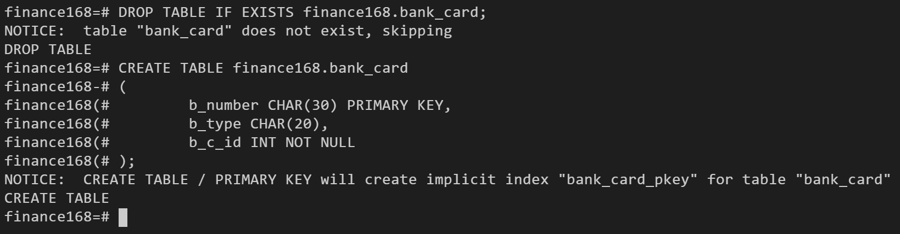

步骤 4理财产品信息表的创建。
创建理财产品信息表finance168s_product。
删除表finance168s_product。

```sql
DROP TABLE IF EXISTS finance168.finance168s_product;
```
创建表finance168s_product。

```sql
CREATE TABLE finance168.finance168s_product
(
        p_name VARCHAR(100) NOT NULL,
        p_id INT PRIMARY KEY,
        p_description VARCHAR(4000),
        p_amount INT,
        p_year INT
);
```
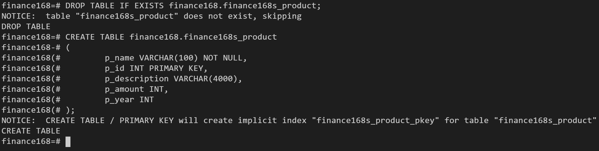

步骤 5保险信息表的创建。
在SQL编辑框中输入如下语句，创建保险信息表insurance。
删除表insurance。

```sql
DROP TABLE IF EXISTS finance168.insurance;
```
创建表insurance。

```sql
CREATE TABLE finance168.insurance
(
        i_name VARCHAR(100) NOT NULL,
        i_id INT PRIMARY KEY,
        i_amount INT,
        i_person CHAR(20),
        i_year INT,
        i_project VARCHAR(200)
);
```
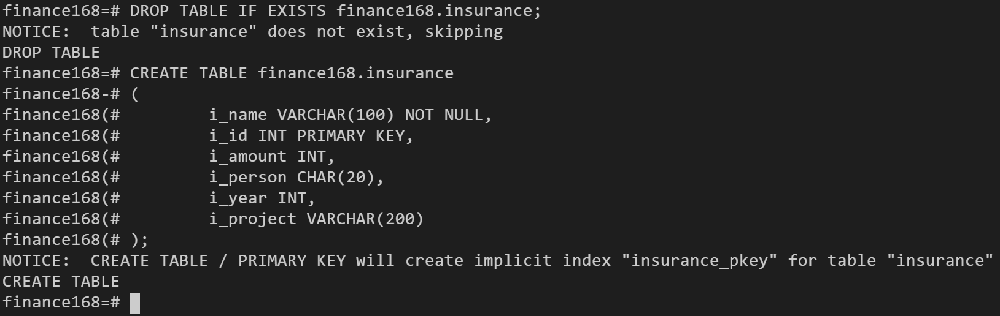

步骤 6基金信息表的创建。
在SQL编辑框中输入如下语句，创建保险信息表fund。
删除表fund。

```sql
DROP TABLE IF EXISTS finance168.fund;
```
创建表fund。

```sql
CREATE TABLE finance168.fund
(
        f_name VARCHAR(100) NOT NULL,
        f_id INT PRIMARY KEY,
        f_type CHAR(20),
        f_amount INT,
        risk_level CHAR(20) NOT NULL,
        f_manager INT NOT NULL
);
```
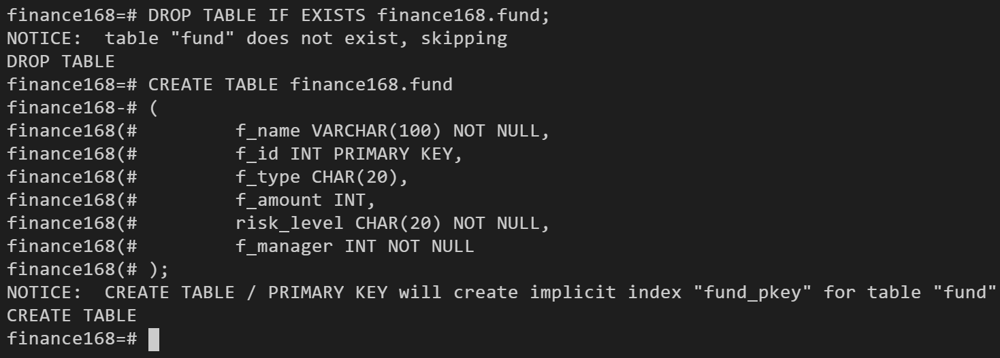

步骤 7资产信息表的创建。
在SQL编辑框中输入如下语句，创建资产信息表property。
删除表property。

```sql
DROP TABLE IF EXISTS finance168.property;
```
创建表property。

```sql
CREATE TABLE finance168.property
(
        pro_id INT PRIMARY KEY,
pro_c_id INT NOT NULL,
        pro_pif_id INT NOT NULL,
        pro_type INT NOT NULL,
        pro_status CHAR(20),
        pro_quantity INT,
        pro_income INT,
        pro_purchase_time DATE
);
```


## 1.1.5 插入表数据

为了实现对表数据的相关操作，本实验需要以执行SQL语句的方式对金融数据库的相关表插入部分数据。
步骤 1对client表进行数据初始化。
执行insert操作。

```sql
INSERT INTO finance168.client(c_id,c_name,c_mail,c_id_card,c_phone,c_password) VALUES (1,'张一','zhangyi@huawei.com','340211199301010001','18815650001','gaussdb_001');
INSERT INTO client(c_id,c_name,c_mail,c_id_card,c_phone,c_password) VALUES (2,'张二','zhanger@huawei.com','340211199301010002','18815650002','gaussdb_002');
INSERT INTO client(c_id,c_name,c_mail,c_id_card,c_phone,c_password) VALUES (3,'张三','zhangsan@huawei.com','340211199301010003','18815650003','gaussdb_003');
INSERT INTO client(c_id,c_name,c_mail,c_id_card,c_phone,c_password) VALUES (4,'张四','zhangsi@huawei.com','340211199301010004','18815650004','gaussdb_004');
INSERT INTO client(c_id,c_name,c_mail,c_id_card,c_phone,c_password) VALUES (5,'张五','zhangwu@huawei.com','340211199301010005','18815650005','gaussdb_005');
INSERT INTO client(c_id,c_name,c_mail,c_id_card,c_phone,c_password) VALUES (6,'张六','zhangliu@huawei.com','340211199301010006','18815650006','gaussdb_006');
INSERT INTO client(c_id,c_name,c_mail,c_id_card,c_phone,c_password) VALUES (7,'张七','zhangqi@huawei.com','340211199301010007','18815650007','gaussdb_007');
INSERT INTO client(c_id,c_name,c_mail,c_id_card,c_phone,c_password) VALUES (8,'张八','zhangba@huawei.com','340211199301010008','18815650008','gaussdb_008');
INSERT INTO client(c_id,c_name,c_mail,c_id_card,c_phone,c_password) VALUES (9,'张九','zhangjiu@huawei.com','340211199301010009','18815650009','gaussdb_009');
INSERT INTO client(c_id,c_name,c_mail,c_id_card,c_phone,c_password) VALUES (10,'李一','liyi@huawei.com','340211199301010010','18815650010','gaussdb_010');
INSERT INTO client(c_id,c_name,c_mail,c_id_card,c_phone,c_password) VALUES (11,'李二','lier@huawei.com','340211199301010011','18815650011','gaussdb_011');
INSERT INTO client(c_id,c_name,c_mail,c_id_card,c_phone,c_password) VALUES (12,'李三','lisan@huawei.com','340211199301010012','18815650012','gaussdb_012');
INSERT INTO client(c_id,c_name,c_mail,c_id_card,c_phone,c_password) VALUES (13,'李四','lisi@huawei.com','340211199301010013','18815650013','gaussdb_013');
INSERT INTO client(c_id,c_name,c_mail,c_id_card,c_phone,c_password) VALUES (14,'李五','liwu@huawei.com','340211199301010014','18815650014','gaussdb_014');
INSERT INTO client(c_id,c_name,c_mail,c_id_card,c_phone,c_password) VALUES (15,'李六','liliu@huawei.com','340211199301010015','18815650015','gaussdb_015');
INSERT INTO client(c_id,c_name,c_mail,c_id_card,c_phone,c_password) VALUES (16,'李七','liqi@huawei.com','340211199301010016','18815650016','gaussdb_016');
INSERT INTO client(c_id,c_name,c_mail,c_id_card,c_phone,c_password) VALUES (17,'李八','liba@huawei.com','340211199301010017','18815650017','gaussdb_017');
INSERT INTO client(c_id,c_name,c_mail,c_id_card,c_phone,c_password) VALUES (18,'李九','lijiu@huawei.com','340211199301010018','18815650018','gaussdb_018');
INSERT INTO client(c_id,c_name,c_mail,c_id_card,c_phone,c_password) VALUES (19,'王一','wangyi@huawei.com','340211199301010019','18815650019','gaussdb_019');
INSERT INTO client(c_id,c_name,c_mail,c_id_card,c_phone,c_password) VALUES (20,'王二','wanger@huawei.com','340211199301010020','18815650020','gaussdb_020');
INSERT INTO client(c_id,c_name,c_mail,c_id_card,c_phone,c_password) VALUES (21,'王三','wangsan@huawei.com','340211199301010021','18815650021','gaussdb_021');
INSERT INTO client(c_id,c_name,c_mail,c_id_card,c_phone,c_password) VALUES (22,'王四','wangsi@huawei.com','340211199301010022','18815650022','gaussdb_022');
INSERT INTO client(c_id,c_name,c_mail,c_id_card,c_phone,c_password) VALUES (23,'王五','wangwu@huawei.com','340211199301010023','18815650023','gaussdb_023');
INSERT INTO client(c_id,c_name,c_mail,c_id_card,c_phone,c_password) VALUES (24,'王六','wangliu@huawei.com','340211199301010024','18815650024','gaussdb_024');
INSERT INTO client(c_id,c_name,c_mail,c_id_card,c_phone,c_password) VALUES (25,'王七','wangqi@huawei.com','340211199301010025','18815650025','gaussdb_025');
INSERT INTO client(c_id,c_name,c_mail,c_id_card,c_phone,c_password) VALUES (26,'王八','wangba@huawei.com','340211199301010026','18815650026','gaussdb_026');
INSERT INTO client(c_id,c_name,c_mail,c_id_card,c_phone,c_password) VALUES (27,'王九','wangjiu@huawei.com','340211199301010027','18815650027','gaussdb_027');
INSERT INTO client(c_id,c_name,c_mail,c_id_card,c_phone,c_password) VALUES (28,'钱一','qianyi@huawei.com','340211199301010028','18815650028','gaussdb_028');
INSERT INTO client(c_id,c_name,c_mail,c_id_card,c_phone,c_password) VALUES (29,'钱二','qianer@huawei.com','340211199301010029','18815650029','gaussdb_029');
INSERT INTO client(c_id,c_name,c_mail,c_id_card,c_phone,c_password) VALUES (30,'钱三','qiansan@huawei.com','340211199301010030','18815650030','gaussdb_030');
```
查询插入结果。

```sql
select count(*) from finance168.client;
```
结果为：

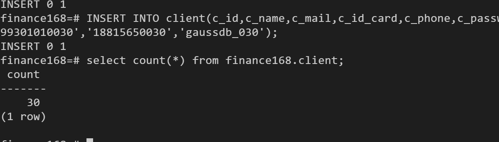

步骤 2对bank_card表进行数据初始化。
执行insert操作。

```sql
INSERT INTO finance168.bank_card(b_number,b_type,b_c_id) VALUES ('6222021302020000001','信用卡',1);
INSERT INTO finance168.bank_card(b_number,b_type,b_c_id) VALUES ('6222021302020000002','信用卡',3);
INSERT INTO finance168.bank_card(b_number,b_type,b_c_id) VALUES ('6222021302020000003','信用卡',5);
INSERT INTO finance168.bank_card(b_number,b_type,b_c_id) VALUES ('6222021302020000004','信用卡',7);
INSERT INTO finance168.bank_card(b_number,b_type,b_c_id) VALUES ('6222021302020000005','信用卡',9);
INSERT INTO finance168.bank_card(b_number,b_type,b_c_id) VALUES ('6222021302020000006','信用卡',10);
INSERT INTO finance168.bank_card(b_number,b_type,b_c_id) VALUES ('6222021302020000007','信用卡',12);
INSERT INTO finance168.bank_card(b_number,b_type,b_c_id) VALUES ('6222021302020000008','信用卡',14);
INSERT INTO finance168.bank_card(b_number,b_type,b_c_id) VALUES ('6222021302020000009','信用卡',16);
INSERT INTO finance168.bank_card(b_number,b_type,b_c_id) VALUES ('6222021302020000010','信用卡',18);
INSERT INTO finance168.bank_card(b_number,b_type,b_c_id) VALUES ('6222021302020000011','储蓄卡',19);
INSERT INTO finance168.bank_card(b_number,b_type,b_c_id) VALUES ('6222021302020000012','储蓄卡',21);
INSERT INTO finance168.bank_card(b_number,b_type,b_c_id) VALUES ('6222021302020000013','储蓄卡',7);
INSERT INTO finance168.bank_card(b_number,b_type,b_c_id) VALUES ('6222021302020000014','储蓄卡',23);
INSERT INTO finance168.bank_card(b_number,b_type,b_c_id) VALUES ('6222021302020000015','储蓄卡',24);
INSERT INTO finance168.bank_card(b_number,b_type,b_c_id) VALUES ('6222021302020000016','储蓄卡',3);
INSERT INTO finance168.bank_card(b_number,b_type,b_c_id) VALUES ('6222021302020000017','储蓄卡',26);
INSERT INTO finance168.bank_card(b_number,b_type,b_c_id) VALUES ('6222021302020000018','储蓄卡',27);
INSERT INTO finance168.bank_card(b_number,b_type,b_c_id) VALUES ('6222021302020000019','储蓄卡',12);
INSERT INTO finance168.bank_card(b_number,b_type,b_c_id) VALUES ('6222021302020000020','储蓄卡',29);
```
查询插入结果。

```sql
select count(*) from finance168.bank_card;
```
结果为：

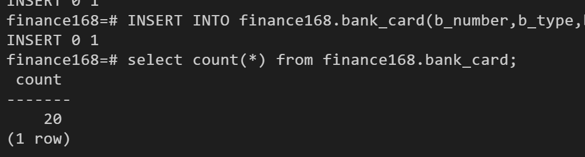

步骤 3对finance168s_product表进行数据初始化。
执行insert操作。

```sql
INSERT INTO finance168.finance168s_product(p_name,p_id,p_description,p_amount,p_year) VALUES ('债券',1,'以国债、金融债、央行票据、企业债为主要投资方向的银行理财产品。',50000,6);
INSERT INTO finance168.finance168s_product(p_name,p_id,p_description,p_amount,p_year) VALUES ('信贷资产',2,'一般指银行作为委托人将通过发行理财产品募集资金委托给信托公司，信托公司作为受托人成立信托计划，将信托资产购买理财产品发售银行或第三方信贷资产。',50000,6);
INSERT INTO finance168.finance168s_product(p_name,p_id,p_description,p_amount,p_year) VALUES ('股票',3,'与股票挂钩的理财产品。目前市场上主要以港股挂钩居多',50000,6);
INSERT INTO finance168.finance168s_product(p_name,p_id,p_description,p_amount,p_year) VALUES ('大宗商品',4,'与大宗商品期货挂钩的理财产品。目前市场上主要以挂钩黄金、石油、农产品的理财产品居多。',50000,6);
```
查询插入结果。

```sql
select count(*) from finance168.finance168s_product;
```
结果为：

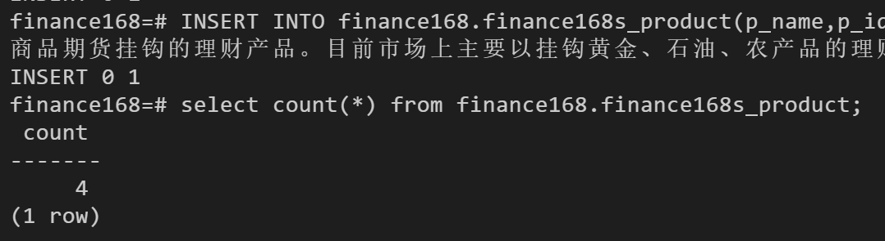

步骤 4对insurance表进行数据初始化。
执行insert操作。

```sql
INSERT INTO finance168.insurance(i_name,i_id,i_amount,i_person,i_year,i_project) VALUES ('健康保险',1,2000,'老人',30,'平安保险');
INSERT INTO finance168.insurance(i_name,i_id,i_amount,i_person,i_year,i_project) VALUES ('人寿保险',2,3000,'老人',30,'平安保险');
INSERT INTO finance168.insurance(i_name,i_id,i_amount,i_person,i_year,i_project) VALUES ('意外保险',3,5000,'所有人',30,'平安保险');
INSERT INTO finance168.insurance(i_name,i_id,i_amount,i_person,i_year,i_project) VALUES ('医疗保险',4,2000,'所有人',30,'平安保险');
INSERT INTO finance168.insurance(i_name,i_id,i_amount,i_person,i_year,i_project) VALUES ('财产损失保险',5,1500,'中年人',30,'平安保险');
```
查询插入结果。

```sql
select count(*) from finance168.insurance;
```
结果为：
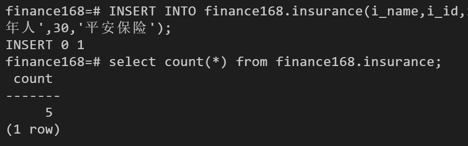
步骤 5对fund表进行数据初始化。
执行insert操作。

```sql
INSERT INTO finance168.fund(f_name,f_id,f_type,f_amount,risk_level,f_manager) VALUES ('股票',1,'股票型',10000,'高',1);
INSERT INTO finance168.fund(f_name,f_id,f_type,f_amount,risk_level,f_manager) VALUES ('投资',2,'债券型',10000,'中',2);
INSERT INTO finance168.fund(f_name,f_id,f_type,f_amount,risk_level,f_manager) VALUES ('国债',3,'货币型',10000,'低',3);
INSERT INTO finance168.fund(f_name,f_id,f_type,f_amount,risk_level,f_manager) VALUES ('沪深300指数',4,'指数型',10000,'中',4);
```
查询插入结果。

```sql
select count(*) from finance168.fund;
```
结果为：
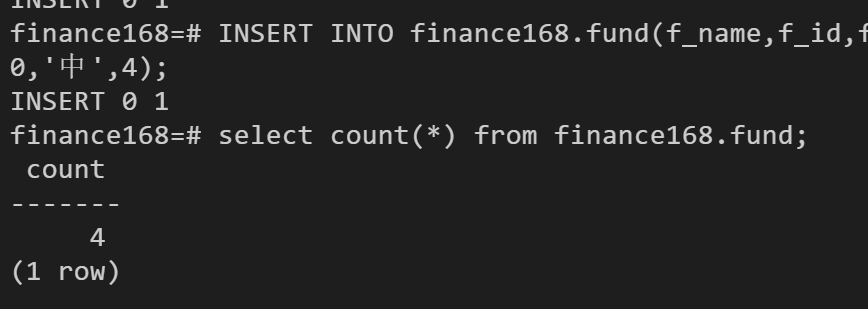
步骤 6对property表进行数据初始化。
执行insert操作。

```sql
INSERT INTO finance168.property(pro_id,pro_c_id,pro_pif_id,pro_type,pro_status,pro_quantity,pro_income,pro_purchase_time) VALUES (1,5,1,1,'可用',4,8000,'2018-07-01');
INSERT INTO finance168.property(pro_id,pro_c_id,pro_pif_id,pro_type,pro_status,pro_quantity,pro_income,pro_purchase_time) VALUES (2,10,2,2,'可用',4,8000,'2018-07-01');
INSERT INTO finance168.property(pro_id,pro_c_id,pro_pif_id,pro_type,pro_status,pro_quantity,pro_income,pro_purchase_time) VALUES (3,15,3,3,'可用',4,8000,'2018-07-01');
INSERT INTO finance168.property(pro_id,pro_c_id,pro_pif_id,pro_type,pro_status,pro_quantity,pro_income,pro_purchase_time) VALUES (4,20,4,1,'冻结',4,8000,'2018-07-01');
```
查询插入结果。

```sql
select count(*) from finance168.property;
```
结果为：
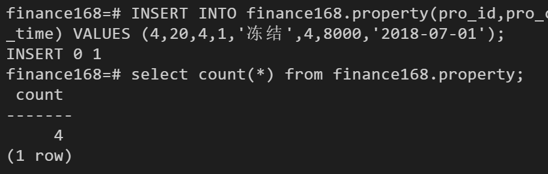

## 1.1.6 手工插入一条数据
当C银行有新的信息需要加入数据库时，系统需要在对应的数据表中手动插入一条新的数据。因此，针对主键属性定义的场景，介绍如何手动插入一条数据。
步骤 1在金融数据库的客户信息表中添加一个客户的信息。（属性冲突的场景）
c_id_card和c_phone非唯一。

```sql
INSERT INTO finance168.client(c_id,c_name,c_mail,c_id_card,c_phone,c_password) VALUES (31,'李丽','lili@huawei.com','340211199301010005','18815650005','gaussdb_005');
```
错误信息如下：duplicate key value violates unique constraint "client_c_id_card_key"

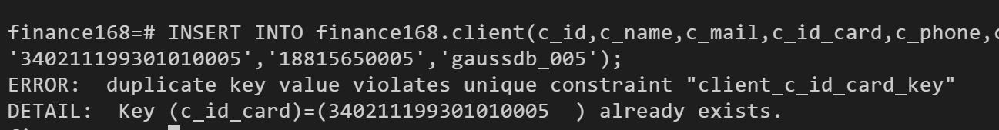

说明：由于在表的创建过程中，实验定义了c_id_card和c_phone为唯一且非空（UNIQUE NOT NULL），所以当表中存在时，插入数据失败。
步骤 2在金融数据库的客户信息表中添加一个客户的信息。（插入成功的场景）。
插入成功的示例。

```sql
INSERT INTO finance168.client(c_id,c_name,c_mail,c_id_card,c_phone,c_password) VALUES (31,'李丽','lili@huawei.com','340211199301010031','18815650031','gaussdb_031');
```

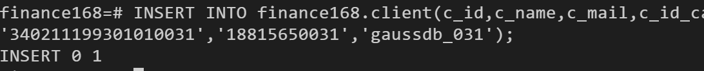

## 1.1.7 添加约束

步骤 1对表添加外键约束，在银行信息表和资产信息表中，都存在每个银行卡必须有一个持卡者、每份资产必须都有一个资产拥有者这样的对应关系。因此针对这种对应关系，创建外键约束。
给表bank_card添加外键约束

```sql
ALTER TABLE finance168.bank_card ADD CONSTRAINT fk_c_id FOREIGN KEY (b_c_id) REFERENCES finance168.client(c_id) ON DELETE CASCADE;
```
给表property添加外键约束

```sql
ALTER TABLE finance168.property ADD CONSTRAINT fk_pro_c_id FOREIGN KEY (pro_c_id) REFERENCES finance168.client(c_id) ON DELETE CASCADE;
```
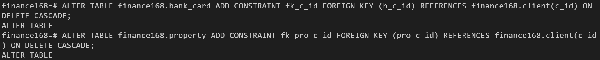

备注：
银行卡信息表中的b_c_id与客户信息表中的c_id一致，且每个银行卡都必须有一个持卡者。
在进行表删除时，需要先删除bank_card表，再删除client表，因为两个表存在约束。
资产信息表中的pro_c_id与客户信息表中的c_id一致，且每一份资产都必须有一个资产拥有者。
在进行表删除时，需要先删除property表，再删除client表，因为两个表存在约束。

步骤 2在理财产品表、保险信息表和基金信息表中，都存在金额这个属性，在现实生活中，金额不会存在负数。因此针对表中金额的属性，增加大于0的约束条件。
为finance168s_product表的p_amount列添加大于等于0的约束。

```sql
ALTER table finance168.finance168s_product ADD CONSTRAINT c_p_mount CHECK (p_amount >=0);
```
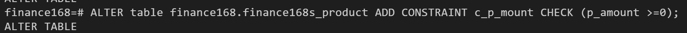

步骤 3尝试手工插入一条金额小于0的记录。

```sql
INSERT INTO finance168.finance168s_product(p_name,p_id,p_description,p_amount,p_year) VALUES ('信贷资产',10,'一般指银行作为委托人将通过发行理财产品募集资金委托给信托公司，信托公司作为受托人成立信托计划，将信托资产购买理财产品发售银行或第三方信贷资产。',-10,6);
```
执行失败，失败原因：new row for relation "finance168s_product" violates check constraint "c_p_mount"。

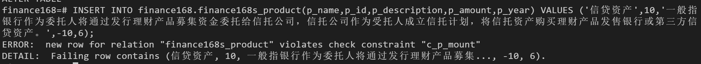

步骤 4向fund表添加约束。
为fund表的f_amount列添加大于等于0的约束。

```sql
ALTER table finance168.fund ADD CONSTRAINT c_f_mount CHECK (f_amount >=0);
```
步骤 5向insurance表添加约束。
为insurance表的i_amount列添加大于等于0的约束。

```sql
ALTER table finance168.insurance ADD CONSTRAINT c_i_mount CHECK (i_amount >=0);
```

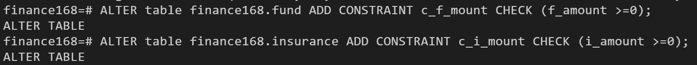

## 1.1.8 查询数据

在本章的金融数据库实验中，主要目的是为了让读者学习到更深一层的查询操作，让学习者能够更深入的去了解openGauss数据库的复杂操作。
步骤 1单表查询。
查询银行卡信息表。

```sql
SELECT b_number,b_type FROM finance168.bank_card;
```
结果如下：
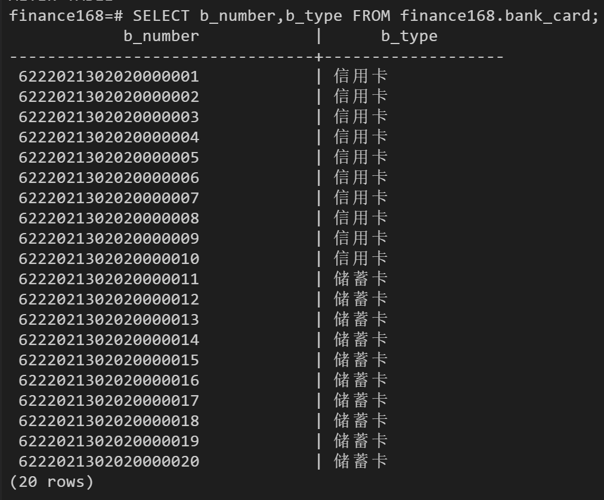
步骤 2条件查询。
查询资产信息中‘可用’的资产数据。

```sql
select * from finance168.property where pro_status='可用';
```
结果如下：

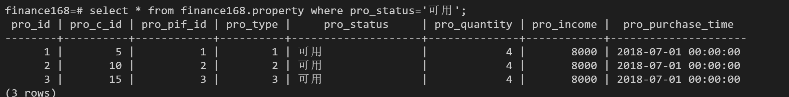

步骤 3聚合查询。
查询用户表中有多少个用户。

```sql
SELECT count(*) FROM finance168.client;
```
结果如下：

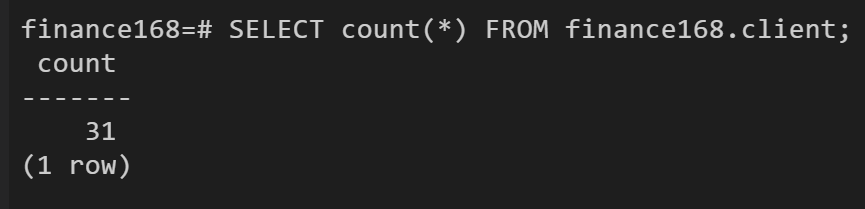

查询银行卡信息表中，储蓄卡和信用卡的个数。

```sql
SELECT b_type,COUNT(*) FROM finance168.bank_card GROUP BY b_type;
```
结果如下：
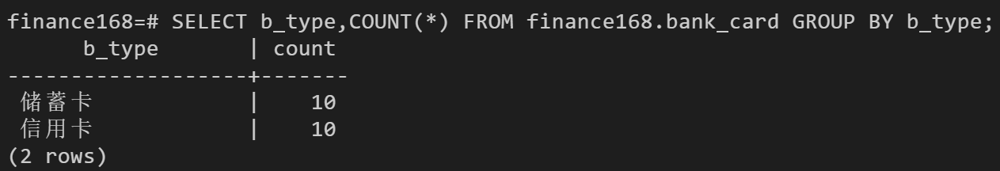
查询保险信息表中，保险金额的平均值。

```sql
SELECT AVG(i_amount) FROM finance168.insurance;
```
结果如下：

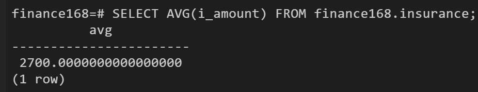

查询保险信息表中保险金额的最大值和最小值所对应的险种和金额。

```sql
select i_name,i_amount from finance168.insurance where i_amount in (select max(i_amount) from finance168.insurance)
union
select i_name,i_amount from finance168.insurance where i_amount in (select min(i_amount) from finance168.insurance);
```
结果如下：
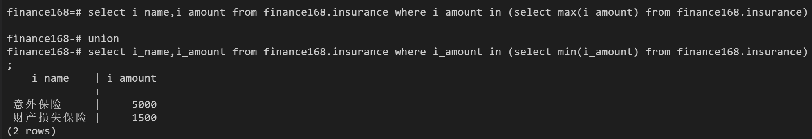
步骤 4连接查询。
（1)半连接。
查询用户编号在银行卡表中出现的用户的编号，用户姓名和身份证。

```sql
SELECT c_id,c_name,c_id_card FROM finance168.client WHERE EXISTS (SELECT * FROM finance168.bank_card WHERE client.c_id = bank_card.b_c_id);
```
结果如下：
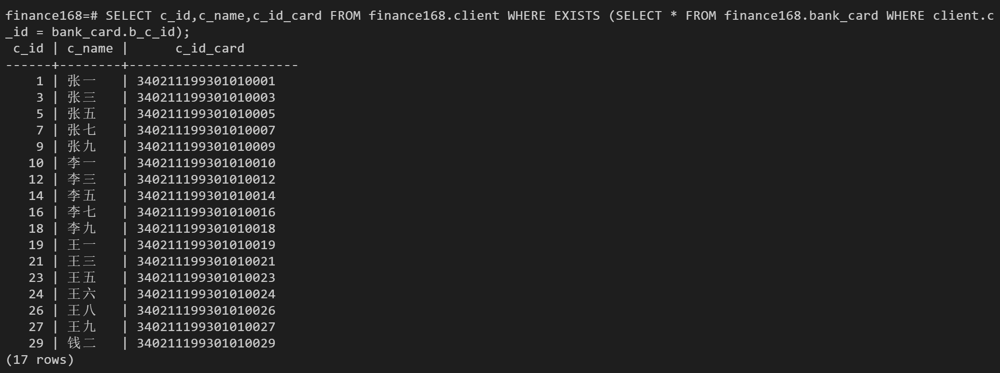
备注：半连接是一种特殊的连接类型，在SQL中没有指定的关键字，通过在WHERE后面使用IN或EXISTS子查询实现。当IN/EXISTS右侧的多行满足子查询的条件时，主查询也只返回一行与EXISTS子查询匹配的行，而不是复制左侧的行。
（2）反连接。
查询银行卡号不是'622202130202000001*'（*表示未知)的用户的编号，姓名和身份证。

```sql
SELECT c_id,c_name,c_id_card FROM finance168.client WHERE c_id NOT IN (SELECT b_c_id FROM finance168.bank_card WHERE b_number LIKE '622202130202000001_');
```
结果如下：
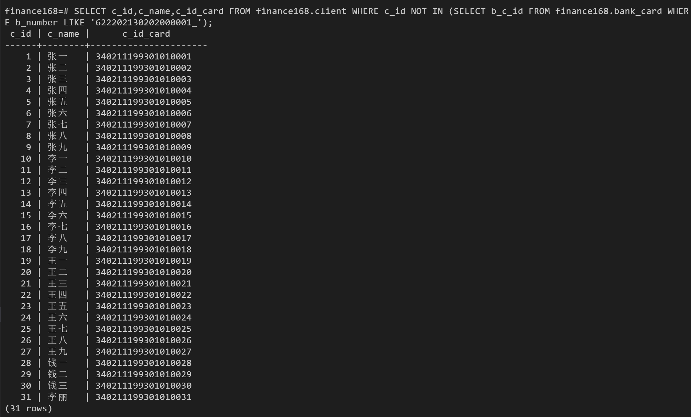

备注：反连接是一种特殊的连接类型，在SQL中没有指定的关键字，通过在WHERE后面使用 NOT IN或NOT EXISTS子查询实现。返回所有不满足条件的行。这个关系的概念跟半连接相反。
步骤 5子查询。
通过子查询，查询保险产品中保险金额大于平均值的保险名称和适用人群。

```sql
SELECT i1.i_name,i1.i_amount,i1.i_person FROM finance168.insurance i1 WHERE i_amount > (SELECT avg(i_amount) FROM finance168.insurance i2);
```
结果如下：
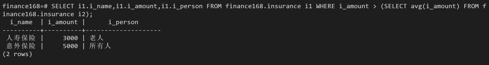
步骤 6ORDER BY和GROUP BY。
（1)ORDER BY子句。
按照保额降序查询保险编号大于2的保险名称，保额和适用人群。

```sql
SELECT i_name,i_amount,i_person FROM finance168.insurance WHERE i_id>2 ORDER BY i_amount DESC;
```
结果如下：
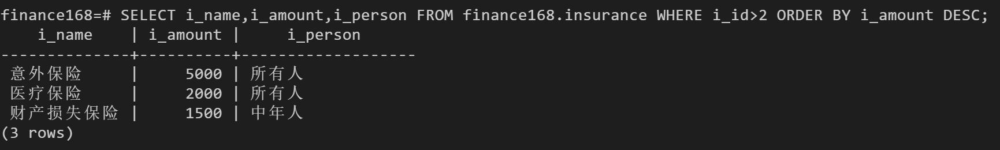
（2)GROUP BY子句。
查询各理财产品信息总数，按照p_year分组。

```sql
SELECT p_year,count(p_id) FROM finance168.finance168s_product GROUP BY p_year;
```
结果如下：
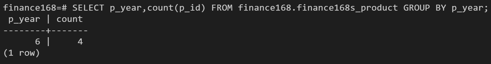
步骤 7HAVING和WITH AS。
（1)HAVING子句。
查询保险金额统计数量等于2的适用人群数。

```sql
SELECT i_person,count(i_amount) FROM finance168.insurance GROUP BY i_person HAVING count(i_amount)=2;
```
结果如下：
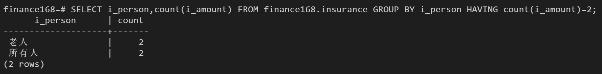
备注：HAVING子句依附于GROUP BY子句而存在。
（2)WITH AS子句。
使用WITH AS查询基金信息表。

```sql
WITH temp AS (SELECT f_name,ln(f_amount) FROM finance168.fund ORDER BY f_manager DESC) SELECT * FROM temp;
```
结果如下：
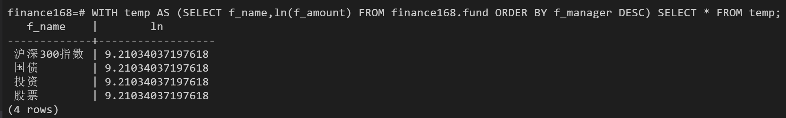
备注：该语句为定义一个SQL片段，该SQL片段会被整个SQL语句用到。
可以使SQL语句的可读性更高。存储SQL片段的表与基本表不同，是一个虚表。数据库不存放对应的定义和数据，这些数据仍存放在原来的基本表中。若基本表中的数据发生变化，从存储SQL片段的表中查询出的数据也随之改变。

## 1.1.9 视图
视图是一个虚拟表，是sql的查询结果，其内容由查询定义。对于来自多张关联表的复杂查询，就不得不使用十分复杂的SQL语句进行查询，造成极差的体验感。使用视图之后，可以极大的简化操作，使用视图不需要关心相应表的结构、关联条件等。
步骤 1创建视图。
针对“查询用户编号在银行卡表中出现的用户的编号，用户姓名和身份证” 的查询，创建视图。

```sql
CREATE VIEW finance168.v_client as SELECT c_id,c_name,c_id_card FROM finance168.client WHERE EXISTS (SELECT * FROM finance168.bank_card WHERE client.c_id = bank_card.b_c_id); 
```
使用视图进行查询。

```sql
SELECT * FROM finance168.v_client;
```
结果如下：
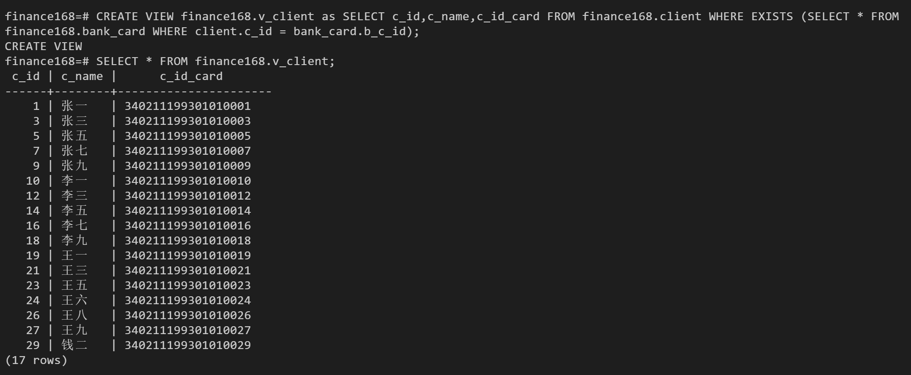
步骤 2修改视图内容
修改视图，在原有查询的基础上，过滤出信用卡用户。

```sql
CREATE OR REPLACE VIEW finance168.v_client as SELECT c_id,c_name,c_id_card FROM finance168.client WHERE EXISTS (SELECT * FROM finance168.bank_card WHERE client.c_id = bank_card.b_c_id and bank_card.b_type='信用卡');
```
使用视图进行查询。

```sql
select * from finance168.v_client;
```
结果如下：
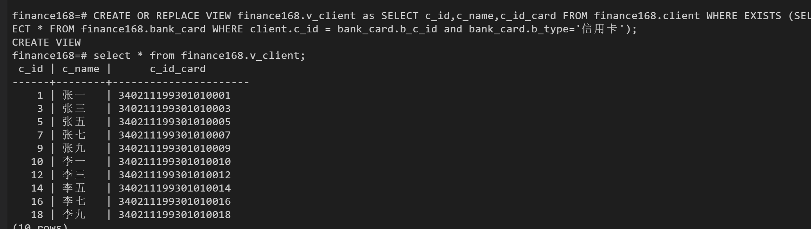
步骤 3修改视图名称。

```sql
ALTER VIEW finance168.v_client RENAME TO v_client_new;
```
步骤 4删除视图。
将v_client视图删除，删除视图不影响基表。

```sql
DROP VIEW finance168.v_client_new;
```
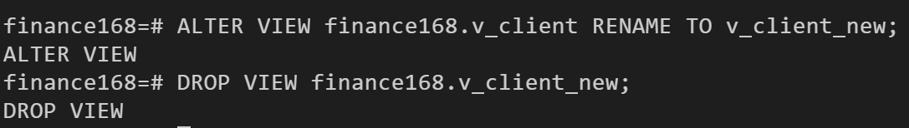

## 1.1.10 索引

步骤 1创建索引。
在普通表property上创建索引。

```sql
CREATE INDEX finance168.idx_property ON finance168.property(pro_c_id DESC,pro_income,pro_purchase_time);
```
结果如下：

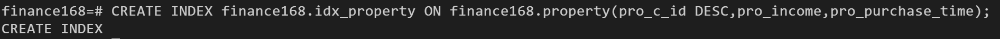
步骤 2重命名索引。
在普通表property上重建及重命名索引。
重建索引。

```sql
DROP INDEX finance168.idx_property;
CREATE INDEX finance168.idx_property ON finance168.property(pro_c_id DESC,pro_income,pro_purchase_time);
```
重命名索引。

```sql
ALTER INDEX finance168.idx_property RENAME TO idx_property_temp;
```
步骤 3删除索引。
删除索引idx_property_temp。

```sql
DROP INDEX finance168.idx_property_temp;
```
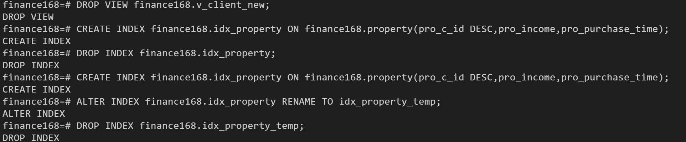

## 1.1.11 数据的修改和删除

步骤 1修改数据。
修改/更新银行卡信息表中b_c_id小于10和客户信息表中c_id相同的记录的b_type字段。
查看表数据。

```sql
SELECT * FROM finance168.bank_card where b_c_id<10 ORDER BY b_c_id;
```
结果如下：
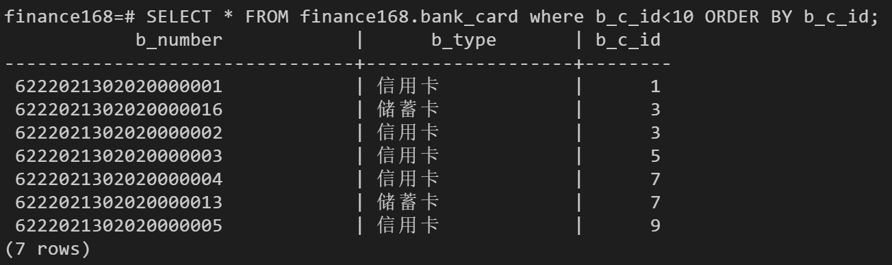
开始更新数据：

```sql
UPDATE finance168.bank_card SET bank_card.b_type='借记卡' from finance168.client where bank_card.b_c_id = client.c_id and bank_card.b_c_id<10;
```
重新查询数据情况。

```sql
SELECT * FROM finance168.bank_card ORDER BY b_c_id;
```
结果如下：
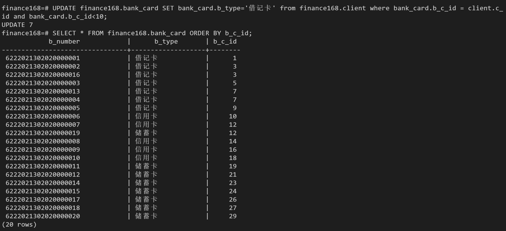
步骤 2删除指定数据。
删除基金信息表中编号小于3的行。
删除前查询结果。

```sql
SELECT * FROM finance168.fund;
```
结果如下：
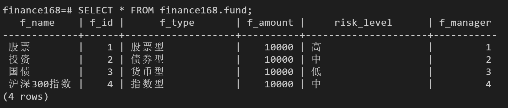
开始删除数据：

```sql
DELETE FROM finance168.fund WHERE f_id<3;
```
查询删除结果。

```sql
SELECT * FROM finance168.fund;
```
结果如下：
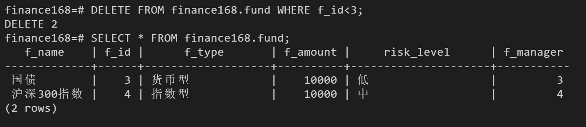
步骤 3退出数据库

```shh
\q
```

## 1.1.12 新用户的创建和授权
在本章中，假设C银行的某新员工想要在自己的用户下去访问sys用户下的金融数据库，则该员工需要向sys申请添加相关权限，具体操作如下：
步骤 1连接数据库

```sh
gsql -d postgres -p 26000 -r
```
步骤 2连接数据库后，进入SQL命令界面。创建用户dbuser，密码为Gauss#3demo。

```sql
CREATE USER dbuser IDENTIFIED BY 'Gauss#3demo';
```
步骤 3切换到finance168数据库，给用户dbuser授予finance168数据库下bank_card表的查询和插入权限，并将SCHEMA的权限也授予dbuser用户。

```sql
\connect finance168;
GRANT SELECT,INSERT ON finance168.bank_card TO dbuser;
GRANT ALL ON SCHEMA finance168 to dbuser;
```
步骤 4退出数据库：

	\q
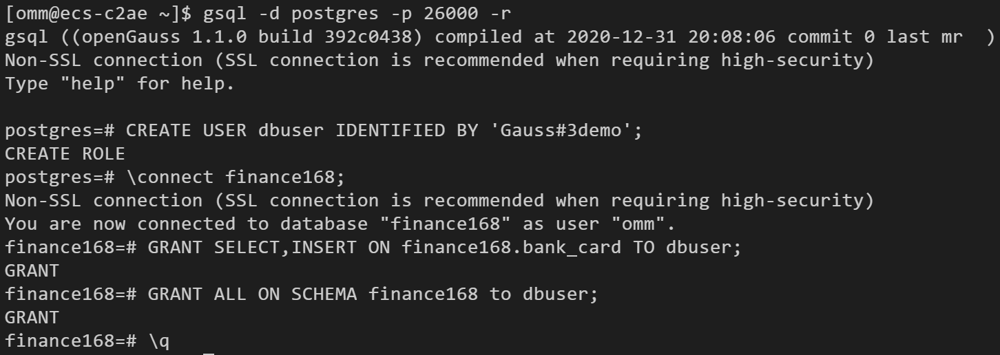

## 1.1.13 新用户连接数据库

步骤 1在gsql登录数据库，使用新用户连接。
使用操作系统omm用户在新的窗口登陆并执行以下命令，并输入对应的密码(如：Gauss#3demo)。

```sql
gsql -d finance168 -U dbuser -p 26000 -r
```
步骤 2访问finance168数据库的表bank_card。

```sql
select * from finance168. bank_card where b_c_id<10;
```
结果如下：
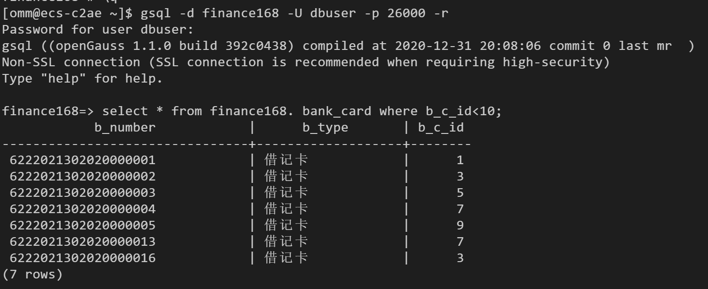
步骤 3退出数据库：

```sql
\q
```

## 1.1.14 删除Schema
步骤 1使用管理员用户登陆finance168数据库。
通过gsql来登录finance168数据库，新建session。

```sql
gsql -d finance168 -p 26000 -r
```
步骤 2使用“\dn”查看数据库下的schema。

```sql
\dn
```
  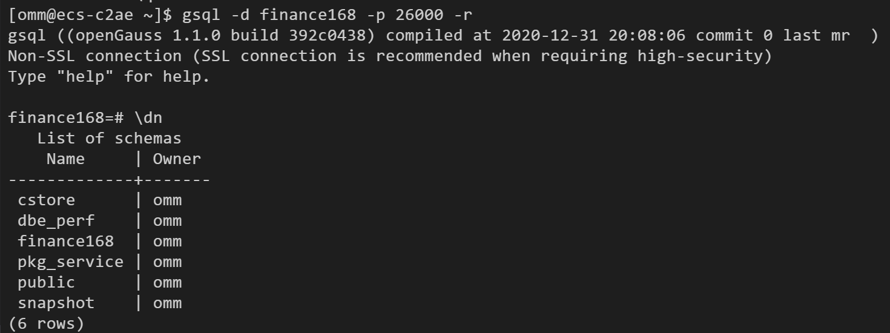
步骤 3设置默认查询为finance168。

```sql
set search_path to finance168;
```
步骤 4使用“\dt”命令可以看到在finance168中的对象。

```sql
\dt                               
```
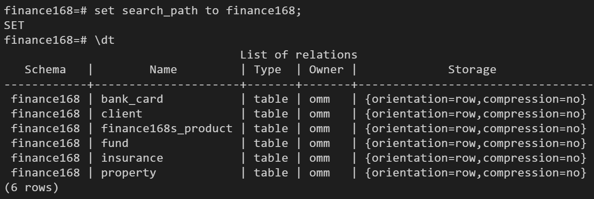
步骤 5使用DROP SCHEMA 命令删除finance168会有报错，因为finance168下存在对象。

```sql
DROP SCHEMA finance168;
```
报错如下：
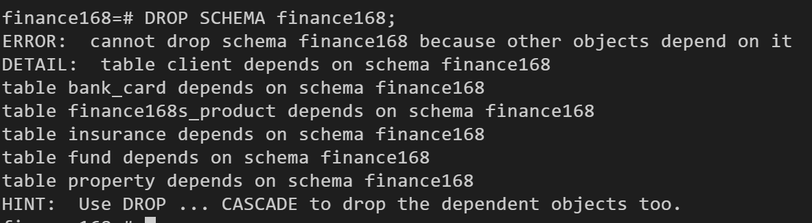
步骤 6使用DROP SCHEMA…..CASCADE删除，会将finance168连同下的对象一起删除。

```sql
DROP SCHEMA finance168 CASCADE;
```
结果如下：
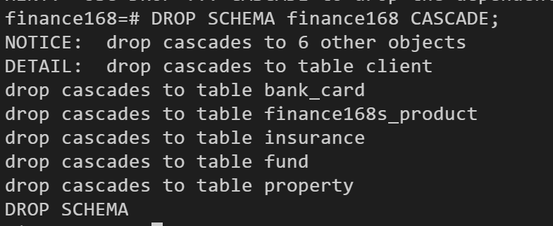
步骤 7使用“\dt”命令可以看到在finance168和public中的对象，对象已删除。

```sql
\dt  
```


步骤 8退出数据库：

```sql
postgres=#\q
```

