### 针对供应管理数据库SPJ，进行各种嵌套与集合查询：

##### (1)查询使用了“S001”供应商供应的零件的工程项目信息；
```sql
SELECT
	* 
FROM
	J168 
WHERE
	JNO IN ( SELECT JNO FROM SPJ168 WHERE SNO = 'S001' ) 
```
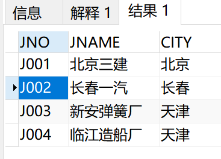

##### (2)查询供应零件“螺丝刀”的供应商信息；

```sql
SELECT
	* 
FROM
	S168 
WHERE
	SNO IN ( SELECT SNO FROM SPJ168 WHERE PNO IN ( SELECT PNO FROM P168 WHERE PNAME = '螺丝刀' ) )
```

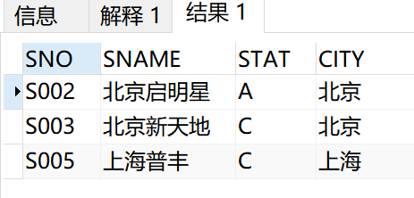

##### (3)查询供应商“北京新天地”的所有客户（工程项目）的信息；

```sql 
SELECT
	* 
FROM
	J168 
WHERE
	JNO IN ( SELECT JNO FROM SPJ168 WHERE SNO IN ( SELECT SNO FROM S168 WHERE SNAME = '北京新天地' ) )
```

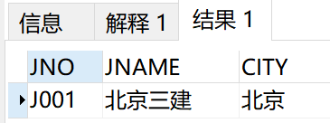

##### (4)查询供应了“J003”工程“P002”零件的供应商信息；

```sql 
SELECT
	* 
FROM
	S168 
WHERE
	SNO IN ( SELECT SNO FROM SPJ168 WHERE JNO = 'J003' AND PNO = 'P002' )
```

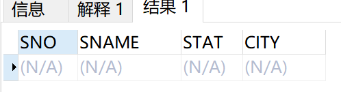

##### (5)查询使用了“天津”供应商供应的“红色”零件的工程项目信息；

```sql  
SELECT
	* 
FROM
	J168 
WHERE
	JNO IN (
	SELECT
		JNO 
	FROM
		SPJ168 
	WHERE
		SNO IN ( SELECT SNO FROM S168 WHERE CITY = '天津' ) 
		AND PNO IN ( SELECT PNO FROM P168 WHERE COLOR = '红色' ) 
	)
```

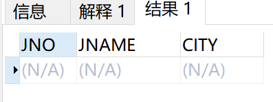

##### (6)查询没有使用“天津”供应商供应的“红色”零件的工程项目信息；

```sql 
SELECT
	* 
FROM
	J168 
WHERE
	JNO IN (
	SELECT
		JNO 
	FROM
		SPJ168 
	WHERE
		PNO != ALL (
		SELECT
			PNO 
		FROM
			P168 
		WHERE
			COLOR = '红色' 
			AND PNO IN ( SELECT PNO FROM SPJ168 WHERE SNO IN ( SELECT SNO FROM S168 WHERE CITY = '天津' ) ) 
		) 
	)
```

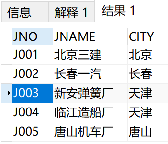

##### (7)查询使用了“S002”供应的“螺母”零件的工程信息；

```sql  
SELECT
	* 
FROM
	J168 
WHERE
	JNO IN ( SELECT JNO FROM SPJ168 WHERE PNO IN ( SELECT PNO FROM P168 WHERE PNAME = '螺  母' ) AND SNO = 'S002' )
```

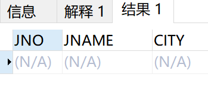

##### (8)查询使用了 “螺母”零件的工程信息及相应供应商信息；
```sql 
SELECT
	J168.JNO,
	JNAME,
	J168.CITY,
	S168.SNO,
	SNAME,
	S168.CITY,
	STAT 	
FROM
	J168,S168,SPJ168,P168
WHERE
	SPJ168.SNO = S168.SNO	AND SPJ168.JNO = J168.JNO AND SPJ168.PNO = P168.PNO AND PNAME = '螺  母' 
```

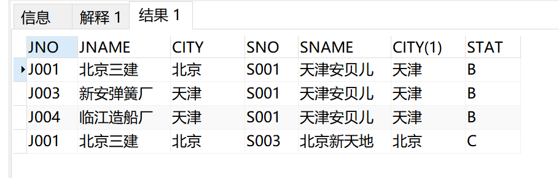

##### (9)查询给“长春一汽”项目供应零件的供应商信息和供应情况；
```sql 
SELECT
	S168.SNO,
	SNAME,
	S168.CITY,
	P168.PNO,
	PNAME,
	COLOR,
	WT 
FROM
	S168,	SPJ168,	J168,	P168 
WHERE
	SPJ168.SNO = S168.SNO 
	AND SPJ168.JNO = J168.JNO 
	AND SPJ168.PNO = P168.PNO 
	AND JNAME = '长春一汽'
```

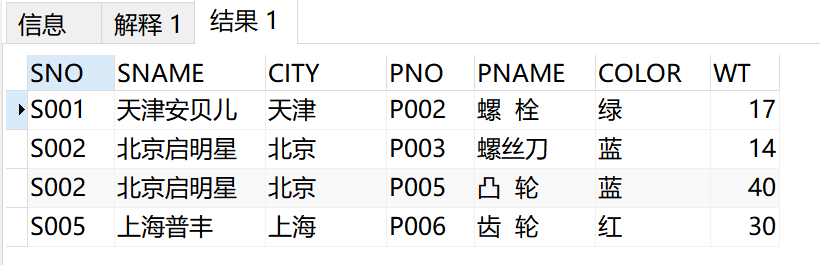

##### (10)查询给“长春一汽”项目供应“螺母”零件最多的供应商信息和供应情况;

```sql 
SELECT
	S168.SNO,
	SNAME,
	S168.CITY,
	P168.PNO,
	PNAME,
	COLOR,
	WT 
FROM
	S168,
	SPJ168,
	J168,
	P168 
WHERE
	SPJ168.SNO = S168.SNO 
	AND SPJ168.JNO = J168.JNO 
	AND SPJ168.PNO = P168.PNO 
	AND JNAME = '长春一汽' 
	AND WT IN ( SELECT MAX ( WT ) FROM P168 WHERE PNAME = '螺  母' )
```

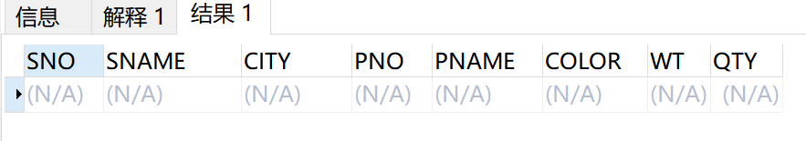

##### (11)查询使用了“螺母”或“螺丝刀”零件的工程项目信息；

```sql 
SELECT
	* 
FROM
	J168 
WHERE
	JNO IN ( SELECT JNO FROM SPJ168 WHERE PNO IN 
	( SELECT PNO FROM P168 WHERE PNAME = '螺  母' 
	UNION SELECT PNO FROM P168 WHERE PNAME = '螺丝刀' ) )
```

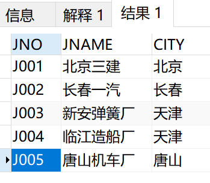

##### (12)查询既使用了“螺母”又使用了“螺丝刀”零件的工程项目信息；

```sql  
SELECT
	* 
FROM
	J168 
WHERE
	JNO IN ( SELECT JNO FROM SPJ168 WHERE PNO IN 
	( SELECT PNO FROM P168 WHERE PNAME = '螺  母' 
	INTERSECT SELECT PNO FROM P168 WHERE PNAME = '螺丝刀' ) )
```

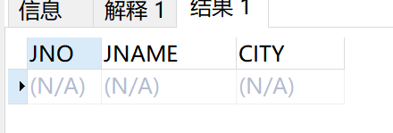

##### (13)查询使用了“螺母”零件但没有使用“螺丝刀”零件的工程项目信息；

```sql 
SELECT
	* 
FROM
	J168 
WHERE
	JNO IN ( SELECT JNO FROM SPJ168 WHERE PNO IN ( SELECT PNO FROM P168 WHERE PNAME = '螺  母' EXCEPT SELECT PNO FROM P168 WHERE PNAME = '螺丝刀' ) )
```

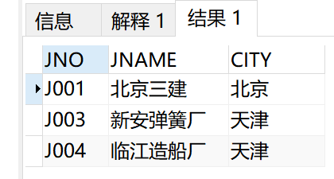

##### (14)查询使用过所有供应商供应的零件的工程项目信息。 不存在任何零件没使用
```sql  
SELECT
	* 
FROM
	J168 
WHERE
	NOT EXISTS (
	SELECT
		* 
	FROM
		P168 
	WHERE
		NOT EXISTS ( SELECT * FROM SPJ168 WHERE SPJ168.PNO = P168.PNO AND SPJ168.JNO = J168.JNO ) 
	)
```

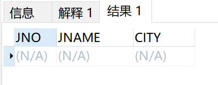


