# 数据更新
#### 1插入一个供应商‘S6’的信息，具体参数自己设定；
```sql
INSERT 
INTO S168(SNO,SNAME,STAT,CITY)
VALUES('S6','亳州制造厂','A','亳州')
```

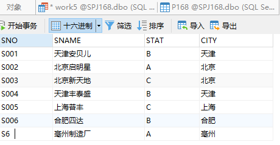

#### 2插入一个零件‘P7’的信息，具体参数自己设定；

```sql
INSERT 
INTO P168(PNO,PNAME,COLOR,WT)
VALUES('P7','螺丝刀','红','30')
```

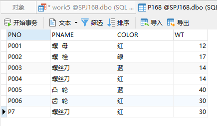

#### 3插入一个项目’J8’的信息，具体参数自己设定；

```sql
INSERT 
INTO J168(JNO,JNAME,CITY)
VALUES('J8','亳州机场','亳州').
```

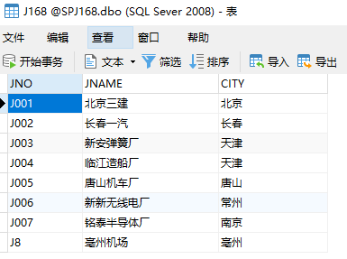

#### 4插入‘S6’供应项目’J8’ 零件P7的信息，供应量为500；

```sql
INSERT 
INTO SPJ168(SNO,PNO,JNO,QTY)
VALUES('S6','P7','J8','500')
```

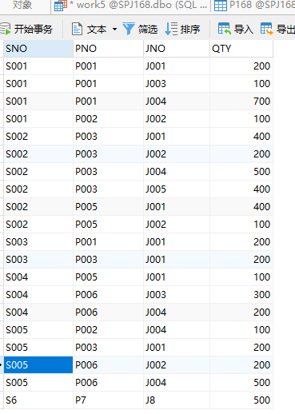

#### 5计算各个供应商供应各种零件的平均供货量，并将结果存放在数据库中（先建表）*；

```sql
CREATE TABLE Savg_QTY
(SNO CHAR(10),
PNO CHAR(10),
avg_grade INT)

INSERT
INTO Savg_QTY
	SELECT SNO,PNO,AVG(QTY)
	FROM SPJ168
	GROUP BY SNO,PNO 
```

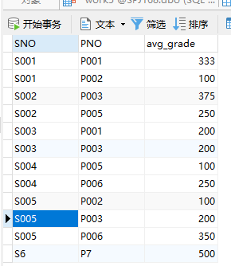

#### 6将所有供应工程“J2”零件“P3”的供应商改为S1；

```sql
UPDATE SPJ168
SET SNO = 'S1'
WHERE JNO = 'J2' AND PNO = 'P3'
```
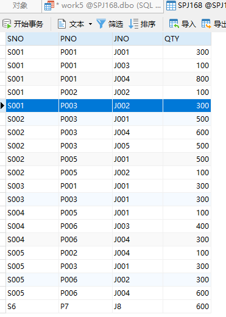

#### 7修改供应量大于100的供应详情，将供应量增加100；

```sql
UPDATE SPJ168
SET QTY = QTY + 100 
WHERE QTY > 100
```
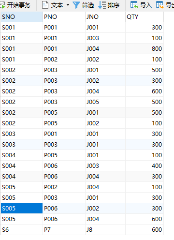

#### 8将J1项目的最大供应量降为为原来的一半；

```sql
UPDATE SPJ168 
SET QTY = QTY / 2 
WHERE
	QTY >= ALL ( SELECT QTY FROM SPJ168 WHERE JNO = 'J001' )
```

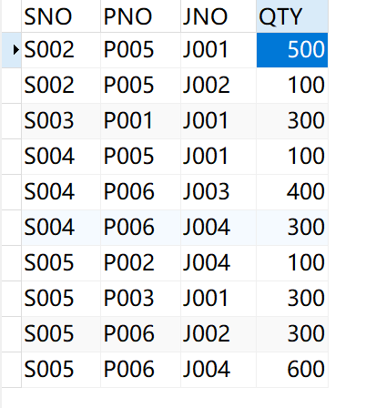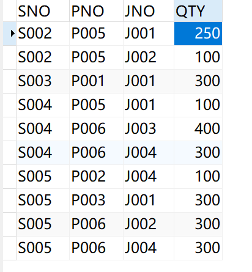

#### 9删除S6供应商信息（注意参照完整性）；

```sql
DELETE 
FROM S168
WHERE SNO = 'S6'
```


#### 10删除零件‘P7’的信息；

```sql
DELETE 
FROM P168
WHERE PNO = 'P7'
```
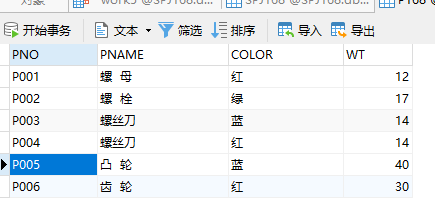

#### 11删除项目’J8’的信息；

```sql
DELETE 
FROM J168
WHERE JNO = 'J8'
```
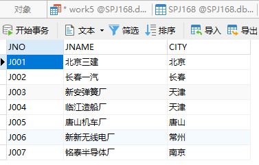

#### 12删除项目‘J7’的所有供应信息；

```sql
DELETE 
FROM SPJ168
WHERE JNO = 'J007'
```
#### 13删除 “天津安贝儿”供应商的所有供应信息；*
```sql
DELETE 
FROM
	SPJ168 
WHERE
	SNO IN ( SELECT SNO FROM S168 WHERE SNAME = '天津安贝儿' )
```


#### 14删除使用了“北京”供应商供应的“螺丝刀”零件的供应信息和工程项目信息；

```sql
DELETE 
FROM
	SPJ168 
WHERE
	SNO = ( SELECT SNO FROM S168 WHERE SPJ168.SNO = S168.SNO AND CITY = '北京') AND PNO = ( SELECT PNO FROM P168 WHERE SPJ168.PNO = P168.PNO AND PNAME = '螺丝刀')
```

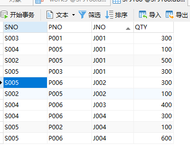
