# 简单查询

针对供应管理数据库SPJ，进行以下各种简单查询：

1. 查询所有供应商的信息，用中文表头显示；

   ```sql
   --1.查询所有供应商的信息，用中文表头显示；
   SELECT SNAME
   FROM S168
   ```
   
   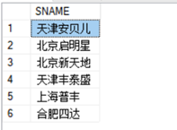
   
2. 查询位于"北京"的名称包含"星"的供应商信息；

    ```sql
    --2.查询位于“北京”的名称包含“星”的供应商信息；
    SELECT SNAME,SNO FROM S168
    WHERE CITY='北京' AND SNAME LIKE '%星%'
    ```

    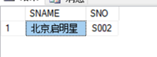

3. 查询供应商名中最后一个字是"丰"的供应商信息；

    ```sql
    --3.查询供应商名中最后一个字是“丰”的供应商信息；
    SELECT SNAME,SNO FROM S168
    WHERE  SNAME LIKE '%丰'
    ```

    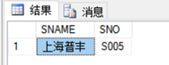

4. 查询零件名以"螺丝"开头的零件信息；

    ```sql
    --4.查询零件名以“螺丝”开头的零件信息；
    SELECT PNAME,PNO FROM P168
    WHERE PNAME LIKE '螺丝%'
    ```

    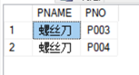

5. 查询名称含有"车"的工程项目信息；

    ```sql
    --5.查询名称含有“车”的工程项目信息；
    SELECT JNAME FROM J168
    WHERE JNAME LIKE '%车%'
    ```

    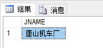

6. 查询名称为"螺母"、"螺栓"、"螺丝刀"的零件信息；

    ```sql
    --6.查询名称为“螺母”、“螺栓”、“螺丝刀”的零件信息；
    SELECT * FROM P168
    WHERE PNAME IN ('螺  母','螺  栓','螺丝刀')
    ```

    

7. 查询"S001"号供应商的供应情况；

    ```sql
    --7.查询“S001”号供应商的供应情况；
    SELECT * FROM SPJ168
    WHERE SNO='S001'
    ```

    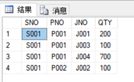

8. 查询"P002"号零件的总供应量；

   ```sql
   --8.查询“P002”号零件的总供应量；
   SELECT SUM(QTY) 
   FROM SPJ168
   WHERE PNO='P002'
   ```
   
   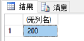
   
9. 查询"P002"号零件供应量的最大、最小和平均值；

    ```sql
    --9.查询“P002”号零件供应量的最大、最小和平均值；
    SELECT MAX(QTY),MIN(QTY),AVG(QTY)
    FROM SPJ168
    WHERE PNO='P002'
    ```

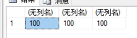


10. 分组计算每个工程项目使用每种零件的供应量；
    
    ```sql
    --10.分组计算每个工程项目使用每种零件的供应量；
    SELECT JNO,PNO, SUM(QTY)  AS  SUMQTY_BYJNO
    FROM   SPJ168
    GROUP BY JNO,PNO;
    ```

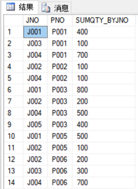

11. 查询供应量在300以上的供应信息；

    ```sql
    --11.查询供应量在300以上的供应信息；
    SELECT PNO, SUM(QTY) AS SUMQTY_BYPNO
    FROM   SPJ168
    GROUP BY PNO
    HAVING SUM(QTY)>300
    ```

    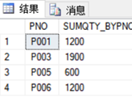

12. 查询供应量最低的两个供应信息；

    ```sql
    --12.查询供应量最低的两个供应信息；
    SELECT TOP 2 * 
    FROM	 SPJ168
    ORDER BY QTY  ASC; 
    ```

    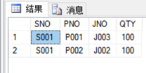

13. 查询供应量前三名的供应商的编号；

    ```sql
    --13.查询供应量前三名的供应商的编号；
    SELECT TOP 3 SNO
    FROM	 SPJ168
    ORDER BY QTY  DESC;  
    ```

    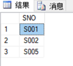

14. 分组统计每个供应商供应每种零件的供应量。

    ```sql
    --14.分组统计每个供应商供应每种零件的供应量。
    SELECT SNO,PNO, SUM(QTY)  AS  SUMQTY_BYSP
    FROM   SPJ168
    GROUP BY SNO,PNO
    ```
    
    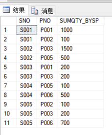

