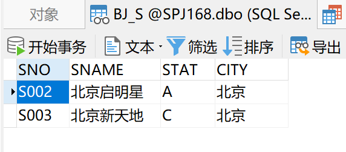
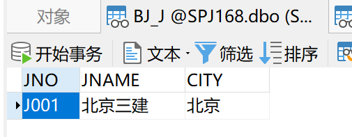
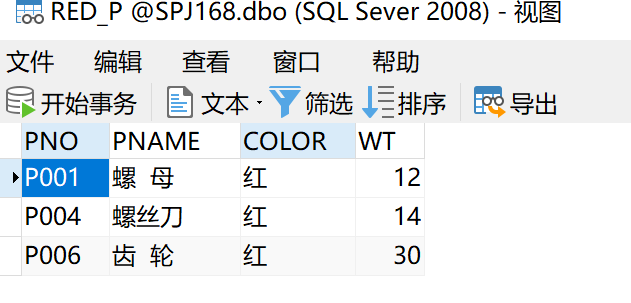
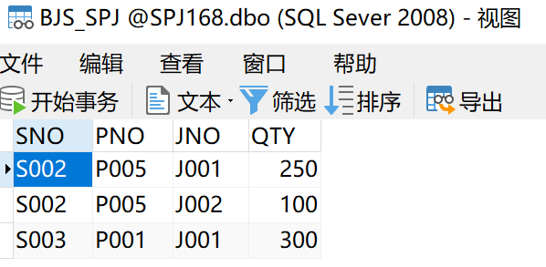
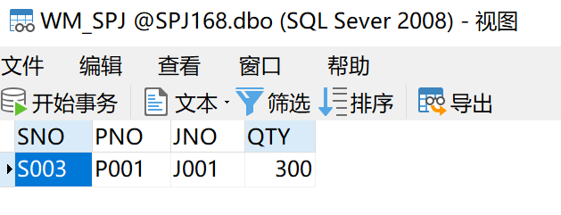
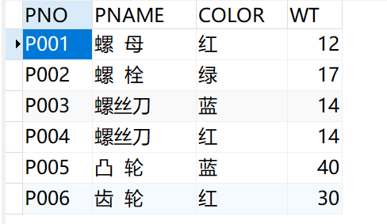
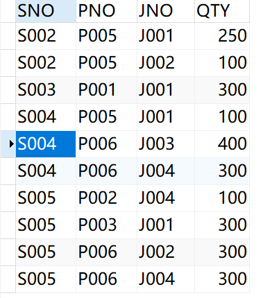
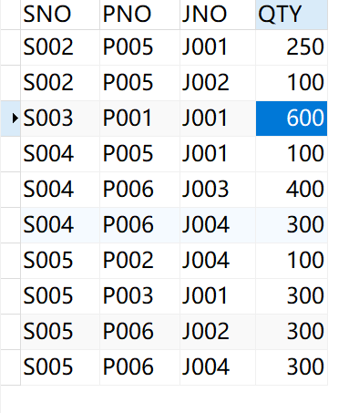
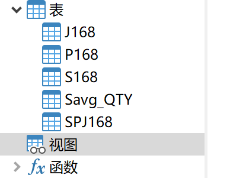

## 请针对SPJ数据库，进行各种视图操作：
#### (1) 建立“北京”供应商视图BJ_S ；
```sql
CREATE VIEW BJ_S AS SELECT
* 
FROM
	S168 
WHERE
	CITY = '北京'
```


#### (2) 建立“北京”工程视图BJ_J ；
```sql
CREATE VIEW BJ_J AS SELECT
* 
FROM
	J168 
WHERE
	CITY = '北京'
```




#### (3) 建立“红”色零件视图RED_P;
```sql
CREATE VIEW RED_P AS SELECT
* 
FROM
	P168 
WHERE
	COLOR = '红'
```

#### 

#### (4) 建立“北京”供应商的供应情况视图BJS_SPJ；

```sql
CREATE VIEW BJS_SPJ AS SELECT
* 
FROM
	SPJ168 
WHERE
	SNO IN ( SELECT SNO FROM S168 WHERE CITY = '北京' )
```


#### (5) 建立“北京”供应商供应“北京”工程的供应情况视图BJSJ_SPJ ；

```sql
CREATE VIEW BJSJ_SPJ AS SELECT
* 
FROM
	SPJ168 
WHERE
	SNO IN ( SELECT SNO FROM S168 WHERE CITY = '北京' ) 
	AND JNO IN ( SELECT JNO FROM J168 WHERE CITY = '北京' )
```


#### (6) 建立“北京新天地”供应商的供应情况视图WM_SPJ ；

```sql
CREATE VIEW WM_SPJ AS SELECT
SPJ168.SNO,
SPJ168.PNO,
SPJ168.JNO,
SPJ168.QTY 
FROM
	SPJ168,
	S168 
WHERE
	SPJ168.SNO= S168.SNO 
	AND S168.SNAME= '北京新天地';
```


#### (7) 将“红”色零件的重量加1；

```sql
SELECT
	* 
FROM
	P168;
UPDATE P168 
SET WT = WT + 1 
WHERE
	COLOR = '红';
```


#### (8) 将“北京新天地”供应商的供应数量加倍；

```sql
SELECT
	* 
FROM
	SPJ168;
UPDATE SPJ168 
SET QTY = QTY * 2 
WHERE
	SNO IN ( SELECT SNO FROM S168 WHERE SNAME = '北京新天地' );
```


#### (9) 分别删除以上定义的各个视图。

```sql
DROP VIEW WM_SPJ;
DROP VIEW BJSJ_SPJ;
DROP VIEW BJS_SPJ;
DROP VIEW RED_P;
DROP VIEW BJ_J;
DROP VIEW BJ_S;
```


