# 实验一 准备工作 — 编写简单的C/C++源程序和MFC 应用程序

### **实验目的**

1.  了解本地计算机的网络配置； 
2.  熟悉 Visual C ++中的 C/C++程序设计编程环境，掌握运行一个 C/C++程序设计的基本步骤，包括编辑、编译和运行； 
3. 掌握 C/C++语言程序设计的基本框架，能够编写简单的 C/C++程序；
4. 基于 MFC 编写简单的应用程序

### **实验任务**

1. 熟悉实验环境；

2. 查询本地计算机的 IP 地址、MAC 地址、子网掩码，ARP 缓存表，使用 ping 命令测试

和安大主页的连接状态；

3. 分别使用 C、C++显示本地网络信息，并把相关信息保存为 TXT 文件；

4. 在 MFC 环境下使用基于单文档和对话框的方法，显示本地网络信息；

5. 分别使用 C/C++和 MFC 完成课堂教学的例子：两整数加法器，并比较两者的区别。

## **实验内容**

##### 1熟悉实验环境，检查计算机和相关软件是否运行正常。

##### 2查询本地计算机网络信息

运行“cmd”出现命令窗口，在此窗口中输入相关命令：

```bash
ipconfig /all

arp –a

netstat –a 
```

对以上相关结果进行记录(IP 地址，MAC 地址，子网掩码)

```
IPv4 地址 . . . . . . . . . . . . : 192.168.50.120(首选)
物理地址. . . . . . . . . . . . . : 30-C9-AB-A8-57-D5
子网掩码  . . . . . . . . . . . . : 255.255.255.0
```

使用 Ping 命令测试本地和网站的连接情况：

```bash
ping www.baidu.com
```


##### 3将以上获取的网络信息分别按标准 C 和 C++风格显示出来并保存为 txt 文件

要求显示和保存的内容格式为：

```
IP 地址： 192.168.***.***
MAC 地址：30-C9-AB-A8-**-**
子网掩码：255.255.255.0
```

3.1 在磁盘(桌面)上新建一个文件夹，用于存放程序，文件夹的名字可以是学号，如*C:\Users\admin\Desktop\你的学号*。 

##### 3.3 相关网络信息的显示与保存示例代码

**源程序**

```c++
#include<fstream>
using namespace std;
int main()
{
	ofstream fout("message.txt");
	
	fout << "IP 地址： 192.168.***.***\nMAC 地址：30 - C9 - AB - A8 - ** - **\n子网掩码：255.255.255.0";
	return 0;
}
```

**运行结果**

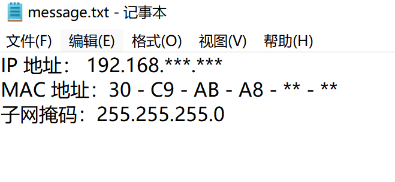

##### 4.使用 MFC 分别在一个对话框和单文档窗口中显示以上获得的主要本地网络信息

1. 使用基于单文档 SDI 的工程，则在视图类的 OnDraw（CDC *pDC）函数中添加代码：

```c++
pDC->TextOut(0,0,("*你要显示的内容！*"));
```

2. 使用基于对话框的工程，直接在静态文本控件上显示即可。

##### 5.分别使用 C、C++和 MFC 完成课堂教学例子：两整数加法器，比较两类方法

本身的差异和用户主观体验的差异。MFC 部分内容与课堂授课内容完全一致，参照课堂授课内容) 

## MFC两整数加法器

#### 项目创建

1. 创建新项目，搜索mfc应用

   - 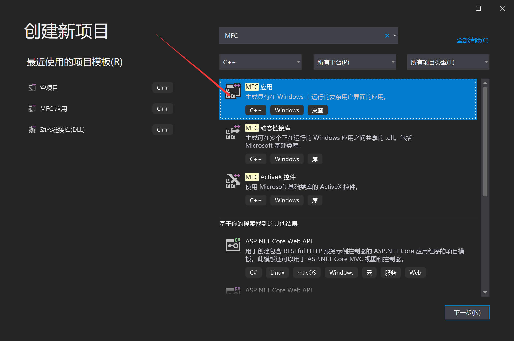

   - 如果显示没有则是下载时未选择，可以重新选择
   - 


2. 项目命名，并选择位置
   - 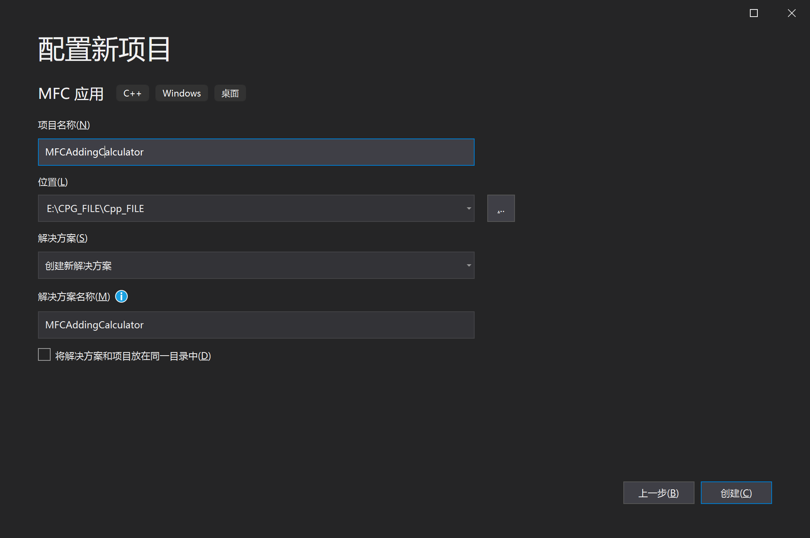

3. 选择基于对话框，其它不用管，点击完成
   - 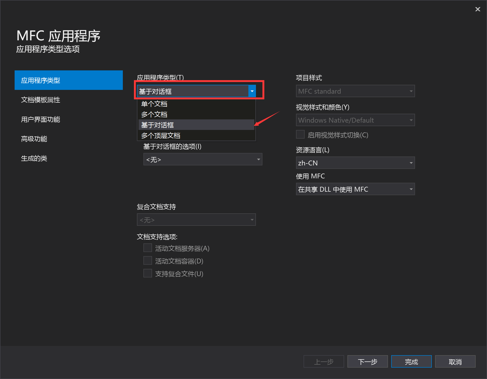

#### 窗口设计

4. 添加``Edit Control`控件
   - 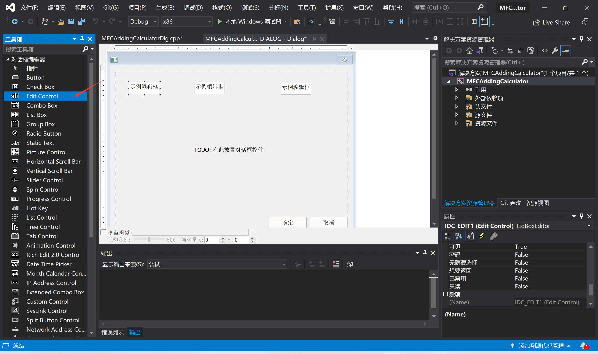

5. 右键进入类向导，或使用快捷键<kbd>Ctrl</kbd>+<kbd>Shift</kbd>+<kbd>X</kbd>，在成员变量部分设置变量类型
   - 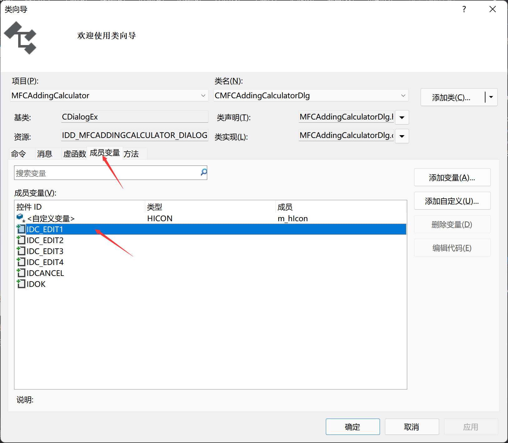

6. 双击控件，为每一个控件ID设置类别、名称变量类型
   - 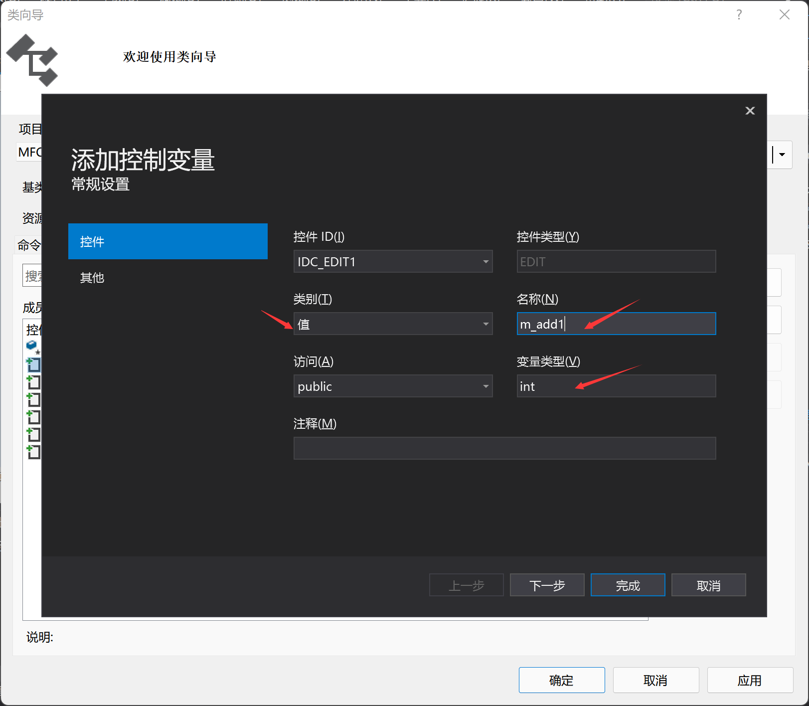

7. 控件设置完毕后如图所示
   - 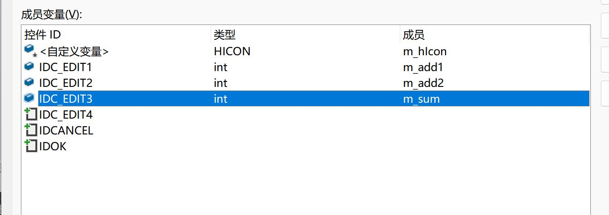

8. 添加运算按钮
   - 

     
#### 功能实现

9. 设置运算按钮底层算法，双击按钮

   - 用户在程序运行过程中通过鼠标或键盘修改了对话框控件的状态后，对话框中与控件相关联的变量值并没有马上更新。以参数TRUE调用函数UpdateData()的作用就是更新所有与对话框控件相关联的变量值，而以参数FALSE调用此函数则更新与变量相关联的控件的显示状态，使之与变量一致。也可以通俗地说，以TRUE和FALSE作为参数可分别实现控件关联变量的“里传”和“外传”。下面的语句起刷新编辑框的作用。

   - ```c++
     UpdateData(true);
     m_sum = m_add1 + m_add2;
     UpdateData(false);
     ```

10. 此时该整数加法器已经实现了，但为了美观，提高可用率，我们可以加一些Static Text美化一些，并适当调整各组件位置，对齐
    - 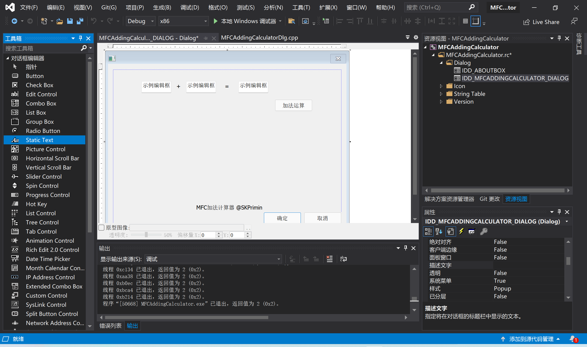

11. 还可以完善一下，增加一个清空按钮

    - 具体实现也只需将变量重新复制为0即可

    - ```c++
      UpdateData(true);
      m_sum = 0;
      m_add1 = 0;
      m_add2 = 0;
      UpdateData(false);
      ```

12. 运行效果图示意图
    - 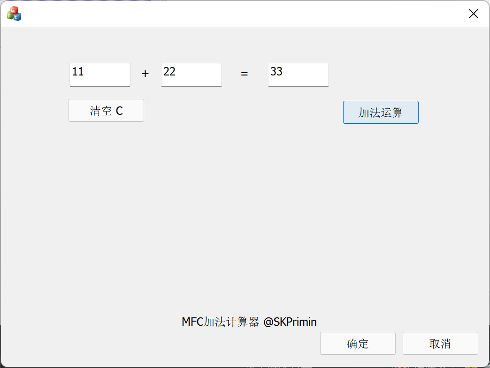

## C++两整数加法器

#### 项目创建

1. 创建新的空项目,这里我们可以选择直接添加新项目,更方便体会两种方法的使用感受
   - 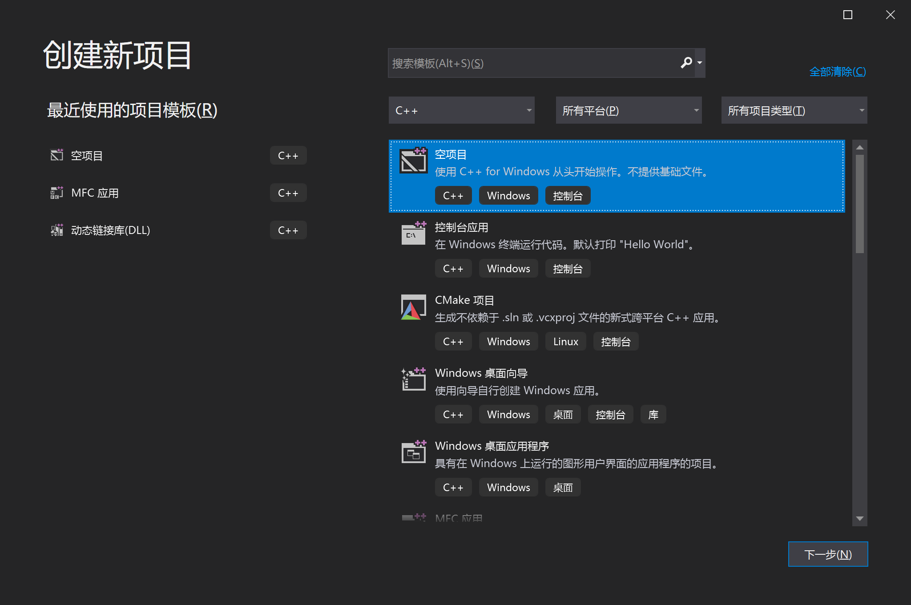

2. 项目命名并选择位置
   - 

3. 在源文件中添加新建项，添加一个c++文件（.cpp）并命名
   - 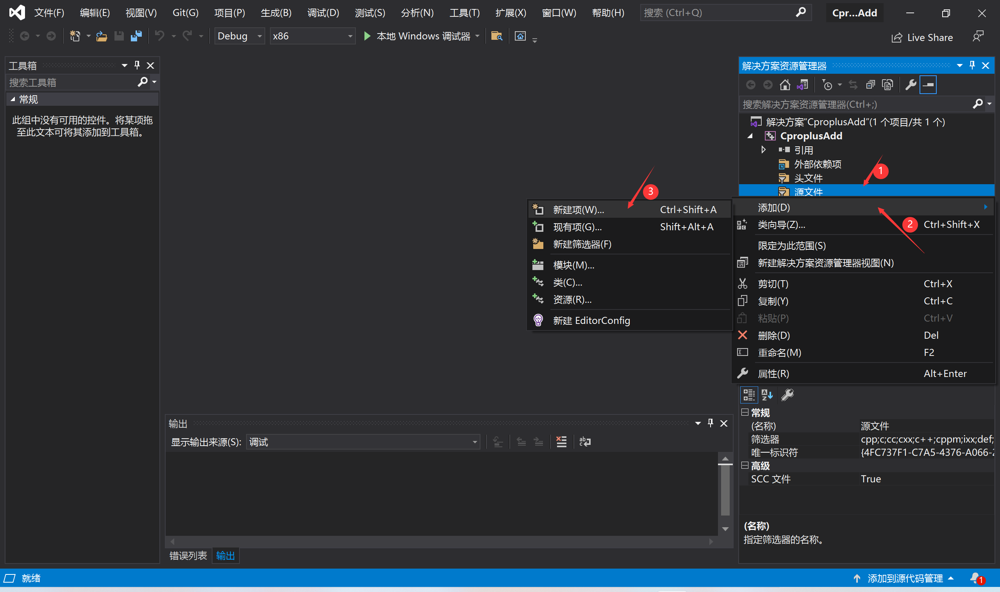

4. 编写代码

   - ```c++
     # include <stdio.h>
     #include <iostream>
     
     int main()
     {
     	int add1, add2, sum;
     	std::cout<<"请输入两个想要相加的数"<<std::endl;
     	std::cin>>add1>>add2;
     	sum = add1 + add2;
     	std::cout << "输入的两数 "<<add1<<" 与 "<<add2<<" 之和为 "<<sum << std::endl;
     }
     ```

5. 运行效果如下
   - 