# 实验二 Socket 通信中的前端 UI 开发

## Windows 标准控件的使用 

#### 实验目的

1. 了解 MFC 消息循环机制；

2. 掌握 MFC 中部分常用控件的使用方法；

3. 基于 MFC 编写具备一定用户界面交互功能的应用程序。

#### 实验任务

1. 进一步理解 MFC 消息循环机制；

2. 进一步了解掌握 MFC 控件的使用方法，使用多种控件开发具有简单用户交互功能的MFC 应用程序—个人信息简表； 

3. 制作具有基本的数据处理能力的 MFC 应用程序—计算器。

### 实验内容

一、使用多种控件开发具有简单用户界面交互功能的 MFC 应用程序，显示你的个人信息，界面设计如图 1.请将界面控件规则对齐排列，同类控件使用静态组合框归类布置。

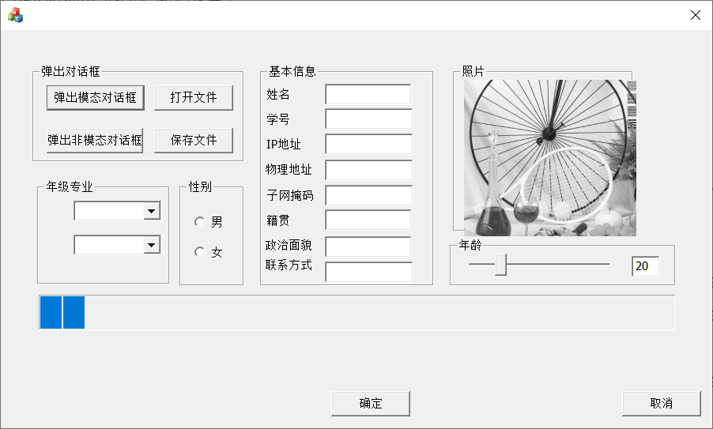

<center>图 1 系统界面</center>

功能要求

#### 1模态对话框

“弹出模态对话框”按钮无效(该控件不使能);

- 在Dialog处插入对话框

  - 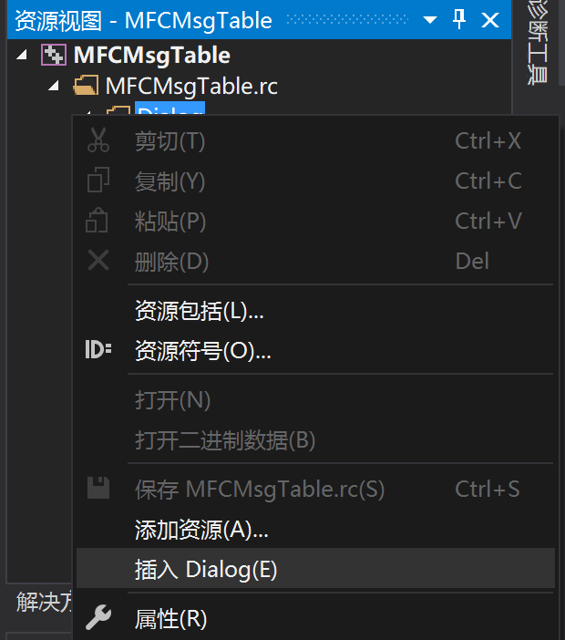

- 给新建的Dialog添加类

  - 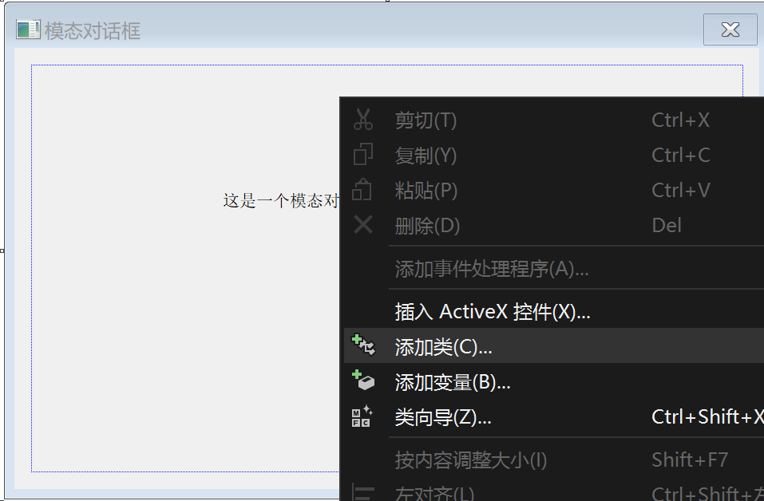
  - 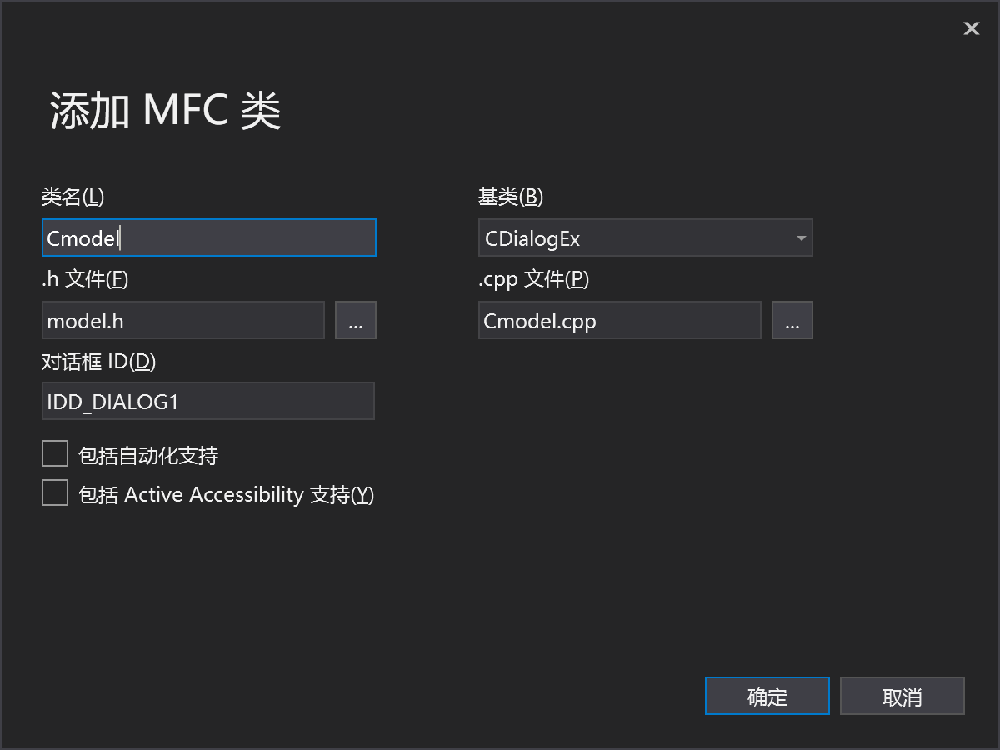

- 设置属性

  - 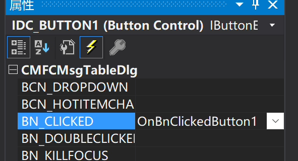

- 回到主页面，点击对应按钮，编写函数

  - ```c++
    //注意要在开头处加上之前设置头文件
    #include "model.h"
    
    void CMFCMsgTableDlg::OnBnClickedButton1()
    {
    	// TODO: 在此添加控件通知处理程序代码
    	Cmodel cm;
    	cm.DoModal();
    }
    ```

    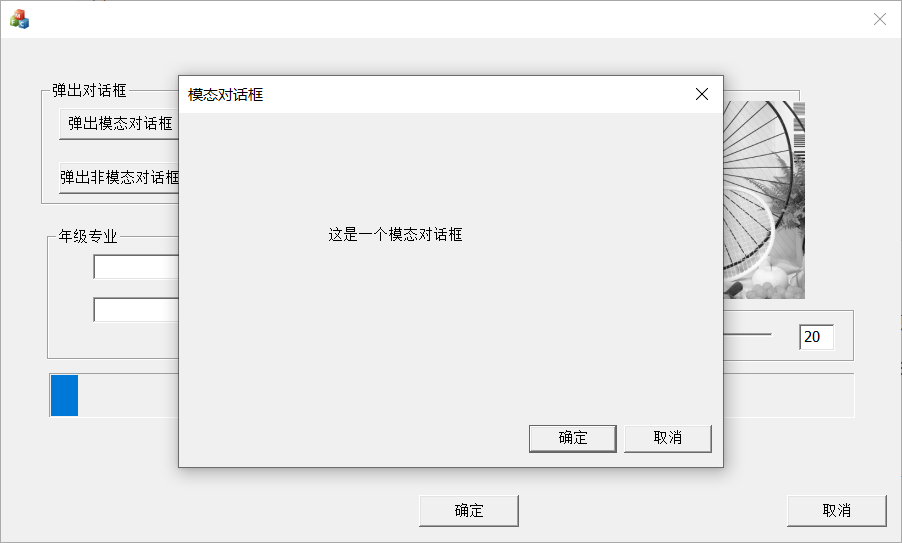

#### 2非模态对话框

点击“弹出非模态对话框”按钮，弹出一个你设计好的非模态对话框，注意关闭该对话框时对话框资源的销毁过程。

```c++
void CMFCMsgTableDlg::OnBnClickedButton2()
{

	// TODO: 在此添加控件通知处理程序代码
	Cnomodel* pDlg = new Cnomodel;
	pDlg->Create(IDD_DIALOG2, this);
	pDlg->ShowWindow(SW_SHOW);

	m_progress.SetStep(100);
	m_progress.StepIt();

}
```

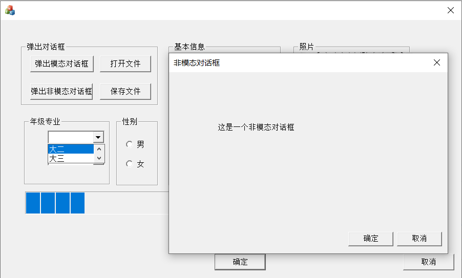

#### 3打开文件

点击“打开文件”按钮，弹出打开文件对话框，选中你上次保存的 txt 文件，点击“确定”后打开该文件，从中读取你的姓名，学号、和本地网络信息，动态填入对应的编辑框中。

------------------------------------------------------------------------------------------------------------

```c++
void CMFCMsgTableDlg::OnBnClickedButton3()
{

	m_progress.SetStep(100);
	m_progress.StepIt();
	// TODO: 在此添加控件通知处理程序代码
	char* location = _strdup(setlocale(LC_CTYPE, NULL));
	setlocale(LC_CTYPE, "chs");
	BOOL isOpen = TRUE;		//是否打开(FALSE则为保存)
	CString defaultDir = "E:";	//默认打开的文件路径
	CString filter = ".txt";	//文件过虑的类型
	TCHAR szFilter[] = _T("文本文件(*.txt)|*.txt|所有文件(*.*)|*.*||");

	CFileDialog openFileDlg(TRUE, "txt", NULL, 0, szFilter, this);

	CString m_path;
	if (openFileDlg.DoModal() == IDOK)
	{
		CString m_path = openFileDlg.GetPathName();//取出文件路径    
		CStdioFile file;
		CString str;
		if (file.Open(m_path, CFile::modeRead))
		{
			while (file.ReadString(str))
			{
				int len = str.GetLength();
				int index = str.Find(_T(":"), 0);
				CString strL = str.Left(index);
				strL.TrimRight();
				CString strR = str.Mid(index + 1, len);
				strR.TrimLeft();
				if (strL == "姓名")
				{
					m_name = strR;
					UpdateData(FALSE);
				}
				if (strL == "学号")
				{
					m_stuid = strR;
					UpdateData(FALSE);
				}
				if (strL == "IP地址")
				{
					m_ip = strR;
					UpdateData(FALSE);
				}
				if (strL == "MAC地址")
				{
					m_mac = strR;
					UpdateData(FALSE);
				}
				if (strL == "子网掩码")
				{
					m_subnetmask = strR;
					UpdateData(FALSE);
				}
				if (strL == "籍贯")
				{
					m_ip = strR;
					UpdateData(FALSE);
				}
				if (strL == "政治面貌")
				{
					m_mac = strR;
					UpdateData(FALSE);
				}
				if (strL == "联系方式")
				{
					m_subnetmask = strR;
					UpdateData(FALSE);
				}

			}
			file.Close();
		}
		UpdateData(FALSE);
	}
	setlocale(LC_CTYPE, location);
	free(location);
}
```

-----------------------------------------------------------------------------------------------------------------

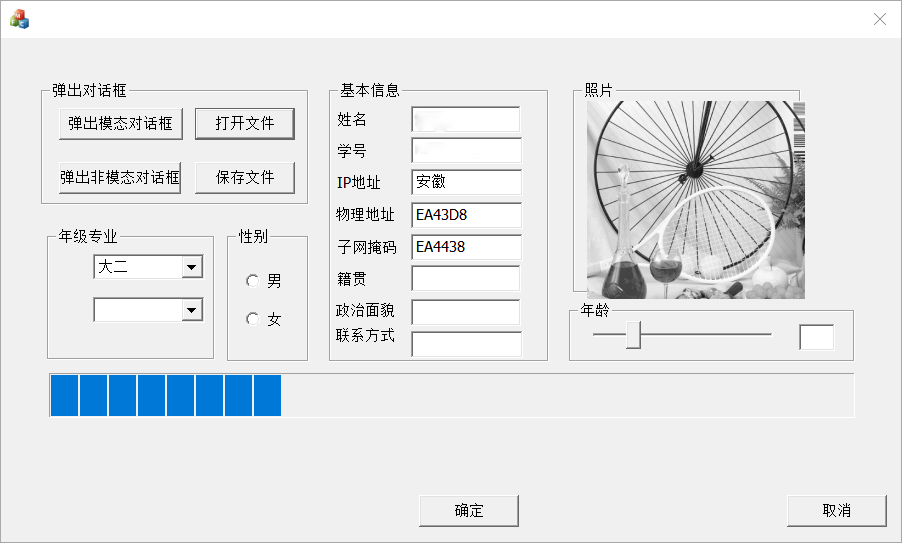

#### 4年级和专业

4. 从年级专业组合框中选中你的年级和专业，两个组合框应有如下选项和选中效果：

-  给两个Combox设置如下类型及变量
   - 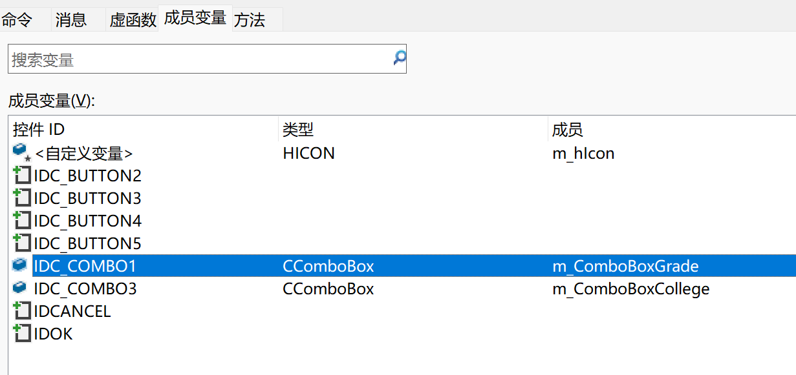

- 添加选项，在`BOOL CMFCMessageInterfaceDlg::OnInitDialog()`中加上如下代码，在底部该函数底部添加

  - ```c++
    // TODO: 在此添加额外的初始化代码
    	m_CboxGrade.AddString(_T("大三")); //默认值
    	m_CboxGrade.AddString(_T("大一"));
    	m_CboxGrade.AddString(_T("大二"));
    	m_CboxGrade.AddString(_T("大四"));
    
    	m_CboxProce.AddString(_T("信息安全"));//默认值
    	m_CboxProce.AddString(_T("软件工程"));
    	m_CboxProce.AddString(_T("数字媒体"));
    	m_CboxProce.AddString(_T("计算机科学与技术"));
    ```
  
  | 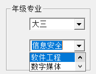 | 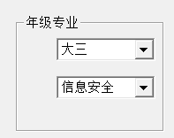 |  |
  | ------------------------------------------------------------ | ------------------------------------------------------------ | ------------------------------------------------------------ |

#### 5性别信息

使用两个互斥的 Radio 按钮，确定你的性别信息；
- 添加两个Radio Button，<kbd>Ctrl</kbd>+<kbd>D</kbd>设置两个按钮编号连续，所有按钮属性tabstop、auto均为true，并将第一个radio 的group属性设为True，
- 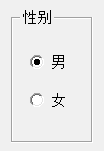

#### 6年龄

使用一个滑动条 Slider，动态得到你的年龄；

同样在`BOOL CMFCMessageInterfaceDlg::OnInitDialog()`中加上如下代码，在底部该函数底部添加

```c++
	// 年龄滑块的初始值设置
	m_AgeSlider.SetRange(0, 100); //设置滑动范围
	m_AgeSlider.SetLineSize(10); 
	m_AgeSlider.SetTicFreq(1);//每1个单位画一刻度
	m_AgeSlider.SetPos(20);//设置滑块初始位置为20
```

Slider的函数内容

```c++
void CMFCMsgTableDlg::OnNMCustomdrawSlider1(NMHDR* pNMHDR, LRESULT* pResult)
{
	LPNMCUSTOMDRAW pNMCD = reinterpret_cast<LPNMCUSTOMDRAW>(pNMHDR);
	// TODO: 在此添加控件通知处理程序代码
	int nPos = m_AgeSlider.GetPos(); //获得滑块当前位置

	CString str  = _T("");
	str.Format(_T("%d"), nPos);

	SetDlgItemText(IDC_EDIT9, str);
	*pResult = 0;
}

```

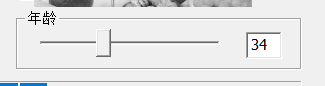

#### 7显示照片

使用一个 Picture 控件，显示你的 bmp 位图照片；

- 先将图片加载到资源文件中，再将属性中 杂项->类型Type 设置为Bitmap，在选择对应的图像
- 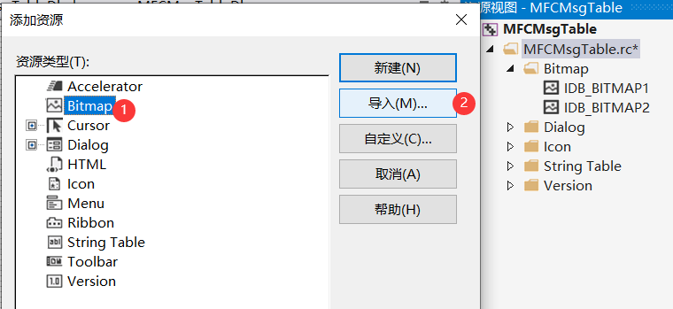
- 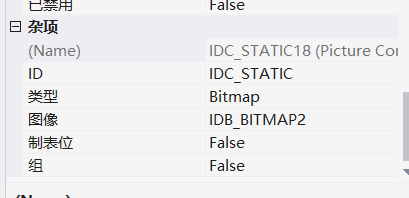
- 

#### 8动态滚动条

在界面底部，放置一个进度条控件，在你的程序运行过程中，始终动态滚动；

同样的`OnInitDialog()`函数

```c++
	//初始化进度条
	m_progress.SetRange(0, 1600);
	m_progress.SetPos(10);
```

```c++
void CMFCMsgTableDlg::OnNMCustomdrawProgress1(NMHDR* pNMHDR, LRESULT* pResult)
{
	LPNMCUSTOMDRAW pNMCD = reinterpret_cast<LPNMCUSTOMDRAW>(pNMHDR);
	// TODO: 在此添加控件通知处理程序代码
	//指定进度条控件的步进增量 
	*pResult = 0;
}
```

每完成一步可以进度条加一些

```c++
m_progress.SetStep(100);
m_progress.StepIt();
```

#### 9输入基本信息

手动输入补全剩余的编辑框，填写你的籍贯、政治面貌、联系方式等基本信息；

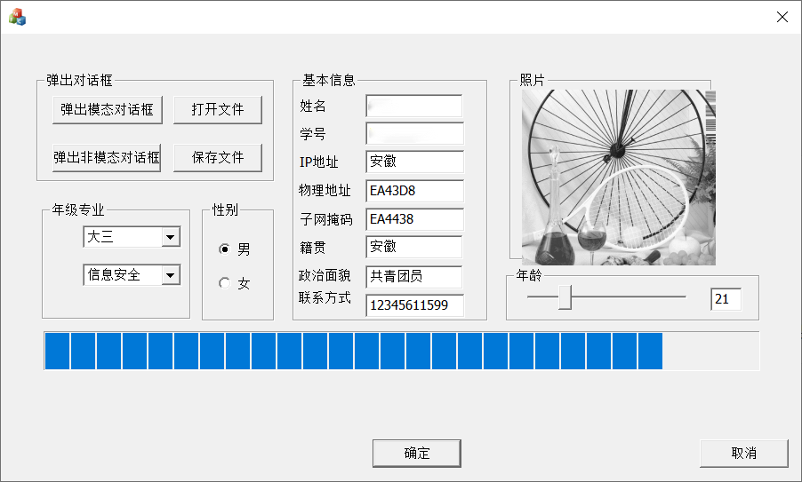

#### 10保存文件

所有信息填写完毕后，点击“保存文件”按钮，弹出保存文件对话框，将除图片以外的你的个人信息再次保存为一个 txt 文件。

```cpp
void CMFCMsgTableDlg::OnBnClickedButton4()
{
	m_progress.SetStep(100);
	m_progress.StepIt();

	// TODO: 在此添加控件通知处理程序代码
	UpdateData(true);


	TCHAR szFilter[] = "文本文件(*.txt)|*.txt|所有文件(*.*)|*.*||";
	CFileDialog saveFileDlg(FALSE, "txt", NULL, 0, szFilter, this);
	if (saveFileDlg.DoModal() == IDOK)
	{

		CString strFilePath = saveFileDlg.GetFileName();//取出文件路径    
		// 判断是否已经存在
		if (_access(strFilePath, 0) == 0)
		{
			CString strQuery; 
			CString prompt = ".txt";
			strQuery.Format("%s 已经存在，要替换它吗？", strFilePath);
			if (IDNO == ::MessageBox(m_hWnd, strQuery, prompt, MB_ICONQUESTION | MB_YESNO))
			{
				return;
			}
		}
		CString grade, proce, age, sex; //用来存放选择内容年级、专业、年龄、性别信息

		m_CboxGrade.GetLBText(m_CboxGrade.GetCurSel(), grade);
		m_CboxProce.GetLBText(m_CboxProce.GetCurSel(), proce);
		age.Format("%d", m_AgeSlider.GetPos());  //将整型变量i转化为字符串型

		sex == "男"; //默认为男，如果未选中第一个则为女
		int state_man = ((CButton*)GetDlgItem(IDC_RADIO1))->GetCheck();
		if (state_man == 0) sex == "女";
		
		
		CFile file;  //创建一个文件
		file.Open(strFilePath, CFile::modeCreate | CFile::modeReadWrite);  //打开该文件
		UpdateData(TRUE); //各编辑框的变量获取输入值
		CString strlist; //定义一个输入
		strlist = "姓名:" + m_name + "\n学号:" + m_stuid + "\nIP地址:" + m_ip + "\n物理地址:" + m_mac + "\n子网掩码:" + m_subnetmask;
		file.Write(strlist, strlist.GetLength());
		strlist = "\n籍贯:" + m_nativeplace + "\n政治面貌:" + m_politicallandscape + "\n联系方式:" + m_contact;
		file.Write(strlist, strlist.GetLength());
		strlist = "\n年级:" + grade + "\n专业:" +  proce + "\n年龄:" + age + "\n性别:" + sex;
		file.Write(strlist, strlist.GetLength());//将该列表写入创建的文件
		file.Close(); //关闭文件
	}
}
```

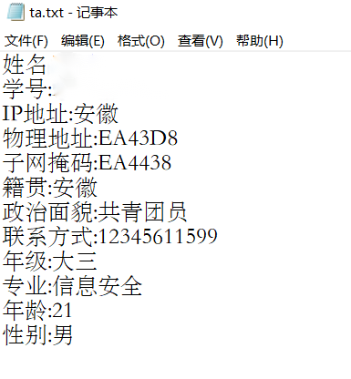


-----------------------------------------------------------------------------------------

