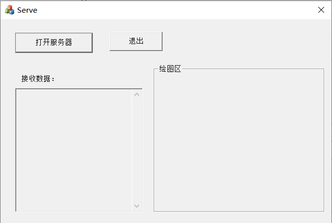
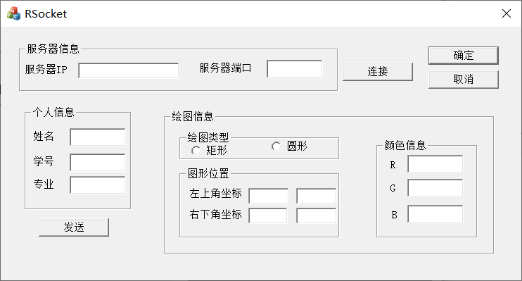
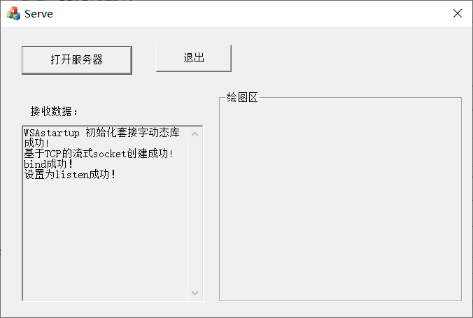
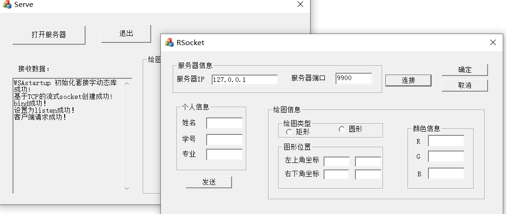
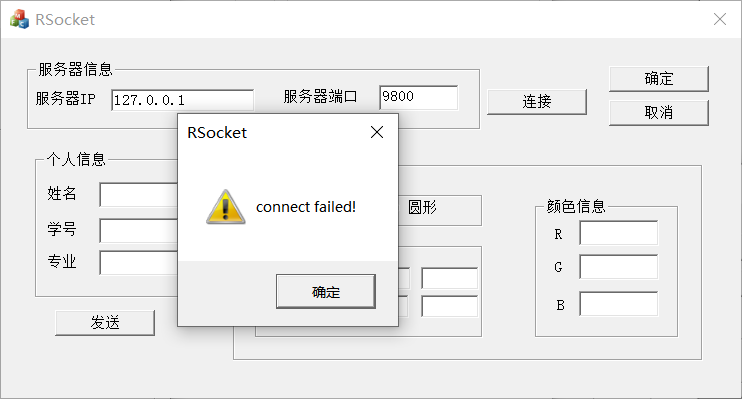
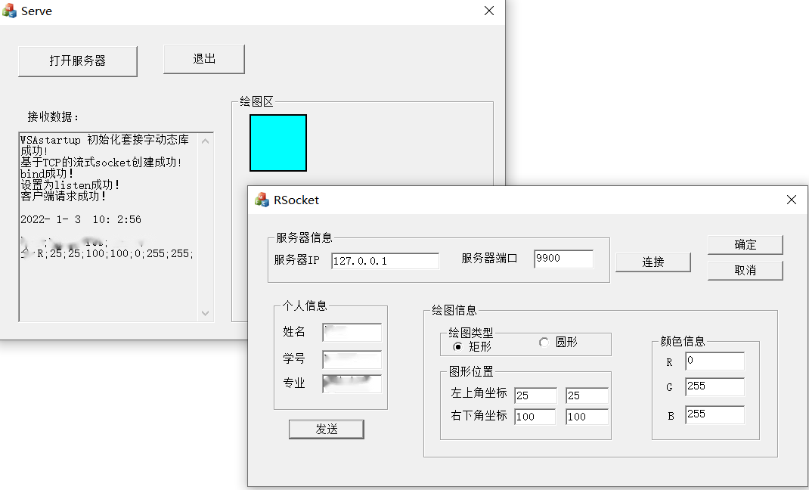
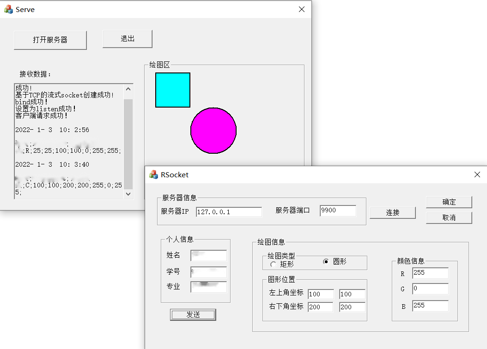

# 简单的Socket网络编程

**【实验目的】**

1. 了解相关网络协议的基本原理和工作流程；

2. 掌握使用 Socket 进行网络通信的方法；

3. 体会客户机、服务器交互模式。

**【实验任务】**

1. 通过调用 Socket 相关函数实现网络通信；

2. 实现界面系统和后台通信系统的协同配合；

3. 回顾常用控件和 GDI 对象的使用方法；

4. 感受 MFC 下多线程的基本用法。

## **实验内容**

1. 分别建立服务器和客户机，以单线程/多线程方式实现客户机和服务器的连

接和通信，从客户机向服务器传输你的个人信息和绘图信息，在服务器上显示

你发送的信息并按照传输来的信息绘制图形。服务器和客户端的界面布局和功

能效果分别如图 1 和图 2 所示。

1.1 功能要求

1. 服务器端首先运行并在某一端口(如 9990)监听客户端连接请求；

2. 在客户端填写服务器端的 IP 地址和端口号，连接并发送消息；

3. 填写自己的姓名、学号、专业和绘图相关信息向服务器发送，服务器收到消息后，显示出你的全部消息，并按照所发送消息的内容在绘图区绘制指定的图形。






### 客户端：

**在连接按钮下实现与给定地址和端口号的服务器的连接：**

- 调用 WSAStartup()进行 Socket 库初始化；

- 调用 socket()创建基于 TCP 的流式套接字; 
- 确定服务器地址信息:、

> 至此，客户端的操作已完成。
> > ==你的 sockaddr_in 结构==.sin_family = AF_INET;
> > ==你的 sockaddr_in 结构==.sin_addr.s_addr = inet_addr(==服务器 IP 地址，本机一般为 127.0.0.1==);
> > ==你的 sockaddr_in 结构==.sin_port = htons(==服务器监听端口号==);
> > memset(==你的 sockaddr_in 结构==.sin_zero, 0x00, 8);
> > 这里需要注意，如果把 CString 类的 IP 地址转换为 inet_addr()函数需要的 char*类型可
> > 使用 CString 类的 LockBuffer 方法：
> >
> > ​	==你的用来输入 IP 地址的编辑框关联的 CString 类变量==.LockBuffer()

-  调用 connect()进行连接。

**在界面填上相关的信息后，点击“发送”按钮，实现信息发送：**

为各个存放需要传输内容的 Edit 控件关联 CString 类的变量，然后调用 send()集中整体发送。具体发送的 CString 字符串内容依据你的界面填写和选择而定，在发送之前应调用UpdateData()把界面的值“传入”。这里同样需要注意，把 CString 类对象转换为 send()函数需要的 char*类型可使用 CString 类的 LockBuffer 方法。此外，多条信息之间应加上合适的分隔符，便于你在接收端进行分割处理。

#### 客户端代码

```c++

// RSocketDlg.cpp: 实现文件
//

#include "pch.h"
#include "framework.h"
#include "RSocket.h"
#include "RSocketDlg.h"
#include "afxdialogex.h"
// 导入库
#include <WinSock2.h>
#include<atlconv.h>
#pragma comment(lib,"WS2_32.lib")
#include <string> 
#ifdef _DEBUG
#define new DEBUG_NEW
#endif
//变量声明
#define BUF_SIZE 64
WSADATA wsd;
SOCKET sHost;
SOCKADDR IN serveAddr;
char buf[BUF_SIZE];
int retVal;

// 用于应用程序“关于”菜单项的 CAboutDlg 对话框

class CAboutDlg : public CDialogEx
{
public:
	CAboutDlg();

// 对话框数据
#ifdef AFX_DESIGN_TIME
	enum { IDD = IDD_ABOUTBOX };
#endif

	protected:
	virtual void DoDataExchange(CDataExchange* pDX);    // DDX/DDV 支持

// 实现
protected:
	DECLARE_MESSAGE_MAP()
};

CAboutDlg::CAboutDlg() : CDialogEx(IDD_ABOUTBOX)
{
}

void CAboutDlg::DoDataExchange(CDataExchange* pDX)
{
	CDialogEx::DoDataExchange(pDX);
}

BEGIN_MESSAGE_MAP(CAboutDlg, CDialogEx)
END_MESSAGE_MAP()


// CRSocketDlg 对话框


CRSocketDlg::CRSocketDlg(CWnd* pParent /*=nullptr*/)
	: CDialogEx(IDD_RSOCKET_DIALOG, pParent)
{
	m_hIcon = AfxGetApp()->LoadIcon(IDR_MAINFRAME);
}

void CRSocketDlg::DoDataExchange(CDataExchange* pDX)
{
	CDialogEx::DoDataExchange(pDX);
}

BEGIN_MESSAGE_MAP(CRSocketDlg, CDialogEx)
	ON_WM_SYSCOMMAND()
	ON_WM_PAINT()
	ON_WM_QUERYDRAGICON()
	ON_BN_CLICKED(IDC_BUTTON2, &CRSocketDlg::OnBnClickedButton2)
	ON_BN_CLICKED(IDC_BUTTON1, &CRSocketDlg::OnBnClickedButton1)
//	ON_WM_TIMER()
END_MESSAGE_MAP()


// CRSocketDlg 消息处理程序

BOOL CRSocketDlg::OnInitDialog()
{
	CDialogEx::OnInitDialog();

	// 将“关于...”菜单项添加到系统菜单中。

	// IDM_ABOUTBOX 必须在系统命令范围内。
	ASSERT((IDM_ABOUTBOX & 0xFFF0) == IDM_ABOUTBOX);
	ASSERT(IDM_ABOUTBOX < 0xF000);

	CMenu* pSysMenu = GetSystemMenu(FALSE);
	if (pSysMenu != nullptr)
	{
		BOOL bNameValid;
		CString strAboutMenu;
		bNameValid = strAboutMenu.LoadString(IDS_ABOUTBOX);
		ASSERT(bNameValid);
		if (!strAboutMenu.IsEmpty())
		{
			pSysMenu->AppendMenu(MF_SEPARATOR);
			pSysMenu->AppendMenu(MF_STRING, IDM_ABOUTBOX, strAboutMenu);
		}
	}

	// 设置此对话框的图标。  当应用程序主窗口不是对话框时，框架将自动
	//  执行此操作
	SetIcon(m_hIcon, TRUE);			// 设置大图标
	SetIcon(m_hIcon, FALSE);		// 设置小图标

	// TODO: 在此添加额外的初始化代码

	return TRUE;  // 除非将焦点设置到控件，否则返回 TRUE
}

void CRSocketDlg::OnSysCommand(UINT nID, LPARAM lParam)
{
	if ((nID & 0xFFF0) == IDM_ABOUTBOX)
	{
		CAboutDlg dlgAbout;
		dlgAbout.DoModal();
	}
	else
	{
		CDialogEx::OnSysCommand(nID, lParam);
	}
}

// 如果向对话框添加最小化按钮，则需要下面的代码
//  来绘制该图标。  对于使用文档/视图模型的 MFC 应用程序，
//  这将由框架自动完成。

void CRSocketDlg::OnPaint()
{
	if (IsIconic())
	{
		CPaintDC dc(this); // 用于绘制的设备上下文

		SendMessage(WM_ICONERASEBKGND, reinterpret_cast<WPARAM>(dc.GetSafeHdc()), 0);

		// 使图标在工作区矩形中居中
		int cxIcon = GetSystemMetrics(SM_CXICON);
		int cyIcon = GetSystemMetrics(SM_CYICON);
		CRect rect;
		GetClientRect(&rect);
		int x = (rect.Width() - cxIcon + 1) / 2;
		int y = (rect.Height() - cyIcon + 1) / 2;

		// 绘制图标
		dc.DrawIcon(x, y, m_hIcon);
	}
	else
	{
		CDialogEx::OnPaint();
	}
}

//当用户拖动最小化窗口时系统调用此函数取得光标
//显示。
HCURSOR CRSocketDlg::OnQueryDragIcon()
{
	return static_cast<HCURSOR>(m_hIcon);
}


void CRSocketDlg::OnBnClickedButton2()
{
	// TODO: 在此添加控件通知处理程序代码 连接程序
	UpdateData(TRUE);
	if (WSAStartup(MAKEWORD(2, 2), &wsd) != 0)
	{
		AfxMessageBox("WSAstartup failed!");
		return;
	}

	sHost = socket(AF_INET, SOCK_STREAM, IPPROTO_TCP);
	if (INVALID_SOCKET == sHost)
	{
		AfxMessageBox("socket error!");
		WSACleanup();
		return;
	}
	SOCKADDR_IN addrsServ{};
	int i = 0;
	//str.Format(_T("%d"), i);
	addrsServ.sin_family = AF_INET;

//	addrsServ.sin_addr.S_un.S_addr = inet_addr("127.0.0.1");
	addrsServ.sin_addr.s_addr = htonl(2130706433);
	addrsServ.sin_port = htons(9990);
	int sSreveraddlen = sizeof(addrsServ);
	m_ipa.LockBuffer();
	UpdateData(false);
	retVal = connect(sHost, (LPSOCKADDR)&addrsServ, sizeof(addrsServ));
	if (SOCKET_ERROR == retVal)
	{
		AfxMessageBox("connect failed!");
		closesocket(sHost);
		WSACleanup();
		return;
	}
}


void CRSocketDlg::OnBnClickedButton1()
{
	// TODO: 在此添加控件通知处理程序代码
	int bufsize;
	CString str;
	CString str1;
	CString str2;
	CString str3;
	CString str4;
	CString str5;
	CString str6;
	CString str7;
	CString str8;
	CString str9;
	CString str10;
	CString str11;
	CString str12;
	if (((CButton*)GetDlgItem(IDC_RADIO1))->GetCheck() == 1)
	{
		str11 = "R";
	}
	if (((CButton*)GetDlgItem(IDC_RADIO2))->GetCheck() == 1)
	{
		str11 = "C";
	}
	str12 = ";";
	GetDlgItemText(IDC_EDIT3, str1);
	GetDlgItemText(IDC_EDIT4, str2);
	GetDlgItemText(IDC_EDIT5, str3);
	GetDlgItemText(IDC_EDIT6, str4);
	GetDlgItemText(IDC_EDIT7, str5);
	GetDlgItemText(IDC_EDIT8, str6);
	GetDlgItemText(IDC_EDIT9, str7);
	GetDlgItemText(IDC_EDIT10, str8);
	GetDlgItemText(IDC_EDIT11, str9);
	GetDlgItemText(IDC_EDIT12, str10);
	str = str1 + str12 + str2 + str12 + str3 + str12 + str11 + str12 + str4 + str12 + str5 + str12 + str6 + str12 + str7 + str12 + str8 + str12 + str9 + str12 + str10 + str12;
	USES_CONVERSION;
	char* a = T2A(str.GetBuffer(0));
	str.ReleaseBuffer();
	sprintf_s(buf, "%s", a);
	bufsize = send(sHost, buf, strlen(buf), 0);
	if (SOCKET_ERROR == bufsize)
	{
		AfxMessageBox("send failed!");
		closesocket(sHost);
		WSACleanup();
		return;
	}
}
```

### 服务端

**在服务器端的“打开服务器”按钮下进行服务器端套接字的创建** 

- 调用 WSAStartup()加载 Socket 库进行初始化；

- 调用 Socket()函数创建基于 TCP 的流式套接字用于主线程的请求监听； 

- 设置服务器端的本机地址:

> > ==你的 sockaddr_in 结构==.sin_family = AF_INET; 
> > ==你的 sockaddr_in 结构==.sin_port = htons(==你的监听端口，比如 9990==);
> > ==你的 sockaddr_in 结构==.s_addr = htonl(INADDR_ANY);

- 调用 bind()函数将 Socket 与地址进行绑定； 
-  调用 listen()函数设置套接字为监听工作状态。

#### 服务器端代码

```c++

// ServeDlg.cpp: 实现文件
//

#include "pch.h"
#include "framework.h"
#include "Serve.h"
#include "ServeDlg.h"
#include "afxdialogex.h"
// socket库
#include <WinSock2.h>
#include<atlconv.h>
#include<string.h>
#include<iostream>
using namespace std;
#pragma comment(lib,"WS2_32.lib")
#ifdef _DEBUG
#define new DEBUG_NEW
#endif

#define BUF_SIZE 64
//变量声明
WSADATA wsd;
SOCKET sServer;//用于监听
SOCKET sClient;//实现与客户端通信
SOCKADDR IN serveAddr;
char buf[BUF_SIZE];  //用于接收数据
CString res[BUF_SIZE];  //用于对收到数据的提取划分
//CDC *//用于得到全局的设备描述表
int retVal;
HANDLE hThread;
/////////////////////////////////////////////////////////////////////////////
// CAboutDlg dialog used for App About
CString s1, s2, s3, s4, s5;

// 用于应用程序“关于”菜单项的 CAboutDlg 对话框

class CAboutDlg : public CDialogEx
{
public:
	CAboutDlg();

// 对话框数据
#ifdef AFX_DESIGN_TIME
	enum { IDD = IDD_ABOUTBOX };
#endif

	protected:
	virtual void DoDataExchange(CDataExchange* pDX);    // DDX/DDV 支持

// 实现
protected:
	DECLARE_MESSAGE_MAP()
};

CAboutDlg::CAboutDlg() : CDialogEx(IDD_ABOUTBOX)
{
}


void CAboutDlg::DoDataExchange(CDataExchange* pDX)
{
	CDialogEx::DoDataExchange(pDX);
}

BEGIN_MESSAGE_MAP(CAboutDlg, CDialogEx)
END_MESSAGE_MAP()


// CServeDlg 对话框


CServeDlg::CServeDlg(CWnd* pParent /*=nullptr*/)
	: CDialogEx(IDD_SERVE_DIALOG, pParent)
{
	m_hIcon = AfxGetApp()->LoadIcon(IDR_MAINFRAME);
}

void CServeDlg::DoDataExchange(CDataExchange* pDX)
{
	CDialogEx::DoDataExchange(pDX);
	DDX_Control(pDX, IDC_EDIT1, m_info);
}

BEGIN_MESSAGE_MAP(CServeDlg, CDialogEx)
	ON_WM_SYSCOMMAND()
	ON_WM_PAINT()
	ON_WM_QUERYDRAGICON()
	ON_BN_CLICKED(IDC_BUTTON1, &CServeDlg::OnBnClickedButton1)
	ON_WM_TIMER()
	ON_BN_CLICKED(IDC_BUTTON2, &CServeDlg::OnBnClickedButton2)
END_MESSAGE_MAP()


// CServeDlg 消息处理程序

BOOL CServeDlg::OnInitDialog()
{
	CDialogEx::OnInitDialog();

	// 将“关于...”菜单项添加到系统菜单中。

	// IDM_ABOUTBOX 必须在系统命令范围内。
	ASSERT((IDM_ABOUTBOX & 0xFFF0) == IDM_ABOUTBOX);
	ASSERT(IDM_ABOUTBOX < 0xF000);

	CMenu* pSysMenu = GetSystemMenu(FALSE);
	if (pSysMenu != nullptr)
	{
		BOOL bNameValid;
		CString strAboutMenu;
		bNameValid = strAboutMenu.LoadString(IDS_ABOUTBOX);
		ASSERT(bNameValid);
		if (!strAboutMenu.IsEmpty())
		{
			pSysMenu->AppendMenu(MF_SEPARATOR);
			pSysMenu->AppendMenu(MF_STRING, IDM_ABOUTBOX, strAboutMenu);
		}
	}

	// 设置此对话框的图标。  当应用程序主窗口不是对话框时，框架将自动
	//  执行此操作
	SetIcon(m_hIcon, TRUE);			// 设置大图标
	SetIcon(m_hIcon, FALSE);		// 设置小图标

	// TODO: 在此添加额外的初始化代码
	//SetTimer(0, 1000, NULL);
	return TRUE;  // 除非将焦点设置到控件，否则返回 TRUE
}

void CServeDlg::OnSysCommand(UINT nID, LPARAM lParam)
{
	if ((nID & 0xFFF0) == IDM_ABOUTBOX)
	{
		CAboutDlg dlgAbout;
		dlgAbout.DoModal();
	}
	else
	{
		CDialogEx::OnSysCommand(nID, lParam);
	}
}

// 如果向对话框添加最小化按钮，则需要下面的代码
//  来绘制该图标。  对于使用文档/视图模型的 MFC 应用程序，
//  这将由框架自动完成。

void CServeDlg::OnPaint()
{
	if (IsIconic())
	{
		CPaintDC dc(this); // 用于绘制的设备上下文

		SendMessage(WM_ICONERASEBKGND, reinterpret_cast<WPARAM>(dc.GetSafeHdc()), 0);

		// 使图标在工作区矩形中居中
		int cxIcon = GetSystemMetrics(SM_CXICON);
		int cyIcon = GetSystemMetrics(SM_CYICON);
		CRect rect;
		GetClientRect(&rect);
		int x = (rect.Width() - cxIcon + 1) / 2;
		int y = (rect.Height() - cyIcon + 1) / 2;

		// 绘制图标
		dc.DrawIcon(x, y, m_hIcon);
	}
	else
	{
		CDialogEx::OnPaint();
	}
}

//当用户拖动最小化窗口时系统调用此函数取得光标
//显示。
HCURSOR CServeDlg::OnQueryDragIcon()
{
	return static_cast<HCURSOR>(m_hIcon);
}


DWORD WINAPI ClientThread(LPVOID lpParameter)
{
	CServeDlg* dlg = (CServeDlg*)lpParameter;
	SOCKADDR_IN addrcClient{};
	int cClientaddlen = sizeof(addrcClient);
	//接收数据
	sClient = accept(sServer, (struct sockaddr*)&addrcClient, &cClientaddlen);
	if (INVALID_SOCKET == sClient)
	{
		AfxMessageBox("accept failed！");
		closesocket(sServer);
		closesocket(sClient);
		WSACleanup();
		return 0;
	}
	s5 = "\r\n客户端请求成功！";
	CString strText = "";
	//获得当前文本
	dlg->m_info.GetWindowText(strText);
	strText += s5;
	//设置追加后的文本
	dlg->m_info.SetWindowText(strText);

	// 阻塞等待
	while (TRUE)
	{
		/*memset(buf, 0x00, 100);
		int bufsize;*/
		ZeroMemory(buf, BUF_SIZE);
		retVal = recv(sClient, buf, 100, 0);
		if (SOCKET_ERROR == retVal)
		{

			AfxMessageBox("recv failed！");
			closesocket(sServer);
			closesocket(sClient);
			WSACleanup();
			return 0;
		}
		//将数据转换为便于处理的 CString 类对象 RcvData
		CString	RcvData = CString(buf);
		SYSTEMTIME tim;
		GetLocalTime(&tim);
		char sDateTime[30];
		sprintf_s(sDateTime, "%4d-%2d-%2d  %2d:%2d:%2d", tim.wYear, tim.wMonth, tim.wDay, tim.wHour, tim.wMinute, tim.wSecond);
		CString year(sDateTime);
		strText = "";
		//获得当前文本
		dlg->m_info.GetWindowText(strText);
		strText += "\r\n\r\n" + year + "\r\n\r\n" + RcvData;
		//设置追加后的文本
		dlg->m_info.SetWindowText(strText);
		int pos;
		CString rest;
		for (int i = 0; i < 11; i++)
		{
			pos = RcvData.Find(';');
			rest = RcvData.Mid(pos + 1, RcvData.GetLength());
			res[i] = RcvData.Left(pos);
			RcvData = rest;
		}

		CWnd* pWnd = dlg->GetDlgItem(IDC_STATIC1);
		CDC* dc = pWnd->GetDC();//注意这里获取了新的 dc
		pWnd->Invalidate();
		pWnd->UpdateWindow();
		CRect rectView;
		CRgn rgn;
		dlg->GetDlgItem(IDC_STATIC1)->GetClientRect(&rectView);
		rgn.CreateRectRgn(rectView.left, rectView.top, rectView.right, rectView.bottom);
		dc->SelectClipRgn(&rgn);
		CPen pNewPen(PS_SOLID, 2, RGB(0, 0, 0));
		CPen* pOldPen;
		pOldPen = dc->SelectObject(&pNewPen);
		CBrush pNewBrush1(RGB(255, 255, 0));
		CBrush* pOldBrush;
		if (res[3] == 'R')
		{
			CRect rect1(_ttoi(res[4]), _ttoi(res[5]), _ttoi(res[6]), _ttoi(res[7]));
			CBrush pNewBrush1(RGB(_ttoi(res[8]), _ttoi(res[9]), _ttoi(res[10])));
			dlg->m_info.GetWindowText(res[4] + res[8]);
			dc->Rectangle(&rect1);
			pOldBrush = dc->SelectObject(&pNewBrush1);
			dc->Rectangle(&rect1);
			dc->SelectObject(pOldPen);//恢复原有的笔
			dc->SelectObject(pOldBrush);
			dc->DeleteDC();
		}
		if (res[3] == 'C')
		{
			CRect rect1(_ttoi(res[4]), _ttoi(res[5]), _ttoi(res[6]), _ttoi(res[7]));
			CBrush pNewBrush1(RGB(_ttoi(res[8]), _ttoi(res[9]), _ttoi(res[10])));
			dc->Ellipse(&rect1);
			pOldBrush = dc->SelectObject(&pNewBrush1);
			dc->Ellipse(&rect1);
			dc->SelectObject(pOldPen);//恢复原有的笔
			dc->SelectObject(pOldBrush);
			dc->DeleteDC();
		}
	}

	return 0;
}


void CServeDlg::OnBnClickedButton1()
{
	// TODO: 在此添加控件通知处理程序代码
	//初始化
	if (WSAStartup(MAKEWORD(2, 2), &wsd) != 0)
	{
		s1 = "WSAstartup failed!";
		return;
	}
	s1 = "WSAstartup 初始化套接字动态库成功!";
	//m_info.SetWindowText(s1);
	CString strText = "";
	//获得当前文本
	m_info.GetWindowText(strText);
	strText += s1;
	//设置追加后的文本
	m_info.SetWindowText(strText);
	//监听
	sServer = socket(AF_INET, SOCK_STREAM, IPPROTO_TCP);
	if (INVALID_SOCKET == sServer)
	{
		s2 = "socket error!";
		WSACleanup();
		return;
	}
	s2 = "基于TCP的流式socket创建成功!";
	//m_info.SetWindowText(s1 + "\n" + s2);
	strText = "";
	m_info.GetWindowText(strText);
	strText += "\n\r\n" + s2;
	m_info.SetWindowText(strText);
	SOCKADDR_IN addrsServ{};
	int i = 0;
	//设置地址
//	str.Format(_T("%d"), i);
	addrsServ.sin_family = AF_INET;
	addrsServ.sin_port = htons(9990);
	addrsServ.sin_addr.S_un.S_addr = htonl(INADDR_ANY);
	int sSreveraddlen = sizeof(addrsServ);
	//绑定地址
	retVal = bind(sServer, (const struct sockaddr*)&addrsServ, sizeof(SOCKADDR_IN));
	if (SOCKET_ERROR == retVal)
	{
		s3 = "bind failed！";
		closesocket(sServer);
		WSACleanup();
		return;
	}
	s3 = "bind成功！";
	//m_info.SetWindowText(s1 + "\n" + s2 + "\n" + s3);
	strText = "";
	m_info.GetWindowText(strText);
	strText += "\n\r\n" + s3;
	m_info.SetWindowText(strText);
	//监听
	retVal = listen(sServer, 1);
	if (SOCKET_ERROR == retVal)
	{
		s4 = "listen failed！";
		closesocket(sServer);
		WSACleanup();
		return;
	}
	s4 = "设置为listen成功！";
	//m_info.SetWindowText(s1 + "\r\n\n" + s2 + "\r\n\n" + s3 + "\r\n\n" + s4);
	strText = "";
	m_info.GetWindowText(strText);
	strText += "\n\r\n" + s4;
	m_info.SetWindowText(strText);
	hThread = CreateThread(NULL, 0, ClientThread, (LPVOID)this, 0, NULL);
	if (hThread == NULL)
	{
		CString ss;
		ss = "Create Thread Failed!! !";
		AfxMessageBox(ss);
		closesocket(sServer);
		WSACleanup();
		return;
	}
}


void CServeDlg::OnTimer(UINT_PTR nIDEvent)
{
	// TODO: 在此添加消息处理程序代码和/或调用默认值

	if (nIDEvent != 0)
		return;
	KillTimer(0);

	// 阻塞获得的数据
	char buf2[512];
	memset(buf2, 0, 5128 * sizeof(char));
	// 接收数据
	int retRal = recv(sServer, buf2, 512, 0);
	//if (retRal > 0)
	//{
	//	buf = buf2;
	//}
	SetTimer(0, 1000, NULL);
	CDialogEx::OnTimer(nIDEvent);
}


void CServeDlg::OnBnClickedButton2()
{
	// TODO: 在此添加控件通知处理程序代码
	hThread = CreateThread(NULL, 0, ClientThread, (LPVOID)this, 0, NULL);
}
```

### 运行效果

1. 打开服务器显示已经创建完毕进入监听状态



2. 客户端请求连接，成功

   

   如果此处输错地址或是服务器未打开便会提示连接失败

   

   3. 客户端发送数据，服务端成功接收并绘制出图形
      - 
      - 