# 软件动态、静态分析技术

## 练习 1 动态调试技术

1、实验说明

> 动态分析是在可控环境中运行程序或者模拟程序的执行过程，同时利用分 析工具，监控程序的所有操作，观察其执行流程和状态，获取执行过程中的各 种数据。调试则是一种最为重要的动态分析技术，能够获取程序的真实行为， 以及指令执行过程中各个操作数的具体值。

2、实验目的

> 本实验使用 OllyDbg 调试器， 分析简单注册程序（TraceMe.exe），获得正 确的序列号或者修改程序逻辑， 以此学习调试 Win32 应用程序的相关技术。

3、实验原理

课程第 3 讲动态分析技术

4、实验环境

Windows 桌面系统，OllyDbg

5、实验内容

（1）通过调试，获取正确的序列号；

（2）修改指令，破解注册验证。

6、实验步骤

（1）加载被调试程序

有两种方式加载被调试程序：

> 打开 OllyDbg ，通过"File -- Open"菜单项打开被调试程序；
> 运行被调试程序，打开 OllyDbg ，通过"File -- Attach"菜单项附加被调 试程序的进程。

（2）下断点

> 在反汇编面板中通过快捷键"Ctrl+G"打开"跟随表达式"窗口，找到 GetWindowTextA 函数的入口地址，按下 F2 快捷键在入口处下断点；

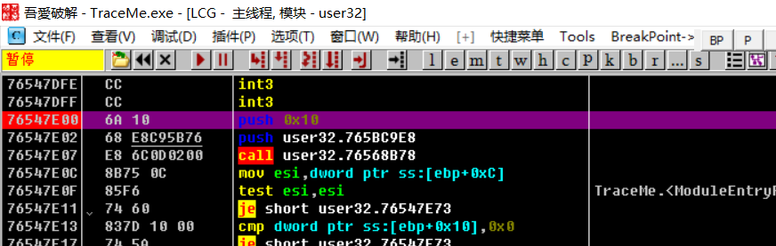

（3）输入用户名和序列号

按下 F9 快捷键运行程序，在程序窗口中输入用户名和序列号，然后单击 "Check"按钮；

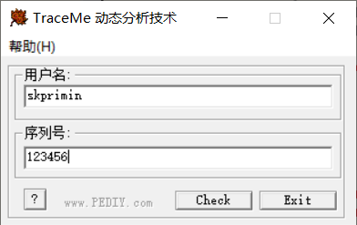

（4）分析

> 程序在 GetWindowTextA 函数的入口地址处暂停，按下 F2 快捷键，取消该处的断点，之后按下"Alt+F9"快捷键，从系统代码空间返回用户代码空间。
>
> 找到紧跟在两次调用 GetDlgItemTextA 函数之后的调用用户自定义函数处，按下 F4 快捷键运行到该处；或者以 F8 单步跟踪的方式，运行到该处，如 图 2- 1 所示的标记为 1 的指令。

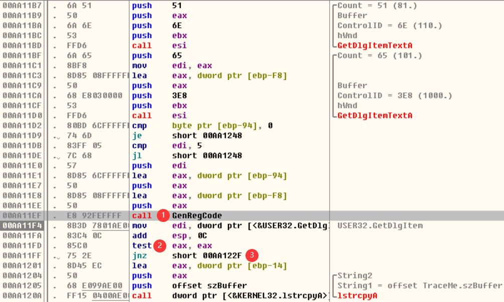{width="5.768332239720035in" height="3.463332239720035in"}

<center>图 2- 1 单击 Check 按钮后的代码逻辑</center>

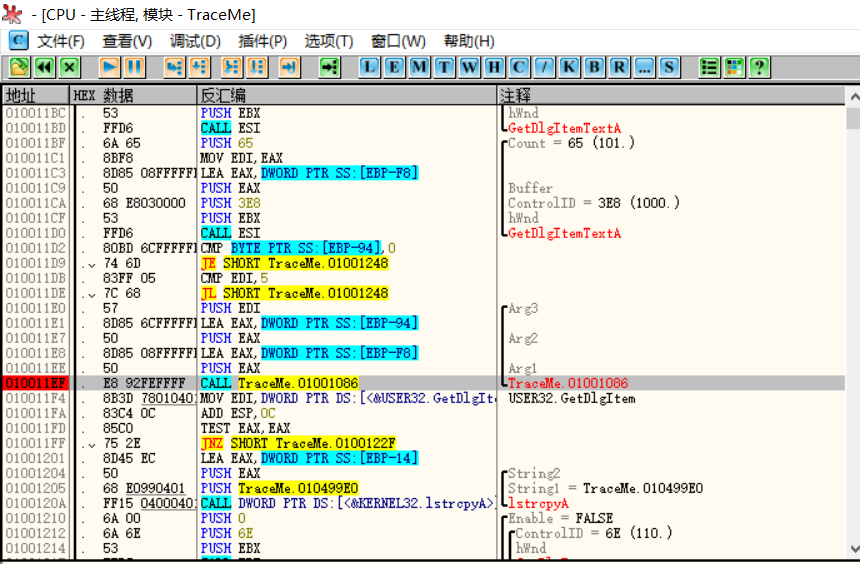

> F7 进入该函数内部， 然后运行至调用 lstrcmpA 函数处，观察栈窗口中压入 栈中的两个参数，这两个值分别为`123456`和 `29763`，它们代表的是 `输入的序列号`和`正确的序列号` ，如图 2-2 所示。至此，已经得知当前所输入的用户名对应的正确的序列号，停止调试再次输入用户名和记录的序列号便可通过验证。

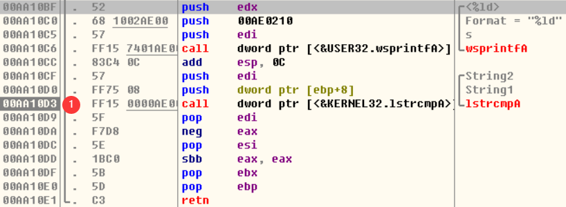{width="5.768332239720035in" height="2.116665573053368in"}

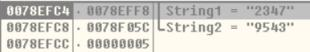{width="3.216666666666667in" height="0.5249989063867017in"}

<center>图 2-2 验证序列号是否正确的代码和当前栈中数据</center>

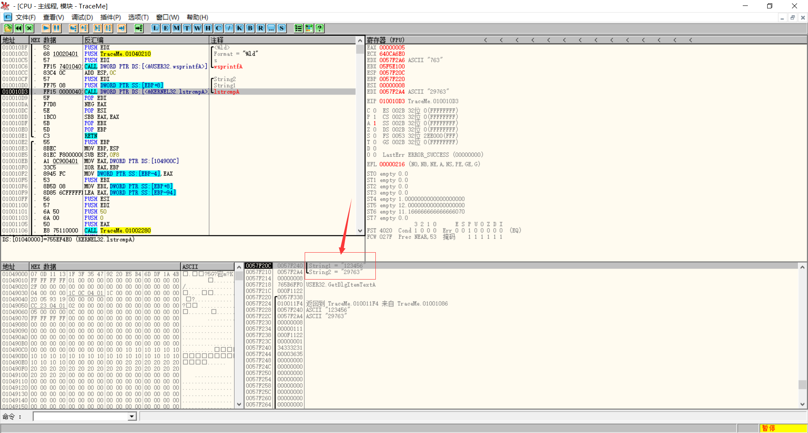

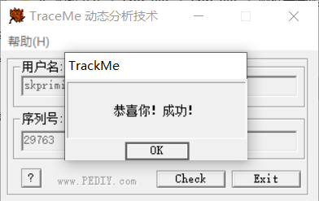

（5)"暴力"破解

> 调试程序运行至在图 2- 1 中标记 2 或者 3 的指令时， 也可以通过修改指令 的方式改变程序运行逻辑，通过验证。 例如，将 3 处占用 2 字节的条件跳转指 令用其他指令替换。具体操作如下：
>
> - 鼠标选择标签 2 处的指令，按下空格快捷键，在弹出的"Assemble at test eax eax"窗口中将现有指令替换为 ` xor eax eax`，xor来全给清空了，并勾选"Fillwith nops" 选项，然后单击 Assemble 按钮。
> - 或者鼠标选择标签 3 处的指令，按下空格快捷键，在弹出的"Assemble at JNZ SHORT 0100122F"窗口中将现有指令替换为 `JZ SHORT 0100122F`，结果为0照样转移，并勾选"Fillwith nops" 选项，然后单击 Assemble 按钮。
> - 选中任一处修改的指令，依次操作"右键\--Copy to executable\--All modifications\--Copy All"。
> - 在弹出的 Dump 窗口(D)中通过"右键\--Save file"保存修改。

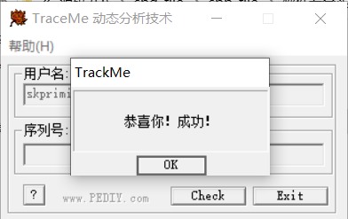

7 、思考与总结

（1）尝试使用其他指令修改方式改变程序逻辑。

（2）试想如何在不修改程序的情况下，得到正确的序列号？

- 逆向分析技术破解源代码，得到序列号算法

## 练习 2 逆向分析技术

1、实验说明

> 软件逆向分析是指将可执行程序反汇编，分析得到的汇编代码，理解其逻 辑功能，并用高级语言重新描述完整程序或部分模块的功能。

2、实验目的

> 本实验结合 OllyDbg 和IDA，分析简单注册程序（TraceMe.exe）的序列号 生成逻辑，以此学习 Windows 32 位应用程序的逆向分析技术。

3、实验原理

课程第 4 讲逆向分析技术

4、实验环境

Windows 桌面系统、IDA 7.0 及以上

5、实验内容

分析 TraceMe.exe，实现注册机程序

6、实验步骤

（1）使用 OllyDbg 打开 TraceMe.exe，依照实验 2 中的步骤定位生成序列 号函数的虚拟内存地址`01001086`，如图 3- 1 所示。 之后打开内存窗口（M），寻找待分析 程序加载的虚拟内存基址`01000000`，如图 3-2 所示。最后， 以此确认该函数的相对虚拟内存地址=虚拟内存地址-虚拟内存基址。

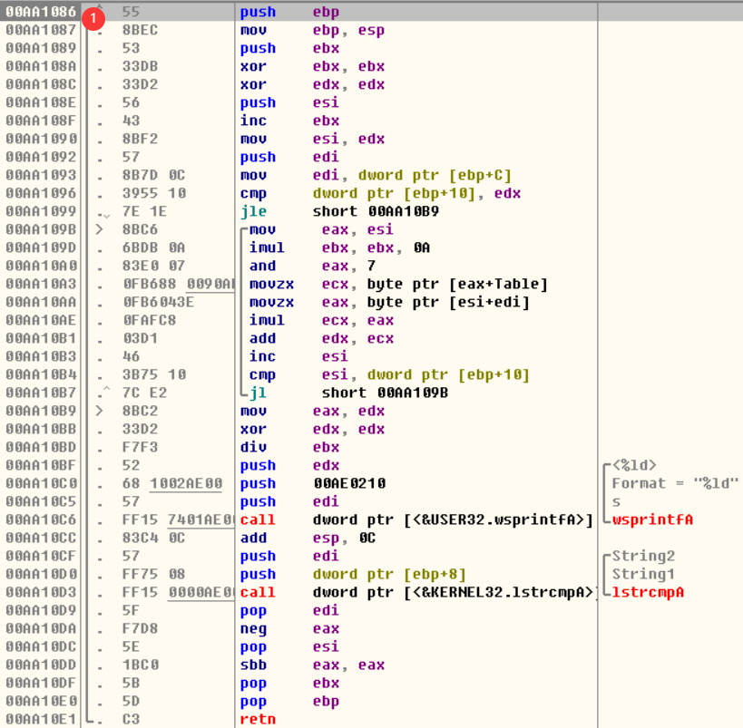{width="4.598332239720035in" height="4.51in"}

<center>图 3- 1 生成序列号的函数入口地址</center>

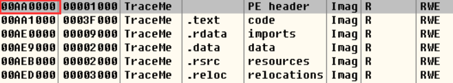{width="5.483332239720035in" height="1.008332239720035in"}

<center>图 3-2 程序的内存窗口</center>

（2）用 StudPE 打开 TraceMe.exe，获取程序的基址，如图 3-3 所示。 也可 根据 IDA 打开文件显示的信息确定程序基址，如图 3-4 所示。

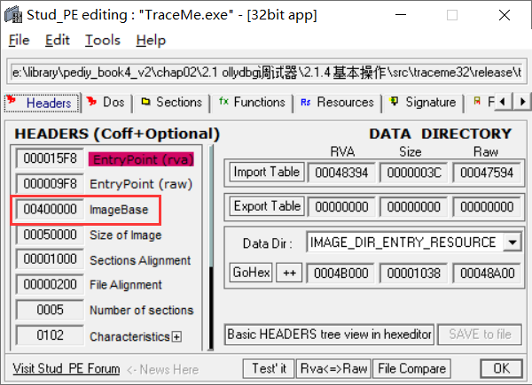{width="4.231665573053369in" height="3.0666655730533683in"}

<center>图 3-3 StudPE 查看程序基址</center>

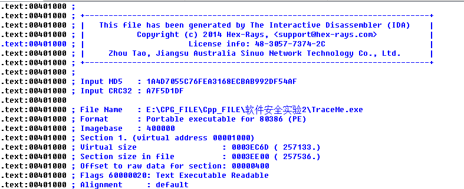

<center>图 3-4 IDA 显示的程序基本信息</center>

（3）用 IDA 打开 TraceMe.exe，根据第 1 步得到的相对虚拟内存地址、第 2 步得到的基址，确定生成序列号函数的地址为 。然后通过快捷键 G ， 打开"Jump to Address"窗口，定位到该函数，如图 3-5 所示。

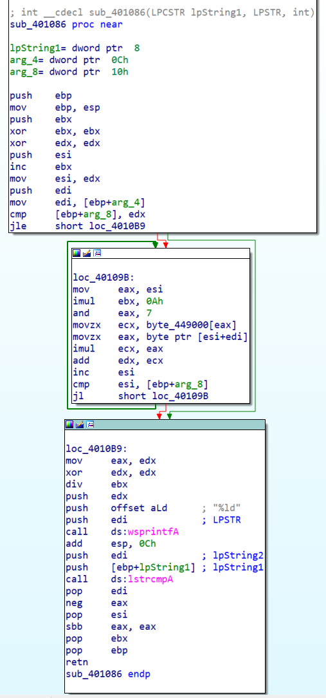

<center>图 3-5 序列号生成函数</center>

（4）打开 VS，创建控制台应用程序作为注册机，然后根据图 3-5 所示的 汇编代码，写出对应的高级语言代码，得到完整的序列号生成函数。

- 第一段是先给个寄存器清零，循环的第一轮，以及循环结束后的跳转到输出部分。依照推理我们判断出中间的40109B是一个循环，而且很明显449000处有一个数组也参与了运算，我们点进449000，看到是一个数组，取其前7+1位得到`int g_chCode[8] = {0x7, 0x0D, 0x11, 0x13, 0x1F, 0x3F, 0x35, 0x47};`。关于数组长度的来源，是由于and eax, 7将高位清空，导致数组上限只会到达g_chCode[7] ，因此取到前八位即可，再多无意义，反正取不到。
  
  - ```assembly
    mov     eax, esi ; 给了eax，由于eax
    and     eax, 7 ;将高位清空,导致数组上限只会到达g_chCode[7]，即只会用到数组前8个
    ```
  
  - 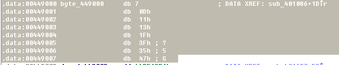
  
- 从下图部分我们可以推算出算法循环内容是eax（输入部分esi+edi项）与ecx（预留数组中的eax项）进行了乘法运算，并且计算结果值累加进edx。另有一个值ebx闷声发大财，每次都超级加十倍，一个esi每次默默加一。而循环是否继续由与esi, [ebp+arg_8]比较值决定jl全名jump less，意为小于跳转。到此我们可以推算出这部分的大致实现方式

  - ```assembly
    mov     eax, esi ; 给了eax，由于eax
    imul    ebx, 0Ah ;闷声发大财
    and     eax, 7 ;将高位清空,导致数组上限只会到达g_chCode[7]，即只会用到数组前8个
    
    movzx   ecx, byte_449000[eax]
    movzx   eax, byte ptr [esi+edi]
    imul    ecx, eax ;相乘
    add     edx, ecx ;累加
    
    inc     esi ;默默加一
    cmp     esi, [ebp+arg_8]
    jl      short loc_40109B ;小于跳转
    ```
    
  - ```c++
    
    unsigned int edx, ebx;
    int g_chCode[8] = {0x7, 0x0D, 0x11, 0x13, 0x1F, 0x3F, 0x35, 0x47};
    edx = 0;
    ebx = 1;
    int esi = 0;
    while (esi < strlen(ptr)) {
        ebx *= 10;
        edx += (unsigned __int8) ptr[esi] * (unsigned __int8) g_chCode[esi % 8];
        esi++;
    }
    ```
  
- 最后一部分 dx寄存器值给ax；xor dx dx就相当于把dx各位置归0；div ebx即bx除ax，实质是bx除dx，并ax存储除法操作的商，dx存储除法操作的余数。三push是wsprintfA函数的三个参数即输出语句，这里我们的工作可以说已经结束了。

- - ```assembly
    mov     eax, edx
    xor     edx, edx ;dx各位置归0
    div     ebx ;bx除ax，实质是bx除dx,并且dx存储除法操作的余数
    
    push    edx ;第三个参数
    push    offset aLd      ; "%ld" 第二个参数
    push    edi             ; LPSTR 第一个参数
    call    ds:wsprintfA ;输出函数本体
    ```

  - ```c++
    edx = edx % ebx;
    printf("%ld", edx);
    return 0;
    ```

（5）完成后，编译新创建的注册机程序，结合 TraceMe.exe，验证实现的 序列号生成功能是否正确。

- 将我们上面分析的结果总结起来，并插入语句使其连贯为一个完整的程序

  - ```c++
    #include<iostream>
    #include<cstring>
    #include<string>
    using namespace std;
    
    int main()
    {
        unsigned int edx, ebx;
        char ptr[100];
        cin >> ptr;
        int g_chCode[8] = {0x7, 0x0D, 0x11, 0x13, 0x1F, 0x3F, 0x35, 0x47};
    
        edx = 0;
        ebx = 1;
        int esi = 0;
        while (esi < strlen(ptr)) {
            ebx *= 10;
            edx += (unsigned __int8) ptr[esi] * (unsigned __int8) g_chCode[esi % 8];
            esi++;
        }
        edx = edx % ebx;
        printf("%ld", edx);
        return 0;
    }
    ```

7、思考与总结

（1）为何不直接用 IDA 分析 TraceMe.exe？

-  TraceMe.exe很显然是一个会动的能运行的程序，使用动态调试能很快地找到计算序列号的核心程序，进而实现调式。

（2）思考动态调试和逆向分析的优缺点，以及应如何分析程序。

- 动态调式在程序的运行过程中实现，能分析其内部原理。

- 静态分析程序并未运行，通过分析文件的结构（格式）获取其内部原理。

  
