# 6硬件加密锁

1、实验说明

加密锁能够将软件中关键算法的代码移到加密锁中执行，实现高强度的软件保护功能。

2、实验目的

本实验使用一款商用加密锁，将软件中的部分代码移植到加密锁中运行，以此加深对软件保护和授权技术的理解。

3、实验原理

课程第 8、9 讲软件保护和授权技术

4、实验环境

Windows 桌面系统，Visual Studio 6.0 及以上版本，Visual Studio Code，硬件加密锁

## 实验步骤

#### 1准备开发环境

安装 Visual Studio Code（VSCode），然后打开 VSCode 并安装 yttool 插

件，如图 6-1 所示。

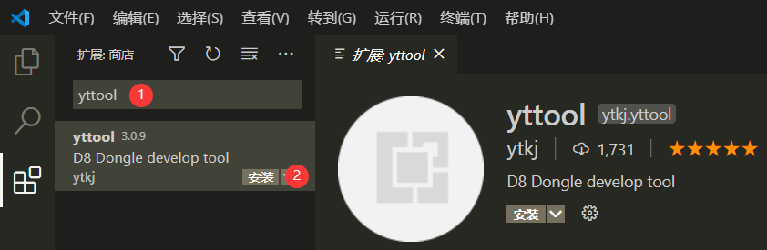

打开命令提示符（cmd），进入 ex6 目录，以图 6-2 所示的命令，启动调试服务程序。

```bash
D8Debuger.exe -start
```

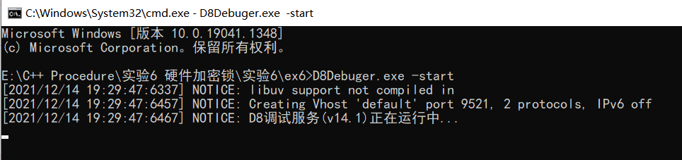

#### 2生成模版代码

在 VSCode 中，通过文件-->打开文件夹（File-->Open Folder），选择 ex6文件夹并打开，然后双击 VSCode 左侧资源管理器中的 softkey.yt 文件。修改该文件中内容，根据需要修改现有代码，或者添加自定义的函数。这些函数中可调用加密锁内置的函数，详细参见目录下的“开发文档.pdf”。 

将加密锁插入计算机 USB 口，之后在 VSCode 中输入快捷键<kbd>Ctrl</kbd>+<kbd>Shift</kbd>+<kbd>P</kbd>，在弹出的输入框中输入 `D8ResetKey`，，初始化加密锁（弹出的提示选择“是”）

在 VSCode 中输入快捷键<kbd>Ctrl</kbd>+<kbd>Shift</kbd>+<kbd>P</kbd>，在弹出的输入框中输入`D8MakeCode`，之后的选项中选择 vc 作为开发语言，接着输入下载密钥（自行设置密钥），如图所示。 

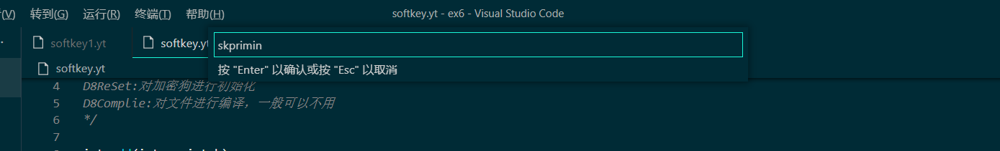

模板生成成功，并且将代码下载到加密锁后，VSode 的输出窗口会有如图所示的提示，同时 ex6 目录下将出现 vc_sample 文件夹和模板工程文件。

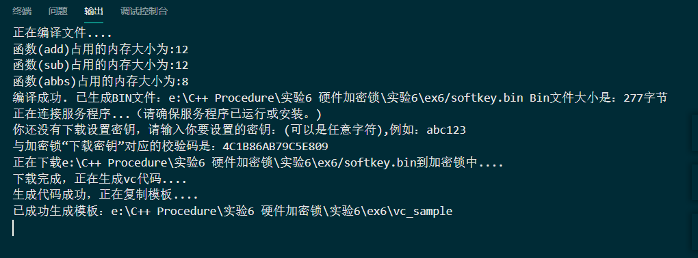

#### 3编译模板项目

进入 vc_sample 目录，使用 VC6.0 或者 Visual Studio 打开模板项目文件TEST.DSW。


依照图 6-6 所示，修改 RunFunc 函数，然后生成解决方案。之后观察程序运行结果，然后将自己的加密锁和其他同学的互换，再次观察程序运行结果。

```c++
	char szText[64] = { 0 };
	wsprintf(szText, "%d", add(12, 23, KeyPath));
	MessageBox(NULL, szText, "SoftKey", MB_OK);
	return LastErr;
```

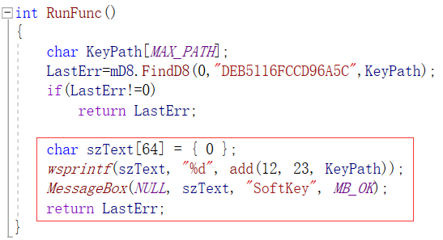


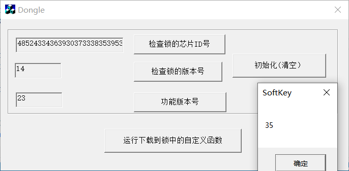

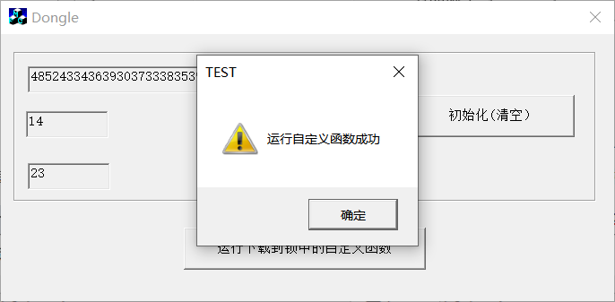

注意，如果使用 Visual Studio 打开目标工程，需要在“项目属性-->C/C++-->代码生成”中，将“启用函数级链接”的选项修改为“是”。

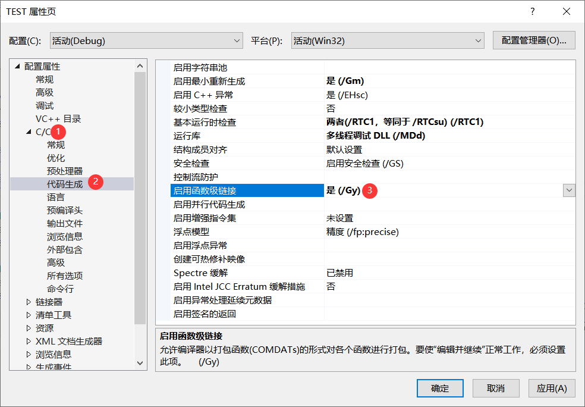

另外，将 stdafx.h 中_WIN32_WINNT 和 WINVER 宏定义改为 0x0501。

#### 4个性化保护方案设计

使用 TraceMe 文件夹中的 softkey.yt 文件，根据第2步中的操作，将代码下载到加密锁中、生成模板代码，

注意：此处在另一文件夹启动D8Debuger.exe有些许困难，可以在第二步文件夹下将原有的vc_sample文件夹改名，原有的yt文件改名。并将新的softkey.yt迁往原文件夹，可直接生成。 

- 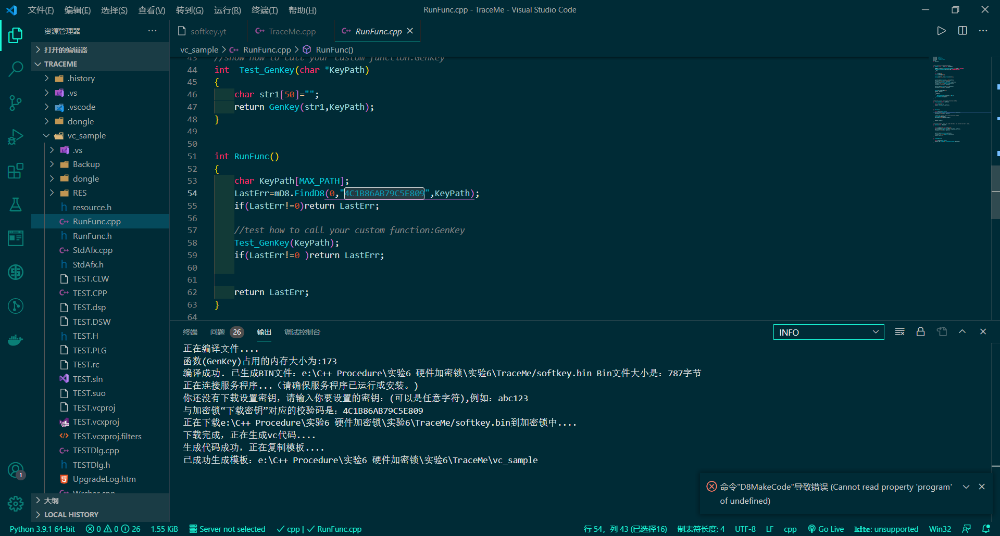

  并用生成代码中的校验码替换 TraceMe 项目中 GenRegCode 函数的校验码，最后编译生成 TraceMe。

- 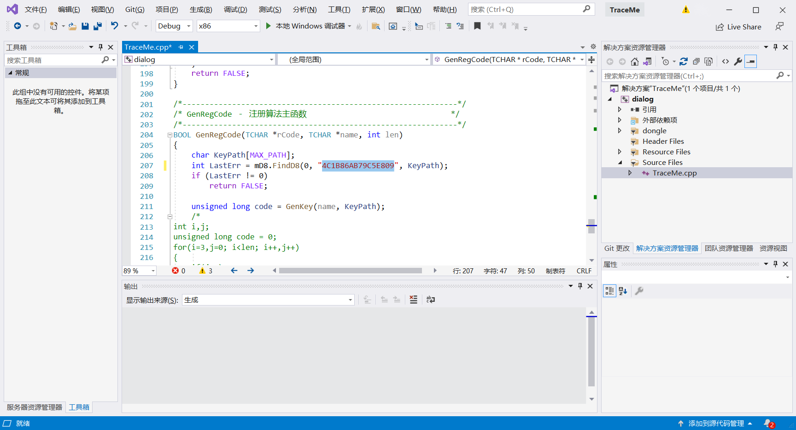

根据实验3 逆向分析技术或实验5 Hook 技术实验中的结果，使用一对经 过正确验证的“用户名”和“序列号”，作为刚生成的 TraceMe 的输入，观察此 时的验证结果。

如果此时编译宝座显示没有st**x.h头文件则是没有安装mfc，无法生成界面，依照下图所示安装mfc即可。

- 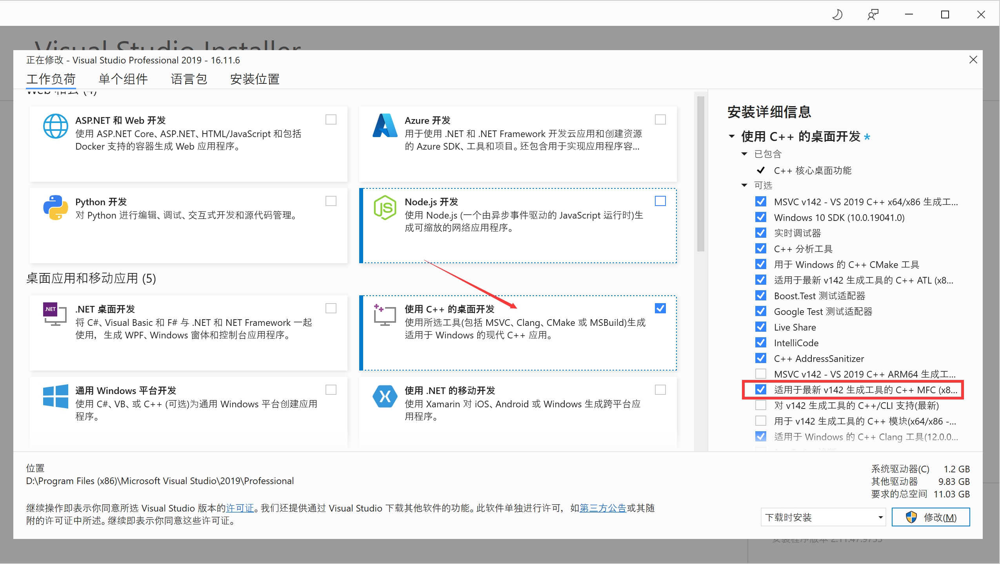

如果此时拔掉加密锁就会失败


加上密码锁便成功

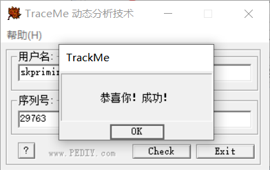

插入加密锁，再次验证，观察验证结果；和其他同学交换加密锁，再次验证，并观察结果。

## 思考与总结

1. 在加密锁中自定义的关键代码应该具有什么样的特点？ 
   1. 能够对指定密钥进行保护
2. 比较本次实验和先前实验中 TraceMe 计算序列号的保护强度？
   1. 本次实验使用硬件加密，当然比普通的计算保护强度高，破解计算序列号我们已经通过动态调试，逆向分析，Inline hook等技术破解，但硬件加密单凭软件是无法触动的。
3. 如何提高软件调用加密锁中自定义函数的安全性？
   1. 使用更安全的算法，比如基于离散对数求解难问题使用RSA
4. 实验提供的 TraceMe 项目已经从生成的模板代码中提取并嵌入关键代码，实验结束后思考如何将加密锁模板代码应用到其他项目中。
   1. 将文件长久保存，到其他项目时只需修改其中计算序列号的相关代码，改为新项目的算法即可。
