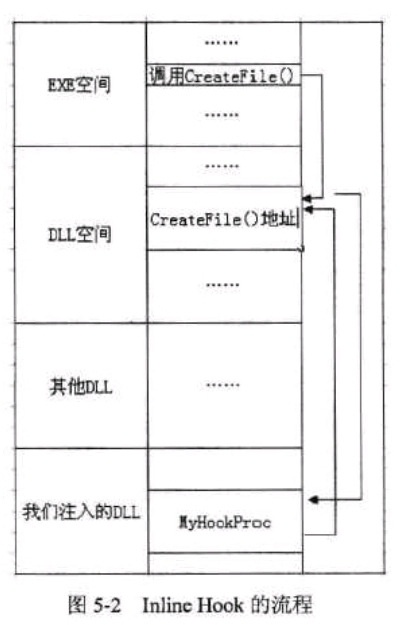
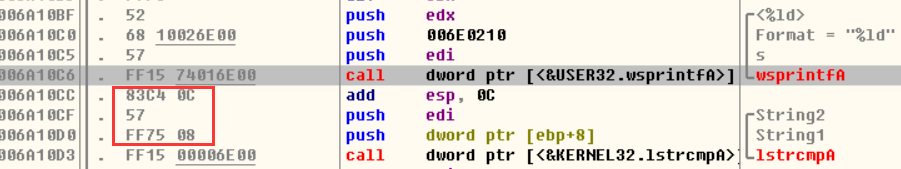
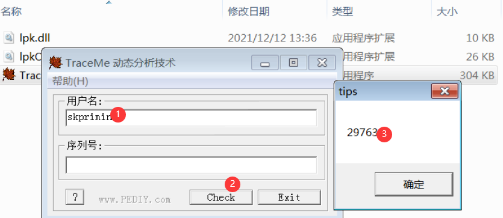
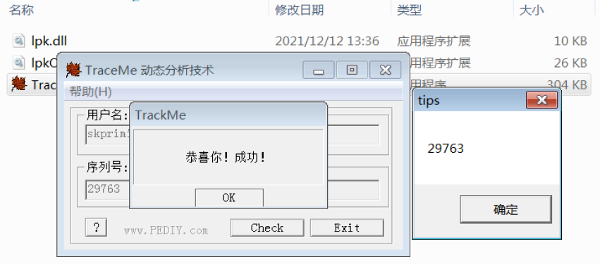
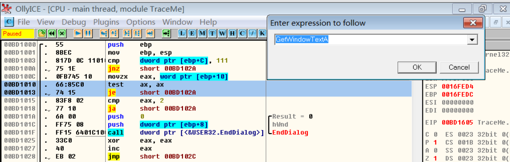
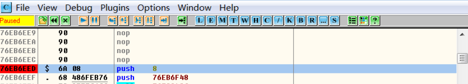
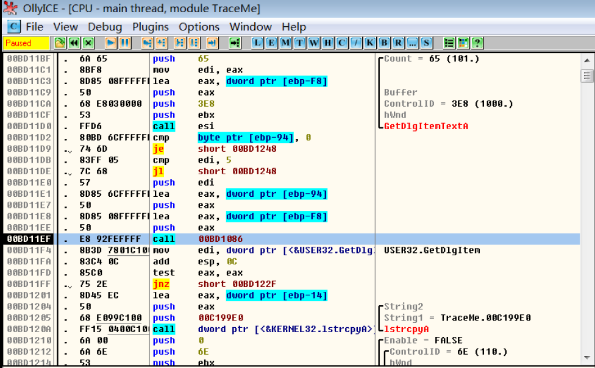
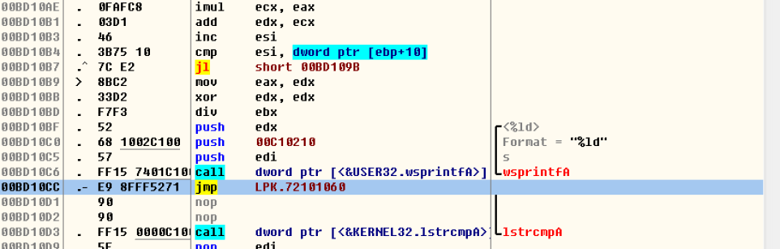
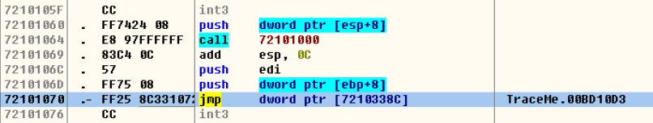

# 实验 5 Hook 技术

## 实验须知

**1实验说明**

Hook 是在指令的关键位置插入特定代码，以干预程序原有的执行流程，实现拦截目标进程运行过程的关键信息改变目标进程原本执行流程等目的。

**2实验目的**

本实验使用 Inline Hook 技术，挂钩 TraceMe.exe 中计算序列号的代码，获取正确的序列号，加深对 Hook 技术的理解。

#### 3实验原理

#####  Hook

- Hook∶中文译作"挂钩"或"钩子"，在指令执行的关键位置插入特定代码，以干预程序原有的执行流程，实现拦截目标进程运行过程的关键信息、改变目标进程原本执行流程等目的

- 从流程上看，原本直接调用函数的过程被修改后，"绕个弯"、经过插入的代码（函数）后，才到达真正的目标函数处，因此该过程也被称为"Detour";插入的函数通常和目标函数有相同的原型，称之为Detour函数

- 根据Hook所修改内容，将其分为Address Hook、Inline Hook（内联钩子）、Message Hook。直接嵌入jmp指令来改变流程的，称为Inline Hook

  ```mermaid
  flowchart LR
      调用函数 --> Detour函数
      Detour函数 --> 目标函数
      
      目标函数 -->  Detour函数
          Detour函数 --> 调用函数
  ```

  <center>HOOK函数的调用关系</center>
  
  
  
##### Inline Hook

- Inline Hook所修改的内容是指令，通常使用jmp、call、ret等指令，替换目标函数入口处的数条指令，转移代码到Detour函数，待执行完毕后，再跳转回Hook之后的地址执行后续代码

- Hook过程涉及4个对象，调用函数、Detour函数、Trampoline函数、目标函数;Trampoline并不是完整的函数，而是目标函数被Hook 时，在入口处被替换的几条指令




Inline Hook需解决两个问题

- 确定采用的Hook方式，这决定执行流程转移的机器码

- 准备Trampoline函数，确保Detour函数能正确执行目标函数中被Hook之后的指令

根据不同的使用场合， 主要有5种方式实现跳转∶

- `jmp XXXX`（5字节）（常用方式）
- `push XXXX + ret`（6字节）
- `mov reg,XXXX + jmp reg` （7字节）
- `call `
- `HotPatch`

##### Inline Hook流程

1. 构造跳转指令
2. 在内存中找到欲HOOK函数地址，并保存欲HOOK位置处的前5个字节
3. 将构造的跳转指令写入需HOOK的位置处
4. 当被HOOK位置被执行时会转到我们的流程执行
5. 如果要执行原来的流程，那么取消HOOK，也就是还原被修改的字节
6. 执行原来的流程
7. 继续hook原来的位置

**4实验环境**

Windows 桌面系统Visual Studio 6.0 及以上版本TraceMe.exe

## 实验步骤

#### 1创建劫持 lpk 的 DLL 项目

依照[实验 4](https://blog.csdn.net/m0_46530662/article/details/121744553) 练习3DLL 中的步骤，创建 DLL 项目，实现劫持 lpk.dll 的功能，并在 DllMain 创建的线程函数中，将弹出对话框的功能替换为安装 Inline Hook

```cpp
DWORD WINAPI ThreadWorking(LPVOID lpParameters)
{
    InstallInlineHook();
    return 0;
}
```

<center>线程函数</center>

#### 2Detour 函数

根据[实验 2](https://blog.csdn.net/m0_46530662/article/details/121533684) 中的分析可知，下图所示 TraceMe.exe 中调用 wsprintfA 之前，计算得到的序列号存放在 edx 寄存器中，并被压入栈，调用 wsprintfA 之后，序列号仍在栈中，因此可通过 Hook 图中红色框中的指令获取序列号。



<center>TraceMe 格式化序列号的指令</center>

据此实现的 Detour 函数如图所示，图中 XX 的值为`8` ，AAAA、BBBB、CCCC 三条指令依次为：`add esp,0xc`、`push edi`、`push dword ptr[ebp+8] `。

```cpp
__declspec(naked) void DetourFunction()
{
    _asm
    {
        push [esp + XX] 
        call DoSomething
        
        AAAA
        BBBB
        CCCC
        jmp g_backPos
    }
}

```

<center>Detour 函数</center>
- `push [esp + 8]`是为了将计算得出的edx序列号压入栈。
  - esp是栈指针，push、pop指令会自动调整esp的值；esp为x86CPU使用的堆栈指针，每进行一次入栈操作，esp要减4，堆栈一个单元是4Byte，使用基址-偏移量寻址，即[esp+8]。
  
- 三条指令是为了保持原有功能，防止程序运行出错。


\_\_declspec(naked)是告知编译器代码中的汇编语言不需要编译器画蛇添足添加其它汇编代码。对于jmp类型的hook，若没有说明\_\_declspec(naked)，系统为了控制堆栈平衡，会自动添加一些额外的代码，破坏hook函数的堆栈。如果没有使用JMP到原函数，就必须要用 RET 或 RET n 指令返回。

```c++
_declspec(naked) void DetourFunction() 
{
	_asm
	{
		push [esp + 8]
		call DoSomething

		add esp,0xc
		push edi
		push dword ptr[ebp+8]
		jmp g_backPos
	}
}
```

#### 3安装 Inline Hook 函数

本实验以 JMP 方式实现 Inline Hook，安装 Hook 的函数如图所示，代码中 A= `7`，B= `5`，CCCC 的表达式为：`(ULONG)DetourFunction- nHookPos -5` 。

- 被替换指令`add esp,0xc`、`push edi`、`push dword ptr[ebp+8] `，其机器码为`83C4 0C, 57, FF75 08`，显而易见是7个字节
- Hook指令为jmp指令，jmp指令长转移时对应机器码为E9，后面根着一个 XX XX XX XX 的地址，因此这个指令的机器码长度为5个字节

- jmp指令的操作数其实是跳转的偏移量，不能直接写跳转的目的地址，计算偏移量(CCCC)的公式为：$jmp后的偏移量 = 目的地址-原地址-跳转指令的长度$。
  - `(ULONG)DetourFunction`为目的地址，
  - `nHookPos`原地址，jmp的起始地址，
  - `jmp XXXX`为5字节

```cpp
int InstallInlineHook()
{
	unsigned char nOriginalLen = A; //被替换指令的长度
	HMODULE hMod = GetModuleHandle(NULL);
	unsigned long nHookPos = (unsigned long)hMod + 0x10CC; // Hook的目标地址
	g_backPos = nHookPos + nOriginalLen;
	unsigned char nHookCodeLen = B;			// Hook指令的长度
	unsigned char chHookCodes[16] = {0xE9}; // JMP
	*((ULONG *)(chHookCodes + 1)) = CCCC;
	memset(chHookCodes + nHookCodeLen, 0x90, sizeof(chHookCodes) - nHookCodeLen);
	ULONG nWrite = 0;
	HANDLE hProcess = GetCurrentProcess();
	int nRet = WriteProcessMemory(hProcess, (void *)nHookPos, (void *)chHookCodes, nOriginalLen, &nWrite);
	if (nRet)
		return 0;
	else
		return 1;
}
```

<center>安装 Hook 的函数</center>

#### 4显示序列号

Detour 函数获取到序列号后，用对话框将其显示，如图所示，AAAA所代表的该函数的调用约定为 `_stdcall`。

MessageBox()函数的调用约定是\_\_stdcall，定义函数时也要使用\_\_stdcall。定义时使用的是WINAPI，这是一个宏，该宏的定义如下：

```cpp
#define WINAPI __stdcall 
```

在win32应用程序里,宏APIENTRY，WINAPI，都表示\_stdcall，在dll的函数调用约定中使用\_\_stdcall 。WinUser.h中关于MessageBoxA()函数的定义如下

```cpp
WINUSERAPI int WINAPI 
MessageBoxA(_In_opt_ HWND hWnd,_In_opt_ LPCSTR lpText,_In_opt_ LPCSTR lpCaption,_In_ UINT uType);
```

```cpp
unsigned long g_backPos = 0;
void AAAA DoSomething(ULONG sid)
{
	TCHAR strText[16] = {0};
	wsprintf(strText, TEXT("%d"), sid);
	MessageBox(NULL, strText, TEXT("tips"), MB_OK);
}
```

<center>对话框显示序列号</center>

```c++
#include <Windows.h>
#include "pch.h"
#include <stdio.h>
 
// 导出函数
#pragma comment(linker, "/EXPORT:LpkTabbedTextOut=lpkOrg.LpkTabbedTextOut,@1")
#pragma comment(linker, "/EXPORT:LpkDllInitialize=lpkOrg.LpkDllInitialize,@2")
#pragma comment(linker, "/EXPORT:LpkDrawTextEx=lpkOrg.LpkDrawTextEx,@3")
#pragma comment(linker, "/EXPORT:LpkPSMTextOut=lpkOrg.LpkPSMTextOut,@9")
#pragma comment(linker, "/EXPORT:LpkUseGDIWidthCache=lpkOrg.LpkUseGDIWidthCache,@10")
#pragma comment(linker, "/EXPORT:LpkGetCharacterPlacement=lpkOrg.LpkGetCharacterPlacement,@6")
#pragma comment(linker, "/EXPORT:LpkGetTextExtentExPoint=lpkOrg.LpkGetTextExtentExPoint,@7")
#pragma comment(linker, "/EXPORT:LpkInitialize=lpkOrg.LpkInitialize,@8")
#pragma comment(linker, "/EXPORT:ftsWordBreak=lpkOrg.ftsWordBreak,@11")
#pragma comment(linker, "/EXPORT:LpkEditControl=lpkOrg.LpkEditControl,@4")
#pragma comment(linker, "/EXPORT:LpkExtTextOut=lpkOrg.LpkExtTextOut,@5")


unsigned long g_backPos = 0;
void _stdcall DoSomething(ULONG sid)
{
	TCHAR strText[16] = { 0 };
	wsprintf(strText, TEXT("%d"), sid);
	MessageBox(NULL, strText, TEXT("tips"), MB_OK);
}
_declspec(naked) void DetourFunction()
{
	_asm
	{
		push [esp + 8]
		call DoSomething

		add esp, 0xc
		push edi
		push dword ptr[ebp + 8]
		jmp g_backPos
	}
}

int InstallInlineHook()
{
	unsigned char nOriginalLen = 7; //被替换指令的长度
	HMODULE hMod = GetModuleHandle(NULL);
	unsigned long nHookPos = (unsigned long)hMod + 0x10CC; // Hook的目标地址
	g_backPos = nHookPos + nOriginalLen;
	unsigned char nHookCodeLen = 5; // Hook指令的长度
	unsigned char chHookCodes[16] = { 0xE9 }; //JMP
	*((ULONG*)(chHookCodes + 1)) = (ULONG)DetourFunction - nHookPos - 5;
	memset(chHookCodes + nHookCodeLen, 0x90, sizeof(chHookCodes) - nHookCodeLen);
	ULONG nWrite = 0;
	HANDLE hProcess = GetCurrentProcess();
	int nRet = WriteProcessMemory(hProcess, (void*)nHookPos, (void*)chHookCodes, nOriginalLen, &nWrite);
	if (nRet)
		return 0;
	else
		return 1;
}
DWORD WINAPI ThreadWorking(LPVOID lpParameters)
{
	InstallInlineHook();
	return 0;
}

BOOL WINAPI DllMain(HMODULE hModule, DWORD dwReason, PVOID pvReserved)
{
	if (dwReason == DLL_PROCESS_ATTACH)
	{
		CreateThread(NULL, 0, ThreadWorking, NULL, 0, NULL);
		DisableThreadLibraryCalls(hModule);
	}
	return TRUE;
}
```

至此，一个完整的Inline Hook就编写完成，同样是Release x86编译出lpk.dll，同样是拉进Win7运行，同样是复制过来原有的lpk.dll并改名lpkOrg.dll，不同的这次是TraceMe.exe。

#### 5观察结果

仿照[实验 4 ](https://blog.csdn.net/m0_46530662/article/details/121744553)练习3DLL劫持 步骤4的操作，新建文件夹，并将 TraceMe.exe、lpk.dll 和 lpkOrg.dll 放在该文件夹中。运行 TraceMe.exe，输入用户名和序列号，观察计算得到的序列号。



随后我们输入发现确实成功了



参照[实验2](https://blog.csdn.net/m0_46530662/article/details/121533684)用 OllyDbg 打开修改后的 TraceMe，观察 Hook 之处的代码。

- 快捷键<kbd>Ctrl</kbd>+<kbd>G</kbd>打开"跟随表达式"窗口，找到 GetWindowTextA 函数的入口地址，按下 F2 快捷键在入口处下断点；






- 按下 F9 快捷键运行程序，在程序窗口中输入用户名，然后单击 "Check"按钮；

- 程序在 GetWindowTextA 函数的入口地址处暂停，按下 F2 快捷键，取消该处的断点，之后按下"Alt+F9"快捷键，从系统代码空间返回用户代码空间。

- 找到紧跟在两次调用 GetDlgItemTextA 函数之后的调用用户自定义函数处，按下 <kbd>F4</kbd> 快捷键运行到该处；或者以 <kbd>F8</kbd> 单步跟踪的方式，运行到该处，如图所示的`00BD11EF  |.  E8 92FEFFFF   call    00BD1086`的指令。



- <kbd>F7</kbd> 进入该函数内部， 然后运行至调用 lstrcmpA 函数处，发现指令确实已经被修改，多了一个jmp指令不知跳向何方

  

- 但程序知道，<kbd>F4</kbd>运行至jmp处变跳转到了目标地址，来到了它的起源地，如下图所示，正是我们创造出的Hook，正是我们第二步所编写的Detour函数。

  

#### 6思考与总结

1尝试用其他非 JMP 方式，以及不同的位置实现 Inline Hook。 

- 在构造Detour 函数时我们变知晓，如果没有使用JMP到原函数，就必须要用 RET 或 RET n 指令返回。故也可以使用这种方式实现Hook。

2总结 C/ASM 混合编程的方法。

-  C指C，ASM是C++中的一个关键字，用于在C++源码中内嵌汇编语言。\_\_asm关键字启动内联汇编并且能写在任何C++合法语句之处。汇编代码装入asm代码块中。