# 代码注入技术

## 引言

1、实验说明

代码注入是将用户代码注入到其他进程或者可执行文件中，实现拦截目标进程运行过程的关键信息、改变目标进程或可执行文件原本执行流程等目的

2、实验目的

本实验通过远程线程和输入表注入，向目标进程注入代码、向目标 PE 文件注入 DLL，以加深对代码注入技术的理解。 


### 3、实验原理

- 在目标进程中申请内存并写入待注入DLL的路径，然后调用
  CreateRemoteThread，在目标中创建线程;线程函数地址为LoadLibrary(A/W)，线程参数便是存放DLL路径的内存首地址

- 调用CreateRemoteThread需要目标进程句柄作刀梦数，此N而得到在目标进程中创建线程(PRoCES>CKEAlP_I11nEA)、r '存(PROCESS_VM_WRITE)等多项权限

- “远程”线程是和CreateThread相对的，匹程纹任疋巧进性主利线程，创建的线程不属于当前进程

- 使用LoadLibrarv作为线程函数较为方便，因为不考虑返回值和参数类型的情况下，二者有相同的函数原型，如下所示:

  ```cpp
  HMODULE WINAPI LoadLibraryA(LPCSTR lpLibFileName);
  DWORD WINAPI ThreadProc(LPVOID lpParameter);
  ```

- 远程线程注入过程需要在目标进程空间申请内存，存储线程执行时所需的参数等数据

-  VirtualAllocEx:在指定进程中申请内存空间

-  WriteProcessMemory:向指定进程的指定虚拟内存地址写入数据

```cpp
//获取目标进程的句柄
HANDLE hProc =OpenProcess(PROCESS_ALL_ACCESS,FALSE, dwTargetPid),
//在目标进程申请空间存储DLL完整路径
LPTSTR pDllFile =(LPTSTR)VirtualAllocEx(hProc, NULL, lstrlen(DllPath)+1,MEM_COMMIT, PAGE_READWRITE);
//将DLL路径写入目标进程申请的内存中
WriteProcessMemory(hProc, pDllFile, DllPath, lstrlen(DllPath)+1, NULL)
//获取LoadLibraryA的入口地址
HMODULE hKernel = GetModuleHandle("Kernel32");
PTHREAD_START_ROUTINE pfnStartAddr = GetProcAddress(hKernel,"LoadLibraryA");
//创建远程线程调用LoadLibrary
CreateRemoteThread(hProc, NULL,0, pfnStartAddr, pDllFile,0, NULL);

```

##### 区别

原理和远程线程注入DLL原理相似，区别是:

- 线程执行对象不同:即线程函数不同，注入DLL时创建远程线程执行LoadLibrary(A/W)函数，而注入代码时执行用户实现的这部分代码

- 目标进程空间存储对象不同:注入DLL时在目标进程中申请的内存空间用于存储DLL路径，而注入代码存储的是作为线程函数的这部分代码，以及线程函数的参数

远程线程注入代码注意事项:

- **注入代码定位**:包括如何确定代码的起始位置和代码的长度，这决定
  了向目标进程写入什么内容、写入多少字节
- **注入代码实现**:注入代码是要在目标进程中执行，因此创建该代码主体中的全局变量、堆内存、本地自定义函数等均无法使用，使用系统API则不受限制


4、实验环境

Windows 7 系统、Visual Studio 6.0 及以上版本
关于Windows 7 的选择，建议大家使用 带Service Pack1的X86系统，[镜像下载网站](http://www.tellyou.top/ ).这样能够在使用WM ware时安装WMtools，实现内容文件的直接复制，方便快捷，是32位系统。
迅雷下载号：
```
ed2k://|file|hk_windows_7_home_premium_with_sp1_x86_dvd_620848.iso|2621298688|33CB0040A929656DC1BE176E3FF8F00E|/
```
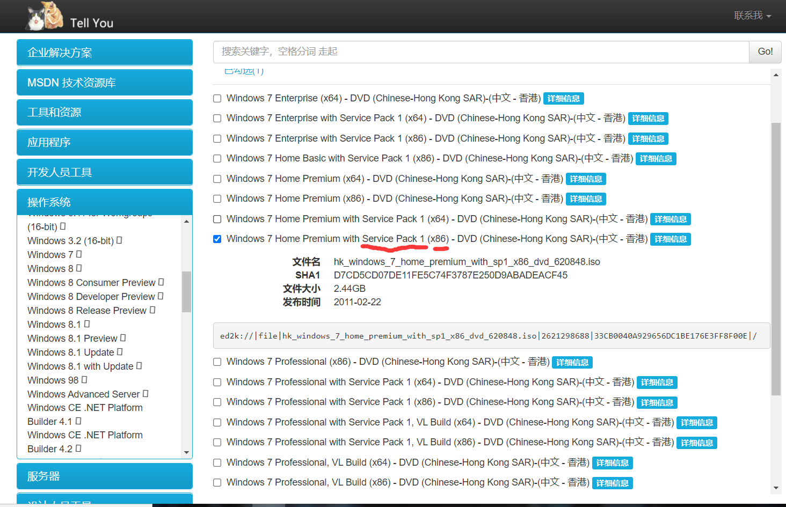


5、实验内容

（1）远程线程注入

（2）利用 Detours 实现输入表注入

（3）DLL 劫持


## 远程线程注入

### 1创建 Win32 应用程序项目

打开 VS，选择空项目模板，创建 Win32 应用程序，然后向新建项目中添加源程序文件 InjectCode.cpp（附件已提供）。 

源代码

```c++
#include <windows.h>
#include <stdio.h>

typedef struct _THREAD_PARAM
{
	FARPROC pFunc[2];		// LoadLibraryA(), GetProcAddress()
	char szBuf[4][128];		// "user32.dll", "MessageBoxA",  "text", "caption"
} THREAD_PARAM,  PTHREAD_PARAM;

typedef HMODULE(WINAPI pfnLoadLibrary)(LPCSTR lpLibFileName);
typedef xx(WINAPI pfnGetProcAddress)(xx, xx);
typedef xx (WINAPI pfnMsgBox)(xx, xx, xx, xx);

BOOL SetPrivilege(LPCTSTR lpszPrivilege, BOOL bEnablePrivilege)
{
	HANDLE hToken;
	if (!OpenProcessToken(GetCurrentProcess(), TOKEN_ADJUST_PRIVILEGES | TOKEN_QUERY, &hToken))
	{
		printf("OpenProcessToken error:%d\n", GetLastError());
		return FALSE;
	}

	LUID luid;
	if (!LookupPrivilegeValue(NULL,	lpszPrivilege,	&luid))
	{
		printf("LookupPrivilegeValue error:%d\n", GetLastError());
		return FALSE;
	}

	TOKEN_PRIVILEGES NewState;
	NewState.PrivilegeCount = 1;
	NewState.Privileges[0].Luid = luid;
	if (bEnablePrivilege)
		NewState.Privileges[0].Attributes = SE_PRIVILEGE_ENABLED;
	else
		NewState.Privileges[0].Attributes = 0;

	if (!AdjustTokenPrivileges(hToken, FALSE, &NewState, sizeof(TOKEN_PRIVILEGES), NULL, NULL))
	{
		printf("AdjustTokenPrivileges error:%d\n", GetLastError());
		return FALSE;
	}
	return TRUE;
}

DWORD WINAPI ThreadProc(LPVOID lParam)
{
	PTHREAD_PARAM pParam = (PTHREAD_PARAM)lParam;
	// "user32.dll"
	HMODULE hMod = ((pfnLoadLibrary)pParam->pFunc[0])(pParam->szBuf[0]);
	if (!hMod)
		return 1;

	// "MessageBoxA"
	pfnMsgBox pFunc = (pfnMsgBox)((pfnGetProcAddress)pParam->pFunc[1])(hMod, pParam->szBuf[1]);
	if (!pFunc)
		return 1;

	pFunc(NULL, pParam->szBuf[2], pParam->szBuf[3], MB_OK);
	return 0;
}

BOOL InjectCode(DWORD dwPID)
{
	HANDLE hProcess = OpenProcess(xx, xx, xx);
	if (!hProcess)
	{
		printf("OpneProcess Error:%d\n", GetLastError());
		return FALSE;
	}

	// 写入线程函数所用的参数
	THREAD_PARAM param = { 0 };
	HMODULE hMod = GetModuleHandleA("Kernel32.dll");
	param.pFunc[0] = GetProcAddress(hMod, "LoadLibraryA");
	param.pFunc[1] = GetProcAddress(hMod, "GetProcAddress");
	strcpy_s(param.szBuf[0], "user32.dll");
	strcpy_s(param.szBuf[1], "MessageBoxA");
	strcpy_s(param.szBuf[2], "Hello, World");
	strcpy_s(param.szBuf[3], "AHU");

	DWORD dwSize = sizeof(THREAD_PARAM);
	VOID pParam = VirtualAllocEx(xx, xx, xx, xx, xx);
	if (!pParam)
	{
		printf("VirtualAllocEx for parameter Error:%d\n", GetLastError());
		return FALSE;
	}

	if (!WriteProcessMemory(xx, xx, &xx, xx, xx))
	{
		printf("WriteProcessMemory Error:%d\n", GetLastError());
		return FALSE;
	}

	// 写入远程线程函数
	dwSize = (DWORD)xx - (DWORD)xx;
	VOID pThreadAddr = VirtualAllocEx(xx, xx, xx, xx, xx);
	if (!pThreadAddr)
	{
		printf("VirtualAllocEx for Thread Error:%d\n", GetLastError());
		return FALSE;
	}

	if (!WriteProcessMemory(xx, xx, xx, xx, xx))
	{
		printf("WriteProcessMemory for Thread Error:%d\n", GetLastError());
		return FALSE;
	}

	HANDLE hThread = CreateRemoteThread(xx, xx, xx, (LPTHREAD_START_ROUTINE)xx, xx, xx, xx);
	if (!hThread)
	{
		printf("CreateRemoteThread Error:%d\n", GetLastError());
		return FALSE;
	}

	WaitForSingleObject(hThread, INFINITE);
	CloseHandle(hThread);
	CloseHandle(hProcess);
	return TRUE;
}

int main(int argc, char argv)
{
	if (argc != 2)
	{
		printf("\n USAGE: %s <PID>\n", argv[0]);
		return 1;
	}

 	if (!SetPrivilege(SE_DEBUG_NAME, TRUE))
 		return 1;

	DWORD dwPid = atoi(argv[1]);
	InjectCode(dwPid);

	return 0;
}
```


### 2编写提权函数

在远程进程中申请内存空间、创建线程等操作，需要获取相应的权限，某些目标进程需要提升操作进程的自身权限，具体实现代码如下所示。


```c++
BOOL SetPrivilege(LPCTSTR lpszPrivilege, BOOL bEnablePrivilege)
{
    HANDLE hToken;
    if (!OpenProcessToken(GetCurrentProcess(), TOKEN_ADJUST_PRIVILEGES | TOKEN_QUERY, &hToken))
    {
        printf("OpenProcessToken error:%d\n", GetLastError());
        return FALSE;
    }

    LUID luid;
    if (!LookupPrivilegeValue(NULL,    lpszPrivilege, &luid))
    {
        printf("LookupPrivilegeValue error:%d\n", GetLastError());
        return FALSE;
    }

    TOKEN_PRIVILEGES NewState;
    NewState.PrivilegeCount = 1;
    NewState.Privileges[0].Luid = luid;
    if (bEnablePrivilege)
        NewState.Privileges[0].Attributes = SE_PRIVILEGE_ENABLED;
    else
        NewState.Privileges[0].Attributes = 0;

    if (!AdjustTokenPrivileges(hToken, FALSE, &NewState, sizeof(TOKEN_PRIVILEGES), NULL, NULL))
    {
        printf("AdjustTokenPrivileges error:%d\n", GetLastError());
        return FALSE;
    }
    return TRUE;
}
```

### 3远程线程函数

线程函数是在目标进程中实施具体功能的函数，它所用到的变量、函数地址均和注入进程不同，需要通过显示链接的方式获取相应的系统 API 函数地址，因此需将函用到的函数名称、参数，以及 LoadLibrary 和 GetProcAddress 函数的地址以参数形式传入远程线程中。注意，远程线程函数中 pfnXXX 为函数指针，其定义方式请回顾实验 1 练习 2 显示链接 DLL 中的内容。

```c++
typedef HMODULE(WINAPI pfnLoadLibrary)(LPCSTR lpLibFileName);
typedef xx(WINAPI pfnGetProcAddress)(xx, xx);
typedef xx (WINAPI pfnMsgBox)(xx, xx, xx, xx);
```

##### GetProcAddress function (libloaderapi.h)

[GetProcAddress function (libloaderapi.h) - Win32 apps | Microsoft Docs](https://docs.microsoft.com/en-us/windows/win32/api/libloaderapi/nf-libloaderapi-getprocaddress)

函数 从指定的动态链接库文件夹(DLL)检索导出函数或变量的地址。

```c++
FARPROC GetProcAddress(
  [in] HMODULE hModule,
  [in] LPCSTR  lpProcName
);
```

- `[in]hModule`
  - 包含函数或变量的DLL模块的句柄。LoadLibrary、LoadLibraryEx、LoadPackagedLibrary或GetModuleHandle函数返回这个句柄。
  - GetProcAddress函数不会从使用LOAD_LIBRARY_AS_DATAFILE标志加载的模块中检索地址。有关更多信息，请参阅LoadLibraryEx。

- `[in]lpProcName`
  - 函数或变量名，或函数的序数值。如果这个参数是一个序数值，它必须是低序字;高阶词必须为零。

##### MessageBox function (winuser.h)

[MessageBox function (winuser.h) - Win32 apps | Microsoft Docs](https://docs.microsoft.com/en-us/windows/win32/api/winuser/nf-winuser-messagebox)

显示一个模态对话框，其中包含一个系统图标、一组按钮和一个简短的特定于应用程序的消息，如状态或错误信息。消息框返回一个整数值，该值指示用户单击了哪个按钮。

###### Syntax

```cpp
int MessageBox(
  [in, optional] HWND    hWnd,
  [in, optional] LPCTSTR lpText,
  [in, optional] LPCTSTR lpCaption,
  [in]           UINT    uType
);
```

- `[in, optional] hWnd`
  - 类型: HWND
  - 要创建的消息框的所有者窗口的句柄。如果此参数为 NULL，则消息框没有所有者窗口。

- `[in, optional] lpText`
  - 类型: LPCTSTR
  - 要显示的消息。如果字符串由多行组成，则可以在每行之间使用回车符和/或换行符来分隔这些行。

- `[in, optional] lpText`
  - 类型: LPCTSTR
  - 对话框标题。如果此参数为 NULL，则默认标题为 Error。

- `[in] uType`
  - 类型: UINT
  - 对话框的内容和行为。此参数可以是来自以下标志组的标志的组合。

故此部分补全为：

```c++
typedef HMODULE(WINAPI* pfnLoadLibrary)(LPCSTR lpLibFileName);
typedef FARPROC(WINAPI* pfnGetProcAddress)(HMODULE hModule,LPCSTR lpProcName);
typedef int(WINAPI* pfnMsgBox)(HWND hWnd, LPCTSTR lpText, LPCTSTR lpCaption, UINT uType);
```

#### 4实施注入

回顾远程线程注入的过程，仿照远程线程注入 DLL 的方式，向目标进程中注入代码。（填充完整代码）

BOOL InjectCode(DWORD dwPID)函数中空缺的部分为：

```c++
HANDLE hProcess = OpenProcess(xx, xx, xx); //line 66
```

[OpenProcess function (processthreadsapi.h) - Win32 apps | Microsoft Docs](https://docs.microsoft.com/en-us/windows/win32/api/processthreadsapi/nf-processthreadsapi-openprocess)

- 打开现有的本地进程对象。

- ```c++
  HANDLE OpenProcess(
    [in] DWORD dwDesiredAccess,
    [in] BOOL  bInheritHandle,
    [in] DWORD dwProcessId
  );
  ```

  - `[ in ] dwDesiredAccess`

  对进程对象的访问。根据进程的安全描述符检查此访问权限。[此参数](https://docs.microsoft.com/en-us/windows/win32/procthread/process-security-and-access-rights)可以是一个或多个进程访问权限。**PROCESS_ALL_ACCESS**:进程对象的所有可能访问权限。**PROCESS_CREATE_PROCESS** :需要创建一个过程。**PROCESS_CREATE_THREAD**:需要创建一个线程。**PROCESS_DUP_HANDLE**:需要使用 dupicatehandle 复制句柄。。。。

  如果调用方启用了 SeDebugPrivilege 特权，则无论安全描述符的内容如何，都将授予请求的访问权限。

  - `[in] bInheritHandle`

  如果此值为 TRUE，则此进程创建的进程将继承此句柄。否则，进程不会继承此句柄。

  - `[ in ] dwProcessId`

  要打开的本地进程的标识符。

  根据情况 此行参数应填写：

  ```c++
  HANDLE hProcess = OpenProcess(PROCESS_ALL_ACCESS, FALSE, dwPID);
  ```

```c++
VOID pParam = VirtualAllocEx(xx, xx, xx, xx, xx); // line 84
```

[VirtualAllocEx function (memoryapi.h) - Win32 apps | Microsoft Docs](https://docs.microsoft.com/en-us/windows/win32/api/memoryapi/nf-memoryapi-virtualallocex)

- 在指定进程的虚拟地址空间中保留、提交或更改内存区域的状态。该函数初始化它分配给零的内存。若要为物理内存指定 NUMA 节点，请参见 virtuallocalexnuma。

- ```c++
  LPVOID VirtualAllocEx(
    [in]           HANDLE hProcess,
    [in, optional] LPVOID lpAddress,
    [in]           SIZE_T dwSize,
    [in]           DWORD  flAllocationType,
    [in]           DWORD  flProtect
  );
  ```

  - `[in] hProcess`

  进程的句柄。该函数在进程的虚拟地址空间中分配内存。

  该句柄必须具有 process_vm _ operation 访问权限。有关详细信息，请参阅进程安全性和访问权限。

  - `[in, optional] lpAddress`

  为要分配的页区域指定所需起始地址的指针。

  如果您保留内存，函数会将该地址舍入到最接近分配粒度的倍数。

  如果您正在提交已经保留的内存，则函数会将该地址舍入到最近的页边界。若要确定页面的大小和主机上的分配粒度，请使用 GetSystemInfo 函数。

  如果 lpAddress 为 NULL，则函数确定在何处分配区域。

  如果该地址位于未通过调用 InitializeEnclave 初始化的 enclave 内，virtuallocalex 将在该地址为 enclave 分配一页零。该页面必须以前未提交，并将不与英特尔软件后卫扩展编程模型的 EEXTEND 指令衡量。

  如果在您初始化的飞地中的地址，那么分配操作将失败，出现 ERROR _ invalid _ address 错误。

  - `[in] dwSize`

  要分配的内存区域的大小，以字节为单位。

  如果 lpAddress 为 NULL，则函数将 dwSize 舍入到下一个页面边界。

  如果 lpAddress 不为 NULL，则函数将分配从 lpAddress 到 lpAddress + dwSize 范围内包含一个或多个字节的所有页。例如，这意味着跨越页边界的2字节范围将导致函数分配两个页。

  - `[in] flAllocationType`

  内存分配的类型。此参数必须包含下列值之一。

  | Value              | Meaning                                                      |
  | :----------------- | :----------------------------------------------------------- |
  | **MEM_COMMIT**     | 为指定的保留内存页分配内存费用(根据内存的总体大小和磁盘上的分页文件)。 |
  | **MEM_RESERVE**    | 保留进程的虚拟地址空间的范围，而不在内存或磁盘上的分页文件中分配任何实际的物理存储。 |
  | **MEM_RESET**      | 指示lpAddress和dwSize指定的内存范围内的数据不再受关注。不应该从分页文件中读取或写入页面。然而，该内存块稍后将再次使用，因此不应该将其解除。此值不能与任何其他值一起使用。 |
  | **MEM_RESET_UNDO** | 只能在早先成功应用 MEM _ reset 的地址范围上调用 MEM _ reset _ undo。 |

  此参数还可以指定如下值。

  | Value               | Meaning                                                      |
  | :------------------ | :----------------------------------------------------------- |
  | **MEM_LARGE_PAGES** | 使用大页面支持分配内存。大小和对齐方式必须是大页面最小值的倍数。 |
  | **MEM_PHYSICAL**    | 保留一个可用于映射地址窗口扩展(AWE)页面的地址范围。          |
  | **MEM_TOP_DOWN**    | 将内存分配到可能的最高地址。                                 |

  - `[in] flProtect`

  要分配的页区域的内存保护。如果正在提交页，则可以指定任何一个内存保护常量。

  如果 lpAddress 指定 enclave 中的地址，则 flProtect 不能是以下任何值:PAGE_NOACCESS、PAGE_GUARD、PAGE_NOCACHE、PAGE_WRITECOMBINE

  根据上下文，本初应该补全为

  ```c++
  VOID* pParam = VirtualAllocEx(hProcess, NULL, dwSize, MEM_COMMIT, PAGE_READWRITE);
  ```

```c++
if (!WriteProcessMemory(xx, xx, &xx, xx, xx)) //line 91
```

[WriteProcessMemory function (memoryapi.h) - Win32 apps | Microsoft Docs](https://docs.microsoft.com/en-us/windows/win32/api/memoryapi/nf-memoryapi-writeprocessmemory)

- 将数据写入指定进程中的内存区域。要写入的整个区域必须是可访问的，否则操作将失败。

- ```c++
  BOOL WriteProcessMemory(
    [in]  HANDLE  hProcess,
    [in]  LPVOID  lpBaseAddress,
    [in]  LPCVOID lpBuffer,
    [in]  SIZE_T  nSize,
    [out] SIZE_T  *lpNumberOfBytesWritten
  );
  ```

- **Parameters**

  - `[in] hProcess`

  要修改的进程内存的句柄。该句柄必须对进程具有 process_vm _ write 和 process_vm _ operation 访问权。

  - `[in] lpBaseAddress`

  指向将数据写入的指定进程中的基地址的指针。在数据传输发生之前，系统验证指定大小的基地址和内存中的所有数据都可以被写访问，如果无法访问，函数将失败。

  - `[in] lpBuffer`

  指向包含要写入指定进程的地址空间中的数据的缓冲区的指针。

  - `[in] nSize`

  要写入指定进程的字节数。

  - `[out] lpNumberOfBytesWritten`

  指向一个变量的指针，该变量接收传输到指定进程的字节数。这个参数是可选的。如果 lpNumberOfBytesWritten 为 NULL，则忽略该参数。

  此处补全为：这个指针即上面刚刚定义的`pParam`

  ```c++
  if (!WriteProcessMemory(hProcess, pParam, &param, dwSize, NULL))
  ```


```c++
// 写入远程线程函数 line 97
dwSize = (DWORD)xx - (DWORD)xx;
VOID pThreadAddr = VirtualAllocEx(xx, xx, xx, xx, xx);
```

此处DWORD 32位无符号整数（unsigned long）转型的应为地址，即需要计算两函数内存地址之差。根据顺序，应为`(DWORD)InjectCode - (DWORD)ThreadProc`

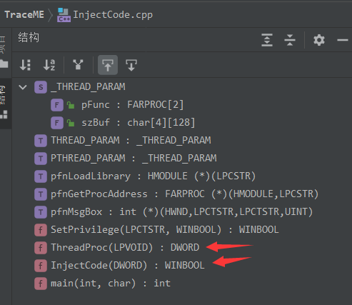]

- VirtualAllocEx部分与上文相同

- ```c++
  // 写入远程线程函数
  dwSize = (DWORD)InjectCode - (DWORD)ThreadProc;
  VOID* pThreadAddr = VirtualAllocEx(hProcess, NULL, dwSize, MEM_COMMIT, PAGE_READWRITE);
  ```


```c++
if (!WriteProcessMemory(xx, xx, xx, xx, xx)) // line 106
```

依照上次WriteProcessMemory的定义，本次应该对line97 部分刚定义的pThreadAddr做判断

- ```c++
  if (!WriteProcessMemory(hProcess, pThreadAddr, ThreadProc, dwSize, NULL))
  ```

  

```c++
HANDLE hThread = CreateRemoteThread(xx, xx, xx, (LPTHREAD_START_ROUTINE)xx, xx, xx, xx); // line 112
```

[CreateRemoteThread function (processthreadsapi.h) - Win32 apps | Microsoft Docs](https://docs.microsoft.com/en-us/windows/win32/api/processthreadsapi/nf-processthreadsapi-createremotethread)

- 创建一个在另一个进程的虚拟地址空间中运行的线程。使用[CreateRemoteThreadEx](https://docs.microsoft.com/en-us/windows/desktop/api/processthreadsapi/nf-processthreadsapi-createremotethreadex) 函数创建一个线程，该线程在另一个进程的虚拟地址空间中运行，并可选择指定扩展属性。

- ```c++
  HANDLE CreateRemoteThread(
    [in]  HANDLE                 hProcess,
    [in]  LPSECURITY_ATTRIBUTES  lpThreadAttributes,
    [in]  SIZE_T                 dwStackSize,
    [in]  LPTHREAD_START_ROUTINE lpStartAddress,
    [in]  LPVOID                 lpParameter,
    [in]  DWORD                  dwCreationFlags,
    [out] LPDWORD                lpThreadId
  );
  ```

**Parameters**

- `[in] hProcess`

要在其中创建线程的进程的句柄。句柄必须具有PROCESS_CREATE_THREAD、PROCESS_QUERY_INFORMATION、PROCESS_VM_OPERATION、PROCESS_VM_WRITE和PROCESS_VM_READ访问权限，并且在某些平台上没有这些权限可能会失败。有关更多信息，请参见进程安全性和访问权限。

- `[in] lpThreadAttributes`

指向SECURITY_ATTRIBUTES结构的指针，该结构指定新线程的安全描述符，并确定子进程是否可以继承返回的句柄。如果lpThreadAttributes为NULL，线程将获得一个默认的安全描述符，并且不能继承该句柄。线程的默认安全描述符中的访问控制列表(ACL)来自创建器的主令牌。

Windows XP:线程的默认安全描述符中的acl来自创建者的主要或模拟令牌。Windows XP with SP2和Windows Server 2003改变了这种行为。

- `[in] dwStackSize`

堆栈的初始大小，以字节为单位。系统将此值舍入到最近的页面。如果该参数为0(零)，则新线程使用可执行文件的默认大小。有关更多信息，请参见线程堆栈大小。

- `[in] lpStartAddress`

一个指针，指向将由线程执行的应用程序定义的LPTHREAD_START_ROUTINE类型的函数，它表示远程进程中线程的起始地址。该函数必须在远程进程中存在。要了解更多信息，请参见ThreadProc。

- `[in] lpParameter`

一个指向要传递给线程函数的变量的指针。

- `[in] dwCreationFlags`

控制线程创建的标志。

| Value                                 | Meaning                                                      |
| :------------------------------------ | :----------------------------------------------------------- |
| 0                                     | 线程在创建后立即运行。                                       |
| **CREATE_SUSPENDED**                  | 线程是在挂起状态下创建的，直到[ResumeThread](https://docs.microsoft.com/en-us/windows/desktop/api/processthreadsapi/nf-processthreadsapi-resumethread)函数被调用才会运行。 |
| **STACK_SIZE_PARAM_IS_A_RESERVATION** | 参数*dwStackSize*指定堆栈的初始预留大小。如果未指定此标志，则*dwStackSize*指定提交大小。 |

- `[out] lpThreadId`

一个指向接收线程标识符的变量的指针。

如果该参数为NULL，则不返回线程标识符。

此处应该填充为

```c++
HANDLE hThread = CreateRemoteThread(hProcess, NULL, dwSize, (LPTHREAD_START_ROUTINE)pThreadAddr, pParam, 0, NULL);
```

#### 5编写 main 函数

```c
int main(int argc, char** argv)
{
    if (argc != 2)
    {
        printf("\n USAGE: %s <PID>\n", argv[0]);
        return 1;
    }

    if (!SetPrivilege(SE_DEBUG_NAME, TRUE))
        return 1;

    DWORD dwPid = atoi(argv[1]);
    InjectCode(dwPid);

    return 0;
}
```

修改后的完整程序如下

```c++
#include <windows.h>
#include <stdio.h>

typedef struct _THREAD_PARAM
{
    FARPROC pFunc[2];     // LoadLibraryA(), GetProcAddress()
    char szBuf[4][128];       // "user32.dll", "MessageBoxA",  "text", "caption"
} THREAD_PARAM, * PTHREAD_PARAM;

typedef HMODULE(WINAPI* pfnLoadLibrary)(LPCSTR lpLibFileName);
typedef FARPROC(WINAPI* pfnGetProcAddress)(HMODULE hModule,LPCSTR lpProcName);
typedef int(WINAPI* pfnMsgBox)(HWND hWnd, LPCTSTR lpText, LPCTSTR lpCaption, UINT uType);

BOOL SetPrivilege(LPCTSTR lpszPrivilege, BOOL bEnablePrivilege)
{
    HANDLE hToken;
    if (!OpenProcessToken(GetCurrentProcess(), TOKEN_ADJUST_PRIVILEGES | TOKEN_QUERY, &hToken))
    {
        printf("OpenProcessToken error:%d\n", GetLastError());
        return FALSE;
    }

    LUID luid;
    if (!LookupPrivilegeValue(NULL, lpszPrivilege, &luid))
    {
        printf("LookupPrivilegeValue error:%d\n", GetLastError());
        return FALSE;
    }

    TOKEN_PRIVILEGES NewState;
    NewState.PrivilegeCount = 1;
    NewState.Privileges[0].Luid = luid;
    if (bEnablePrivilege)
        NewState.Privileges[0].Attributes = SE_PRIVILEGE_ENABLED;
    else
        NewState.Privileges[0].Attributes = 0;

    if (!AdjustTokenPrivileges(hToken, FALSE, &NewState, sizeof(TOKEN_PRIVILEGES), NULL, NULL))
    {
        printf("AdjustTokenPrivileges error:%d\n", GetLastError());
        return FALSE;
    }
    return TRUE;
}

DWORD WINAPI ThreadProc(LPVOID lParam)
{
    PTHREAD_PARAM pParam = (PTHREAD_PARAM)lParam;
    // "user32.dll"
    HMODULE hMod = ((pfnLoadLibrary)pParam->pFunc[0])(pParam->szBuf[0]);
    if (!hMod)
        return 1;

    // "MessageBoxA"
    pfnMsgBox pFunc = (pfnMsgBox)((pfnGetProcAddress)pParam->pFunc[1])(hMod, pParam->szBuf[1]);
    if (!pFunc)
        return 1;

    pFunc(NULL, pParam->szBuf[2], pParam->szBuf[3], MB_OK);
    return 0;
}

BOOL InjectCode(DWORD dwPID)
{
    HANDLE hProcess = OpenProcess(PROCESS_ALL_ACCESS, FALSE, dwPID);
    if (!hProcess)
    {
        printf("OpneProcess Error:%d\n", GetLastError());
        return FALSE;
    }

    // 写入线程函数所用的参数
    THREAD_PARAM param = { 0 };
    HMODULE hMod = GetModuleHandleA("Kernel32.dll");
    param.pFunc[0] = GetProcAddress(hMod, "LoadLibraryA");
    param.pFunc[1] = GetProcAddress(hMod, "GetProcAddress");
    strcpy_s(param.szBuf[0], "user32.dll");
    strcpy_s(param.szBuf[1], "MessageBoxA");
    strcpy_s(param.szBuf[2], "Hello, World");
    strcpy_s(param.szBuf[3], "AHU");

    DWORD dwSize = sizeof(THREAD_PARAM);
    VOID* pParam = VirtualAllocEx(hProcess, NULL, dwSize, MEM_COMMIT, PAGE_READWRITE);
    if (!pParam)
    {
        printf("VirtualAllocEx+ for parameter Error:%d\n", GetLastError());
        return FALSE;
    }

    if (!WriteProcessMemory(hProcess, pParam, &param, dwSize, NULL))
    {
        printf("WriteProcessMemory Error:%d\n", GetLastError());
        return FALSE;
    }

    // 写入远程线程函数
    dwSize = (DWORD)InjectCode - (DWORD)ThreadProc;
    VOID* pThreadAddr = VirtualAllocEx(hProcess, NULL, dwSize, MEM_COMMIT, PAGE_READWRITE);
    if (!pThreadAddr)
    {
        printf("VirtualAllocEx for Thread Error:%d\n", GetLastError());
        return FALSE;
    }

    if (!WriteProcessMemory(hProcess, pThreadAddr, ThreadProc, dwSize, NULL))
    {
        printf("WriteProcessMemory for Thread Error:%d\n", GetLastError());
        return FALSE;
    }

    HANDLE hThread = CreateRemoteThread(hProcess, NULL, dwSize, (LPTHREAD_START_ROUTINE)pThreadAddr, pParam, 0, NULL);
    if (!hThread)
    {
        printf("CreateRemoteThread Error:%d\n", GetLastError());
        return FALSE;
    }

    WaitForSingleObject(hThread, INFINITE);
    CloseHandle(hThread);
    CloseHandle(hProcess);
    return TRUE;
}


int main(int argc, char** argv)
{
    if (argc != 2)
    {
        printf("\n USAGE: %s <PID>\n", argv[0]);
        return 1;
    }

    if (!SetPrivilege(SE_DEBUG_NAME, TRUE))
        return 1;

    DWORD dwPid = atoi(argv[1]);
    InjectCode(dwPid);

    return 0;
}
```

此时编译如果报错C2664，就将字符集修改为使用多字节字符集

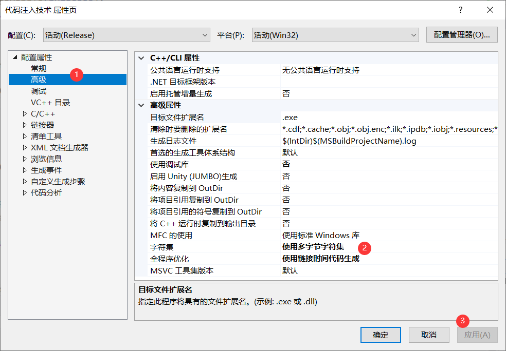


注意：生成可执行文件和程序执行的环境不是同一个操作系统，可能会出现无法找到 msvcrtXX.dll 的情况，此时在项目属性中修改设置，将运行库改为“多线程”或者“多线程调试”，如图 4-6 所示。

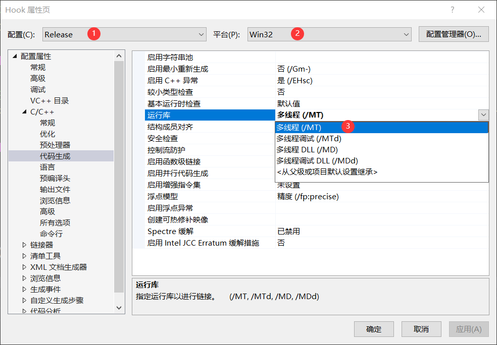


同时也应注意要使用 X86的32位编译。如果使用x64则会直接导致打开的程序关闭。

#### 6观察结果

将解决方案设置为 Release 模式，编译生成可执行文件，然后在 Windows7系统中，打开系统自带的计算器程序，也可以使用任意一个32位程序，如果不知道可以打开C D盘，找到C:\Program Files (x86)\或者D盘的该位置文件夹，不出意外的话都是32位程序，这里以我们编程的起源，万码始祖Dev C++为例。、


通过任务管理器查看计算器程序的PID， 8728。将其作为生成可执行文件的参数。打开命令提示符，以命令形式执行程序，观察注入效果。

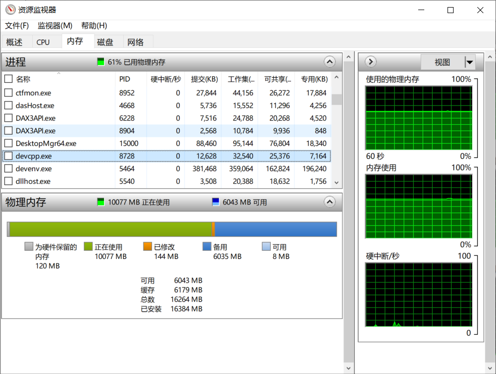


运行效果是弹出一个非模态对话框

```bash
./代码注入技术.exe 8728
```


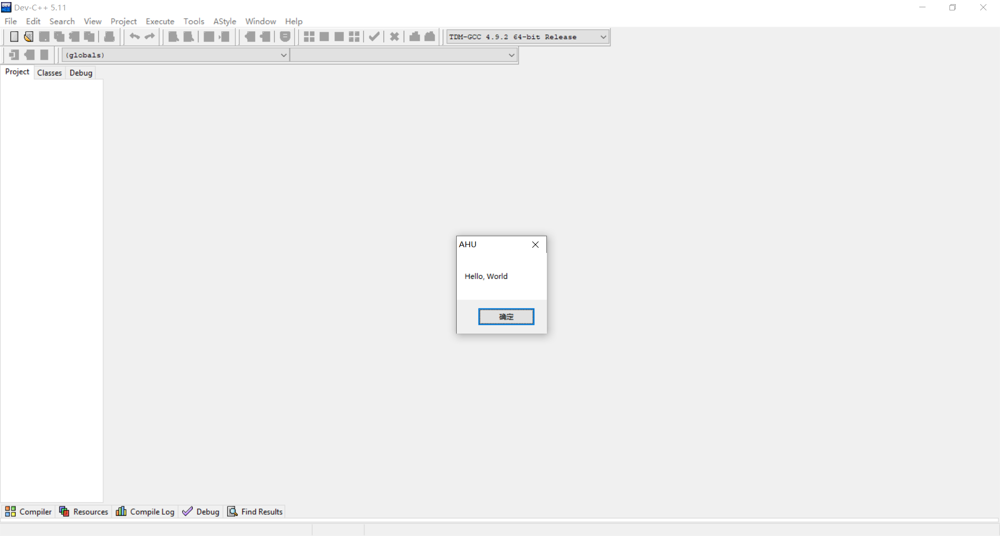
## DLL 劫持

### 1构建劫持所用的 DLL

打开 VS，创建空的 DLL 项目，命名为 lpk，然后添加源程序 lpk.cpp附件已提供。 

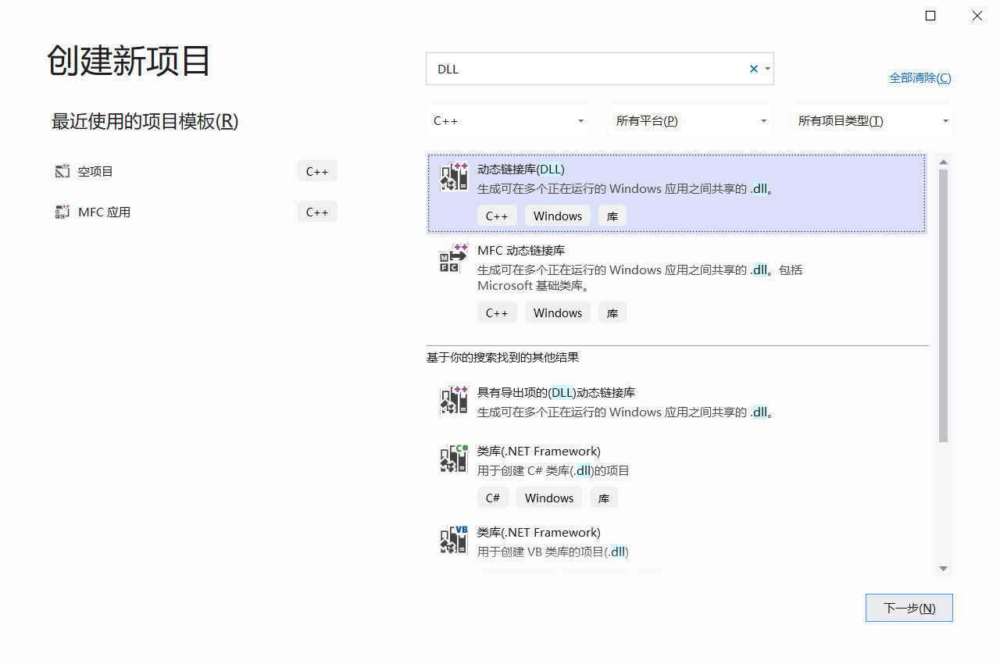


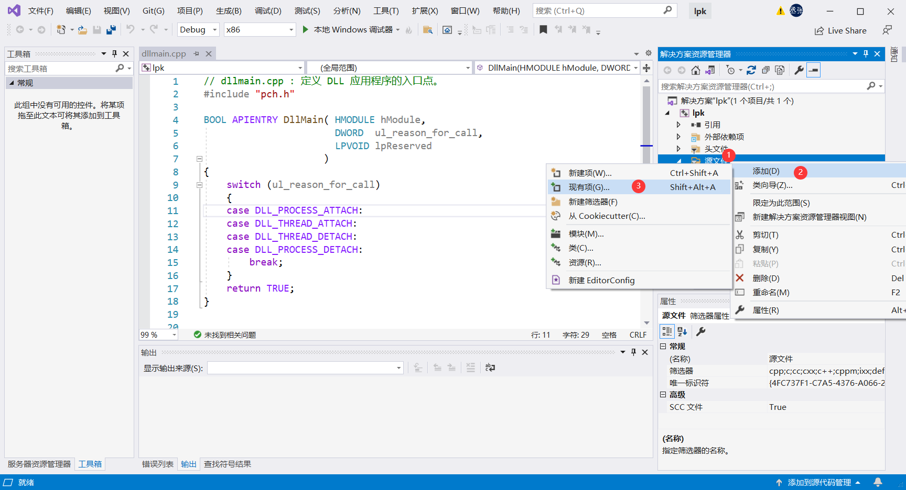


### 2转发原始 DLL 的输出函数填充完整代码

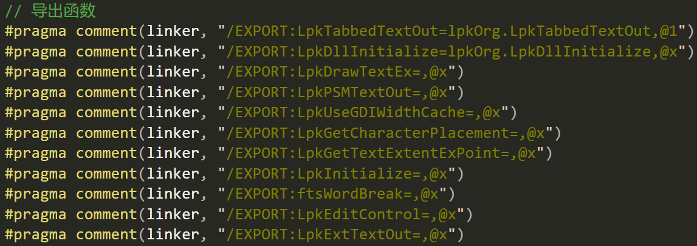


- 程序启动、创建进程时会按照特定的顺序，在指定目录中寻找所要加 载DLL，如果创建同名的劫持DLL，并将其置于真实DLL所在目录之 前的搜索目录中，那么进程将先加载劫持DLL，而不会加载真实DLL。

- 劫持DLL要输出和真实DLL**相同的函数**，并且将每个函数的调用**转发到真实DLL**，保证原有功能正常。除少数系统核心DLL之外的其他DLL，特别是第三方DLL，均可使用 这种方式实现劫持	

根据前一两个示例，我们可以补写出所有的转发函数，按理说我们应该一个一个补写，但我们既然已经到研究软件安全的境界了，相比使用正则表达式实现一些简单的替换还是可以的。如图，选中需要进行匹配的范围，避免脱靶（错误匹配其他代码）。

```bash
:(.*?)=
```

```bash
:$1 = lpkOrg.$1
```


再将后面`@x`改成对应的`@数字`。

这个数字需要我们慢慢查找，先在主机上找打真正的lpk.dll，位于`C:\WINDOWS\system32`文件夹下。

使用Stu_PE打开

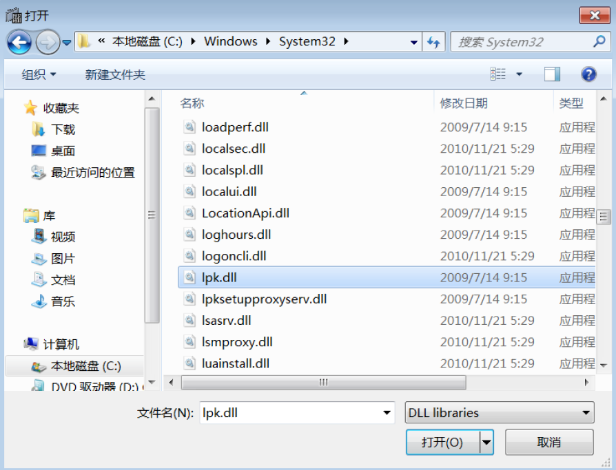


便可以查看转发函数编号

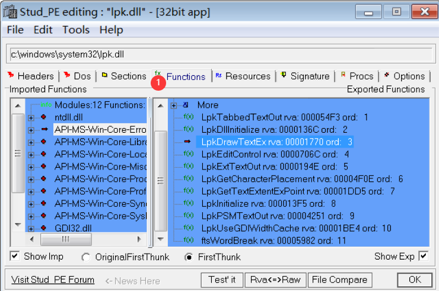


即可补全此部分代码

```java
// 导出函数
#pragma comment(linker, "/EXPORT:LpkTabbedTextOut=lpkOrg.LpkTabbedTextOut,@1")
#pragma comment(linker, "/EXPORT:LpkDllInitialize=lpkOrg.LpkDllInitialize,@2")
#pragma comment(linker, "/EXPORT:LpkDrawTextEx=lpkOrg.LpkDrawTextEx,@3")
#pragma comment(linker, "/EXPORT:LpkPSMTextOut=lpkOrg.LpkPSMTextOut,@9")
#pragma comment(linker, "/EXPORT:LpkUseGDIWidthCache=lpkOrg.LpkUseGDIWidthCache,@10")
#pragma comment(linker, "/EXPORT:LpkGetCharacterPlacement=lpkOrg.LpkGetCharacterPlacement,@6")
#pragma comment(linker, "/EXPORT:LpkGetTextExtentExPoint=lpkOrg.LpkGetTextExtentExPoint,@7")
#pragma comment(linker, "/EXPORT:LpkInitialize=lpkOrg.LpkInitialize,@8")
#pragma comment(linker, "/EXPORT:ftsWordBreak=lpkOrg.ftsWordBreak,@11")
#pragma comment(linker, "/EXPORT:LpkEditControl=lpkOrg.LpkEditControl,@4")
#pragma comment(linker, "/EXPORT:LpkExtTextOut=lpkOrg.LpkExtTextOut,@5")
```


### 3添加额外功能

在 DllMain 中创建线程，线程函数中弹出对话框提示。

```cpp
DWORD WINAPI ThreadWorking(LPVOID lpParameters)
{
	MessageBox(NULL, TEXT("Hello World"), TEXT("Pratice"), MB_OK);
	return 0;
}

BOOL WINAPI DllMain(HMODULE hModule, DWORD dwReason, PVOID pvReserved)
{
	if (dwReason == DLL_PROCESS_ATTACH)
	{
		CreateThread(NULL, 0, ThreadWorking, NULL, 0, NULL);
		DisableThreadLibraryCalls(hModule);
	}
	return TRUE;
}
```


至此完成的代码生成

```c++
#include <Windows.h>
#include "pch.h"
#include <stdio.h>

// 导出函数
#pragma comment(linker, "/EXPORT:LpkTabbedTextOut=lpkOrg.LpkTabbedTextOut,@1")
#pragma comment(linker, "/EXPORT:LpkDllInitialize=lpkOrg.LpkDllInitialize,@2")
#pragma comment(linker, "/EXPORT:LpkDrawTextEx=lpkOrg.LpkDrawTextEx,@3")
#pragma comment(linker, "/EXPORT:LpkPSMTextOut=lpkOrg.LpkPSMTextOut,@9")
#pragma comment(linker, "/EXPORT:LpkUseGDIWidthCache=lpkOrg.LpkUseGDIWidthCache,@10")
#pragma comment(linker, "/EXPORT:LpkGetCharacterPlacement=lpkOrg.LpkGetCharacterPlacement,@6")
#pragma comment(linker, "/EXPORT:LpkGetTextExtentExPoint=lpkOrg.LpkGetTextExtentExPoint,@7")
#pragma comment(linker, "/EXPORT:LpkInitialize=lpkOrg.LpkInitialize,@8")
#pragma comment(linker, "/EXPORT:ftsWordBreak=lpkOrg.ftsWordBreak,@11")
#pragma comment(linker, "/EXPORT:LpkEditControl=lpkOrg.LpkEditControl,@4")
#pragma comment(linker, "/EXPORT:LpkExtTextOut=lpkOrg.LpkExtTextOut,@5")


DWORD WINAPI ThreadWorking(LPVOID lpParameters)
{
	MessageBox(NULL, TEXT("Hello World"), TEXT("Pratice"), MB_OK);
	return 0;
}

BOOL WINAPI DllMain(HMODULE hModule, DWORD dwReason, PVOID pvReserved)
{
	if (dwReason == DLL_PROCESS_ATTACH)
	{
		CreateThread(NULL, 0, ThreadWorking, NULL, 0, NULL);
		DisableThreadLibraryCalls(hModule);
	}
	return TRUE;
}
```

### 4观察结果

依旧是release，X86。译生成可执行文件，在桌面创建新的文件夹 lpkDll，然后将生成的lpk.dll 拷贝到该目录。之后，将 Windows7 系统目录中的 lpk.dll 拷贝到该文件夹，并重命名为 lpkOrg.dll，同时拷贝系统中的记事本 notepad.exe 到该目录。


<kbd>win</kbd> + <kbd>R</kbd>打开在注册表

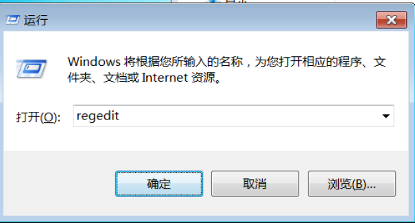


在 HKEY_LOCAL_MACHINE\SYSTEM\CurrentControlSet\Control\Session Manager\ExcludeFromKnownDlls 排除列表中添加 lpk.dll，重启系统。

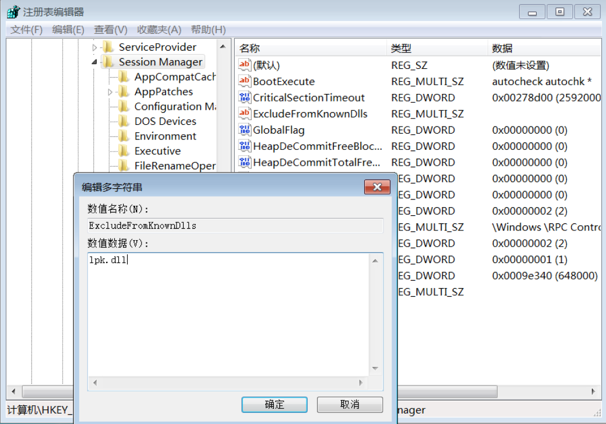


系统重启后，进入桌面 lpkDll 文件夹，打开 notepad.exe，观察运行结果。

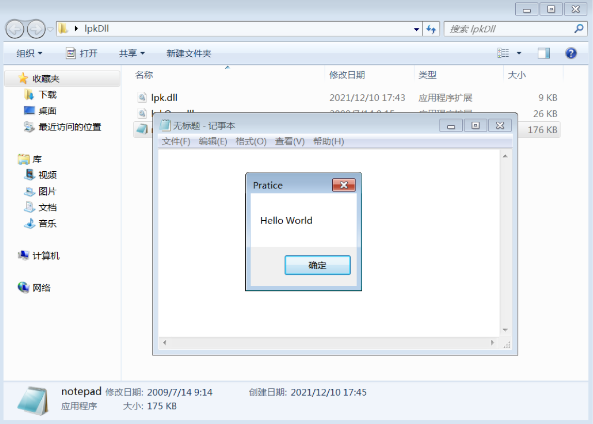
