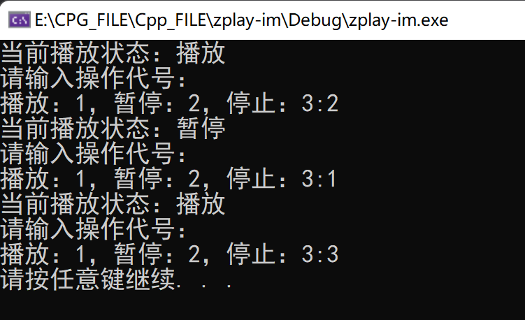

#  动态链接库的使用

1. 实验说明

Libzplay 是遵循 GPL 协议的开源库，它集成了 mp3、flac、ac3、aac、wav等多种音频格式的解码器和编码器，提供了面向 C/C++、C#、Delphi 等多种编程语言的接口，仅需 3 行代码（创建播放资源，打开文件，开始播放）便可实现音乐播放功能。

2. 实验目的

本实验通过 Libzplay 提供的 C 语言接口，实现简单的音乐播放器，以此学习 DLL 的隐式和显式加载方式。

3. 实验原理

课程第 2 讲基础知识

4. 实验环境

Windows 桌面系统，Visual Studio 6.0 及以上版本，libzplay SDK

5. 实验内容

- - 隐式链接

- - 显示链接

## 练习1 隐式链接 DLL

#### **1**、基础步骤

1. 创建控制台应用程序项目

打开 VS，选择空项目模板创建控制台应用程序，命名为 zplay-im，然后向新建项目中添加源程序文件` impilicit.cpp`，编写 main 函数。 

2. 拷贝头文件和库文件

将 libzplay 库中的头文件 `libzplay.h` 和库文件 `libzplay.lib` 到 zplay-im 项目所在的目录。

3. 编写播放程序

使用 libzplay C 语言接口播放音乐文件，至少需要依次调用如下 3 个函数：

```cpp
ZPLAY_HANDLE player = zplay_CreateZPlay();
zplay_OpenFile(player, "homeland.mp3", sfAutodetect);
zplay_Play(player);
```

完整的程序如下

```cpp
#include <stdio.h>
#include <stdlib.h>
#include "libzplay.h"
// 导入lib,否则报错 LNK2019 无法解析的外部符号
#pragma comment(lib,"libzplay")

int main()
{
	ZPLAY_HANDLE player = zplay_CreateZPlay(); // 创建实例，libzplay申请各类资源
	zplay_OpenFile(player, "homeland.mp3", sfAutodetect); //打开音乐文件
	zplay_Play(player); // 播放音乐文件
	system("pause");
	return 0;
}
```

4. 编译程序

编译成功后，将 libzplay 库中的 DLL 文件 `libzplay.dll` 拷贝到编译生成的可执行文件所在目录，或者将该 DLL 文件放入 DLL 加载过程要搜索的目录。歌曲文件以`impilicit.cpp`位置为原点，相对目录寻址。

5. 运行程序仅编写上述代码，程序运行后将立即退出，应如何添加代码使其正常播放音乐？

   - 可以在底部加入一条scanf语句，getchar（）语句等，使其处于一直等待输入的状态，程序自然也不会停止；
   - 使用while（true）也可以实现程序一直进行；
   - `system("pause");`也可以使得程序暂停。

#### **2、拓展设计**

1. 根据 libzplay 提供的数据类型定义和函数接口原型，设计较为完整的音乐播放器，实现播放过程的暂停、播放、停止等控制功能。

2. 播放完毕后，需要做清理工作：

- - zplay_OpenFile 和 zplay_Close 是相对应的 2 个函数，打开的音乐文件不再播放时需要关闭；
  - zplay_CreateZPlay 和 zplay_DestroyZPlay 是相对应的 2 个函数，libzplay 申请的各类资源，不再需要时需要销毁。

#### 附带播放、暂停、停止的完整程序

```cpp
#include <stdio.h>
#include <stdlib.h>
#include "libzplay.h"
// 导入lib,否则报错 LNK2019 无法解析的外部符号
#pragma comment(lib,"libzplay")


void prompt(int statevalue)
{
	printf("当前播放状态：");
	switch (statevalue)
	{
	case 1:
		printf("播放");
		break;
	case 2:
		printf("暂停");
		break;
	case 3:
		printf("停止");
		break;
	default:
		break;
	}
	printf("\n请输入操作代号：\n播放：1，暂停：2，停止：3:");
}

int main()
{
	ZPLAY_HANDLE player = zplay_CreateZPlay(); // 创建实例，libzplay申请各类资源
	zplay_OpenFile(player, "homeland.mp3", sfAutodetect); //打开音乐文件
	zplay_Play(player); // 播放音乐文件

	int statevalue = 1; //定义音乐播放状态，初始时播放
	prompt(1);
	while (scanf_s("%d",&statevalue))
	{
		switch (statevalue)
		{
		case 1:
			zplay_Play(player);
			prompt(1);
			break;
		case 2:
			zplay_Pause(player); // 暂停音乐播放
			prompt(2);
			break;
		case 3:
			zplay_Stop(player); // 停止音乐播放
			goto outexit; // 输入停止命令后跳到关闭文件、资源部分
			prompt(3);
			break;
		default:
			break;
		}
	}
	outexit:
	zplay_Close(player); //关闭不再播放的音乐文件
	zplay_DestroyZPlay(player);//销毁libzplay申请的各类资源

	system("pause");
	return 0;
}
```

运行效果如图所示，此时无声胜有声。相信大家已经听到大弦嘈嘈如急雨，小弦切切如私语。嘈嘈切切错杂弹，大珠小珠落玉盘。间关莺语花底滑，幽咽泉流冰下难。冰泉冷涩弦凝绝，凝绝不通声暂歇。别有幽愁暗恨生，此时无声胜有声。银瓶乍破水浆迸，铁骑突出刀枪鸣。曲终收拨当心画，四弦一声如裂帛。



3. libzplay 部分枚举、结构体和宏定义

```cpp
#define ZPLAY_HANDLE char*
enum TStreamFormat
{
    sfUnknown = 0,
    sfMp3 = 1,
    sfOgg = 2,
    sfWav = 3,
    sfPCM = 4,
    sfFLAC = 5,
    sfFLACOgg = 6,
    sfAC3 = 7,
    sfAacADTS = 8,
    sfWaveIn = 9,
    sfAutodetect = 1000
};

typedef struct 
{
    int fPlay;
    int fPause;
    int fEcho;
    int fEqualizer;
    int fVocalCut;
    int fSideCut;
    int fChannelMix;
    int fSlideVolume;
    int nLoop;
    int fReverse;
    int nSongIndex;
    int nSongsInQueue;
} TStreamStatus;

typedef struct 
{
    unsigned int hour;
    unsigned int minute;
    unsigned int second;
    unsigned int millisecond;
} TStreamHMSTime;

typedef struct 
{
    unsigned int sec;
    unsigned int ms;
    unsigned int samples;
    TStreamHMSTime hms;
} TStreamTime;
```

4. libzplay 提供的部分 C 语言接口声明

```cpp
ZPLAY_HANDLE __stdcall zplay_CreateZPlay();
int __stdcall zplay_OpenFile(ZPLAY_HANDLE handle, const char* sFileName, 
TStreamFormat nFormat);
int __stdcall zplay_Play(ZPLAY_HANDLE handle);
int __stdcall zplay_Pause(ZPLAY_HANDLE handle);
int __stdcall zplay_Stop(ZPLAY_HANDLE handle);
void __stdcall zplay_GetPosition(ZPLAY_HANDLE handle, TStreamTime* pTime);
void __stdcall zplay_GetStatus(ZPLAY_HANDLE handle, TStreamStatus* pStatus);
int __stdcall zplay_Close(ZPLAY_HANDLE handle);
int __stdcall zplay_DestroyZPlay(ZPLAY_HANDLE handle);
```

#### **3、思考与总结**

- 为什么最开始程序运行后便立即退出？

有可能是没有使进程阻塞的语句。在`return 0`前加上`system("pause");`语句可以使得程序暂停

### **练习** **2** **显式链接** **DLL**

**1、基础步骤** 

1. 创建控制台应用程序项目

打开 VS，选择空项目模板创建控制台应用程序，命名为 zplay-ex，然后向新建项目中添加源程序文件 `expilicit.cpp`，编写 main 函数。 

2. 编写播放程序

- **定义三个函数指针**

zplay_Play 的函数指针：`typedef int(_stdcall* pfnPlay)(ZPLAY_HANDLE handle);`

zplay_CreateZPlay和zplay_OpenFile的函数指针：

```cpp
typedef ZPLAY_HANDLE (_stdcall* pfnCreateZPlay)();
typedef int (_stdcall* pfnOpenFile)(ZPLAY_HANDLE handle, const char* sFileName, TStreamFormat nFormat);
```

-  **动态加载** **libzplay.dll** **到应用程序的进程空间中**

```cpp
HMODULE hModule = LoadLibrary("libzplay.dll");
```

- **动态获取三个函数的入口地址**

```cpp
pfnCreateZPlay CreateZPlay = (pfnCreateZPlay)*GetProcAddress*(hModule, "zplay_CreateZPlay");
pfnOpenFile OpenFile = (pfnOpenFile)GetProcAddress(hModule, "zplay_OpenFile");
pfnPlay Play = (pfnPlay)GetProcAddress(hModule, "zplay_Play");
```

-  **依次调用获取的三个函数**

```cpp
ZPLAY_HANDLE player = CreateZPlay();
OpenFile(player, "homeland.mp3", sfAutodetect);
Play(player);
```

-  **播放完毕，释放加载的** **libzplay.dll**

**FreeLibrary**(hModule);

完整程序

```cpp
#include <stdio.h>
#include <stdlib.h>
#include <windows.h>
#include "libzplay.h"
// 导入lib,否则报错 LNK2019 无法解析的外部符号


typedef ZPLAY_HANDLE (_stdcall* pfnCreateZPlay)();
typedef int (_stdcall* pfnOpenFile)(ZPLAY_HANDLE handle, const char* sFileName, TStreamFormat nFormat);
typedef int(_stdcall* pfnPlay)(ZPLAY_HANDLE handle);


int main()
{
	HMODULE hModule = LoadLibrary("libzplay.dll");

	pfnCreateZPlay CreateZPlay = (pfnCreateZPlay)GetProcAddress(hModule, "zplay_CreateZPlay");
	pfnOpenFile OpenFile = (pfnOpenFile)GetProcAddress(hModule, "zplay_OpenFile");
	pfnPlay Play = (pfnPlay)GetProcAddress(hModule, "zplay_Play");

	ZPLAY_HANDLE player = CreateZPlay(); 
	OpenFile(player, "homeland.mp3", sfAutodetect); 
	Play(player); 

	system("pause");
	return 0;
}
```

3. 编译程序

编译成功后，将 libzplay 库中的 DLL 文件 libzplay.dll 拷贝到编译生成的可执行文件所在目录，或者将该 DLL 文件放入 DLL 加载过程要搜索的目录。

4. 运行程序

**2、思考与总结**

1. 比较显式链接和隐式链接的区别; 
   - 显式链接只用到了dll，但需要自己重写函数入口
   - 隐式链接通过`.lib文件`和`.h文件`（dll允许应用程序导出的所有函数的符号名和可选的标识号，但无代码实现）加载dll，能够直接使用
2. 试分析二者所适用的场景。
   - 我们一般不会用显示链接，想秀的除外。显示链接不需要用到lib库，全部独立自主进行dll调用，在执行过程中随时可以加载或卸载DLL文件，这是依赖于lib的隐式链接做不到的，因此显式链接具有更好的灵活性，同时也能更有效的使用内存，这在编写大型项目程序时大有作为。
   - 隐式链接则可以在我们写小代码时发挥作用，轻便快捷，非常适合自己使用。