# 实验一：注册表操作

#### （1）强制隐藏.exe文件的扩展名

1. 注册表项：`HKEY_CLASS_ROOT\exefile`，

2. 新建字符串值：取名为`NeverShowExt`。

   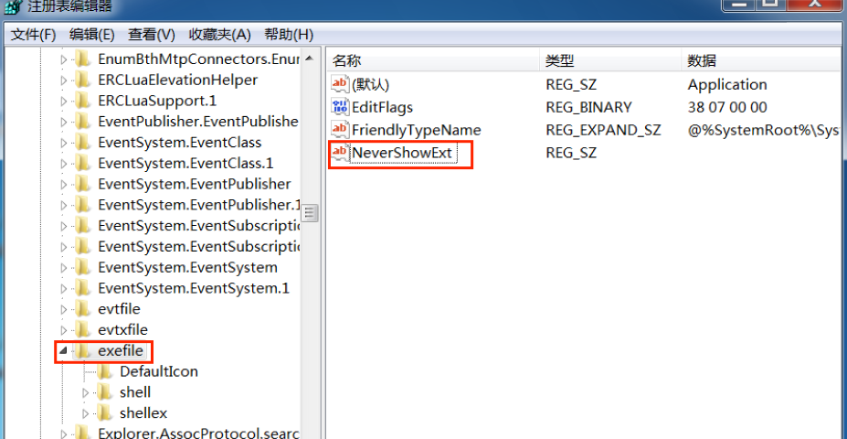

3. 重启计算机

可见`exe`后缀确实没有显示，而其他的`dll`能正常显示。

​	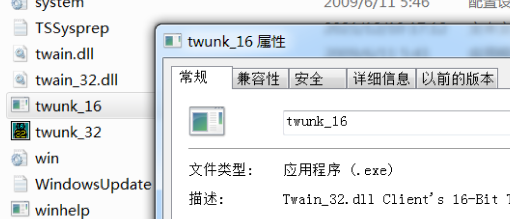

#### （2）隐藏“文件夹选项”子菜单项

0. 原本是可以有`文件夹选项`子菜单的

   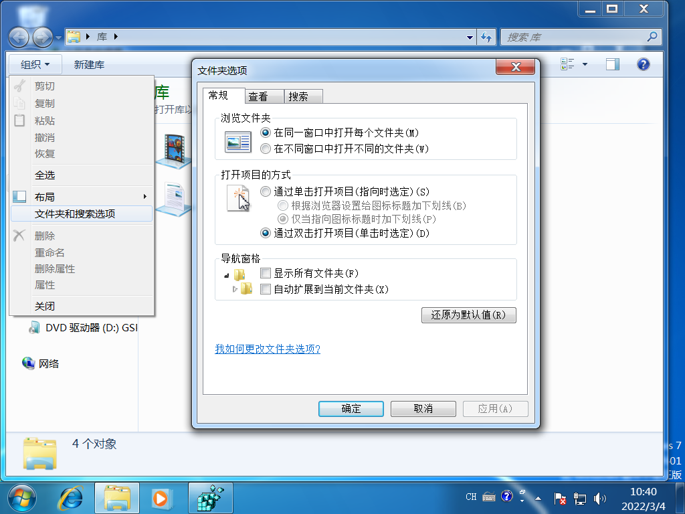

1. 注册表项`\HKEY_CURRENT_USER\Software\Microsoft\Windows\CurrentVersion\Policies\Explorer`

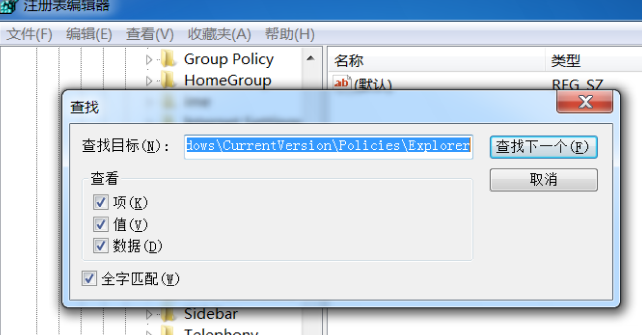

2. 新建DWORD值，取名`NoFolderOptions`, 设置为1

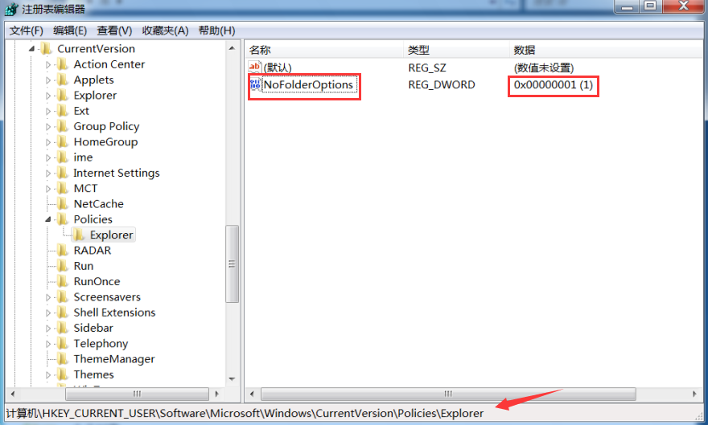

3. 重启计算机

发现已被禁用

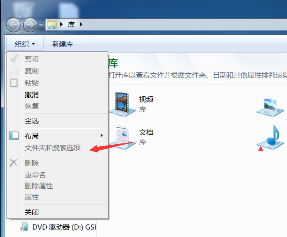

#### （3）利用注册表实现记事本程序自启动

1. 注册表项：`HKEY_CURRENT_USER\Software\Microsoft\Windows\CurrentVersion\Run `

2. 新建字符串值notepad，数值数据：`C:\windows\system32\notepad.exe `(notepad.exe的路径)

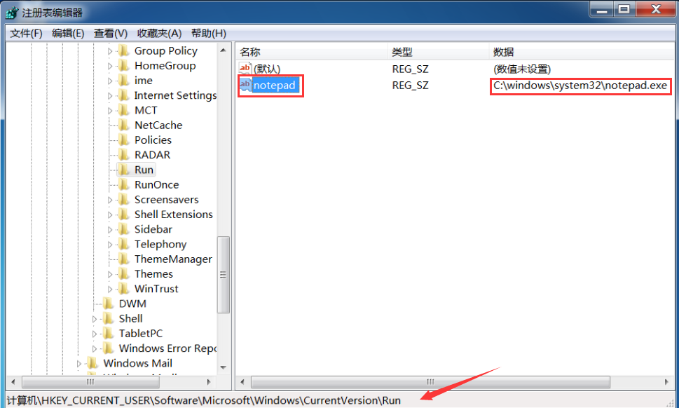

3. 重启计算机

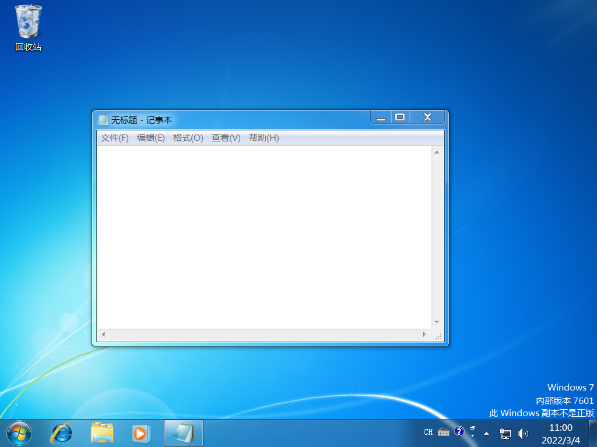

#### （4）利用注册表改变文本文件所关联的程序

1. 注册表项：`HKEY_CLASSES_ROOT\txtfile`

 或`HKEY_LOCAL_MACHINE\Software\command\txtfile`子键，依次展开`shell\open\command`

2、修改键值为：`C:\windows\system32\osk.exe `(osk.exe的路径)

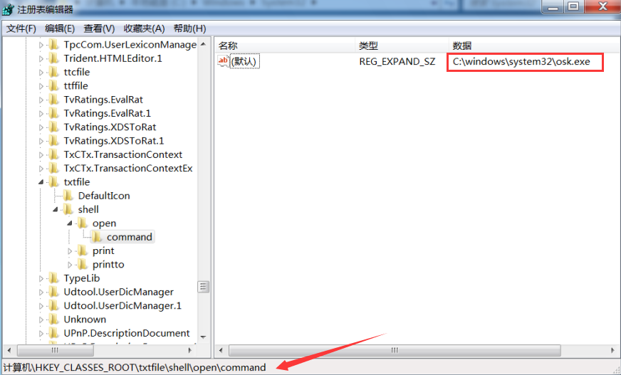

当我们点击一个txt文件时，就被打开osk.exe

#### （5）利用注册表禁止记事本程序运行

1、注册表项：`HKEY_Local_Machine\Software\microsoft\windows NT\CurrentVersion\Image file execution options`路径下新建一项:`notepad.exe`

2、新建字符串值，取名`Debugger`，数值数据随变选择。

此时再点击文档就会（需将第四步的设置解除）

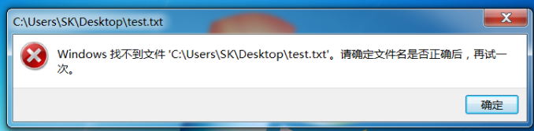

#### （6）注册表失效

1、注册表项：`HKEY_CURRENT_USER\Software\Microsoft\Windows\Current Version\Policies\System`

2、新建选择“DWORD”值，取名为`DisableRegistryTools`，设置为1

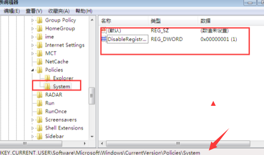

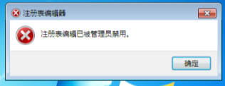

## 以上过程中注册表的操作，对计算机病毒起到什么样的作用？

### 计算机病毒简介

#### 计算机病毒的特点

- 传染性
- 潜伏性
- 隐藏性
- 破坏性
- 不可预见性

#### 计算机病毒的组成

组成可行的计算机病毒必须包含一个搜索例程，该例程可以找到值得感染的新文件或新磁盘。其次，每个计算机病毒都必须包含一个例程，将自身复制到搜索例程所定位的程序中。病毒的三个主要部分是：

> **Infection mechanism**感染机制
> 也称为感染媒介，这是病毒传播或传播的方式。病毒通常具有搜索例程，该例程查找新文件或新磁盘以进行感染。

> **Trigger**扳机
> 也称为逻辑炸弹，这是编译后的版本，当病毒运行时，它可以在可执行文件中的任何时候被激活，它决定了恶意“有效载荷”被激活或传递的事件或条件，例如特定日期，特定时间，特定存在的另一个程序，超过某些限制的磁盘容量，或打开特定文件的双击。

> **Payload**载体
> “载体”是执行病毒恶意目的的实际主体或数据。载体活动可能很明显（例如，因为它导致系统变慢或“冻结”），因为大多数时候“有效负载”本身是有害的活动，或者有时是非破坏性但具有分布性的，这被称为病毒骗局。

#### 计算机病毒的生命周期

计算机病毒的生命周期，用生物学的类比来描述。这个生命周期可以分为四个阶段：

> **Dormant phase**休眠期
> 在此阶段病毒程序处于空闲状态。病毒程序已经设法访问了目标用户的计算机或软件，但在这个阶段，病毒并没有采取任何行动。病毒最终将由“触发器”激活，该触发器说明哪个事件将执行病毒。不是所有的病毒都有这个阶段。

> **Propagation phase**传播阶段
> 病毒开始传播，它正在自我繁殖和复制。该病毒将自身的副本放置到其他程序或磁盘上的某些系统区域中。副本可能与传播版本不同；病毒经常“变形”或变化以逃避 IT 专业人员和防病毒软件的检测。现在，每个受感染的程序都将包含一个病毒克隆，该克隆本身将进入传播阶段。

> **Triggering phase**触发阶段
> 休眠病毒在被激活时会进入此阶段，现在将执行其预期的功能。触发阶段可能由多种系统事件引起，包括该病毒副本复制自身的次数的计数。触发可能发生在载体被删除或经过一段时间后，以减少怀疑。

> **Execution phase**执行阶段
> 这是病毒的实际工作，“有效载荷”将被释放。它可能具有破坏性，例如删除磁盘上的文件、使系统崩溃或损坏文件，或者相对无害，弹出广告。

### 注册表简介

操作系统和其应用程序中的一个重要的层次型数据库，用于存储系统和应用程序的设置信息。注册表由键（key，或称“项”）、子键（subkey，子项）和值项（value）构成。一个键就是树状数据结构中的一个节点，而子键就是这个节点的子节点，子键也是键。一个值项则是一个键的一条属性，由名称（name）、数据类型（datatype）以及数据（data）组成。一个键可以有一个或多个值，每个值的名称各不相同，如果一个值的名称为空，则该值为该键的默认值。

#### 注册表的分支结构

注册表有五个一级分支，下面是这五个分支的名称及作用：

|        名称         |                           作用                            |
| :-----------------: | :-------------------------------------------------------: |
|  HKEY_CLASSES_ROOT  | 存储Windows可识别的文件类型的详细列表，以及相关联的程序。 |
|  HKEY_CURRENT_USER  |                 存储当前用户设置的信息。                  |
| HKEY_LOCAL_MACHINE  |          包括安装在计算机上的硬件和软件的信息。           |
|     HKEY_USERS      |               包含使用计算机的用户的信息。                |
| HKEY_CURRENT_CONFIG |          这个分支包含计算机当前的硬件配置信息。           |

### 具体作用

（1）强制隐藏.exe文件的扩展名：

使得病毒更具隐藏性，后缀名不显示让人难以察觉，很难直观找到这样的文件手动删除。但当与其他显示出拓展名的文件一起出现时，又可能因为与其他文件格格不入而容易被怀疑。

（2）隐藏“文件夹选项”子菜单项：

使用户无法点击文件夹选项，查看具体操作。而文件夹选项中恰好有打开文件后缀和隐藏文件。方便病毒隐藏。

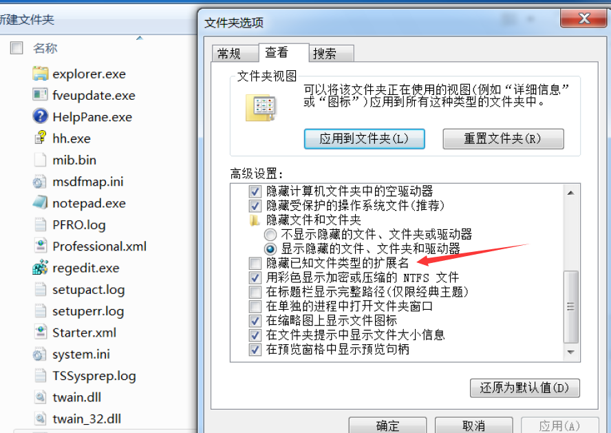

（3）利用注册表实现记事本程序自启动

可以实现病毒程序的自启动，当我们打开电脑时，病毒就会自动启动，进入触发阶段

（4）利用注册表改变文本文件所关联的程序：

利用注册表改变文件关联程序，把关联程序设置为病毒，当用户在进行常规操作时就会触发病毒程序。

（5）利用注册表禁止记事本程序运行

病毒程序可以使用此方式组织杀毒软件运行。当发现病毒程序时，也可以修改注册表从而禁止这个病毒程序运行。

（6）注册表失效

有些病毒是通过在注册表来实现运行，有些可以利用注册表来自主运行，注册表失效可以使很多病毒无法执行。杀毒软件在查杀病毒时也会借助于注册表，失效可以继续隐藏。

## 利用注册表，完成以下操作。

#### (1) 设置QQ开机自启动

在安装时须确保qq自己不会自启，排除干扰。

根据第三步的步骤，直接修改数据为`C:\Program Files\Tencent\QQ\Bin\QQ.exe`（qq的启动路径）

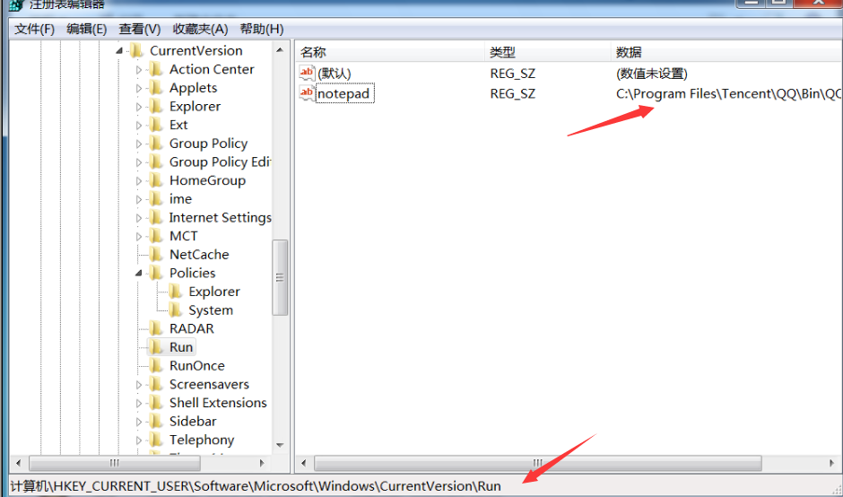

重启后QQ成功自启

#### (2) 可否能否禁用QQ.exe的运行?

根据第5步操作

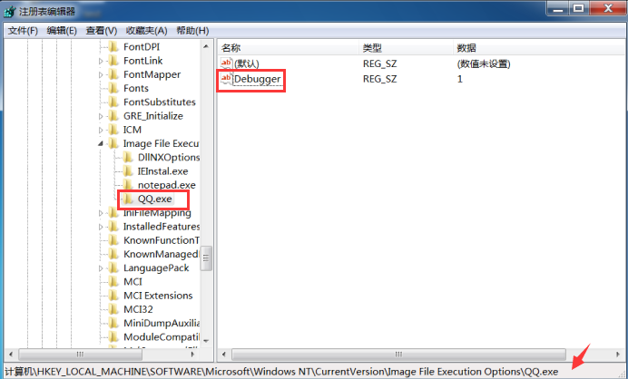

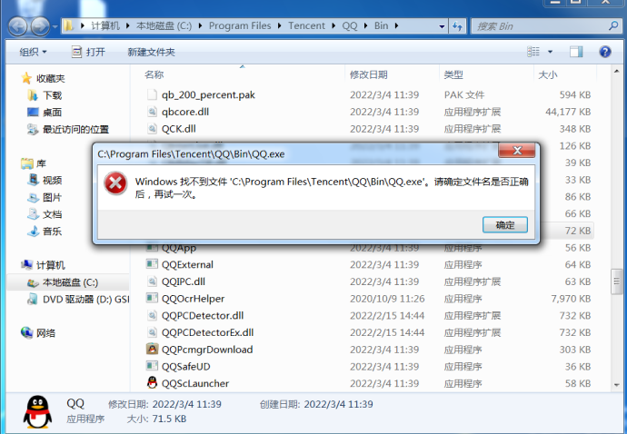