# 病毒行为监控

## 搭建病毒分析实验室

## 虚拟机设置（自己的电脑上必须设置）

### （1） 在真实机中

设置受限文件夹

下面示例为windows 2003通过组策略编辑器设置受限文件夹

1. 运行`gpedit.msc`

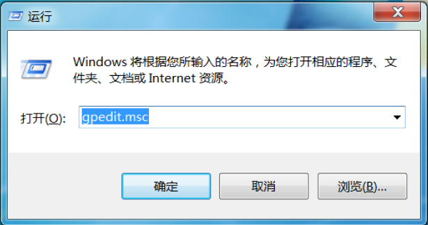

2. 依次选择`“计算机配置”-->“windows设置”-->“安全设置”-->“软件限制策略”-->“其他规则”`。若没有“其他规则”，如下操作：

	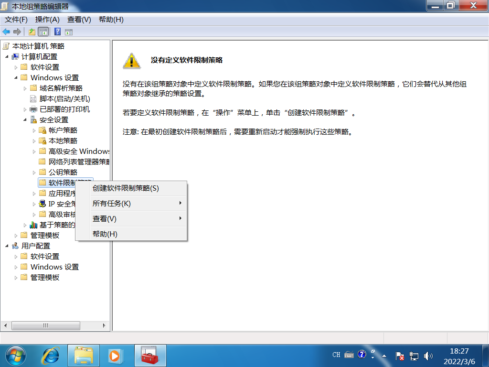

3. 否则：在`“其他规则”`处，单击鼠标右键，选择`“新路径规则”`，做如下操作

   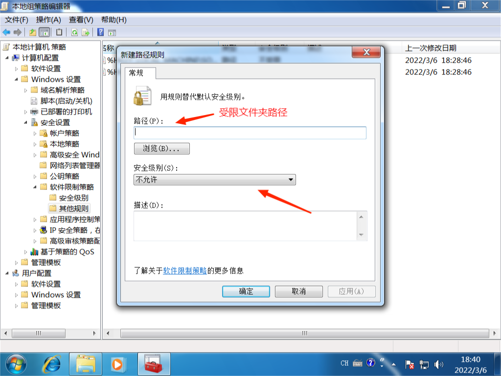

4. 重启计算机

### （2） 设置共享文件夹：

a) 虚拟机中依次选择：虚拟机-设置-选项-共享文件夹

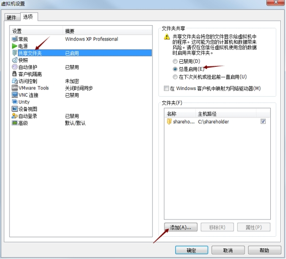 

b) 在虚拟机中查看共享文件夹：

“我的电脑”-“单击鼠标右键”-“映射网络驱动器”

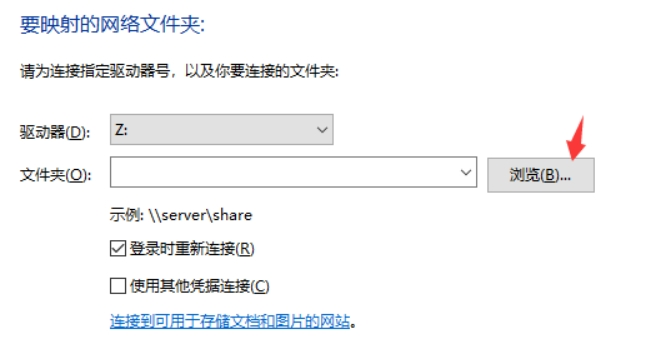 

 

使用特定版本（带Service Pack 1）的win7可以安装VMtools，一样能够实现文件的复制

如`Windows 7 Professional with Service Pack 1 (x64) - DVD (Chinese-Simplified)  cn_windows_7_professional_with_sp1_x64_dvd_u_677031.iso `

https://msdn.itellyou.cn/

```bash
ed2k://|file|cn_windows_7_professional_with_sp1_x64_dvd_u_677031.iso|3420557312|430BEDC0F22FA18001F717F7AF08C9D5|/
```

### （3） 虚拟机断网：

1. `“本地连接”`—禁用

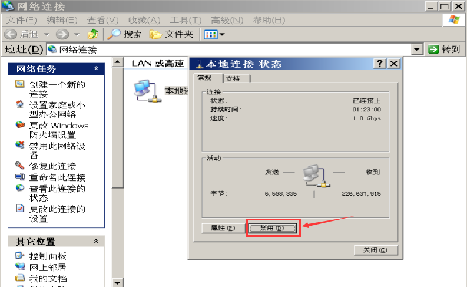

2) 将虚拟机的网络连接设置为桥接模式

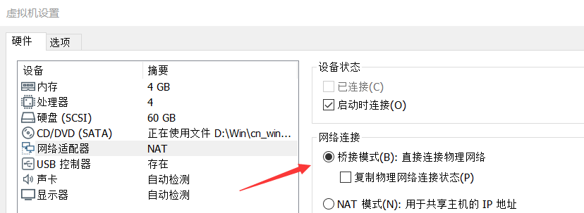


## 运行keylogger.exe

拍摄快照，保存运行前状态

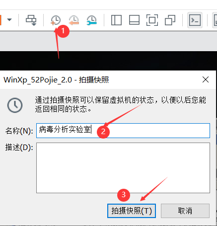

### （1） **设置文件夹选项**

显示所有文件和文件夹（为了查看病毒相关的隐藏文件）

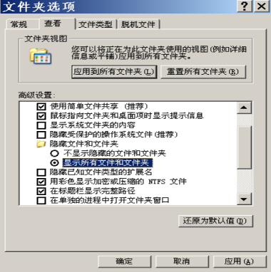

### （2） **病毒运行前观察：**

1. 是否存在隐藏文件夹：

`C:\WINDOWS\r_GUID[F481B223-3705-45B3-B9AB-C0D9A3FDEBB4]`

2. 是否存在如下文件：

`C:\WINDOWS\r_GUID[F481B223-3705-45B3-B9AB-C0D9A3FDEBB4]\ debugsrv.exe`

`C:\WINDOWS\r_GUID[F481B223-3705-45B3-B9AB-C0D9A3FDEBB4]\debugsrv.exe_bug.log`

很显然文件夹以及内容原本**不存在**

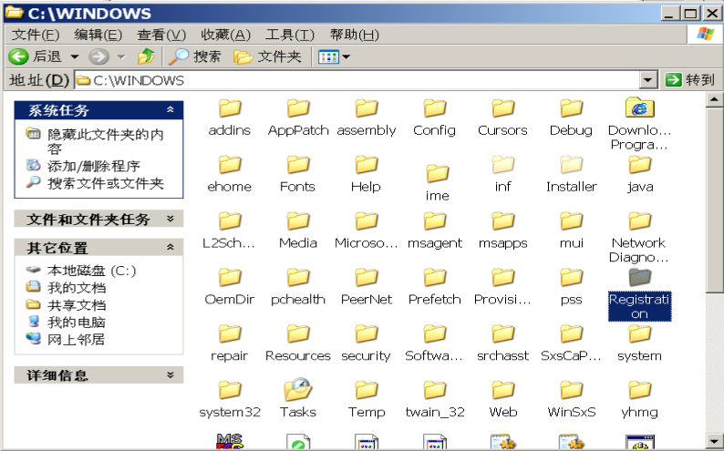


2. 是否启动进程：`debugsrv.exe`

显然也**不存在**

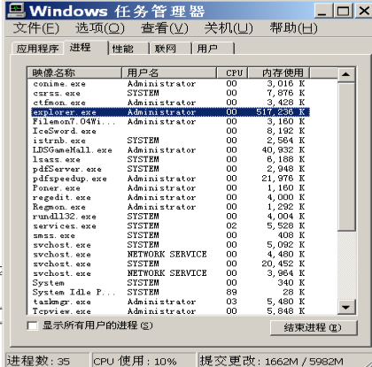

d) 查看注册表：

`HKEY_LOCAL_MACHINE\SOFTWARE\Microsoft\Windows\CurrentVersion\Run`

是否存在键值：`MSWDebugServer`

也**不存在**

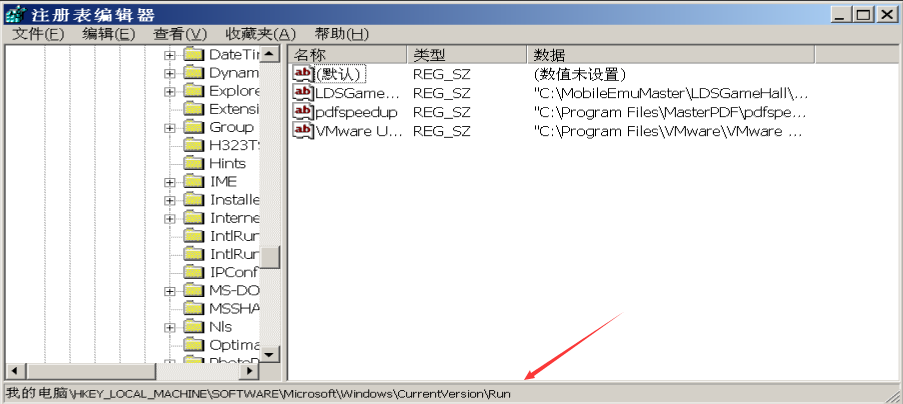

### （3） **病毒运行后观察**

（确认：虚拟机未连接移动设备、断网）

1. 病毒运行后，操作系统有异常吗？

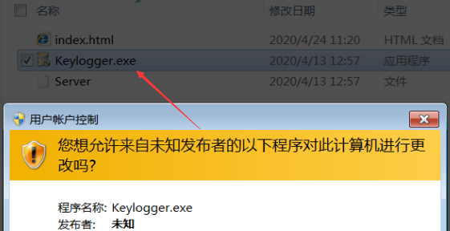

b) 观察文件、进程、注册表项等：

1）文件：

`C:\WINDOWS\r_GUID[F481B223-3705-45B3-B9AB-C0D9A3FDEBB4]\ debugsrv.exe`

`C:\WINDOWS\r_GUID[F481B223-3705-45B3-B9AB-C0D9A3FDEBB4]\debugsrv.exe_bug.log`

已经出现了隐藏目录，也包含了文件

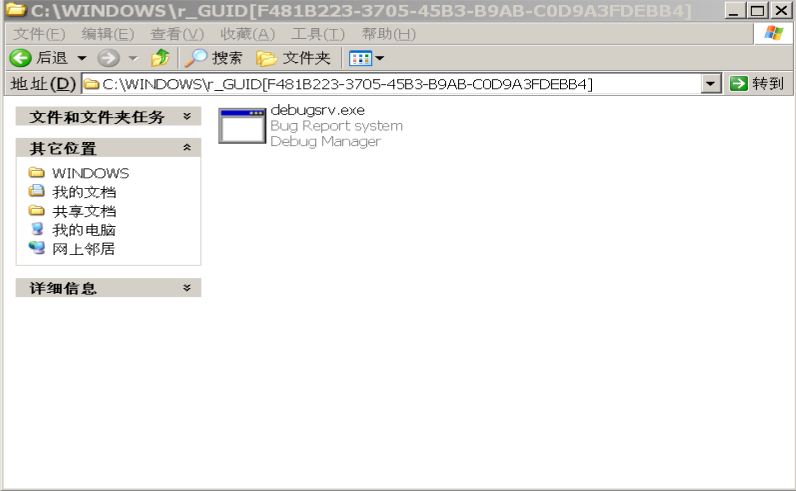

2）进程：

`C:\WINDOWS\r_GUID[F481B223-3705-45B3-B9AB-C0D9A3FDEBB4]\debugsrv.exe`

进程中赫然出现debugsrv.exe

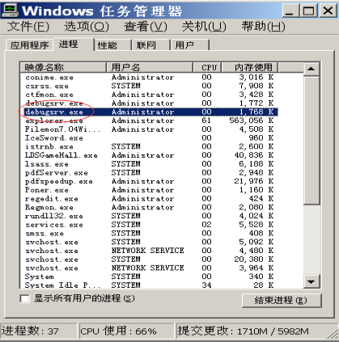

3）注册表项：（观察MSWDebugServer的值）

`HKEY_LOCAL_MACHINE\SOFTWARE\Microsoft\Windows\CurrentVersion\Run——MSWDebugServer`

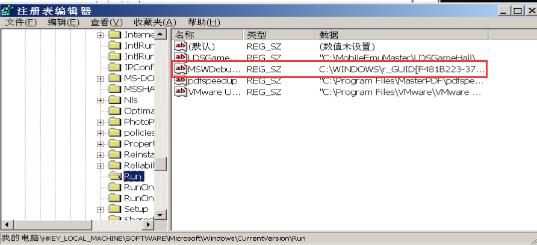

（4） **恢复快照：病毒分析实验室**

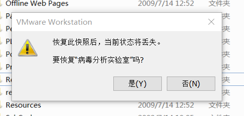


## **安装监控软件**

###  安装软件

将`FileMon`（文件监控）、`RegMon`（注册表监控）、`Process Explorer`（进程监控）、`TCPView`（网络监控）和`IceSword`（病毒辅助分析工具）复制到虚拟机中，依次点击运行。

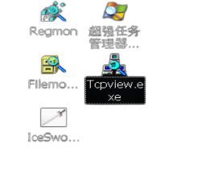

##### 了解`FileMon`，`RegMon`的输出界面：

第一项`”#”`表示文件操作记录的行号；

第二项`“Time”`，操作发生的时间，可以切换；

第三项`“Process”`进行文件操作的进程名，很重要；

第四项`“Request”`文件操作的方式：

第五项`FileMon`：关注值为**Create**、Open、**Write**、Delete的项

第六项`RegMon`：关注值为DeleteValueKey,SetValue的项

第七项`“Other”`文件操作的相关信息，文件的长度属性等信息。

##### FileMon和RegMon的快捷按钮

1. ：是否进行文件监控
2.  ：是否禁止自动滚动
3. ：监控前清空屏幕记录
4. ：设置过滤规则

5. 字体修改：Option-Font（选项-字体）

 

#####  FileMon和RegMon的过滤设置

1. ` “Filter”`按钮可以设置并查看过滤项规则

2.  新建过滤规则：

1.添加不需要监控的进程，Vmware相关进程，`ctfmon.exe; TPAutoconnect.exe; Lsass.exe; FileMon.exe; Regmon.exe; tcpview.exe; procexp.exe; vmtoolsd.exe;System`等。

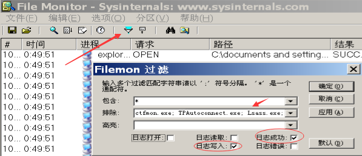

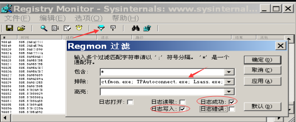

3. 也可以在输出界面选择该进程，单机鼠标右键选择Exclude Process。

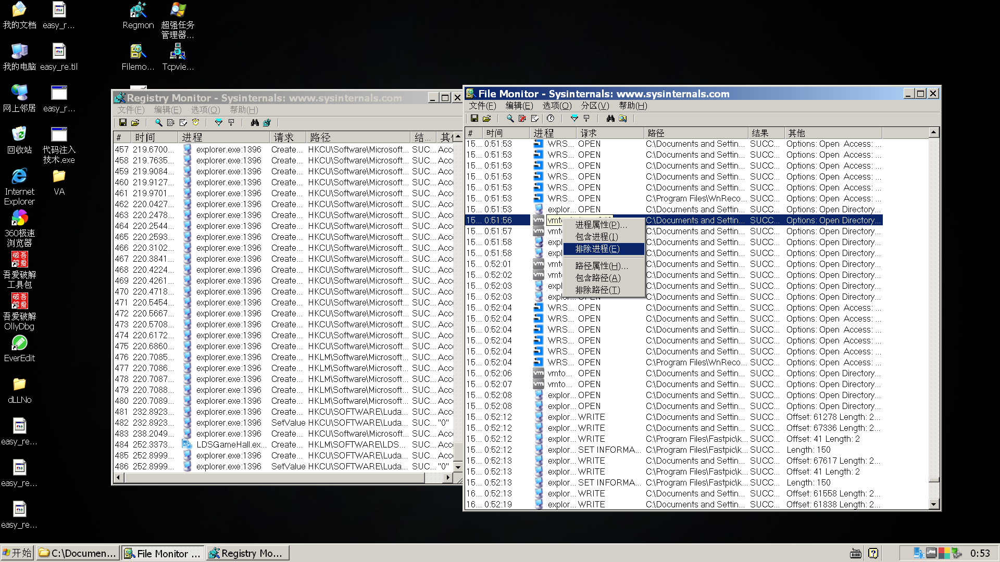

##### Processes Explorer设置

注意输出窗口进程颜色。绿色表示新建进程，红色表示将要结束的进程，粉色表示服务进程。

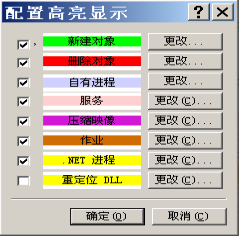

1. 单击进程项字段，可以按照升序、降序和分支（父子关系）三种方式显示进程。

2. 可替换任务管理器：Options-replace task manager

注：TCPView和Procexp放在前端，FileMon和RegMon放在后端

##### IceSword

IceSword:基于内核的查杀工具

1.  可查出所有隐藏进程

2.  可同时结束多个进程
   - 同时结束多个进程，可解决病毒进程间可相互启动的问题

3. 查看模块信息：查看进程加载的模块信息

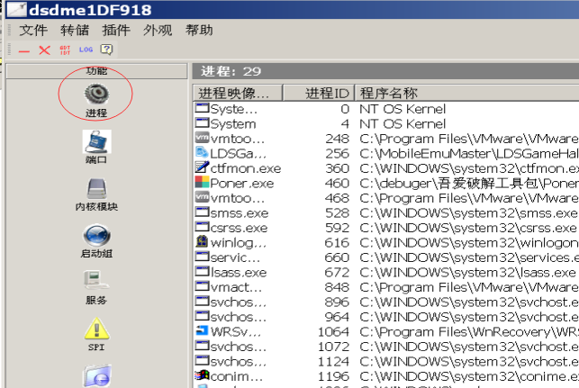

### **拍摄快照**

命名为：病毒分析实验室

## 病毒行为：keylogger.exe

### （1） **通过监控软件观察病毒行为**

#### 恢复快照，依次运行

恢复虚拟机快照：“病毒分析实验”快照

依次运行`FileMon、RegMon、Process Explorer、TCPView、IceSword`

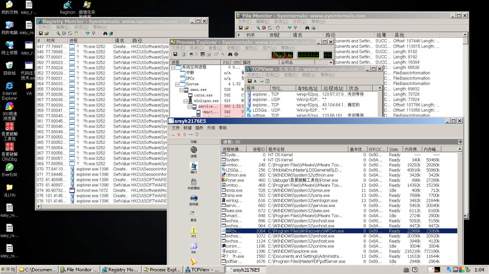

1. 设置FileMon、RegMon过滤规则：

添加不需要监控的进程：

`ctfmon.exe;TPAutoconnect.exe;Lsass.exe;FileMon.exe;Regmon.exe;tcpview.exe;procexp.exe;vmtoolsd.exe;System`等。

`Explore.exe和iexplore.exe`会被病毒利用，不要过滤。

设置日志监控方式：选择“日志写入”“日志成功”

2. 设置Process Explorer：单击进程项字段，按照分支（父子关系）方式显示进程

3. 打开IceSword：观察启动组模块，监视进线程创建模块

#### 运行并观察

1. 运行病毒程序：观察监控软件记录的变化。

在程序点击的一瞬间FileMon、RegMon便监测到有大量进程出现

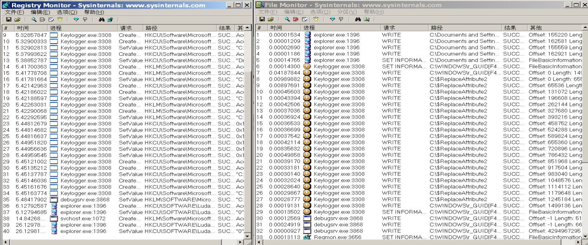

在Process Explorer中显示病毒伪装成了自有进程

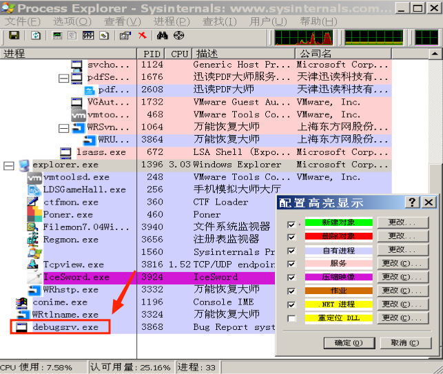

IceSword观察到启动组模块新增

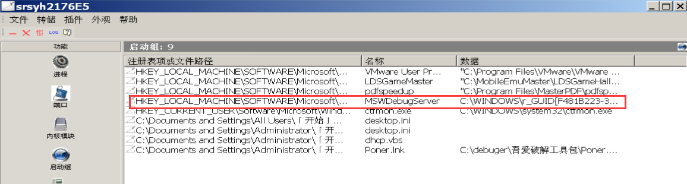

#### 恢复快照

恢复快照：病毒分析实验室

## 思考题

###### 受限文件夹

(1) 搭建病毒分析实验室，思考设置受限文件夹的目的是什么？

> 默认系统会允许大多数应用程序访问受控制文件夹，只限制个别可疑的或不常用的应用程序，一些特殊的应用程序也被阻止了，病毒的行为也同样会被阻止，进而保护物理机不受伤害。

#### keylogger.exe病毒行为

(2) 观察keylogger.exe病毒行为，记录监控软件**所观察到**Keylogger对文件、注册表和进程的修改。

思考，《课2-实验步骤》四（1）指出FileMon关注值为**Create**、Open、**Write**、Delete的请求项，为什么主要关注这四类请求项，而不关注Close、Directory等请求项？

> 计算机病毒的生命周期一般是休眠、传播、触发、执行。因此计算机病毒会创建进程、打开文件、写入内容、删除痕迹。创建进程时一切生命活动的基础，打开文件是写入文件的前提。打开文件可以读取相关数据，甚至写入修改相关数据，如修改注册表，实现自身克隆传播。删除关键数据会破坏计算机，删除自己的痕迹又可以隐藏自己
>
> 而关闭操作在监视期间并无重要意义，对计算机破坏性不大。目录请求并不会对计算机数据进行操作。

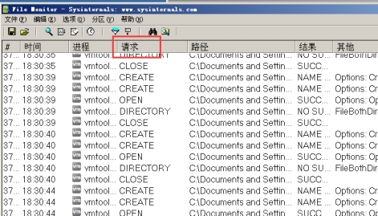

(3) 回答如下问题：

① 病毒为何长期存在并难以察觉？

> 由于计算机病毒具有较强的隐蔽性，计算机病毒不易被发现，其往往以隐含文件或程序代码的方式存在。例如keylogger.exe便将运行的文件夹设为隐藏模式。

② keylogger.exe如何实现自启动？

> 通过修改注册表：在系统自启动文件路径**HKEY_LOCAL_MACHINE\SOFTWARE\Microsoft\Windows\CurrentVersion\Run下，新建了键值：MSWDebugServer以及其对应的文件路径，在开机启动时，该病毒文件也自动启动了。

③ 有没有其他的自启动方法？

[自启动]: https://www.cxyzjd.com/article/liuyukuan/5986456

> 劫持其他程序
>
> 利用注册表改变正常程序所关联的程序

> 将自身添加到启动文件夹

> **注册表**启动，主要有以下几项：
>
> `HKEY_CURRENT_USER /Software/Microsoft/Windows/CurrentVersion/`+ （只对当前用户有效 ）或者
>
> `HKEY_LOCAL_MACHINESoftware/Microsoft/Windows/Current Version/`+（对于所有用户有效）
>
> > Run键
> >
> > RunOnce键
> >
> > RunServicesOnce键
> >
> > RunServices键
> >
> > RunOnceEx键（Windows XP/2003特有）
> >
> > load键
> >
> > Winlogon键
>
> 还有一些其他键值，经常会有一些程序在这里自动运行，如：
>
> [HKEY_CURRENT_USER /Software/Microsoft/Windows/CurrentVersion/Policies/System/Shell]
>
> [HKEY_LOCAL_MACHINE/SOFTWARE/Microsoft/Windows/CurrentVersion/ShellServiceObjectDelayLoad]
>
> [HKEY_CURRENT_USER/Software/Policies/Microsoft/Windows/System/Scripts]
>
> [HKEY_LOCAL_MACHINE/Software/Policies/Microsoft/Windows/System/Scripts]

> 将自身添加为服务、以windows服务方式启动
>
> 通过“开始→控制面板→管理工具→服务”来查看

> 自动批处理文件

> 系统配置文件
>
> 在Windows的配置文件（包括Win.ini、System.ini和wininit.ini文件）也会加载一些自动运行的程序。

> 病毒的映象劫持技术

#### Server.exe的行为

2、观察病毒Server.exe的行为（确认虚拟机未连接移动设备、断网）

(1) 观察病毒的运行程序是哪个文件，该文件存放的绝对路径？（Filemo.exe、Process Explorer—Procexp.exe）

> C:\WINDOWS\r_GUID[F481B223-3705-45B3-B9AB-C0D9A3FDEBB4]\debugsrv.exe

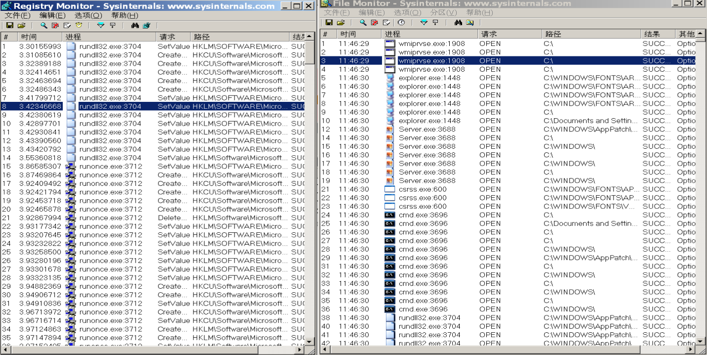

(2) 病毒运行后，启动了哪些进程？（Process Explorer—Procexp.exe）

> 瞬间启动了`Server.exe`但又自动消失了

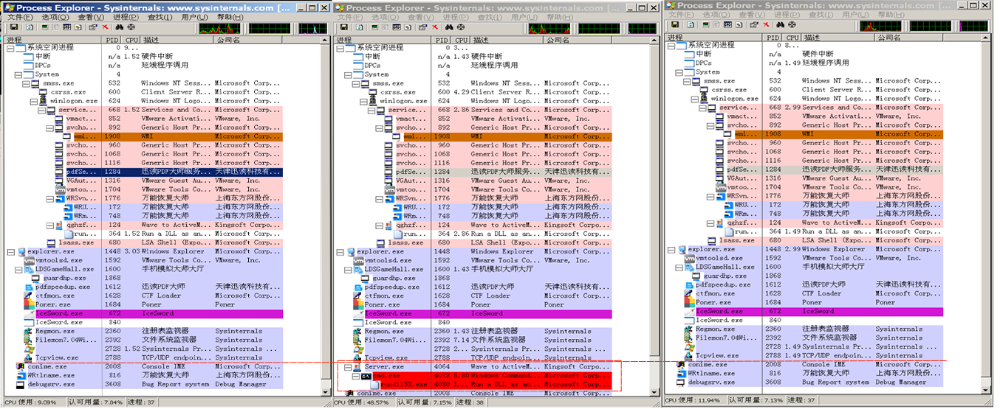

> 通讯检测到时不时会与一远端建立TCP连接

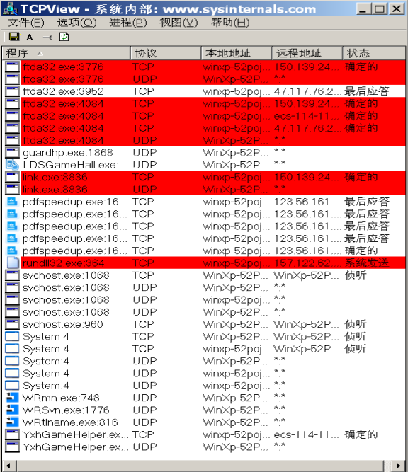

(3) 病毒如何实现自启动？（IceSword.exe）

> 通过修改注册表：在系统自启动文件路径HKEY_LOCAL_MACHINE\SOFTWARE\Microsoft\Windows\CurrentVersion\Run下，新建了键值：MSWDebugServer以及其对应的文件路径，在开机启动时，该病毒文件也自动启动了。

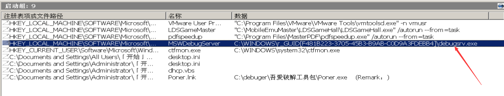

(4) 病毒的键记录写入哪个文件中？（Filemo.exe）

> 每隔一段时间便Server便会写入tmp文件 C:\DOCUME\~1\ADMINI\~1\LOCALS~1\Temp\iljmhv.tmp

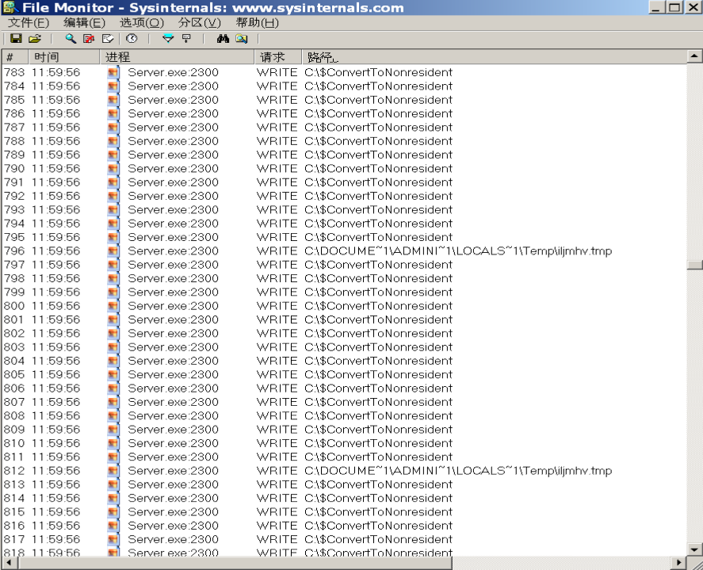

###### 思考：server.exe病毒对操作系统有哪些方面的影响？

> 对计算机数据信息的直接破坏作用，占用磁盘空间和对信息的破坏。寄生在磁盘上的病毒会非法占用一部分磁盘空间。对计算机上文件非法写入数据并隐藏，本病毒甚至修改了注册表。

> 抢占系统资源，影响计算机运行速度。病毒启动状态下是常驻内存的，这就必然抢占一部分系统资源。本病毒开机自启，还一直监视计算机状态，既多余又有害。

> 计算机病毒错误与不可预见的危害，兼容性对系统运行的影响。病毒制造者往往在一台计算机上匆匆编制调试后就向外抛出，不具备良好的兼容性，部分病毒都存在不同程度的错误，很可能会有各种各样的bug。

> 计算机病毒给用户造成严重的心理压力。因为计算机有病毒，或者因为其在别的地方出现就开始怀疑自己电脑是否也有病毒，弄得人心惶惶，心神不宁。

