# PE文件解析

参与作者：YZDYDD

- PE（Portable Executable）∶Windows平台主流的可执行文件格式，它衍生于COFF（Common Object File Format）文件格式，微软希望PE能够适用于所有Windows系统和CPU平台
- Windows系统中exe和dll是完全相同的格式，它们的区别只是一个字段标识文件是exe还是dll，还有其他许多文件类型也都是PE格式，例如ocx、sys
- 64位PE文件被称为PE32+，是在32位的基础上稍作修改，没有添加新的结构，只是将一些字段从32位拓宽到64位，使用Windows API编程用到结构体时可根据宏定义自动选择32或者64位结构

# PE文件结构

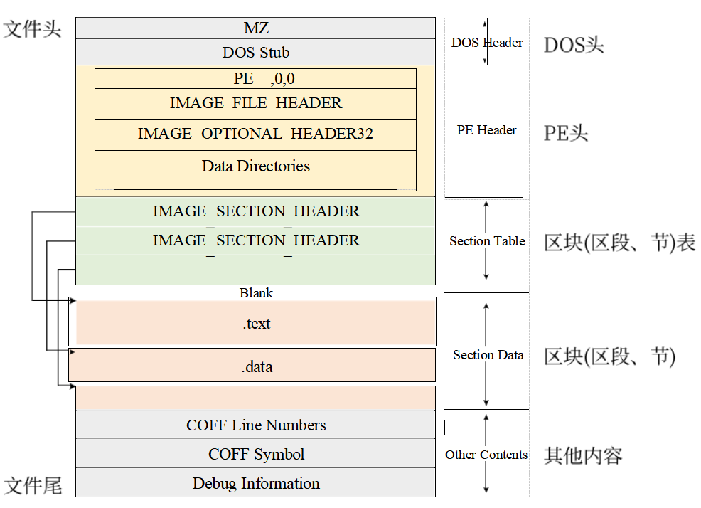

- MS-DOS头

每个PE文件都是以一个DOS程序开始的，有了它DOS就能识别出这是一个有效的执行体，通常把DOS MZ头与DOS stub合称为DOS文件头。

- PE文件头( PE Header )。是PE相关结构NT映像头( IMAGE_NT_ HEADERS )的简称，其中包含许多PE装载器能用到的重要字段。


使用16进制查看器HexEditXP分析TraceMe.exe[百度网盘地址](https://pan.baidu.com/s/15bf3rD3u1fqiIVHtBLbUrA)(提取码1111)

可以说是一个标准的PE文件

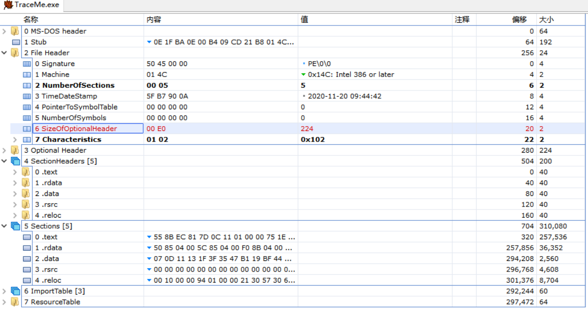

### PE文件映射

- PE文件使用的是平面地址空间，所有代码和数据均合并在一起，文件内容被分割为多个区块（Section，也被称为区段、节），区块中包含代码或数据，各个区块按操作系统页边界对齐
- 区块大小没有限制，每个区块都有自己在内存中的属性，例如某个区块是否包含代码，是否可读、可写、可执行
- PE文件执行前，由Windows加载器（loader）遍历文件的每个部分，并决定被映射到内存中的部分，映射时文件较高偏移映射到内存的高地址
- PE文件一经映射到内存，磁盘和内存中的数据及其结构布局是一致的，但是各部分在磁盘和内存中的相对偏移可能发生改变，相互间的偏移地址可通过PE文件头部一些字段提供的信息进行相互转换

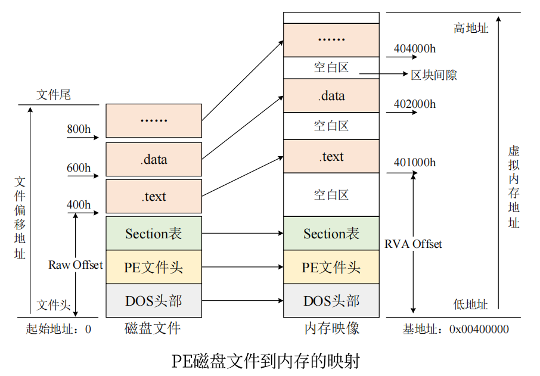


## PE相关概念

###### 基地址

- PE文件由Windows加载器载入内存后，内存中的版本称为模块（Module），映射文件的起始地址称为基地址ImageBase），WindowsNT之后基地址和模块句柄（Handle）相等

- 进程将可执行文件所需要的代码、数据、资源、输入表、输出表等数据结构所使用的内存都放在连续的内存块中，通过模块句柄可以访问这些数据结构
- GetModuleHandle可以获取模块句柄，参数指定模块的名称，如果参数为NULL，则获取调用该模块的可执行文件的模块句柄
-  基地址的值是由链接器决定的，是PE文件中的一个字段，链接器在链接时可以指定基址，或者设定为随机基址

###### 虚拟地址（Virtual Address， VA）

- PE文件被Windows系统加载器映射到内存后，文件各部分在进程空间中的内存地址被称为虚拟地址

###### 相对虚拟地址（Relative Virtual Address，RVA）

- PE文件中变量、函数等对象均需要指定内存中的虚拟地址，需要一个不依赖基地址的地址用于确定对象的虚拟地址

- 相对虚拟地址是相对于PE基地址的偏移，无论PE文件的基地址如何变。化，通过代码块的RVA便可计算出虚拟地址
- $虚拟地址（VA）=基地址（ImageBase）＋相对虚拟地址（RVA）$

###### 文件偏移地址

- 和RVA类似，PE文件储存在磁盘中时，某个字段相对于文件头的偏移量称为文件偏移地址（File Offset）或物理地址（RAW Offset）
-  文件偏移地址从PE文件的第一个字节开始计数，起始值为0

## MS-DOS头

每个PE文件都是以一个DOS程序开始的，有了它，一旦程序在DOS下执行, DOS就能识别出这是一个有效的执行体,然后运行紧随MZ header的DOS stub ( DOS块)。DOS stub实际上是-个有效的EXE,在不支持PE文件格式的操作系统中它将简单地显示-一个错误提示，类似于字符串"Thisprogram cannot be run in MS- DOS mode"。程序员也可以根据自己的意图实现完整的DOS代码。用户通常对DOSstub不太感兴趣，因为在大多数情况下它是由汇编器/编译器自动生成的。我们通常把DOS MZ头与DOS stub合称为DOS文件头。

```assembly
typedef struct _IMAGE_DOS_HEADER 
{ 
USHORT e_magic; // 魔术数字 +0x0
USHORT e_cblp; // 文件最后页的字节数
USHORT e_cp; // 文件页数
USHORT e_crlc; // 重定义元素个数
USHORT e_cparhdr; // 头部尺寸，以段落为单位
USHORT e_minalloc; // 所需的最小附加段
USHORT e_maxalloc; // 所需的最大附加段
USHORT e_ss; // 初始的SS值（相对偏移量）
USHORT e_sp; // 初始的SP值
USHORT e_csum; // 校验和
USHORT e_ip; // DOS代码入口IP
USHORT e_cs; // DOS代码入口CS（相对偏移量）
USHORT e_lfarlc; // 重分配表文件地址
USHORT e_ovno; // 覆盖号
USHORT e_res[4]; // 保留字
USHORT e_oemid; // OEM标识符（相对e_oeminfo）
USHORT e_oeminfo; // OEM信息
USHORT e_res2[10]; // 保留字
LONG e_lfanew; //指向PE文件头"PE",0,0  +0x3c
} IMAGE_DOS_HEADER,*PIMAGE_DOS_HEADER;
```

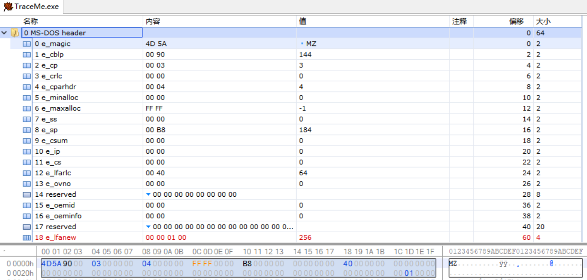

- Intel-CPU使用小端模式（Little-Endian)，低位字节存入低地址，高位字节存入高地址

- 方框处偏移为字段e_lfanew，值为"00 01 00 00"，表示PE文件头偏移

### DOS头文件制作

我们不想要stub调试信息，只是简简单单一个PE，所以只要最低限制64个字节，即40大小，外加112个stub空字节。

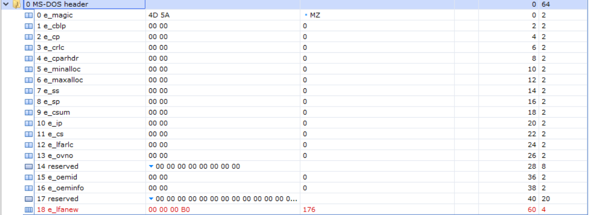

```bash
4D 5A 00 00 00 00 00 00 00 00 00 00 00 00 00 00 00 00 00 00 00 00 00 00 00 00 00 00 00 00 00 00
00 00 00 00 00 00 00 00 00 00 00 00 00 00 00 00 00 00 00 00 00 00 00 00 00 00 00 00 B0 00 00 00
```

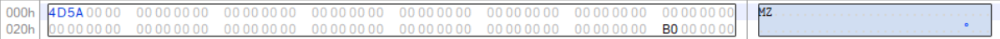

## PE文件头

紧跟着DOS stub的是PE文件头( PE Header )。“PE Header"是PE相关结构NT映像头( IMAGE_NT_ HEADERS )的简称，其中包含许多PE装载器能用到的重要字段。当执行体在支持PE文件结构的操作系统中执行时，PE装载器将从IMAGE \_DOS\_ HEADER结构的e_ lfanew 字段里找到PE Header的起始偏移量，用其加上基址，得到PE文件头的指针。

#### PE文件头（PE Header）

- 在DOS头之后，是NT映像头（IMAGE_NT_HEADER）的简称，包含许多PE加载器要用的重要字段

- PE文件被加载到内存执行时，加载器根据IMAGE_DOS_HEADER结构的e_lfanew字段找到PE Header的偏移量，再加上基地址得到PE文件头指针

  $$PNTHeader= ImageBase+ dosHeader -> e\_lfanew$$

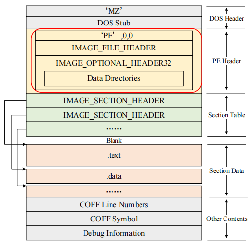

```c++
typedef struct _IMAGE_NT_HEADERS64 {
DWORD Signature;     // PE文件标识
IMAGE_FILE_HEADER FileHeader;
IMAGE_OPTIONAL_HEADER64 OptionalHeader;
} IMAGE_NT_HEADERS64, *PIMAGE_NT_HEADERS64;
```

```
typedef struct IMAGE_NT_HEADERS{
      DWORD Signature;
      IMAGE_FILE_HEADER FileHeader;
      IMAGE_OPTIONAL_HEADER32 OptionalHeader;
}IMAGE_NT_HEADERS,*PIMAGE_NT_HEADERS; 
```

```c++
#ifdef _WIN64
typedef IMAGE_NT_HEADERS64 IMAGE_NT_HEADERS;
typedef PIMAGE_NT_HEADERS64 PIMAGE_NT_HEADERS; #else
typedef IMAGE_NT_HEADERS32 IMAGE_NT_HEADERS;
typedef PIMAGE_NT_HEADERS32 PIMAGE_NT_HEADERS; #endif
```

###### Signature字段

- 有效PE文件的Signature字段设置为0x00004550，ASCII码字符是"PE00"

###### IMAGE_FILE_HEADER

-  映像文件头包含PE文件的一些基本信息，如下所示

```c++
typedef struct _IMAGE_FILE_HEADER {
WORD Machine; // 运行平台
WORD NumberOfSections; // 文件的区块数
DWORD TimeDateStamp; // 文件创建日期和时间
DWORD PointerToSymbolTable; // 指向符号表（用于调试）
DWORD NumberOfSymbols; // 符号表中符号数（用于调试）
WORD SizeOfOptionalHeader; // IMAGE_OPTIONAL_HEADER结构的大小
WORD Characteristics; // 文件属性
} IMAGE_FILE_HEADER, *PIMAGE_FILE_HEADER;
```

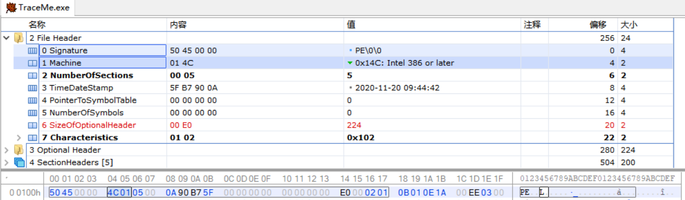

- Machine:可执行文件的目标CPU类型。PE文件可以在多种机器上使用，不同平台上指令的机器码不同。 |


| 机器Machine | 标志 |
| :---------: | :--: |
| Intel i386  | 14Ch |
| MIPS R3000  | 162h |
| MIPS R4000  | 166h |
|  Alpha AXP  | 184h |
|  Power PC   | 1FOh |

- NumberOfSections.

区块( Section)的数目，块表紧跟在IMAGE _NT_ HEADERS后面

-  TimeDateStamp

表示文件的创建时间。这个值是自1970 年1月1日以来用格林威治时间(GMT)计算的秒数，是一一个比文件系统的日期/时间更精确的文件创建时间指示器。将这个值翻译为易读的字符串需要使用_ctime 函数(它是时区敏感型的)。另一个对此字段计算有用的函数是gmtime。

-  PointerToSymbolTable

COFF 符号表的文件偏移位置。因为采用了较新的debug格式，所以COFF符号表在PE文件中较为少见。在Visual Studio .NET出现之前,COFF符号表可以通过设置链接器开关( /DEBUGTYPE:COFF )来创建。COFF符号表几乎总能在目标文件中找到，若没有符号表存在，将此值设置为0。

-  NumberOfSymbols

如果有COFF符号表,它代表其中的符号数目。COFF符号是一一个大小固定的结构，如果想找到COFF符号表的结束处，需要使用这个域。

-  SizeOfOptionalHeader

紧跟IMAGE\_ FILE\_HEADER,表示数据的大小。在PE文件中，这个数据结构叫作IMAGE \_OPTIONAL\_ HEADER, 其大小依赖于当前文件是32位还是64位文件。对32位PE文件，这个域通常是00E0h;对64位PE32+文件，这个域是00F0h。不管怎样，这些是要求的最小值，较大的值也可能会出现。

-  Characteristics

文件属性，有选择地通过几个值的运算得到。这些标志的有效值是定义于winnt.h内的IMAGE_ FILE_ xxx值，具体如表11.2所示。普通EXE文件的这个字段的值一般是010fh，DLL文件的这个字段的值一般是2102h。

|属性值Characteristics|含义|
| :---------: | :--: |
0001h|文件中不存在重定位信息
0002h|文件可执行。如果为0,一般是链接时出问题了
0004h|行号信息被移去.
0008h|符号信息被移去应用程序可以处理超过2GB的地址。该功能是从NTSP3开始被支持的。因为大部分数据库服务器需要
0020h|很大的内存，而NT仅提供2GB给应用程序,所以从NT SP3开始，通过加载/3GB参数，可以使应用程序被分配2~3CB区域的地址，而该处原来属于系统内存区
0080h|处理机的低位字节是相反的
0100h| .目标平台为32位机器
0200h|DBG文件的调试信息被移去
0400h|如果映像文件在可移动介质中，则先复制到交换文件中再运行
0800h|如果映像文件在网络中，则复制到交换文件后才运行
1000h|系统文件
2000h|文件是DLL文件
4000h|文件只能运行在单处理器上
8000h|处理机的高位字节是相反的

### PE文件头制作

共计24个字节。有效PE文件的Signature字段为50 45 00 00；使用Intel i386，Machine标志位4C 01；本次只需使用三个区块`.text .data .rdata `NumberOfSections字段为03 00。32位PE文件SizeOfOptionalHeader通常是E0 00；Characteristics文件属性选择02 00文件可执行。

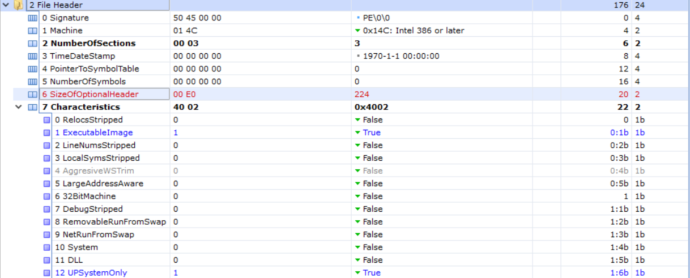

```
50 45 00 00 4C 01 03 00 00 00 00 00 00 00 00 00 00 00 00 00 E0 00 02 00
```


## PE可选文件头

- IMAGE_OPTIONAL_HEADER是可选的结构，但IMAGE FILE HEADER结构不足以定义PE文件属性，因此可选映像头中定义了更多的数据，
- 和IMAGE_FILE_HEADER没有区别，不必考虑两个结构的区别在哪里，将两者连起来就是-个完整的“PE 文件头结构”。

`IMAGE_OPTIONAL_HEADER32`结构如下，字段前的数字标出了字段相对于PE文件头的偏移量。

| 含义|字段类型|字段|偏移                                          |
| -----------|--------------|-----------------|------------------ |
| 标志字，010Bh/020Bh|WORD|Magic|18h                              |
| 所有含代码的区块大小|DWORD|SizeOfCode|1Cn                       |
| 程序执行RVA|DWORD|AddressOfEntryPoint|28h                       |
| 代码区块起始RVA|DWORD|2ChBaseOfCode |2Ch                           |
| 数据区块起始RVA|DWORD|BaseOfData|30h                             |
| 程序默认载入基地址|DWORD|ImageBase|34n                          |
| 内存中区块的对齐值|DWORD|SectionAlignment|28h                |
| 文件中区块的对齐值|DWORD|FileAlignment|3Ch                      |
| 操作系统主版本号|WORD|MajorOperatingSystem Version|  40h       |
| 映像载入内存后的大小|DWORD|SizeOfimage|50h                      |
| MS-DOS+PE Header+区块表大小|DWORD|SizeOfHeaders|54n             |
| 可执行文件所期望的子系统|WORD|Subsystem|58n                     |
| 指向输出表、输入表、资源等结构|数据目录表|DataDirectory[16]|78h |

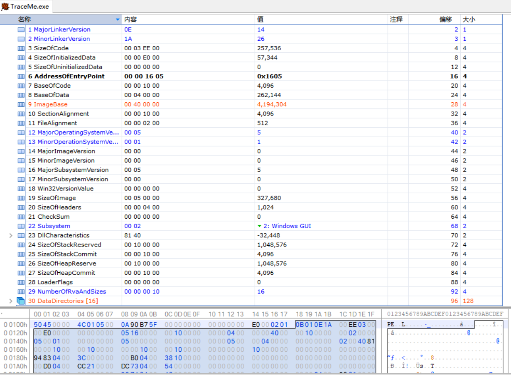

- Magic∶这是一个标记字，说明文件是 ROM映像（0107h）还是普通可执行的映像（010Bh），一般是010Bh。如果是 PE32+，则是020Bh。
- MajorLinkerVersion∶链接程序的主版本号。
- MinorLinkerVersion∶链接程序的次版本号。
- SizeOfCode∶有 IMAGE_SCN_CNT_CODE 属性的区块的总大小（只入不舍），这个值是向上对齐某一个值的整数倍。例如，本例是200h，即对齐的是一个磁盘扇区字节数（200h）的整数倍。在通常情况下，多数文件只有1个Code 块，所以这个字段和.text 块的大小匹配。
- SizeOfInitializedData∶已初始化数据块的大小，即在编译时所构成的块的大小（不包括代码段）。但这个数据不太准确。
- SizeOfUninitializedData∶未初始化数据块的大小，装载程序要在虚拟地址空间中为这些数据约定空间。这些块在磁盘文件中不占空间。就像"UninitializedData"这一术语所暗示的-样。这些块在程序开始运行时没有指定值。未初始化数据通常在 .bss 块中。
- AddressOfntryPoint∶程序执行入口 RVA。对干DLL。这个入口点在进程初始化和关闭时及线程创建和毁灭时被调用。在大多数可执行文件中，这个地址不直接指向 Main、WinMain或 DllMain 函数，而指向运行时的库代码并由它来调用上述函数。在 DLL 中，这个域能被设置为0，此时前面提到的通知消息都无法收到。链接器的NOENTRY 开关可以设置这个域为0。
- BaseOfCode∶代码段的起始 RVA。在内存中。代码段通常在 PE文件头之后.数据块之前。在 Microsoft 链接器生成的可执行文件中，RVA 的值通常是 1000h。Borland 的 Tlink32用ImageBase 加第1个 Code Section的 RVA，并将结果存入该字段。
- BaseOfData∶数据段的起始 RVA。数据段通常在内存的末尾，即 PE 文件头和 Code Section 之后。可是，这个域的值对于不同版本的 Microsoft 链接器是不一致的，在 64 位可执行文件中是不会出现的。
- ImageBase∶文件在内存中的首选载入地址。如果有可能（也就是说，如果目前没有其他文件占据这块地址，它就是正确对齐的并且是一个合法的地址），加载器会试图在这个地址载入 PE 文件。如果 PE 文件是在这个地址载入的，那么加载器将跳过应用基址重定位的步骤。
- SectionAlignment∶载入内存时的区块对齐大小。每个区块被载人的地址必定是本字段指定数值的整数倍。默认的对齐尺寸是目标 CPU的页尺寸。对运行在 Windows 9x/Me下的用户模式可执行文件，最小的对齐尺寸是每页 1000h（4KB）。这个字段可以通过链接器的/ALIGN 开关来设置。在IA-64上，这个字段是按8KB排列的。
- FileAlignment∶磁盘上 PE 文件内的区块对齐大小，组成块的原始数据必须保证从本字段的倍数地址开始。对于x86可执行文件，这个值通常是 200h 或 1000h，这是为了保证块总是从磁盘的扇区开始，这个字段的功能等价于NE 格式文件中的段/资源对齐因子。使用不同版本的 Microsoft 链接器，默认值会改变。这个值必须是2的幂。其最小值为 200h。而日。如果 SectionAlignment小干CPU的页尺寸，这个域就必须与 SectionAlignment 匹配。链接器开关/OPT∶WIN98设置x86可执行文件的对齐值为 1000h；/OPT∶NOWIN98设置对齐值为200h。
- MajorOperatingSystemVersion∶要求操作系统的最低版本号的主版本号。随着这么多版本的Windows 的出现，这个字段显然变得不切题了。
- MinorOperatingSystemVersion∶ 要求操作系统的最低版本号的次版本号。
- MajorImageVersion∶该可执行文件的主版本号，由程序员定义。它不被系统使用，并可以设置为0，可以通过链接器的/VERSION开关来设置。 MinorImageVersion∶该可执行文件的次版本号，由程序员定义。
- MajorSubsystemVersion∶要求最低子系统版本的主版本号。这个值与下一个字段一起，通常被设置为4，可以通过链接器开关/SUBSYSTEM来设置。
- MinorSubsystemVersion∶要求最低子系统版本的次版本号。19Win32VersionValue∶另一个从来不用的字段，通常被设置为0。
- SizeOfmage∶映像载入内存后的总尺寸，是指载入文件从ImageBase 到最后一个块的大小。最后一个块根据其大小向上取整。
- SizeOfHeaders∶MS-DOS头部、PE文件头、区块表的总尺寸。这些项目出现在 PE文件中的所有代码或数据区块之前，域值四舍五入至文件对齐值的倍数。
- CheckSum∶映像的校验和。IMAGEHLP.DLL 中的 CheckSumMappedFile 函数可以计算该值。一般的 EXE 文件该值可以是0，但一些内核模式的驱动程序和系统 DLL 必须有一个校验和。当链接器的/RELEASE开关被使用时，校验和被置于文件中。
- Subsystem∶一个标明可执行文件所期望的子系统（用户界面类型）的枚举值。这个值只对EXE重要，如表11.3所示。

|值|子系统|
|--|--|
0 |未知
1 |不需要子系统(例如驱动程序)
2 |图形接口子系统( GUI)
3 |字符子系统(CUI )
5 |OS/2字符子系统
7 |POSIX字符子系统
8 |保留
9 |Windows CE图形界面

- DllCharacteristics∶ DllMain（）函数何时被调用。默认值为0。

- SizeOfStackReserve∶在 EXE文件里为线程保留的栈的大小。它在一开始只提交其中一部分，只有在必要时才提交剩下的部分。

- SizeOfStackCommit∶在 EXE 文件里，一开始即被委派给栈的内存，默认值是 4KB。

- SizeOfHeapReserve:在EXE文件里,为进程的默认堆保留的内存，默认值是1MB。

- SizeOfHeapCommit:在EXE文件里，委派给堆的内存，默认值是4KB。

- LoaderFlags: 与调试有关， 默认值为0。

- NumberOfRvaAndSizes: 数据目录的项数。这个字段的值从Windows NT发布以来一直是16。

- DataDirectory[16]: 数据目录表，由数个相同的IMAGE\_DATA\_DIRECTORY结构组成，指向输出表、输入表、资源块等数据。IMAGE\_DATA\_DIRECTORY的结构定义如下。

    ```c++
    IMAGE_DATA_DIRECTORY	STRUCT
      VirtualAddress  DWORD ? ;数据块的起始RVA
      Size 						DWORD ? ;数据块的长度
    IMAGE DATA DIRECTORY	ENDS
    ```
#### 数据目录表

- 数据目录表由16个相同的IMAGE_ DATA_ DIRECTORY结构组成，用以指向输出表、输入表、资源等数据
- 如果PE文件不包含某项数据，则该项目录表的2个字段全为0

```cpp
typedef struct _IMAGE_DATA_DIRECTORY
{
DWORD VirtualAddress; // 内存虚拟地址
DWORD Size; // 长度
} IMAGE_DATA_DIRECTORY, *PIMAGE_DATA_DIRECTORY;
```


| 序号|成员|结构|偏移                                          |
| -----------|--------------|-----------------|------------------ |
0|ExportTable|IMAGE_DIRECTORY_ENTRY_EXPORT|78h
1|ImportTable|IMAGE_DIRECTORY_ENTRY_IMPORT|80h
2|ResourcesTable|IMAGE_DIRECTORY_ENTRY_RESOURCE|88h
3|ExceptionTable|IMAGE_DIRECTORY_ENTRY_EXCEPTION|90h
4|SecurityTable|IMAGE_DIRECTORY_ENTRY_SECURITY|98h
5|Base RelocationTable|IMAGE_DIRECTORY_ENTRY_BASERELOC|A0h
6|Debug|IMAGE_DIRECTORY_ENTRY_DEBUG|A8h
7|Copyright|IMAGE_DIRECTORY_ENTRY_COPYRIGHT|B0h
8|Global Ptr|IMAGE_DIRECTORY_ENTRY_GLOBALPTR|B8h
9|Thread Local Storage|IMAGE_DIRECTORY_ENTRY_TLS|C0h
10|Load Configuration|IMAGE_DIRECTORY_ENTRY_LOAD_CONFIG|C8h
11|Bound Import|IMAGE_DIRECTORY_ENTRY_BOUND_IMPORT|D0h
12|Import AddressTable|IMAGE_DIRECTORY_ENTRY_IAT|D8h
13|Delay Import|IMAGE_DIRECTORY_ENTRY_DELAY_IMPORT|E0h
14|COM Descriptor|IMAGE_DIRECTORY_ENTRY_COM_DESCRIPTOR|E8h
15|Reserved|保留，必须为0|F0h

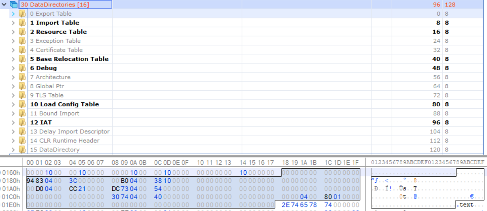

### PE可选文件头制作

224字节大小

Magic一般是01 0B。AddressOfntryPoint为00 10 00 00；ImageBase首选载入地址设为40 00 00 00；SectionAlignment载入内存时的区块对齐大小00 10 00 00=4096；FileAlignment磁盘上 PE 文件内的区块对齐大小00 02 00 00=512；MajorSubsystemVersion要求最低子系统版本的主版本号，通常被设置为4；SizeOfmage映像载入内存后的总尺寸00 40 00 00 = 16,384；SizeOfHeaders为MS-DOS头部、PE文件头、区块表的总尺寸设为00 04 00 00=1,024；Subsystem使用字符子系统(CUI )03 00；NumberOfRvaAndSizes:数据目录的项数自古以来都是16.

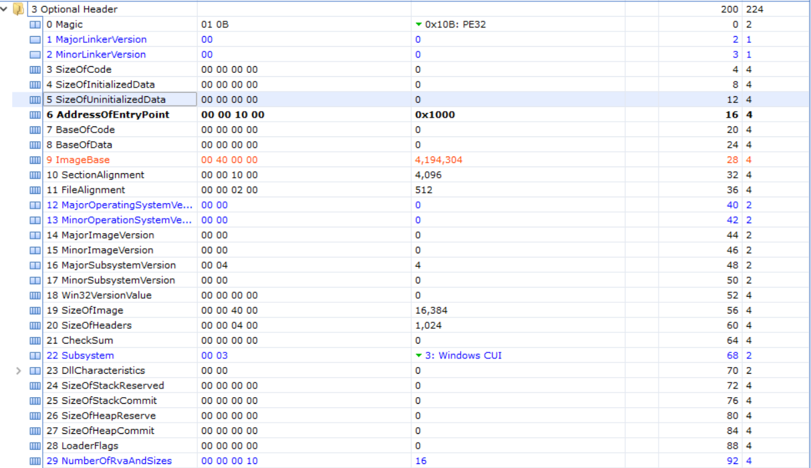

```bash
0B 01 00 00 00 00 00 00 00 00 00 00 00 00 00 00 00 10 00 00 00 00 00 00 00 00 00 00 00 00 40 00
00 10 00 00 00 02 00 00 00 00 00 00 00 00 00 00 04 00 00 00 00 00 00 00 00 40 00 00 00 04 00 00
00 00 00 00 03 00 00 00 00 00 00 00 00 00 00 00 00 00 00 00 00 00 00 00 00 00 00 00 02 00 00 00

DataDirectory:

00 00 00 00 00 00 00 00 00 20 00 00 3C 00 00 00 00 00 00 00 00 00 00 00 00 00 00 00 00 00 00 00
00 00 00 00 00 00 00 00 00 00 00 00 00 00 00 00 00 00 00 00 00 00 00 00 00 00 00 00 00 00 00 00
00 00 00 00 00 00 00 00 00 00 00 00 00 00 00 00 00 00 00 00 00 00 00 00 00 00 00 00 00 00 00 00
00 00 00 00 00 00 00 00 00 00 00 00 00 00 00 00 00 00 00 00 00 00 00 00 00 00 00 00 00 00 00 00
```

显示一个消息框要导入user32.dll库中的MessageBoxA函数；退出又要导入kernel32.dll库中的ExitProcess函数。数据目录表部分仅使用导入目录 

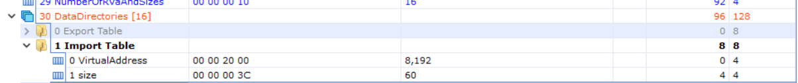

## 区块

在PE文件头与原始数据之间存在一个区块表( Section Table)。 区块表中包含每个块在映像中的信息，分别指向不同的区块实体。

### 区块表和区块

紧跟IMAGE NT_ HEADERS的是区块表,它是-个IMAGE SECTION_ HEADER 结构数组。每个IMAGE SECTION_ HEADER结构包含了它所关联的区块的信息，例如位置、长度、属性,该数组的数目由`IMAGE_NT_ HEADERS.FileHeader.NumberOfSections` 指出。

- 区块表是IMAGE_SECTION_HEADER数组，每个元素包含它所关联的区块的信息，如位置、长度、属性
- 数组元素数，即区块的个数由PE文件头中字段标明
  - `IMAGE NT HEADERS.FileHeader.NumberOfSections`

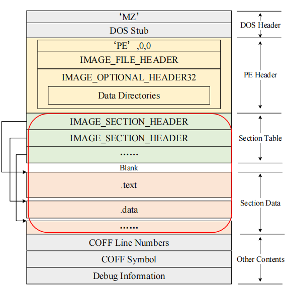

### 区块头结构

```cpp
typedef struct _IMAGE_SECTION_HEADER {
BYTE Name[IMAGE_SIZEOF_SHORT_NAME];// 区块名，8字节
union {
DWORD PhysicalAddress;
DWORD VirtualSize;
} Misc;
DWORD VirtualAddress; // 区块载入内存中的RVA
DWORD SizeOfRawData; // 区块在物理文件中所占用空间
DWORD PointerToRawData; // 区块在物理文件中的偏移
DWORD PointerToRelocations;
DWORD PointerToLinenumbers;
WORD NumberOfRelocations;
WORD NumberOfLinenumbers;
DWORD Characteristics; // 属性
} IMAGE_SECTION_HEADER, *PIMAGE_SECTION_HEADER;
```

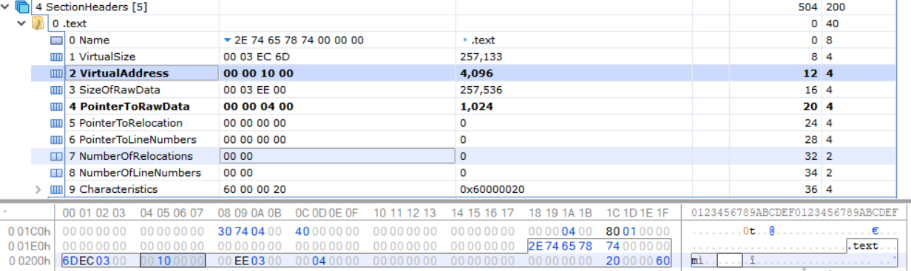

- Name:块名。这是一个8位ASCII码名(不是Unicode内码),用来定义块名。多数块名以一个“.”开始(例如.text), 这个“.” 实际上不是必需的。值得注意的是，如果块名超过8字节,则没有最后的终止标志“NULL"字节。带有一个“\$”的区块名会被链接器特殊对待，前面有“\$"的同名区块会被合并。这些区块是按“$” 后面的字符的字母顺序合并的。
- VirtualSize: 指出实际被使用的区块的大小，是在进行对齐处理前区块的实际大小。如果VirtualSize的值大于SizeOfRawData 的值，那么SizeOfRawData表示来自可执行文件初始化数据的大小，与VirtualSize相差的字节用0填充。这个字段在OBJ文件中是被设置为0的。
- Virtualddress:该块装载到内存中的RVA。这个地址是按照内存页对齐的，它的数值总是SectionAlignment的整数倍。在Microsft工具中,第1个块的默认RVA值为1000h。在OBJ中，该字段没有意义，并被设置为0。
- SizeOfRawData:该块在磁盘中所占的空间。在可执行文件中，该字段包含经FileAlignment调整的块的长度。例如，指定FileAlignment的值为200h, 如果VirtualSize中的块长度为19Ah字节,该块应保存的长度为200h字节。
- PointerToRawData:该块在磁盘文件中的偏移。程序经编译或汇编后生成原始数据，这个字段用于给出原始数据在文件中的偏移。如果程序自装载PE或COFF文件(而不是由操作系统载人的),这- -字段将比VirtualAddress还重要。在这种状态下,必须完全使用线性映像的方法载入文件,所以需要在该偏移处找到块的数据，而不是VirtualAddress字段中的RVA地址。
- PointerToRelocations:在EXE文件中无意义。在0BJ文件中,表示本块重定位信息的偏移量。在OBJ文件中，如果该值不是0,会指向一个IMAGE_ RELOCATION结构数组。
- PointerToLinenumbers: 行号表在文件中的偏移量。这是文件的调试信息。
- NumberOfRelocations: 在EXE文件中无意义。在OBJ文件中，表示本块在重定位表中的重定位数目。
- NumberOfLinenumbers:该块在行号表中的行号数目。
- Charaterstics: 块属性。该字段是-组指出块属性(例如代码/数据、可读可写等)的标志。
    比较重要的标志如表所示，多个标志值求或即为Characteristics 的值。这些标志中的很多都可以通过链接器的/SECTION开关设置。

|字段值|地址|用途|
|-|-|-|
IMAGE_SCN_CNT_CODE|0000020h|包含代码，常与100000h一起设置
IMAGE_SCN_CNTINITIALIZED_DATA|0000040h|该块包含已初始化的数据
IMAGE_SCN_CNT__UNINITIALIZED_DATA|0000080h|该块包含未初始化的数据
IMAGE_SCN_MEM_DISCARDABLE|000000h|该块可被丢弃,因为它一旦被载入，进程就不再需要它了。常见的可丢弃块是.reloe(重定位块)
IMAGE_SCN_MEMSHARED|1000000h|该块为共享块
IMAGE_SCN_MEMEXECUTE|2000000h|该块可以执行。通常当0000020标志被设置时，该标志也被设置
IMAGESCN_MEMREAD|4000000h|该块可读。可执行文件中的块总是设置该标志
IMAGE_SCN_MEM_WRITE|8000000h|该块可写。如果PE文件中没有设置该标志，装载程序就会将内存映像页标记为可读或可执行

区块中的数据逻辑通常是关联的。PE文件一般至少有两个区块, 一个是代码块,另一个是数据块。每个区块都有特定的名字，这个名字用于表示区块的用途。例如，- -个区块叫作.rdata,表明它是-一个只读区块。区块在映像中是按起始地址( RVA )排列的，而不是按字母表顺序排列的。使用区块名只是为了方便,它对操作系统来说是无关紧要的。微软给这些区块分别取了有特色的名字,但这不是必需的。Borland 链接器使用的是像“CODE” 和“DATA"这样的名字。
EXE和OBJ文件的一些常见区块如表所示。除非另外声明，表中的区块名称来自微软的定义。

| 名称     | 描述                                                         |
| -------- | ------------------------------------------------------------ |
| .text    | 默认的代码区块，它的内容全是指令代码。PE文件运行在32位方式下,不受16位段的约束，所以没有理由把代码放到不同的区块中。链接器把所有目标文件的.text块链接成一个大的.text块。如果使用Borland C++,其编译器将产生的代码存储于名为code的区域，其链接器链接的结果是使代码块的名称不是.text, 而是code |
| .data    | 默认的读/写数据区块。全局变量，静态变量- -般放在这里默认的只读数据区块，但程序很少用到该块中的数据。至少有两种情况要用到.rdata 块。一-是在 Mierosoft |
| .rdata   | 链接器产生的EXE文件中，用于存放调试目录;二是用于存放说明字符申。如果程序的DEF文件中指定了DESCRIPTION,字符串就会出现在.rdata块中包含其他外来DLL的函数及数据信息，即输人表。将.idata区块合并到另-一个区块已成为惯例，典型的 |
| idata    | 是.rdata区块。链接器默认仅在创建一一个 Release模式的可执行文件时才将jidata 区块合并到另-个区块中输出表。当创建一个输出API或数据的可执行文件时，链接器会创建-个.EXP文件，这个.EXP文件包含 |
| .edlata  | 一个.eda区块，它会被加入最后的可执行文件中。与idata 区块- -样， .edata 区块也经常被发现合并到了.text或.tdata区块中 |
| .rsre    | 资源。包含模块的全部资源，例如图标、菜单、位图等。这个区块是只读的,无论如何都不应该命名为.rsre以外的名字，也不能被合并到其他区块里 |
| .hss     | 未初始化数据。很少使用，取而代之的是执行文件的sdata 区块的VirtualSize 被扩展到足够大以存放未初始化的数据 |
| .crt     | 用于支持C++运行时( CRT)所添加的数据                          |
| .tls     | TLS的意思是线程局部存储器，用于支持通过_ declspee ( thread )声明的线程局部存储变量的数据,既包括数据的初始化值，也包括运行时所需的额外变量 |
| .reloc   | 可执行文件的基址重定位。基址重定位一般只是DLL需要，而不是EXE需要。在Release模式下，链接器不会给EXE文件加上基址重定位，重定位可以在链接时通过/FIXED开关关闭 |
| .sdala   | 相对于全局指针的可被定位的“短的"读/写数据,用于IA- 64和其他使用一个全局指针寄存器的体系结构。IA- 64上的常规大小的全局变量放在这个区块里 |
| .srdata  | 相对于全局指针的可被定位的“短的”只读数据，用于IA- 64和其他使用一个全局指针寄存器的体系结构 |
| .pdata   | 异常表,包含一个CPU特定的IMAGE RUNTIME_ FUNCTION_ ENTRY结构数组, DataDirctory中的IMAGE_DIRECTORY_ ENTRY EXCEPTION指向它。它用于异常处理，是基于表的体系结构，就像IA-64。唯一不使用基于表的异常处理的架构体系是x86 |
| .debug$s | OBJ文件中Codeview格式的符号。这是一个变量长度的Codeview格式的符号记录流 |
| .debug$T | OBJ文件中Codeview格式的类型记录。这是一个变量长度的Coderiew格式的类型记录流 |
| .debug$P | 当使用预编译的头时，可以在0BJ文件中找到它                    |
| .drectve | 包含链接器命令,只能在0BJ中找到它。命令是能被传递给链接器命令行的字符串,例如“deultib:LIBC”"。命令用空格字符分开 |
| .didat   | 延迟载入的输人数据，只能在非Release模式的可执行文件中找到。在Release模式下，延迟载人的数据会被合并到另一个区块中 |


### 区块表制作

三个区块`.text代码段 .data全局变量数据段 .rdata只读数据段 `

- Name:块名。2E 74 65 78 74 00 00 00 `.text`
- VirtualSize: 指出实际被使用的区块的大小，是在进行对齐处理前区块的实际大小。26 00 00 00 = 38
- Virtualddress:该块装载到内存中的RVA。00 30 00 00
- SizeOfRawData:该块在磁盘中所占的空间。16 00 00 00
- PointerToRawData:该块在磁盘文件中的偏移。00 04 00 00

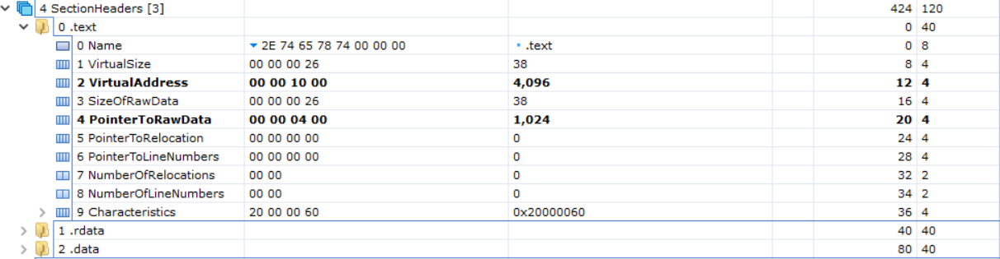

- Charaterstics: 块属性。

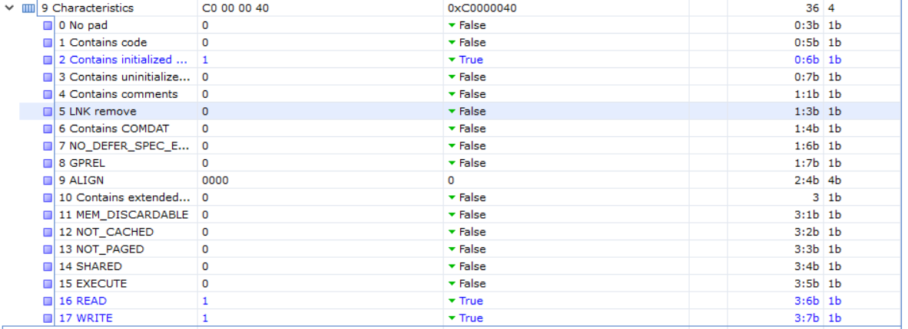

同理设置另两个区块表

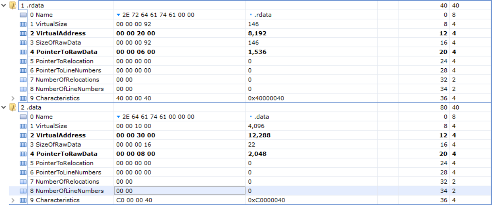

```bash
2E 74 65 78 74 00 00 00 26 00 00 00 00 10 00 00 26 00 00 00 00 04 00 00 00 00 00 00 00 00 00 00
00 00 00 00 60 00 00 20 
2E 72 64 61 74 61 00 00 92 00 00 00 00 20 00 00 92 00 00 00 00 06 00 00 00 00 00 00 00 00 00 00 00 00 00 00 40 00 00 40 
2E 64 61 74 61 00 00 00 00 10 00 00 00 30 00 00 16 00 00 00 00 08 00 00 00 00 00 00 00 00 00 00 00 00 00 00 40 00 00 C0
```


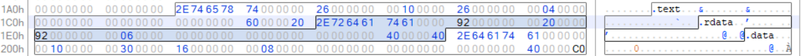


#### 区块对齐

- 无论是物理文件还是内存中，PE文件的区块都是要对齐的，每一个区块从对齐值的倍数的偏移位置开始。区块大小不足时以00h来填充，称其为区块间隙
- PE文件头中FileAlignment字段定义了物理文件中区块的对齐值
  - 例如PE文件内典型对齐值是200h，假设区块第一个字节在400h开始，
    长度为90h，又由于对齐值是200h，下一区块的开始地址只能为600h，中间部分用00h填充
- PE文件头中SectionAlignment定义了内存中区块的对齐值，PE文件被
  映射到内存时，每个区块总是至少从一个页边界处开始，即每个区块的第一个字节对应于某个内存页
  - x86系统中，内存页以4KB为单位，区块的内存对齐值一般为1000h
  -  x64系统中，内存页以8KB为单位，区块的内存对齐值一般为2000h
- PE文件为减少体积，物理文件对齐不以内存页为单位，那么PE文件被映射到内存后，同一字段在物理文件相对文件头的偏移量， 与内存相对基地址的偏移量是不同的，需要在文件偏移地址和虚拟地址之间相互转换，转换方法见下图

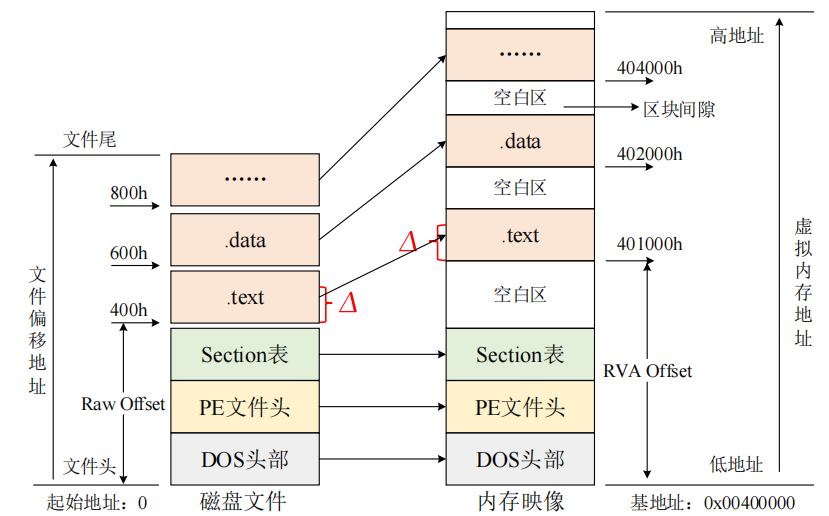
$$
文件偏移地址 = {Raw Offset}+\Delta
\\
内存虚拟地址 = {Rva Offset}+\Delta
$$
Raw Offset和Rva Offset已知，物理地址偏移和内存地址偏移可相互转换

#### 输入表

- PE文件使用来自其他DLL的代码或数据的动作称为输入或导入
- PE文件被载入内存时，Window加载器的工作之一就是定位所有被，输入的函数和数据，并让该PE文件得到那些函数或数据的地址，该过程是通过输入表(Import Table，也称为导入表)完成的
- 输入表保存的是函数名和函数所在的DLL名等动态链接所需的信息

##### 输入函数

- 输入函数（Import Functions）也称为导入函数，是被程序调用但其执行代码不在程序中的函数
- 输入函数的代码位于相关DLL文件中，调用程序中只保留函数名、DLL文件名等函数信息。PE文件只有被载入内存后，Windows加载器才将它用到的DLL载入，并将调用输入函数的指令和输入函数实际地址联系起来，磁盘中的PE文件无法得知输入函数在内存中的地址
- 应用程序隐式链接DLL时，完全由Window加载器完成调用函数指令和输入函数地址的关联
- 应用程序显式链接DLL时，如果被链接的DLL尚未加载到内存中，则先使用LoadLibrary加载目标DLL，然后用GetProcAddress寻找函数地址进行调用操作

```c++
IMAGE_ THUNK_ DATA STRUCT
  union ul
    Forwa rderString DWORD ? //指向一个转向者字符串的RVA
    Function		 DWORD ? //被输入的函数的内存地址
    Ordinal			 DWORD ? //被输入的API的序数值
    AddressOfData	 DWORD ? //指向IMAGE_ IMPORT_ BY_ NAME
  ends
IMAGE_ THUNK_ DATA ENDS
```

#### 输出表

- 输出函数(Export Functions)也称为导出函数，是在当前PE文件中实现，也能够让其他PE文件调用的函数
- PE文件通过输出表向其他PE文件提供函数名、序号、函数入口地址等信息，exe文件通常不存在输出表，大部分DLL文件存在输出表
- PE文件被加载时，填充IAT的过程便是通过对应的DLL文件的输出表获得函数的入口地址等信息

##### 输出函数

- Name: DLL名字的字符串指针，以0x00(1字节)作 为字符串结尾
- AddressOfFunctions: 指向输出地址表(Export Address Table，EAT)的RVA; EAT是RVA数组，每个非0元素对应一个被输出的符号,可看作是指针数组，每个元素是指向输出对象首地址(函数入口地址、变量地址等)的指针
- AddressOfNames:指向输出函数名称表(Export Name Table,ENT)的RVA; ENT是RVA数组，每个元素指向一个以0结尾的ASCII字符串，也可看作是指针数组，每个元素是指向字符串的指针;每个字符串对应-一个通过名字输出的符号，字符串是按照ASCII码值排序的,便于加载器使用二分查找查询被输出的函数名
- AddressOfNameOrdinals: 指向序数表的RVA， 序数表是WORD数组，即每个元素占用2字节，用于将ENT和EAT关联起来

### 区块内容制作

根据区块表设定的**PointerToRawData**，在对应位置开始写入，写入**SizeOfRawData**长度的数据

#### data全局变量数据段 

是MessageBoxA消息框的标题和内容参数，即“MsgBox”、“Hello World !”两个字符串的AscII值。


#### rdata只读数据段

将导入表放到.rdata段，并且自.rdata段起始地址处开始。

user32.dll

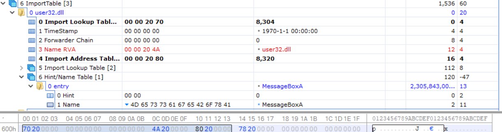

kernel32.dll

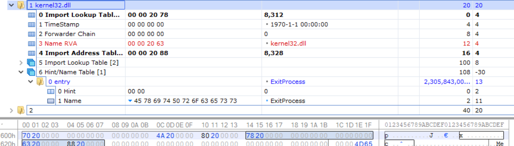

外加字符便完成了rdata。

```bash
70 20 00 00 00 00 00 00 00 00 00 00 4A 20 00 00 80 20 00 00 78 20 00 00 00 00 00 00 00 00 00 00
63 20 00 00 88 20 00 00 00 00 00 00 00 00 00 00 00 00 00 00 00 00 00 00 00 00 00 00 00 00 4D 65
73 73 61 67 65 42 6F 78 41 00 75 73 65 72 33 32 2E 64 6C 6C 00 00 00 45 78 69 74 50 72 6F 63 65
73 73 00 6B 65 72 6E 65 6C 33 32 2E 64 6C 6C 00 3C 20 00 00 00 00 00 00 55 20 00 00 00 00 00 00
11 00 00 00 00 00 00 00 11 00 00 00 00 00 00 00 00 00
```

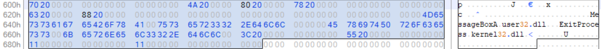


#### text代码段

段中存放所有可执行的指令代码（机器码）

```assembly
push    0          ; MessageBoxA的第四个参数，即消息框的风格，这里传入0。                      
push    0x403000   ;第三个参数，消息框的标题字符串所在的地址。                   
push    0x403007   ;第二个参数，消息框的内容字符串所在的地址。                     
push    0          ;第一个参数，消息框所属窗口句柄，这里填0。                      
call    40101A  	 ;调用MessageBoxA，实际是跳转到该函数的跳转指令所在地址。     
push    0          ;ExitProcess函数的参数，程序退出码，传入0.                         
call    401020     ;调用ExitProcess，实际是跳转到该函数的跳转指令所在地址。
jmp   dword ptr [0x402080] ;跳转到MessageBoxA的真正地址处。
jmp   dword ptr [0x402088] ;跳转到ExitProcess的真正地址处。
```

将这些指令翻译成机器码后如下

```
6A 00 68 00 30 40 00 68 07 30 40 00 6A 00 E8 07 00 00 00 6A 00 E8 06 00 00 00 FF 25 80 20 40 00
FF 25 88 20 40 00
```

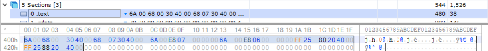

## 运行效果

最终保存为exe文件。

双击运行效果


