# AnalysisPE

## 准备工作

[1]. Filemon等软件监控laborDayVirus病毒行为，观察文件、注册表、进程的变化

1) **FileMon和RegMon的界面设置：**

a) 字体：Option-Font（选项-字体）

b) 禁止自动滚动

c) 监控前清空屏幕记录

2) **FileMon和RegMon的过滤设置**

a) “Filter”按钮可以设置并查看过滤项规则

b) 新建过滤规则：

i. “排除:”选项后面添加不需要监控的进程： 

```
vmtoolsd.exe;ctfmon.exe;TPAutoconnect.exe;Lsass.exe;FileMon.exe;Regmon.exe;tcpview.exe;procexp.exe;System
```

等，可在此基础上手动右键排除无关进程。

ii. 设置日志监控方式：选择“日志写入”“日志成功”

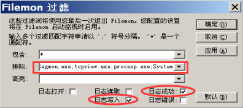


# 实验步骤

## 一、 病毒感染程序

（1） 新建文件夹“text”，将无毒文件“hei0.txt”拷贝至“text”文件夹中。将病毒文件“LaborDayVirus.rar”解压后“LaborDayVirus.exe”拷贝至“text”文件夹中。

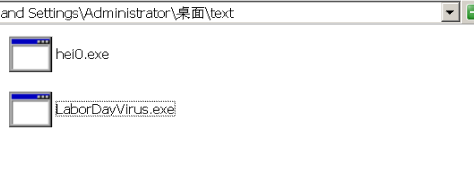

（2） 将系统时间调整为5月1日，双击“text”文件夹中“LaborDayVirus.exe”获得染毒文件hei0.exe。

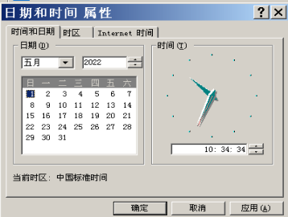

### 感染

（3） 记录hei0.exe染毒前后的文件大小、程序的入口点（OEP），（可使用PEiD或PE explorer）。

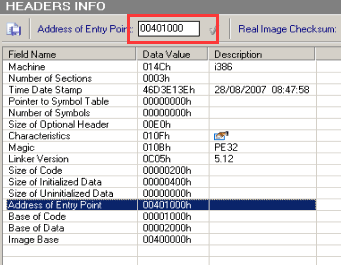

各区段大小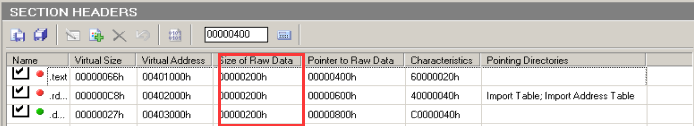

双击运行

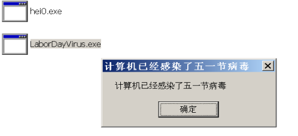

入口地址发生变化

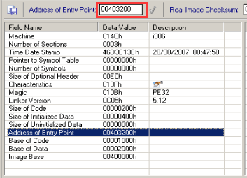

data全局变量数据段大小猛增。

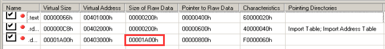

可见EP段，文件偏移链接器等信息全部被修改了。

## 二、为染毒程序脱壳

**问题1：感染病毒的文件hei0.exe是否加壳？**

> 程序加壳的判断条件
>
> 1） 程序入口点不在第一节(.text section)，是程序是否加壳的条件之一。
>
> 2） PEiD，查看EP section，如果存在非标准的section 名，也是加壳的判断条件之一。
>
> 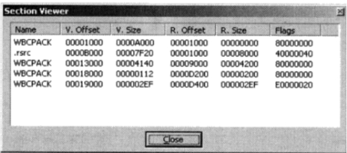
>
> 3） 查看上图，第一个WBCPACK Section，内存大小V.size不为空，文件大小R.size为空，也是加壳的判断条件之一。
>
> **加壳**。程序入口点不在第一节(.text )，而是在.data里
>
> 
>
> 但段表显示正常
>
> 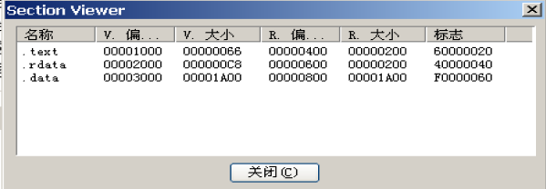

（1）用OD打开hei0.exe，弹出如下窗口


> 思考：为什么会弹出该窗口？
>
> 提示：用PE explorer 查看该文件，观察sizeofcode字段，sizeofImage字段，Address of entry point(OEP)字段的值
>
> 病毒只是修改了OEP，但并没有修改sizeofImage，sizeofcode两个大小，程序误以为这会在运行时解压调整位置

（2）找到OEP（0x00403200），留意OEP后面所有的跳转方向向上的jmp。

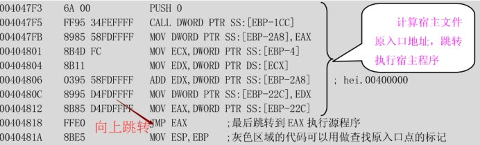

在0x00404818，按F2设置断点，随后按F9运行，程序会在断点0x00404818上中断，观察跳转对象EAX的值为（ ==00401000==）。

发现导致此之前已经感染了病毒

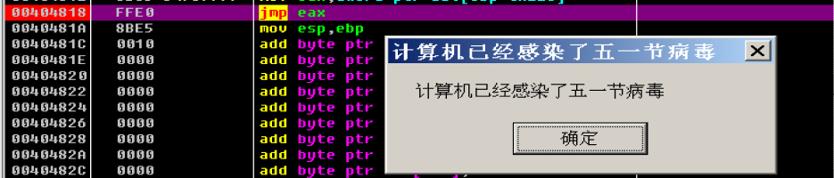

> 问题2：为什么要跳转到EAX的值，EAX的含义？
>
> EAX是.text段的入口地址，即源程序的OEP。应该是返回到真实的入口点。病毒通过劫持入口来运行，不会对原来的程序功能造成影响。

（3）执行实验步骤一（2）

注：如何在被感染的程序中找到原程序的OEP。

OD打开染毒的hei0.exe，跳转方向向上的跨节长跳（.data section到.text section），可以考虑为——由病毒代码返回到原始程序的OEP。

随后前往EAX处查看

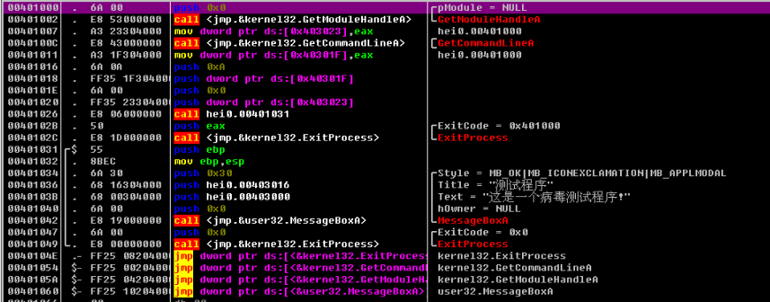

F8逐步调试，发现运行了原本的程序

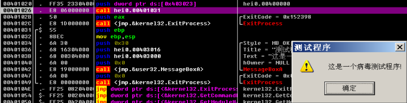

## 三、病毒感染机制分析

（1） 准备一个无毒的可执行程序“hei0.exe”和染毒的可执行程序“hei.exe”，复制到新的文件夹“text1”中。使用PE Explorer分别打开“hei0.exe”和“hei.exe”，对比两个文件的入口点和ImageBase，并记录如下。

|          | OEP      | ImageBase |
| -------- | -------- | --------- |
| hei0.exe | 00401000 | 00400000h |
| hei.exe  | 00403200 | 00400000h |

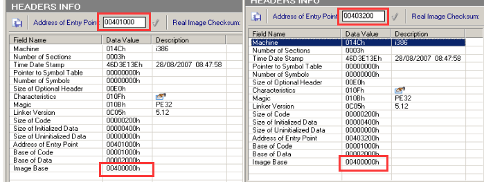

（2） 点击“View”菜单中的“Section Headers”，对比“hei0.exe”和“hei.exe”的section Header的数据，并记录如下：

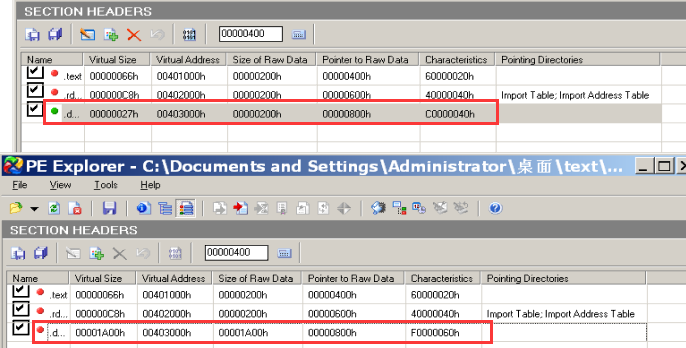

| .data的段头数据结构 | Visual size | Visual address | Size of raw data | point of raw data |
| ------------------- | ----------- | -------------- | ---------------- | ----------------- |
| hei0.exe的.data     | 00000027h   | 00403000h      | 00000200h        | 00000800h         |
| hei.exe的.data      | 00001A00h   | 00403000h      | 00001A00h        | 00000800h         |

显而易见，data段长度和内容发生了变化，病毒代码也正是存在于此。

> **问题3：感染文件在磁盘存放时，病毒代码的相对地址是什么，导入内存中，病毒代码的虚拟地址是什么？**
>
> 在磁盘中，病毒代码的相对地址为0xa00，导入内存后，病毒代码的虚拟地址为0x403200。

（3） 打开UltraEditor，选择“文件”菜单中的“比较文件”功能对“hei0.exe”和“hei.exe”进行二进制比对，可以发现“hei.exe”的0Xa00处开始的数据块为存储于.data节的病毒代码。

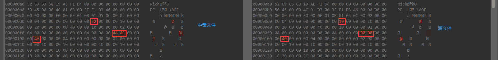

而第一个点正是OEP。

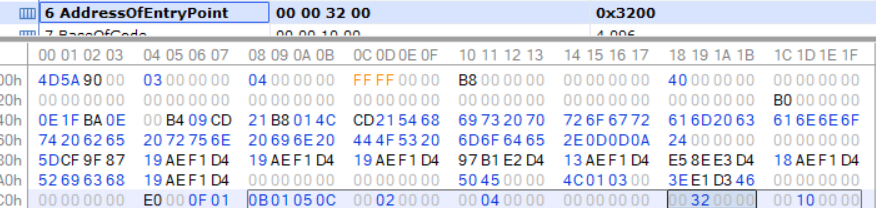

第二个点是限制版本

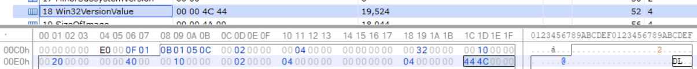

第三个点则是大小

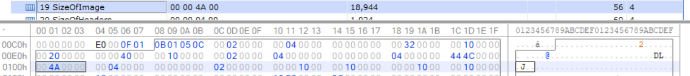

注：该段数据在.data节是因为“hei0.exe”和“hei.exe”的.data节都开始于各自文件的Point to Raw Data 处。这段数据是病毒代码是因为0xa00-0x800+0x403000=0x403200（感染病毒文件hei.exe OEP的虚地址（VA））。

（4） 使用UltraEditor打开“hei.exe”定位光标到“hei.exe”的.data块的Point to Raw Data 处，并以16进制形式查找“hei0.exe”的入口点（注意字节顺序），将查找到的数据的文件偏移记录是________________，该偏移的保护模式内存虚拟地址是__________________________。

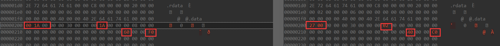

第一、二个不同点是空间大小

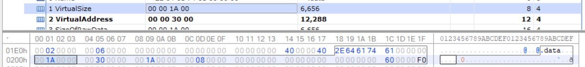

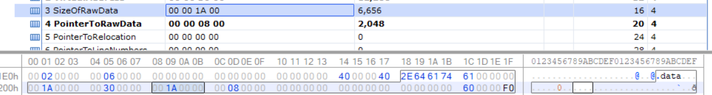

最后一个是字符段

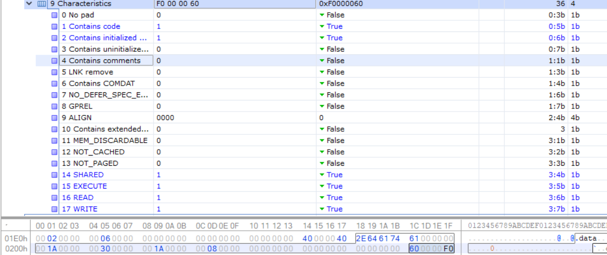

（5） 定位“hei.exe”的jmp断点，在jmp指令上面会发现如下的汇编代码：

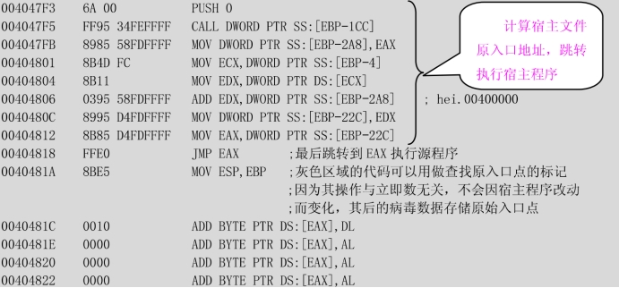 

0x40481c在病毒代码之后，为被加载到内存的病毒数据的存储区，0x1000为“hei0.exe”OEP的RVA，0x1000在反汇编代码中的表示是0010.

（6） 新建“text2”文件夹，将“LaborDayVirus.exe”病毒和“`notepad.exe(C:\WINDOWS\notepad.exe)`”“`mspaint.exe(C:\WINDOWS\system32\mspaint.exe)`”文件放在“text2”文件夹中。运行“LaborDayVirus.exe”感染“notepad.exe”“mspaint.exe”，将各个病毒文件最后一个跳转指令的目的地址记录到下表。

| 文件        | 源文件入口地址 | 感染病毒文件的入口地址 | 感染病毒文件的最后一个跳转目的地址 |
| ----------- | -------------- | ---------------------- | ---------------------------------- |
| Mspaint.exe | 01034CF5       | 01053800               | 01034CF5                           |
| Notepad.exe | 010073A5       | 01013000               | 010073A5                           |

（7） 通过以上的分析，就可以初步断定，该病毒的感染方式为：**将病毒代码写入到data段上**。

> 提示：病毒的感染方式有三种，分别为
>
> i. 添加一个新的段。
>
> ii. 将病毒代码附加在最后一个段上。
>
> iii. 将病毒代码写入到PE文件的各个段的未用空间。

## 四：手工恢复染毒文件hei.exe。

a) 以二进制形式打开染毒文件hei.exe，病毒修改PE文件“hei.exe”的哪些字段？

可选头部段的OEP，SizeOfImage。datad段的VirtualSize，SizeOfRawData。

b) 如何对这些字段进行修改，以清除“hei.exe”文件的病毒？

对应修改，定点清除。

头部

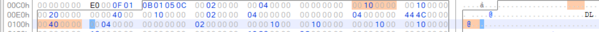

data

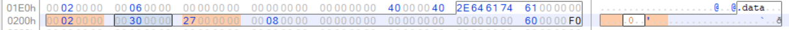

随后恢复正常

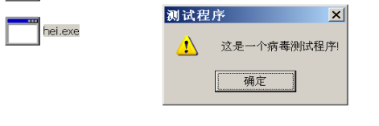