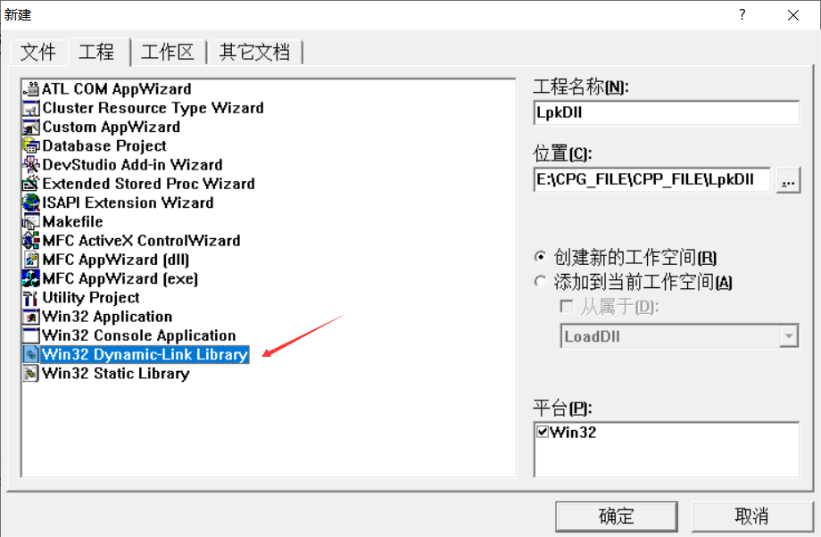
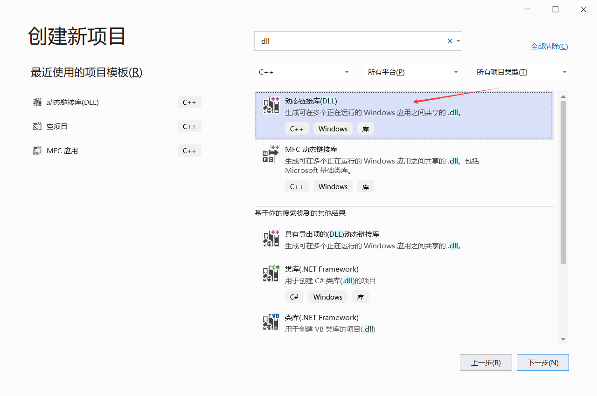
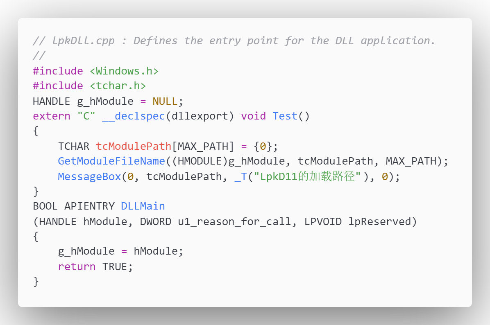
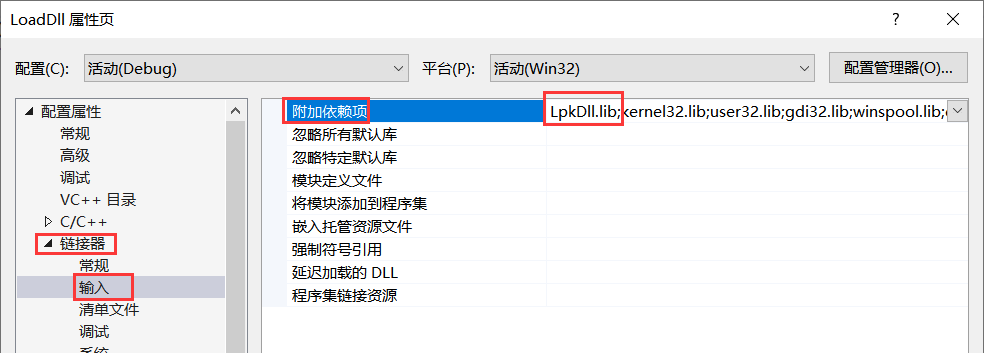
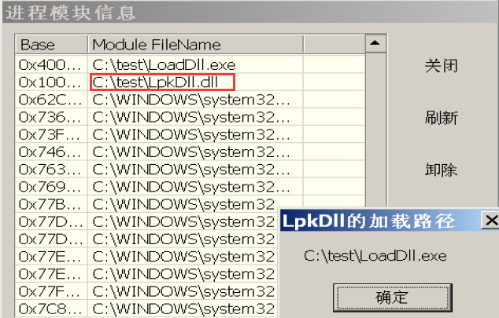
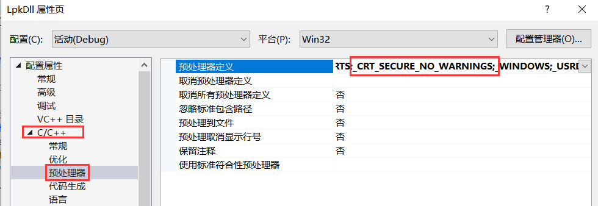
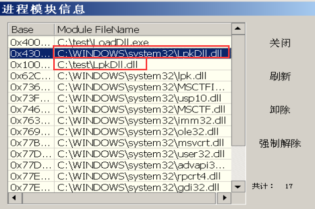
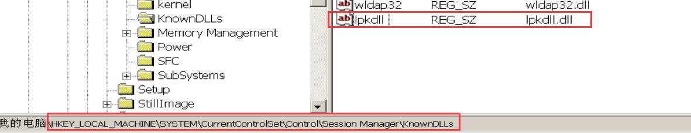
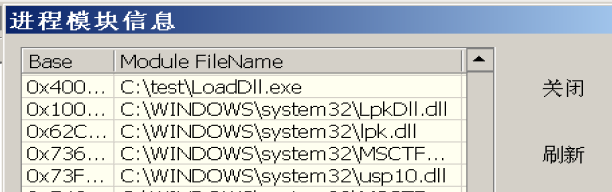

# DLL劫持病毒

实验目的

- 掌握DLL劫持的原理

- 了解DLL劫持攻击的防御办法

### 实验原理

> Windows2000之后的系统，将强制PE加载器首先在应用程序所在目录中搜索要加载的DLL，如果搜索不到才搜索其他目录。PE加载搜索DLL路径顺序由注册表中的键值决定，注册表路径如下：`HKLM\System\CurrentControlSet\Control\Session Manager`，中的SafeDllSearchMode键。
>
> SafeDllSearchMode=1，搜索顺序为
>
> 1）应用程序所在目录
>
> 2）系统目录，GetSystemDirectory获取
>
> 3）16位系统目录
>
> 4）Windows目录，用GetWindowsDirectory获取
>
> 5）运行程序的当前目录
>
> 6）Path环境变量
>
> SafeDllSearchMode=0，搜索顺序为
>
> 1）应用程序所在目录
>
> 2）运行程序的当前目录
>
> 3）系统目录，GetSystemDirectory获取
>
> 4）16位系统目录
>
> 5）Windows目录，用GetWindowsDirectory获取
>
> 6）Path环境变量

# 实验内容

## 一、 观察DLL文件的加载路径

### LpkDll

（1） 使用VC6.0 新建一个简单的动态链接库工程LpkDll



创建一个简单的Dll


或者使用VS





在VS中，其要求使用头文件pch.h，否则无法编译成功

```cpp
// lpkDll.cpp : Defines the entry point for the DLL application.
//

#include "pch.h"

HANDLE g_hModule = NULL;
extern "C" __declspec(dllexport) void Test()
{
    TCHAR tcModulePath[MAX_PATH] = { 0 };
    GetModuleFileName((HMODULE)g_hModule, tcModulePath, MAX_PATH);
    MessageBox(0, tcModulePath, _T("LpkD11的加载路径"), 0);
}

BOOL APIENTRY DLLMain(HANDLE hModule, DWORD u1_reason_for_call, LPVOID lpReserved)
{
    g_hModule = hModule;
    return TRUE;
}
```

```c++
// pch.h: 这是预编译标头文件。
// 下方列出的文件仅编译一次，提高了将来生成的生成性能。
// 这还将影响 IntelliSense 性能，包括代码完成和许多代码浏览功能。
// 但是，如果此处列出的文件中的任何一个在生成之间有更新，它们全部都将被重新编译。
// 请勿在此处添加要频繁更新的文件，这将使得性能优势无效。

#ifndef PCH_H
#define PCH_H

// 添加要在此处预编译的标头
#include "framework.h"

#include <Windows.h>
#include <tchar.h>

#endif //PCH_H
```

为了防止可能出现的vcRuntimeXXX Error，使用多线程运行库。


编译生成了相关文件


### LoadDll

（2） 新建一个控制台工程LoadDll


```cpp
// LoadDll.cpp : Defines the entry point for the console application.
//

// #include "stdafx.h"
#pragma comment(lib, "LpkDll.lib")
extern "C" void Test();
int main(int argc, char *argv[])
{
	Test();
	return 0;
}
```


修改控制台工程LoadDll的配置：“工程”->“配置”->“连接”选项卡 ->“对象/库模块”中添加“LpkDll.lib”



此外，将LpkDll.lib放在LoadDll文件夹中。

编译成功！

### 观察


（3） 在C盘中新建test文件夹，将LoadDll.exe 和LpkDll.dll 放在文件夹C:\test中。运行“LoadDll.exe”，观察程序弹出窗口显示的LpkDll的加载路径==C:\test\LoadDll.exe==。使用IceSword查看LoadDll.exe调用LpkDll.dll的路径是==C:\test\LpkDll.dll==。IceSword->进程->模块信息（单击鼠标右键）


（4） 将LpkDll.dll放在系统文件夹C:\windows\system32中，同时删除C:\test中 的LpkDll.dll 文件。运行“LoadDll.exe”，观察程序弹出窗口显示的LpkDll的加载路径==C:\test\LoadDll.exe==。使用IceSword查看LoadDll.exe调用LpkDll.dll的路径是==C:\windows\system32\LpkDll.dll==。


（5） LpkDll.dll复制到C:\test中，使得LoadDll.exe所在的文件夹C:\test和系统文件夹C:\windows\system32，同时包含LpkDll.dll。运行“LoadDll.exe”，观察程序弹出窗口显示的LpkDll的加载路径==C:\test\LoadDll.exe==。使用IceSword查看LoadDll.exe调用LpkDll.dll的路径是==C:\test\LpkDll.dll==。



问题1：你可以得出实验平台使用的windows 2003 server系统在加载DLL文件时，对路径的搜索顺序是怎样的？

优先搜索自己所在的文件夹，无果后再前往系统盘搜索

## 二、 了解DLL劫持的原理

（1） 另建一个动态链接库工程，也命名为LpkDll（功能为：定义一个函数指针保存原始LpkDll导出函数的地址）。编译得到新的LpkDll.dll

```cpp
#include<Windows.h>
typedef void (* FUNTEST)();
FUNTEST g_funtest = NULL;

extern "C" __declspec(naked) __declspec(dllexport) void Test()
{
	__asm jmp dword ptr[g_funtest]
}

BOOL APIENTRY D1lMain(HMODULE hModule, DWORD ul_reason_for_call, LPVOID lpReserved)
{
	// 加载进程时调用DLLMain
	if (ul_reason_for_call == DLL_PROCESS_ATTACH)
	{
		DisableThreadLibraryCalls(hModule);
		char cDllPath[MAX_PATH] = {0};
		GetSystemDirectoryA((LPSTR)cDllPath, MAX_PATH);
		strcat(cDllPath, "\\LpkDll.dll");
		HMODULE hDll = LoadLibraryA(cDllPath);
		g_funtest = (FUNTEST)GetProcAddress(hDll, "Test");
	}
	return TRUE;
}
```

编译时在C++预处理定义加上`_CRT_SECURE_NO_WARNINGS`



（2） 在C:\windows\system32保存原始LpkDll.dll，将新的LpkDll.dll及LoadDll.exe放在C:\test文件夹中。运行“LoadDll.exe”，使用IceSword查看LoadDll.exe调用LpkDll.dll的路径是==C:\windows\system32\LpkDll.dll==和==C:\test\LpkDll.dll==



问题2：请解释为什么LoadDll.exe会调用这个路径的LpkDll.dll？

新的DLL中包含一个将模块加载到调用进程的函数`LoadLibraryA`，而其加载的路径正是位于系统盘下的LpkDll.dll。正因如此，在加载同文件夹下的DLL时便会一同加载系统盘下的Dll。

## 三、 DLL劫持攻击的防御

（1）在注册表HKLM\System\CurrentControlSet\Control\Session Manager\KnowDlls 中， 新建字符串项“lpkdll”，该数据项的值记为：“lpkdll.dll” 。重启电脑



（2）在C:\windows\system32保存原始LpkDll.dll，将新的LpkDll.dll及LoadDll.exe放在C:\test文件夹中。运行“LoadDll.exe”，使用IceSword查看LoadDll.exe调用LpkDll.dll的路径是==C:\windows\system32\LpkDll.dll==。




1、其中出现三段代码的功能分别是什么？

第一段LpkDll：是一个动态链接库，作用是弹窗显示DLL的加载路径。

第二段LoadDll：是一个控制台程序，链接创建的动态链接库LpkDll。

第三段LpkDll：是一个动态链接库，定义了一个函数指针保存原始LpkDll导出函数的地址，当调用DLLMain时，会调用系统盘下的原始LpkDll。


2、你可以得出实验平台使用操作系统在加载DLL文件时，对路径的搜索顺序是怎样的？

运行程序的当前目录 => 系统目录\Windows\System32 => 环境变量Path


3、请解释为什么LoadDll.exe会调用这个路径的LpkDll.dll？

程序先链接当前目录下的LpkDll.dll，而dll包含着一个函数指针保存原始LpkDll.dll导出函数的地址，会转发到原始dll。


4、请总结预防DLL劫持攻击的方法。

在注册表中进行设施，指定让程序优先加载C:\WINDOWS\system32\下的dll文件，从而防止被劫持。