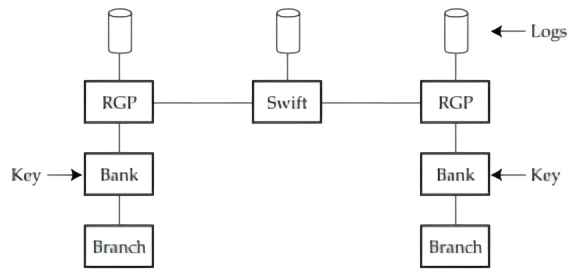
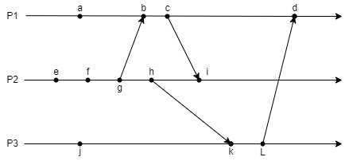
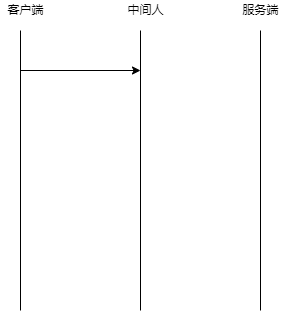

# 2022信息安全工程期末

## 综合运用

1、信息安全工程分析框架包括策略、机制、保证和动机。请回答：

1. 请结合身边例子，简述策略、机制、保证和动机四者的含义；
2. 结合历史的背景，分析为什么在911事件中3英寸以下刀具被携带上飞机是策略失败。

2、身份鉴别用于鉴别用户的身份，防止未授权的用户进入系统。请简述：

1. 如今不少系统提供多种鉴别方式，如网站提供“用户名＋口令”和“手机号＋验证码”,某大学校园门禁系统提供“校园卡刷卡”和“人脸识别”的方式。以上列举的四种分别对应常见手段中的哪一类？以及为什么？
2. 试举出其他不少于3种身份鉴别的例子，并进行分类。

3、SWIFT 是一个为金融机构之间提供信息传递服务的公司， SWIFT 采用了统一的消息格式，让银行可以相互交流。但若只有统一的消息格式而无安全机制， SWIFT 也不可能成功。请据此回答：

1. SWIFT 分别采用什么技术或方法来保障数据完整性和消息的不可否认，并分析为什么该技术可以实现数据完整性和消息的不可否认。
2. 交易行间的安全通信依靠密钥 Key ,而早期公钥密钥学尚未成熟，当时该密钥是如何获得的？
3. 请简单分析在公钥密码学相对成熟的今天，该密钥可以如何安全便捷的获得？

4、$P_1、P_2、P_3$ 是相互通信的进程， $a、b… l$ 是分布在不同进程中的事件，若每个进程中策一个事件的逻辑时间为1，按照 `Lamport `时间戳算法计算事件 $a、b… l$ 的逻辑时间。

## 二、分析题

1、为了保障系统安全，除了登录验证系统，还会有入侵检测系统。

1. 登录验证可阻碍未授权的访问，请结合入侵检测系统工作原理，分析为何还需要部署入侵检测系统。
2. 简述基于主机的入侵检测和基于网络的入侵检测的区别；检测病毒、木马等恶意代码所产生的入侵行为需要哪种入侵检测系统？
3. 某集团对外的服务采用云服务的方式进行部署，并部署了相关入侵检测系统，通过判断网络传输信息中是否存在`/cgi-bin/phf?`来检测特定漏洞。据此该分析入侵检测系统属于哪一类入侵测系统。

2、如下是为简化版 TLS 协议流程，共中，( SK , PKx ｝表示实体 x 所具有的公私钥对， C 为客户端， S 为服务端。假设私钥为 a 的情况下，对应公钥为 g ＂。请结合该流程，回答问题。
$$
1: C - S :& Hello \\
2: S - C :& Domain , PK_S , \{Domain , PKsJ\}SK_{CA}  \\
3: C - S :& g^b \\
4: S - C :& \{Hello\}K_{cs}
$$

1. 上述协议中，是从协议传输的角度进行形式化，还缺少客户端和服务端的计算过程。诸用语言描述缺少的计算过程及原理。
2. 在上述协议中， $K_{CS}$ 是什么，在后续协议中有什么用？其值咋算？
3. 上述协议易受到中间人攻击。请在下图中绘制中间人攻击的过程，并标注每个阶段发送的数据。最后请说明可以如何防范该中间人攻击。

## 三、设计题

为了保证数据安全，系统管理员可对不同的文件针对不同的用户／用户组设置不同的权限。现假设系统中的不同用户／组对不同文件的权限如下矩阵。请据此回答问题。

| 用户\文件 |   file1    |   file2    |   file3    |   file4    |
| :-------: | :--------: | :--------: | :--------: | :--------: |
|   root    |            |            | 可读、可写 | 可读、可写 |
|   user1   | 可读、可写 |    可读    |            |            |
|   user2   |            | 可读、可写 |    可写    |    可读    |
|   user3   |            | 可读、可写 |    可写    |    可读    |

1. 请结合上述矩阵，指出主体和客体在这里分别指什么。

2. 采用访问控制矩阵进行权限管理，当文件、用户数量较多时，存在什么问题？
3. 针对（2）中的问题，采用不少于2种方式改进的访问控制矩阵，并画出。